# User clip planes on feature level 9 hardware

Starting with Windows 8, Microsoft High Level Shader Language (HLSL) supports a syntax that you can use with the Microsoft Direct3D 11 API to specify user clip planes on [feature level](/windows/desktop/direct3d11/overviews-direct3d-11-devices-downlevel-intro) 9\_x and higher. You can use this clip-planes syntax to write a shader, and then use that shader object with the Direct3D 11 API to run on all Direct3D feature levels.

-   [Background](#background-reading)
-   [Syntax](#syntax)
-   [Creating clip planes in clip space on feature level 9 and higher](#creating-clip-planes-in-clip-space-on-feature-level-9-and-higher)
    -   [Background reading](#background-reading)
    -   [10Level9 feature levels](#10level9-feature-levels)
    -   [Clip plane math](#clip-plane-math)
    -   [Clipping in view space](#clipping-in-view-space)
    -   [Projection matrix](#projection-matrix)
    -   [Clip space clip plane](#clip-space-clip-plane)
-   [Related topics](#related-topics)

## Background

You can access user clip planes in the Microsoft Direct3D 9 API via [**IDirect3DDevice9::SetClipPlane**](/windows/desktop/api/d3d9/nf-d3d9-idirect3ddevice9-setclipplane) and [**IDirect3DDevice9::GetClipPlane**](/windows/desktop/api/d3d9/nf-d3d9-idirect3ddevice9-getclipplane) methods. In Microsoft Direct3D 10 and later, you can access user clip planes through the [SV\_ClipDistance](dx-graphics-hlsl-semantics.md) semantic. But before Windows 8, SV\_ClipDistance was not available for [feature level](/windows/desktop/direct3d11/overviews-direct3d-11-devices-downlevel-intro) 9\_x hardware in the Direct3D 10 or Direct3D 11 APIs. So, before Windows 8, the only way to access user clip planes with feature level 9\_x hardware was through the Direct3D 9 API. Direct3D Windows Store apps can't use the Direct3D 9 API. Here we describe the syntax that you can use to access user clip planes through the Direct3D 11 API on feature level 9\_x and higher.

Apps use clip planes to define a set of invisible planes within the 3D world that clip (throw away) all drawn primitives. Windows won't draw any pixel that is on the negative side of any clip planes. Apps can then use clip planes to render planar reflections.

## Syntax

Use this syntax to declare clip planes as function attributes in a [function declaration](dx-graphics-hlsl-function-syntax.md). For example, here we use the syntax on a vertex shader fragment:

``` syntax
cbuffer ClipPlaneConstantBuffer 
{
       float4 clipPlane1;
       float4 clipPlane2;
};

[clipplanes(clipPlane1,clipPlane2)]
VertexShaderOutput main(VertexShaderInput input)
{
       // the rest of the vertex shader doesn't refer to the clip plane
 
       …
 
       return output;
}
```

This example for a vertex shader fragment denotes two clip planes. It shows that you need to place the new **clipplanes** attribute within square brackets immediately before the return value of the vertex shader. Within parentheses after the **clipplanes** attribute, you provide a list of up to 6 **float4** constants that define the plane coefficients for each active clip plane. The example also shows that you need to make the coefficients of each plane reside in a constant buffer.

> [!Note]  
> There is no syntax available to disable a clip plane dynamically. You must either recompile an otherwise identical shader with no **clipplanes** attribute, or your app can set the coefficients in your constant buffer to zero so that the plane no longer affects any geometry.

 

This syntax is available for any 4.0 or later vertex shader target, which includes vs\_4\_0\_level\_9\_1 and vs\_4\_0\_level\_9\_3.

## Creating clip planes in clip space on feature level 9 and higher

Here we show how to create clip planes in clip space on [feature level](/windows/desktop/direct3d11/overviews-direct3d-11-devices-downlevel-intro) 9\_x and higher.

### Background reading

"Introduction to 3D Game Programming with DirectX 10" by Frank D. Luna explains the graphics math background (chapters 1, 2 and 3) you need, and the various spaces and space transformations that occur in the vertex shader (sections 5.6 and 5.8).

### 10Level9 feature levels

In Direct3D 10 and later, you can clip in any space that makes sense, often in world space or view space. But Direct3D 9 uses clip space, which is pre perspective divide projection space. Vectors are in clip space when the vertex shader passes them to stages that follow in the [graphics pipeline](/windows/desktop/direct3d11/overviews-direct3d-11-graphics-pipeline).

When you write a Windows Store app, you must use 10Level9 feature levels ([feature level](/windows/desktop/direct3d11/overviews-direct3d-11-devices-downlevel-intro) 9\_x) so the app can run on feature level 9\_x and higher hardware. Because your app supports feature level 9\_x and higher, you must also use the common capability of applying clip planes in clip space.

When you compile a vertex shader with vs\_4\_0\_level\_9\_1 or later, that vertex shader can use the **clipplanes** attribute. A Direct3D 10 or later object has a dot product of the emitted vertex that contains each of the **float4** global constants specified in the attribute. The Direct3D 9 object has enough meta data to cause the 10Level9 runtime to issue the appropriate calls to [**IDirect3DDevice9::SetClipPlane**](/windows/desktop/api/d3d9/nf-d3d9-idirect3ddevice9-setclipplane).

### Clip plane math

A clip plane is defined by a vector with 4 components. The first three components define an x, y, z vector that emanates from the origin in the space we want to clip. This vector implies a plane, perpendicular to the vector and running through the origin. Windows keeps all pixels on the vector side of the plane and clips all pixels behind the plane. The forth w component pushes the plane back and causes Windows to clip less (a negative w causes Windows to clip more) along the vector line. If the x, y, z components compose a unit (normalized) vector, w pushes the plane w units back.

The math that the graphics processing unit (GPU) performs to determine clipping is a simple dot product between the vertex vector (x, y, z, 1) and the clipping plane vector. This math operation creates a projection length on the clip plane vector. A negative dot product shows the vertex to be on the clipped side of the plane.

### Clipping in view space

Here is our vertex in view space:

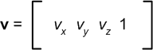

Here is our clip plane in view space:

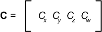

Here is the dot product of vertex and clip plane in view space:

ClipDistance = **v** · **C** = *v*ₓ*C*ₓ +*v*<sub>y</sub>*C*<sub>y</sub> + *v*<sub>z</sub>*C*<sub>z</sub> + *C*<sub>w</sub>

This math operation works for a Direct3D 10 or later object but won't work for a Direct3D 9 object. For Direct3D 9, we must first get through our projection transform into clip space.

### Projection matrix

A projection matrix transforms a vertex from view space (where the origin is the viewer's eye, +x is to the right, +y is up, and +z is straight ahead) into clip space. The projection matrix readies the vertex for hardware clipping and the [rasterization stage](/windows/desktop/direct3d11/d3d10-graphics-programming-guide-rasterizer-stage). Here is a standard perspective matrix (other projections require different math):

<dl> *r*  ratio of window width/height  
*α*  viewing angle  
*f*  distance from the viewer to the far plane  
*n*  distance from the viewer to the near plane  
</dl>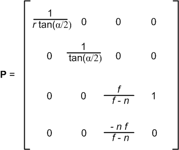

The next matrix is a simplified version of the previous matrix. We show the matrix simplified so we can use it later in the matrix multiply operation.

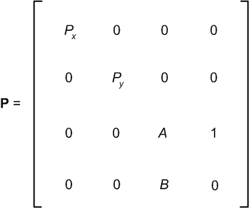

Now we transform our view space vertex into clip space with a matrix multiply:

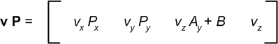

In our matrix multiply operation, our x and y components are only slightly adjusted, but our z and w components are quite mangled. Our clip plane won't give us what we want any more.

### Clip space clip plane

Here we want to create a clip space clip plane whose dot product with our clip space vertex gives us the same value as **v · C** in the [Clipping in view space](#clipping-in-view-space) section.

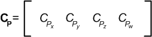

**v** · **C** = **v P** · **C**<sub>P</sub>

*v*ₓ*C*ₓ +*v*<sub>y</sub>*C*<sub>y</sub> + *v*<sub>z</sub>*C*<sub>z</sub> + *C*<sub>w</sub> = *v*ₓ*P*ₓ*C*<sub>Pₓ</sub> +*v*<sub>y</sub>*P*<sub>y</sub>*C*<sub>P<sub>y</sub></sub> + *v*<sub>z</sub>*A*<sub>y</sub>*C*<sub>P<sub>z</sub></sub> + *BC*<sub>P<sub>z</sub></sub> + *v*<sub>z</sub>*C*<sub>P<sub>w</sub></sub>

Now we can break the preceding math operation up by vertex component into four separate equations:

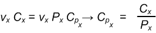

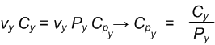

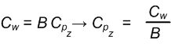

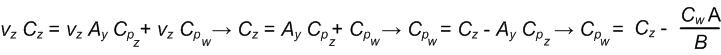

Our view space clip plane and our projection matrix derive and give us our clip space clip plane.

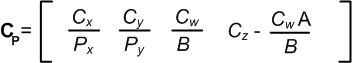

## Related topics

<dl> <dt>

[Programming Guide for HLSL](dx-graphics-hlsl-pguide.md)
</dt> <dt>

[Function Declaration Syntax](dx-graphics-hlsl-function-syntax.md)
</dt> </dl>

 

 