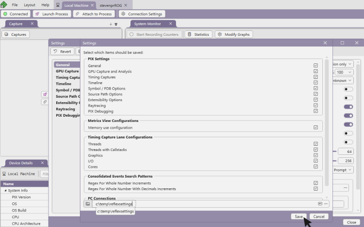

# Configure PIX

PIX has various options you can use to customize PIX to your liking. Most of these are accessed in the Settings menu (accessed via the main File menu).

## Debug symbols

When debugging shaders or profiling CPU code you'll want to provide PIX with debug symbols (PDBs) to enable function names and source code mappings. You can configure where PIX looks for these files in **Settings** under "Symbol / PDB Options".

For details on how to generate appropriate PDBs, see the blog post [Configuring PIX to access PDBs for CPU captures](../timing-captures/pix-timing-captures-pdb-config.md).

# Saving and loading settings

All settings, along with [Timeline configurations](../timing-captures/layouts/pix-timing-captures-timeline-layout.md#lane_config), [Metrics view configurations](../timing-captures/layouts/pix-metrics-layout.md#metrics_view_configs), and [Metrics View Consolidated Event Patterns](../timing-captures/layouts/pix-metrics-layout.md#consolidated_events) can be exported from PIX and saved to a file.  These files can then to imported into other instances of PIX.  The ability to export and import settings makes it easier for multiple users to collaborate.  For example, a studio may wish to create a custom Timing Capture configuration for use by all developers.  

Clicking the **Save** button on the **Settings** dialog brings up a dialog used to choose the settings and configurations you'd like to export.  Specify a file name and click **Save** to export the settings and configuations.

 Use the **Import** button to import a settings file into an instance of PIX.  When importing a file, PIX checks to see if the groups of saved settings and configurations already exist in the target instance of PIX.  If an existing group of settings or configurations are found, PIX displays a warning indicating that the settings will be overwritten.
