# The Metrics layout 

The Metrics Layout is a graphical tool that helps you analyze large volumes of data to quickly find areas of interest as they relate to performance, such as outliers in frame time or unexpected memory allocations.  Correlations can also be drawn between different portions of your title, and between your title and the system.

For a video walkthrough, see [The Metrics View in PIX Timing Captures](https://www.youtube.com/embed/jMKNU0FLdyQ).

Various types of data can be graphed in the Metrics View, including the duration, execution and stalled time of CPU PIX events, the duration of GPU PIX events, the values of counters reported through [PIXReportCounter](../../general/pix-instrumenting.md), and the values of various system-defined counters.

The default Metrics layout consists of the following view and panels:
* Metrics view graph and histogram
* [Selector panel](#selector_panel)
* [Active Metrics panel](#active_metrics_panel)
* [Metric Details panel](#metric_details_panel)

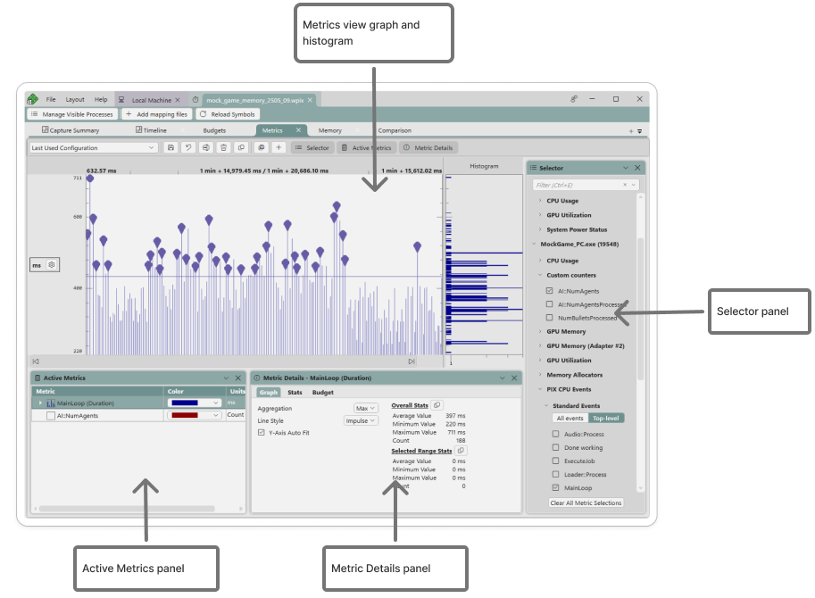

The Metrics View can be accessed in a few different ways. First, various places in the [Timeline layout](pix-timing-captures-timeline-layout.md) and [Summary layout](pix-timing-captures-summary-layout.md) allow you to graph the duration of a PIX event in the Metrics View. The context menus in the Timeline layout on the Thread lanes, Core lanes, and Range Details provide this capability as does the **Graph in Metric View** button in [Element Details](pix-timing-captures-timeline-layout.md#element_details). In the Summary layout, the hyperlinks on the **Longest Top-Level PIX Events** and the **Top PIX Events by Count** controls navigate to the Metrics layout.  When one of these options is chosen, the focus switches to the Metrics View and the duration of the selected PIX event is graphed.

The Metrics View can also be accessed by directly selecting the Metrics tab in a Timing Capture. When accessing the Metrics layout in this way, the Metrics to graph are added by using the [Selector panel](#selector_panel) at the right side of the view.

Metrics added to the graph using either the [Timeline layout](pix-timing-captures-timeline-layout.md), [Summary layout](pix-timing-captures-summary-layout.md) or the [Selector panel](#selector_panel) are considered "active" metrics.  The list of active metrics is displayed in the [Active Metrics panel](#active_metrics_panel) located at the bottom of the view.  The [Metric Details panel](#active_metrics_panel) is used in conjunction with the [Active Metrics panel](#active_metrics_panel) to customize various aspects of how a metric is graphed, including it's line style and color.

The x-axis in the Metrics layout represents time. The ribbon across the top of the layout marks time from the beginning of the capture to the end.

The y-axis is the value of the currently selected metric. The units on the y-axis vary, based on the type of data you're graphing. For example, when graphing a counter such as CPU Usage, the units are percentages. When graphing the duration, execution or stalled time of a PIX event, the units are nanoseconds by default.  

When hovering over a metric in the graph, a tooltip is displayed that shows the name of the metric, the values of the x and y axes, and other statistics such as the minimum, maximum and average values.

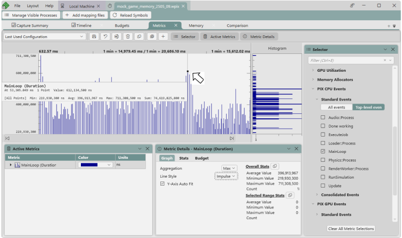

Tooltips can be pinned using the context menu.  Pinning tooltips makes it easier to compare the values from multiple points simultaneously.

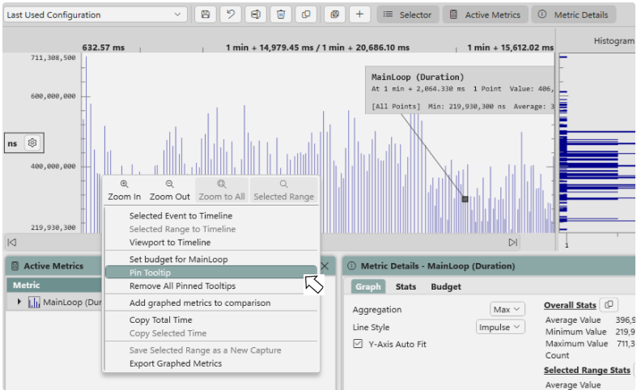

If multiple metrics are graphed, and some of those metrics have different units, the names of the various units are displayed in a panel on the left hand side of the view.  The following figure graphs three metrics with different units: millisecond (ms), percentage (%) and gigabytes (GB).  Hovering over a metric in the graph, or in the [**Active Metrics**](#active_metrics_panel) panel, updates the min and max values for the y axis.  For example, when selecting the **CPU 0** metric in the following figure, the y axis is updated to match the y axis values for that metric (between 0 and 100).

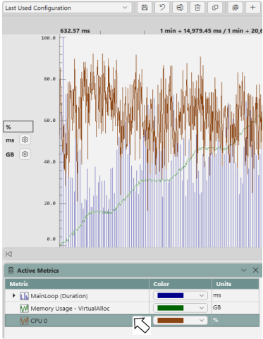

The display units for PIX events and for all memory-related metrics can be customized.  For example, the duration, execution and stalled time for PIX events can be graphed in milliseconds instead of the default nanoseconds.  To change the display units, select the gear icon next to the name of the units on the y axis.

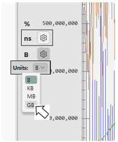

The Metrics graph provides the ability to zoom in and out using Ctrl-mouse wheel button in the same way that the Timeline does. A context menu is also provided that offers several zooming options, including the ability to zoom the [Timeline](../pix-timing-captures.md) to a selected range of time.

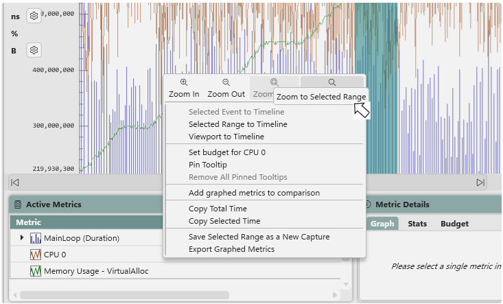

A typical use of the Metrics layout is to find areas of interest by using the graph, and then zoom the [Timeline](../pix-timing-captures.md) to that range to see more detail about what's happening in your game at that point in time.

## Graphing the duration, execution and stalled time of PIX CPU events

When a PIX CPU event is added to the [Active Metrics Panel](#active_metrics_panel), the duration of the event is graphed by default.  The duration is the amount of time taken from the time the event started running until the time the event stopped running.  This time includes any time that the event was not running due to a context switch.  The amount of time the event was not running is the stalled time.  The duration minus the stalled time is the execution time, or the amount of time the code in the event itself ran.

The execution time and stalled time can be graphed in addition to the duration.  Graph the stalled or execution time by expanding the row containing the name of the event in the [Active Metrics Panel](#active_metrics_panel).

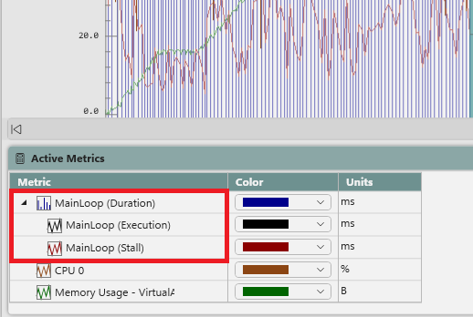

## The Metrics View Histogram

When a metric is graphed, a histogram is created that shows the distribution of the values of the metric over the duration of the capture.  The histogram is oriented vertically and displayed to the right of the graph.  The following figure shows a metric whose duration values largely fall into two distinct groups.  Hovering over a bucket in the histogram displays a tooltip showing the number of points near the durations represented by the bucket.

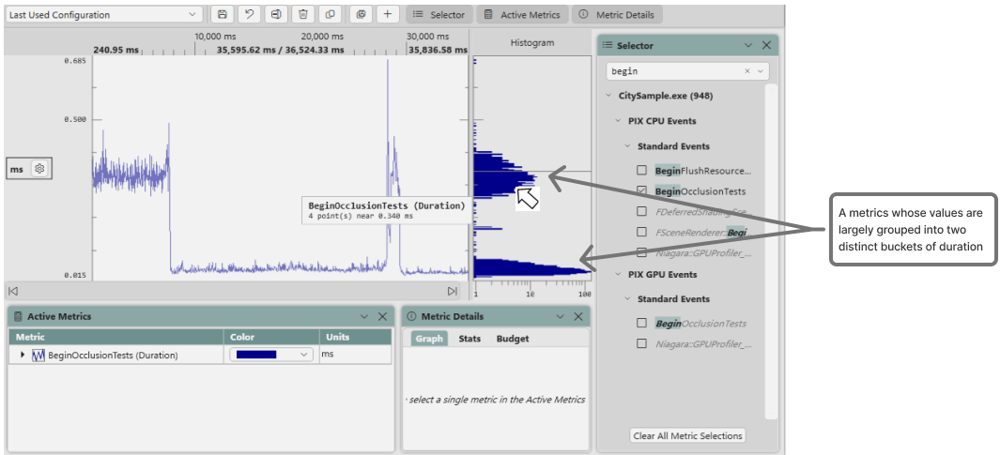

Right clicking on a histogram bucket displays a context menu with a **Goto ...** option.  Use this option to navigate the [Timeline](../pix-timing-captures.md) to the point in time in which one of the events in the selected bucket was running.

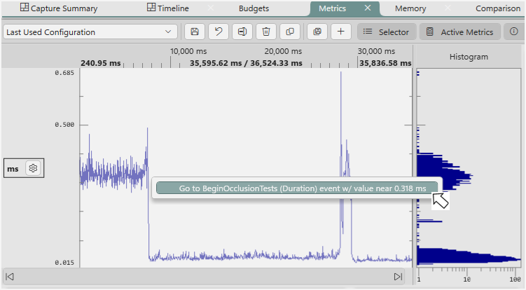

A portion of the histogram can be selected by clicking and dragging the mouse.  When a portion of the histogram is selected in this way, the **Metrics** graph is updated to include only the points in the selected region.  The selected portion of the histogram can also be dragged up and down.  The **Metrics** graph is updated accordingly.

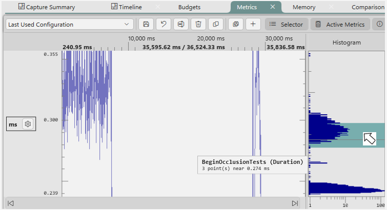

## The Selector panel

The Selector panel to the right-hand side of the graph is used to choose the set of metrics to graph. The available metrics are grouped into two general categories: those metrics that collect performance data for the system as a whole, and those metrics that collect data specific to your game's process.  Counters defined by your game with calls to [PIXReportCounter](../../general/pix-instrumenting.md) can be found under the **Custom Counters** node of the game-specific metrics portion of the Selector panel.

To graph a metric, either find it by expanding the tree in the Selector panel or by typing its name (or partial name) into the filter bar at the top of the panel. After you've found the metrics you'd like to graph, select the check box next to the name of the metric with either the mouse or the spacebar to add it to the graph.

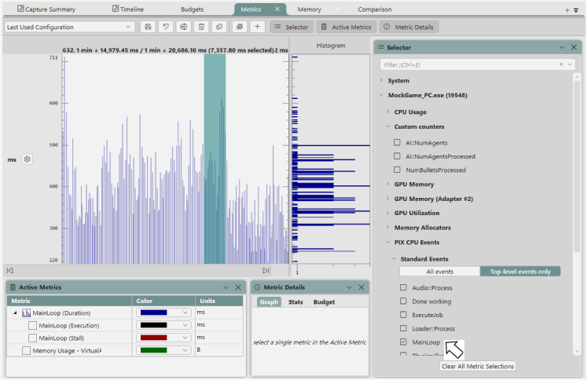

By default, the Selector panel only shows the top level PIX CPU and PIX GPU events.  The rest are hidden by default.  The potential for a large number of PIX events makes it impractical to list them all by default from a UI navigation perspective. The easiest way to find events that aren't at the top level is to use the filter bar at the top of the panel. After entering your search text and selecting Enter, the Selector panel is populated with all events that matched the search criteria. 

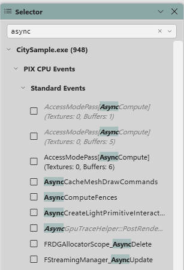

### Consolidated Events

A common practice is to name the PIX events that represent a frame of CPU work (or any other repeated set of work) with a sequential number pattern, as shown in the following figure:

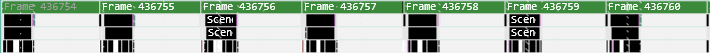

Using the Metrics View to analyze an individual frame when events are named using this pattern isn't useful, but analyzing the set of events as a group can be used to find outliers in frame time.  

When populating the [Selector panel](#selector_panel), PIX uses a set of regular expressions to look for events whose names follow the pattern described by expressions.  Events that fit a pattern are grouped, or consolidated.  The individual events that fit the patterns are treated as the same event for purposes of graphing and analysis.

PIX has two built-in regular expressions.  [Additional regular expressions](#defining-custom-regular-expressions) can be defined by the developer.

The first built-in regular expression matches events that start with the same string, followed by one or more spaces, followed by a number.  For example, from the picture above, the events "Frame 334", "Frame 335", "Frame 336" and so on, will be consolidated and graphed as a single event in the Metrics view.

The second built-in regular expression allows for the number at the end of the pattern to be either an integer or a decimal number.  If the number is a decimal, it must have values on both sides of the ".".  For example, the events "Render 10.987" and "Render 12.789" would be consolidated.

The consolidated events are shown in a separate node in the [Selector panel](#selector_panel) tree under *PIX CPU Events* and *PIX GPU Events*.

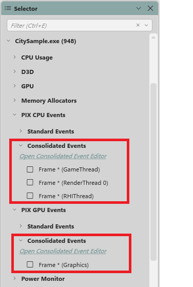

Clicking the checkbox next to a consolidated event will add the group of events to the [Active Metrics](#active_metrics_panel) panel just as with a standard event.  Hovering over a point in the graph will show the name of the underlying event.

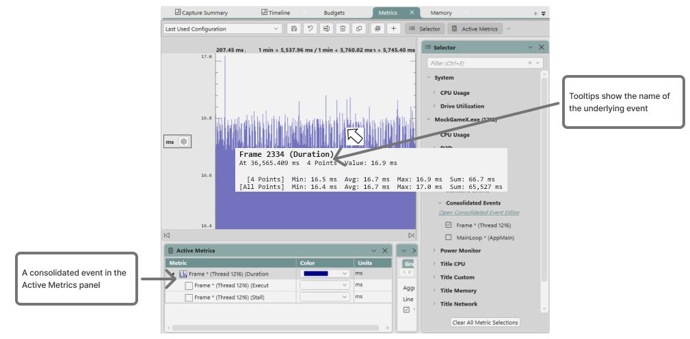

The consolidating of events also occurs when the Metrics layout is navigated to from the [Timeline layout](pix-timing-captures-timeline-layout.md) or the [Summary layout](pix-timing-captures-summary-layout.md).  In the following example, graphing the event *Frame 436782*, which matches the consolidation pattern, will cause the consolidated event *Frame \** to be added to the [Active Metrics](#active_metrics_panel) panel.

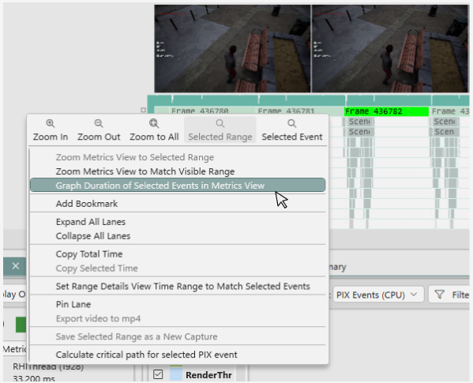

#### Defining Custom Regular Expressions

Custom regular expressions can be defined if the two built-in regular expressions do not result in the event groupings you expect.  Use the **Consolidated Events Editor** to define custom regular expressions.  Access the editor by clicking the **Open Consolidated Event Editor** hyperlink under the **Consolidated Events** node in the **Selection Panel**.

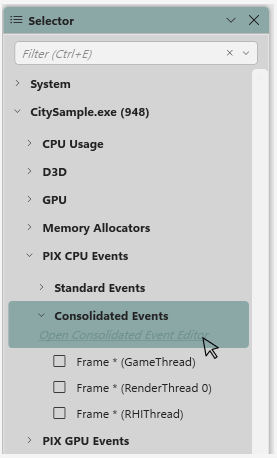

The regular expressions are listed in the **Consolidated Event Definitions**  list box.  The two built in regular expressions, *Regex for Whole Number Increments* and *Regex for Whole Number with Decimal Increments* are the first two in the list.  Expanding a regular expression displays the consolidated events that are created as a result of the regular expression.

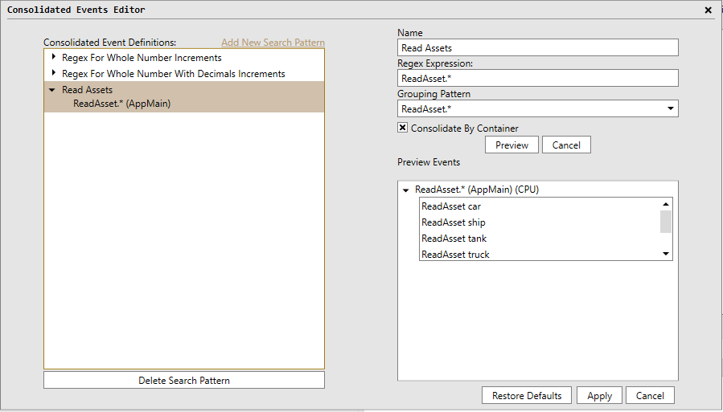

Use the **Add New Search Pattern** hyperlink to create a new regular expression.  Enter a name, the regular expression itself, and a grouping pattern in the corresponding edit boxes.  The grouping pattern is the part of the regular expression that changes as the regular expression is being evaluated.  PIX uses the regular expression classes from the .Net Framework to process the expressions.  See the [Regular Expression Quick Reference](https://learn.microsoft.com/en-us/dotnet/standard/base-types/regular-expression-language-quick-reference) for guidance when writing regular expressions.  PIX will group *PIX CPU events* and *PIX GPU events* separately when regular expressions are evaluated.

Its common to use the same string for an event name on multiple threads or API Queues.  For example, you may use an event named *Frame 456* to identify a frame on your main thread, then also use the same event name on your worker threads to identify which tasks go with that frame.  In this case, consolidating all events that follow the same pattern across all threads into a single event for purposes of graphing in the metrics view isn't useful.  Checking the **Consolidate by Container** checkbox causes PIX to scope the consolidation to the events on each thread or API Queue.

Click the **Preview** button to populate the **Preview Events** list with the consolidated events that will be created as a result of applying the regular expression.  A warning is displayed if the regular expression is malformed, or results in no events being consolidated.  An event is only a candidate for consolidation if it appears exactly one time in the capture.

Expanding a consolidated event will list the individual events that are grouped to create the event.

Regular expressions can be exported from one instance of PIX and imported into another instance using the [**Settings UI**](../../general/pix-configuring.md).

## The Active Metrics and Metric Details panels

The **Active Metrics Panel** lists all metrics that have been added to the graph from either the [**Selector** panel](#the-selector-panel), the [**Timeline** layout](pix-timing-captures-timeline-layout.md), or the [**Summary** layout](pix-timing-captures-summary-layout.md).  The table of graphed metrics includes a checkbox that can be used to toggle whether a given metric is currently graphed.  When a metric is selected in the **Active Metrics Panel**, the **Metric Details panel** is populated with a set of data and controls that can be used to customize the following aspects of how a metric is graphed:

* line style
* color
* aggregation mode
* minimum and maximum values of the y-axis

In addition to supporting these customizations, the **Metric Details panel** can also be used to view various statistics about a metric, both across the capture and for a selected time range.  

Given the volume of available metrics in a typical title, grouping all active metrics together in a single table makes it easier to manage the set of metrics that are currently graphed.

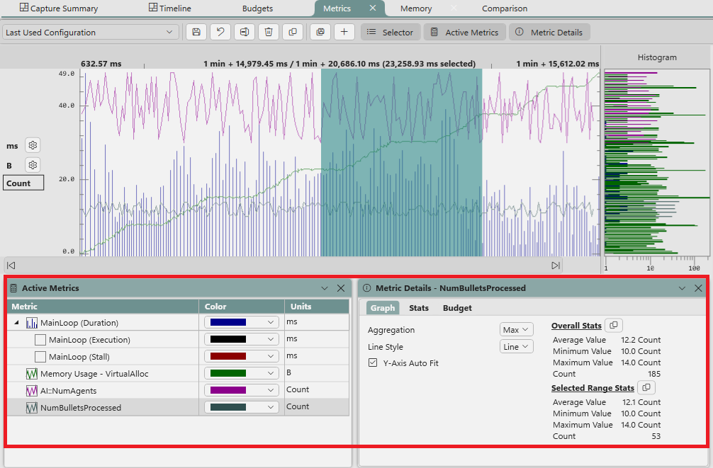

Use the checkbox to the left of a metric to toggle the graph state.  Pressing the spacebar while a row is selected also toggles the graph state.  The up and down arrow keys can be used to navigate between rows.

Use the trash can icon to remove a metric from the active metrics panel.

Ctrl-A will select all metrics in the table.  Using Ctrl-A along with the space bar or delete key is a fast way to toggle the graph state or remove all metrics.  The context menu in the **Active Metrics** panel can also be used to quickly graph or ungraph all metrics.

### Aggregation Mode

Depending on the volume of data in the capture, the Metrics layout may not be able to draw a single point for every value of a metric that was captured.  When this occurs, a number of data points will be aggregated together. The tooltip will include the number of points that have been aggregated.

By default, the maximum value of the aggregated metrics will be graphed.  This aggregation mode can be changed using the **Aggregation** dropdown on the **Graph** tab of the **Metric Details Panel** as shown in the following figure.

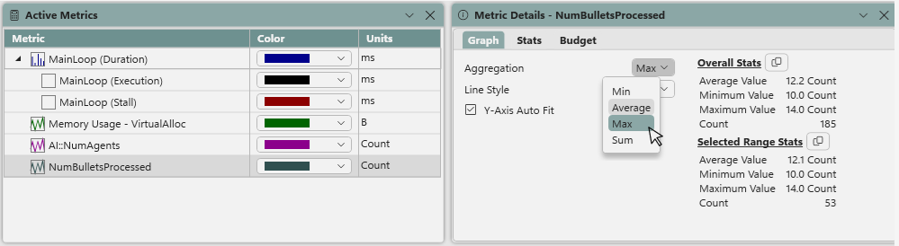

### Customizing the minimum and maximum values for the y-axis

In most cases, the default min and max values of the y-axis are the minimum and maximum values for the metric as seen over the duration of the capture.  However, there are some cases, such as *CPU Usage*, in which the default minimum and maximum values are known ahead of time.  In these cases, the min and max values of the y-axis are fixed.  In the *CPU Usage* example, the default min and max values would be 0 and 100 respectively.  

The default min and max values of the y-axis are also influenced by the set of graphed counters that have the same units.  In this case, the min value is the minimum value from across all of the metrics and the max value is the maximum value from across all metrics.  

There are cases in which the default min and max values for the y-axis may not be optimal.  One such example occurs when the ranges of two or more graphed metrics differ significantly.  In this case, the default min and max y-axis may make it impossible to differentiate individual values for some of the metrics.  In the following example, the graph of the *Frame (GameThread)* metric is easily readable, but the size of the graph for the *Nanite::BasePass* metric makes it difficult to distinguish individual values.

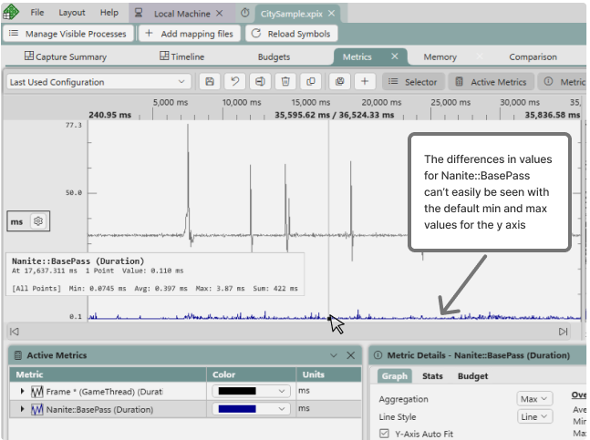

The min and max values of the y-axis can be customized for each metric to make analysis easier in cases like this.  To customize the y-axis, start by selecting a metric in the **Active Metrics Panel**.  The min and max values of the y-axis can then be customized using either the mouse wheel or by entering the values manually in the **Metric Details Panel**.  To customize the y-axis using the mouse, hold down the Shift key, then use the mouse wheel to zoom in and out.  Note that changing the y-axis using the mouse wheel also works in the [histogram control](#metrics_view_histogram).

 To enter the min and max values for the y-axis manually, uncheck the **Y-Axis Auto fit** checkbox on the **Graph** tab of the **Metric Details Panel**.  Doing so causes the **Y-axis min** and **Y-axis max** fields to be editable.  Enter the custom values directly in the edit boxes.  In the following example, the max y-axis value for *Nanite::BasePass* has been customized such that the graph for that metric is now readable alongside the graph for *Frame (GameThread)*.

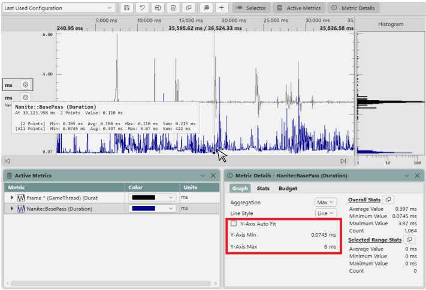

When the y-axis is customized by unchecking the **Y-Axis Auto Fit** checkbox, a new unit box is added to the panel on the left hand side of the graph.  The unit box includes the name of the metric for which the custom y-axis values apply, thereby making it easier to discover which customized y-axis values apply to which metric when several have been customized.

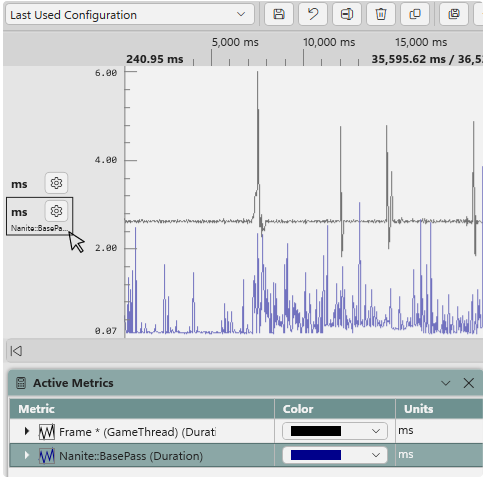

Reselect the **Y-Axis Auto fit** checkbox to restore the default min and max y-axis values for a metric.

### Specifying performance budgets

[Performance budgets](pix-timing-captures-budgets-layout.md) can also be set using the Metrics view graph.  Right clicking a point on the graph and selecting **Set budget for `&lt;metric&gt;`** creates a budget with the value of the selected point.  The new budget will be added to the currently active budget profile.  If no budget profiles exist, you will be prompted to create one.

If a metric has a budget defined, and the metric is selected in the [Active Metrics panel](#the-active-metrics-and-metric-details-panels), the **Budget** tab on the Metric Details panel will contain a list of the points over budget.  Hyperlinks are included for each point.  Use the hyperlinks to navigate to the [Timeline layout](pix-timing-captures-timeline-layout.md) at the point in time where the metric was over budget.

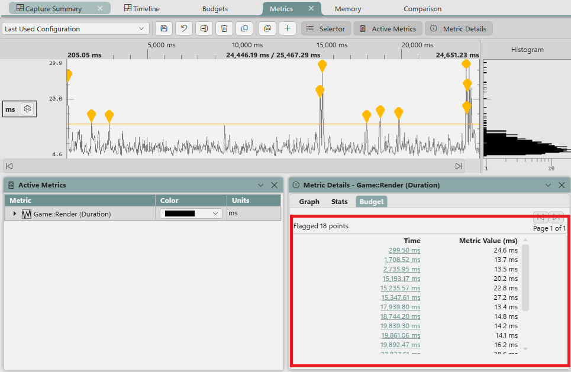

## Exporting data from the Metrics view

The Metrics layout supports exporting data for analysis in other tools such as Microsoft Excel.  Data is exported in csv format.  The values for all points of the currently graphed metrics are exported.  Use the context menu to export the graphed data.

If no time range is selected in the graph, **Export graphed metrics...** will export data for the entire capture.

The points for each metric are exported in time order.  Columns in the csv file include the metric's name, and the timestamp and value for each point.

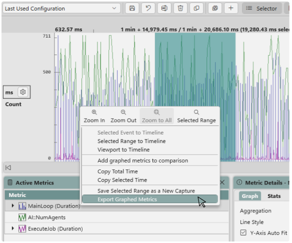

If the points for multiple metrics are exported, the data for each metric is kept in a contiguous set of rows in the csv file, with the data for a given metric following the data for the previous metric.

## Creating and managing Metrics View configurations

The set of currently graphed metrics, along with their display properties, can be saved as a Metrics View configuration.  Creating configurations makes it easier to switch between groups of metrics that are commonly graphed together.  For example, one configuration could be created for a set of physics metrics, and another configuration created for a set of audio metrics.  The **Configurations** dropdown in the upper left corner of the Metrics View can be used to switch between configurations.  The toolbar buttons to the right of the drop down can be used to create, delete and otherwise manage, configurations

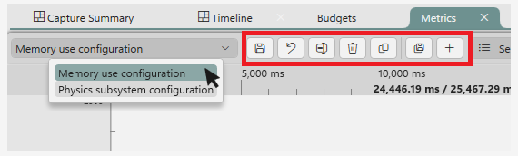

Metrics view configurations can be exported from one instance of PIX and imported into another.  See [Configure PIX](../../general/pix-configuring.md) for more information.
