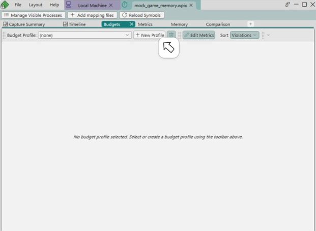
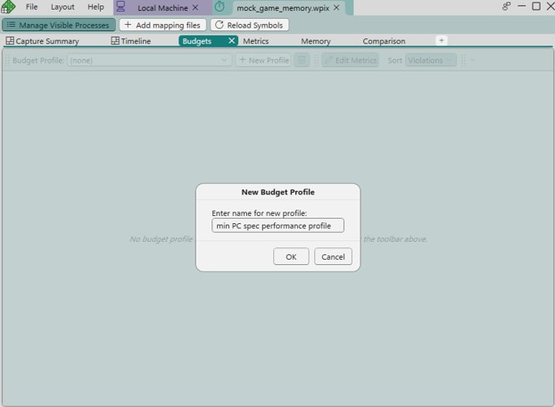
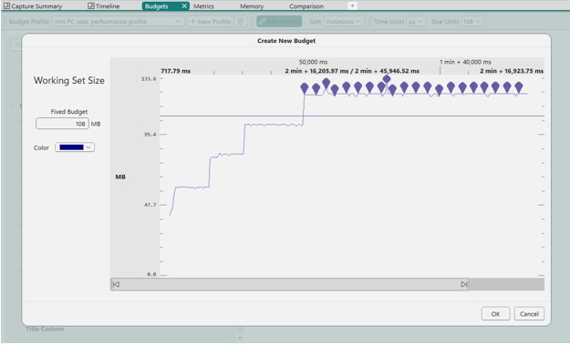
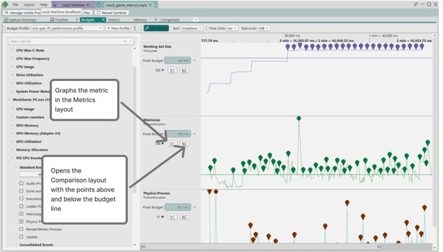
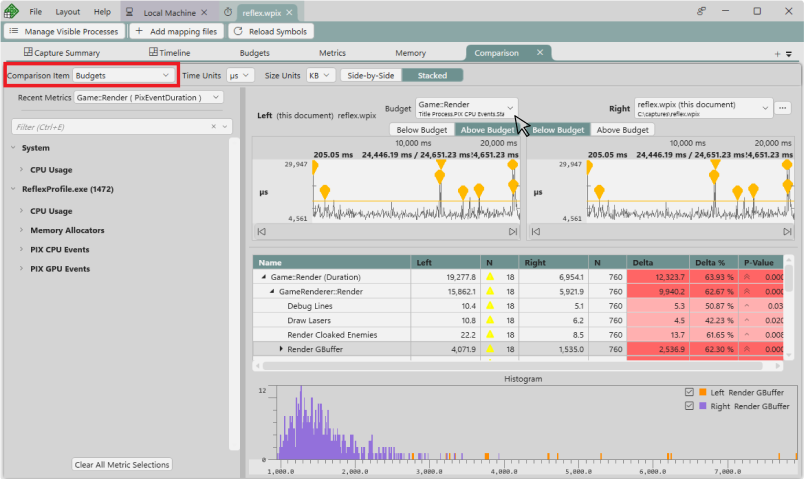
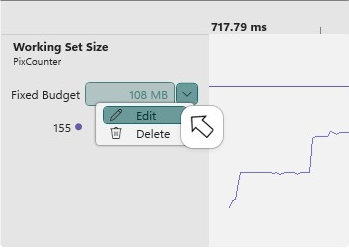
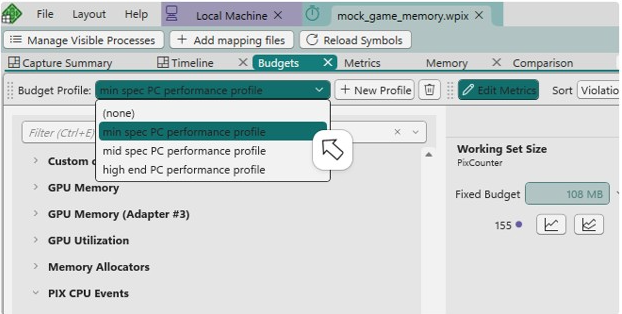
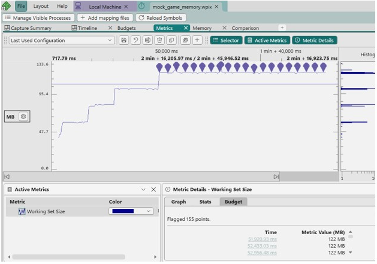
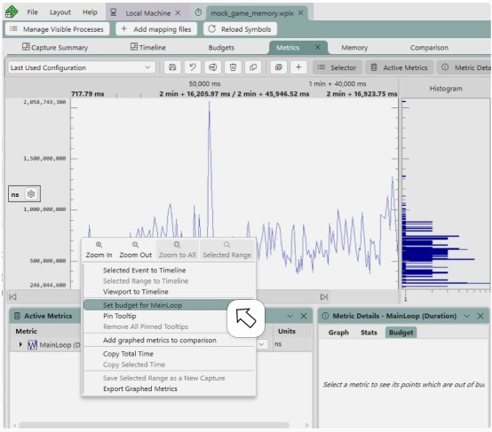

# The Budgets layout 

It's common practice when optimizing games to assign performance budgets to various aspects of the game that are critical to performance.  Overall frame time is probably the most common performance budget, but budgets are also often assigned to individual subsystems like simulation, rendering or physics, for example.  Budgets that limit the amount of memory the game or a subsystem can allocate are also often seen.

Budgets can be defined on any metric available in the [Metrics layout](pix-metrics-layout.md).  The units for a budget is the same as units for the metric on which it is defined.  For example, the budget for a subsystem would be specified as a unit of time, usually milliseconds, while a budget for memory usage would be specified by memory size, such as MB or GB.

The Budgets layout allows for grouping of multiple individual budgets.  A common use of Budget Profiles is to define the performance targets, or profiles, for different hardware specifications.  For example, your studio likely has different performance targets for min-spec, mid-range and high end PCs.

Click the *New Profile* button to create a new profile.

A dialog will appear, prompting you to name your new profile.

After clicking *OK* to create the budget profile, the metrics selection panel will be displayed on the left hand side of the view.  Select a metric to create a budget to add to the profile.  Doing so displays a dialog on which you can specify an initial budget for the metric.  In this example, a budget for the Working Set Size metric has been set.

A horizontal line is drawn on the graph at the value specified in the budget.  All points over budget are flagged to make them easier to find.

Budget profiles typically consist of multiple individual budgets.  The main view in the Budgets layout displays the budgets and their metrics.  Use the buttons on each lane to either graph the metrics in the [Metrics layout](pix-metrics-layout.md), or to open the [Comparison layout](pix-timing-captures-comparison-layout.md).

When the [Comparison layout](pix-timing-captures-comparison-layout.md) is opened, the points above the budget are contained in the left hand graph, while the points below the budget are contained in the right hand graph.

Use the dropdown next to the budget value on the Budgets layout to edit or delete the budget.

Multiple budget profiles are typically defined.  Switch between them using the *Budget Profile* dropdown.

The currently selected budget profile determines the budget values that are used when viewing budgets in either the [Metrics layout](pix-metrics-layout.md) or the [Comparison layout](pix-timing-captures-comparison-layout.md).  For example, the **min spec PC performance profile** specifies a budget of 108 for *Working Set Size*.

When **min spec PC performance profile** is selected in the Budgets layout, the graph of the *Working Set Size* metric in the [Metrics layout](pix-metrics-layout.md) will use the budget of 108.  Switching to a different budget profile will change the budget values that are used.

Similarly, a budget of 108 will be used in the Comparison layout when comparing points above and below the budget line.

Budgets can also be set using the [Metrics layout](pix-metrics-layout.md).  Right clicking a point on the graph and selecting **Set budget for &lt;metric&gt;** creates a budget with the value of the selected point.  The new budget will be added to the currently active budget profile.  If no budget profiles exist, you will be prompted to create one.

