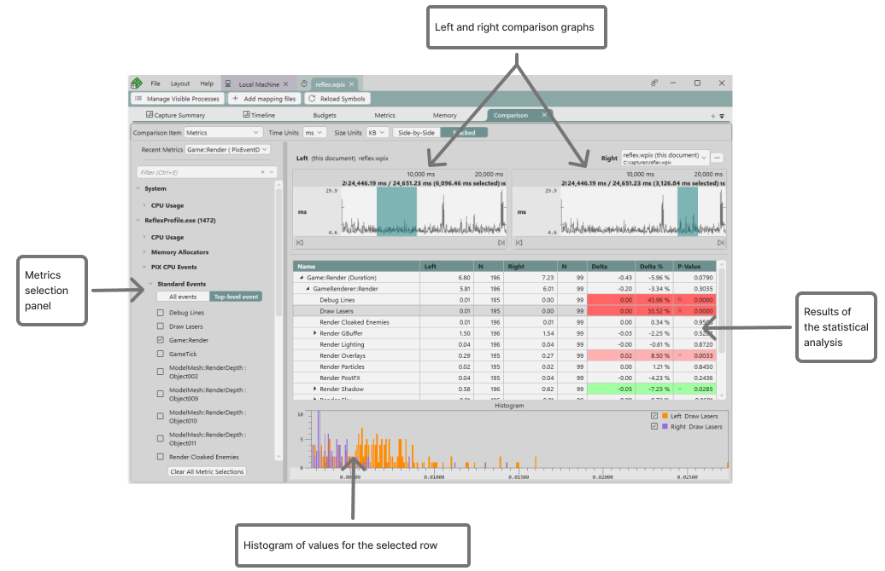

# The Comparison layout 

The Comparison layout is used to produce a statistical comparision of the average duration for the points that represent PIX event hierarchies in two selected ranges of time, or for the points above and below a metric's budget.  Statistical comparisions help determine which portions of the event hierarchies had statistically different durations for the set of points being compared.

The layout consists of a metric selection panel, graphs for the left and right set of points to be compared, a table showing the results of the comparison, and a histogram of the values of both the left and right sets of points for the selected row in the table.  The set of points for the right hand side of the comparison may come from a different capture than the points from the left hand side of the comparison.  This allows you to compare data from a capture taken on one PC with the data taken on a different PC, for example.

## Comparing groups of points for a metric

To produce a comparison for a metric, select *Metrics* from the **Comparison Item** dropdown, select a metric on the selection panel, then select a range of time in both the left and right graphs.  For example, the following graph of a metric named **Game::Render** shows several ranges of time where the event durations are relatively consistent, but there are also ranges of time in which the event's durations are significantly different between the left and right graphs.  A statistical comparison of the event durations in the two highlighted time ranges can be used to determine which portions of the **Game::Render** event hierarchy account for the differences in duration.

Note that each selected range of time must have at least two points for the metric being compared.  It's recommended that you select ranges that have enough points to provide a good sample representation of your game's behavior. The amount of data may vary depending on how noisy your source data is, but a good rule of thumb is to look for ranges with 50-100 data points. A warning indicator will be shown if the number of data points is below 20.  

The **Left** column in the table displays the average duration for the set of points in the range of time selected in the left graph.  The **Right** column displays the average duration for the set of points in the range of time selected in the right graph. The **Delta** and **Delta %** columns show the differences in duration between the left and right groups.

The **P-value** column identifies whether the differences between the left and right groups are statistically significant or whether the differences are due to other factors such as noise, random sampling, or sampling bias.  The lower the P-value, the more statistically significant the differences are.  Those rows with the lowest P-values, are the rows you'll likely want to investigate further, by drilling further into the event hierarchy.  Rows that are statistically significant are colored in either red or green depending on whether the delta between the left and right groups is negative or positive.  The boldness of the red and green colors is relatlive to how close to 0 the P-value is.  Up and down arrows are also displayed in the P-value column to aid with accessibility.  Sorting by P-value is a convenient way to bring the most statistically signifcant points to the top of the table.

The histogram at the bottom of the layout shows the distribution of the durations for the left and right groups for the selected row in the table.  There is generally a correlation between the P-value for a given row and it's histogram.  The histograms for the left and right groups are largely overlapping for rows with high P-values, and vice versa.

The number of points in the left and right groups also influences how to interpret the results.  The **N** columns in the table display the number of points for each group.  A yellow warning triangle is drawn in those cells with low sample counts.  Results may be biased in these cases.

## Comparing the points above and below a metric's budget

To compare the points above and below a metric's budget,  select *Budgets* from the **Comparison Item** dropdown.  The **Budget** dropdown above the two graphs will be populated with all budgets in the current [Budget profile](pix-timing-captures-budgets-layout.md).  Use the dropdown to select the budget to be added to the comparison.  The left hand graph contains the points over budget while the right hand graph contains the points under budget.

