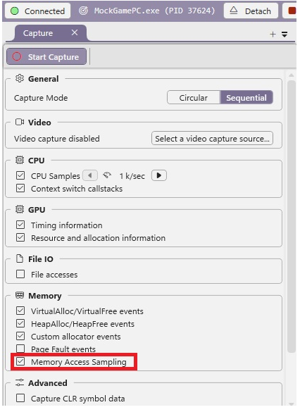
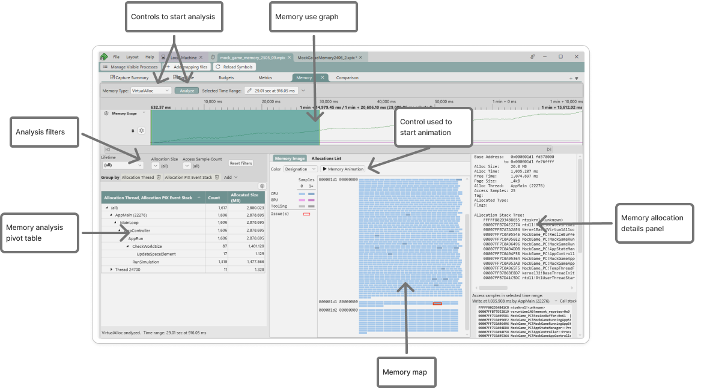
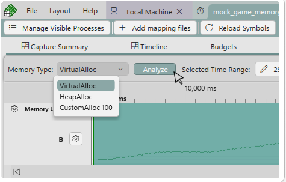
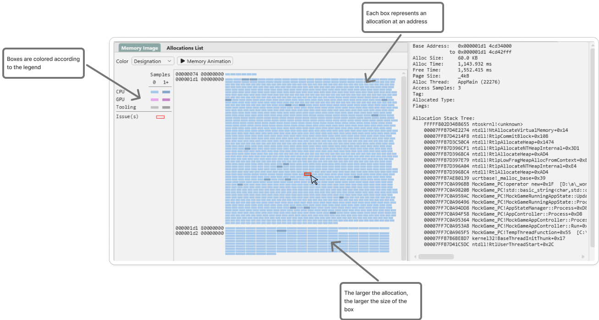
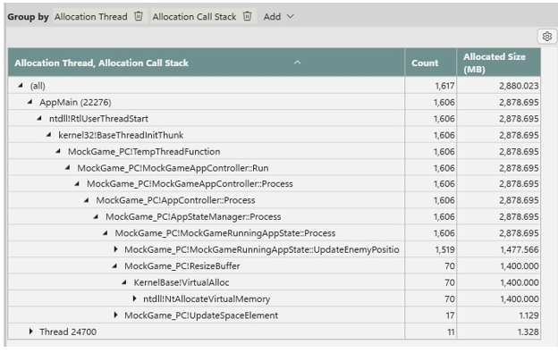
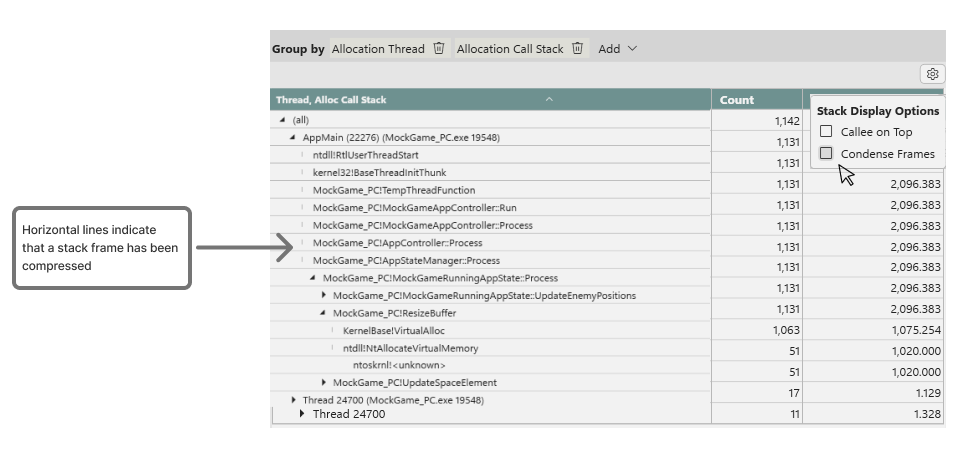
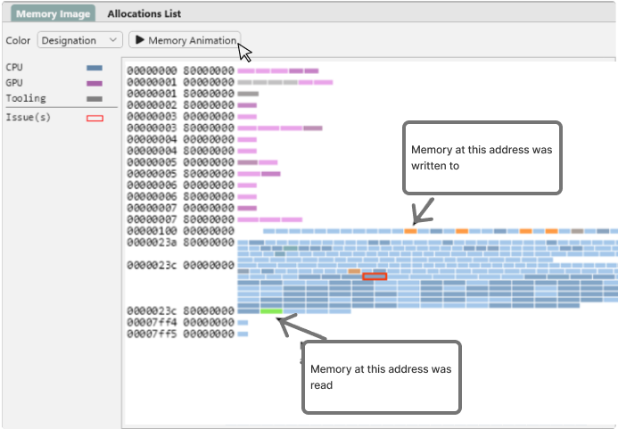
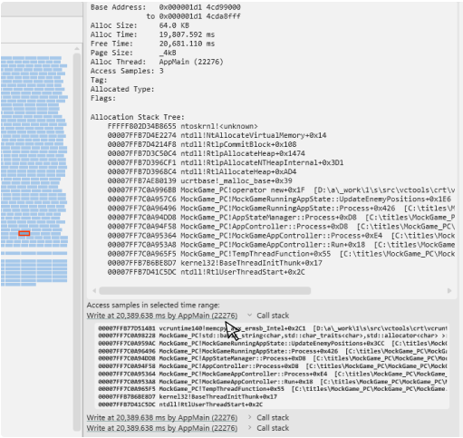

# The Memory layout 

The Memory layout enables you to analyze the memory allocations and accesses made during the capture. The analysis supports several key memory profiling scenarios, including the ability to identify memory allocations that were not freed, and memory that was allocated but then never accessed.

PIX identifies memory accesses based on samples. Each time a CPU sample is collected, PIX also records the values of the system's registers. These register values, along with the title's pdbs and executables, are used to find CPU instructions that result in memory accesses. Because the accesses are identified using sampling, longer captures with higher sampling rates will provide a more complete picture of a title's memory access patterns than shorter captures taken with a lower sampling rate.

> [!NOTE]
> Before collecting memory access samples, add the paths to both the title's pdbs and executables to the [symbol path settings](../pix-timing-captures-pdb-config.md).

To collect memory access samples, you must also collect CPU samples.  Select a **CPU Samples** interval and select the **Memory Access Samples** checkbox before starting a Timing Capture.  PIX will only capture memory allocations made after the capture starts, so consider using the  [**Capture from launch**](../pix-timing-captures.md#take_capture_ui) option when starting a capture to get all memory accounted for.

The primary user interface elements of the Memory layout are shown in the following figure.

* **Memory Usage graph.**  A graph showing the working set size, and the amount of memory allocated by each type of allocator over the duration of the capture.
* **Controls to start analysis.** A set of user interface controls for starting memory analysis.
* **Memory map.** A map of all memory allocations made during the selected time range.
* **Analysis filters**. The user interface controls used to filter the memory map based on a set of predefined criteria.
* **Control used to start animation.** A control to start the animation needed to view individual memory accesses.
* **Memory allocation details panel.**  A panel that provides details about the memory allocation that is selected in the memory map.
* **Memory analysis pivot table.**  A pivot table for analyzing the data based on a set of predefined criteria. The pivots shown in the following figure are Allocation Thread and Allocation PIX event stack.

## Running Memory Analysis

The memory map is not populated when a capture is initially opened. To populate the map, select a region of time in the **Memory Usage graph**, select a memory type from the **Memory Type** dropdown and click the **Analyze** button.

The memory map is organized by memory address. Each box in the map represents a memory allocation at a particular address. The size of each box is relative to the size of the allocation. The boxes in the memory map are colored based on the legend to the left of the map. The following figure shows a memory map colored by memory type: CPU and GPU.

Selecting an allocation populates the **Memory allocation details panel** in the analysis panel with detailed information about that allocation, including its address, size, page size, allocator and callstack.

The allocations shown in the memory map can be filtered in various ways using the **Lifetime**, **Allocation Size**, **Access Sample Count** and **Alloc Page Size** dropdowns. For example, the **Lifetime** dropdown can be used to filter the allocations that were made during the selected time, but were not freed by the end of the analysis window. These allocations represent potential memory leaks. Using the **Access Sample Count** filter to display only those allocations that were never accessed can help find memory that was allocated, but never used.

Use the pivot table to analyze the total amount of memory allocated in the selected region of time. The amount of memory allocated can be pivoted by various criteria including the allocating thread, and callstack and PIX event trees. In the following figure, the total amount of memory allocated is pivoted first by thread and then by the callstacks that allocated the memory.

An option is provided to condense stack frames when the pivot table is pivoted by either **Allocation Call Stack** or **Allocation PIX Event Stack**. If a node in a stack tree has only one child, when condensed, that child node is removed and replaced with a visual indicator. Condensing stack trees makes it faster to navigate portions of the tree that have only one child. The amount of horizontal space is also optimized when stack trees are condensed. To condense a stack, select the **Condense Frames** option from the settings icon in the view.

## Analyzing memory access samples

Detailed information about each memory access, including a link to the [Timeline](../pix-timing-captures.md) at the point in time when the access occurred, along with its callstack, can be obtained by running a memory animation of the selected region of time. Use the **Memory Animation** button to run the animation. When running the animation, PIX processes each memory access in time-order fashion, highlighting the accesses in the map. Memory reads are highlighted in one color, and memory writes are highlighted in another. The following figure shows the memory map as an animation is running.

As memory accesses are analyzed, hyperlinks and callstacks for each allocation and access are populated in the panel to the right hand side of the map. Clicking on a hyperlink navigates to the CPU sample in the Timeline that resulted in the memory access.

