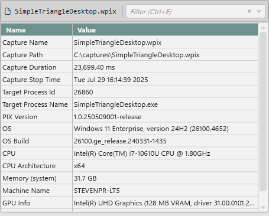
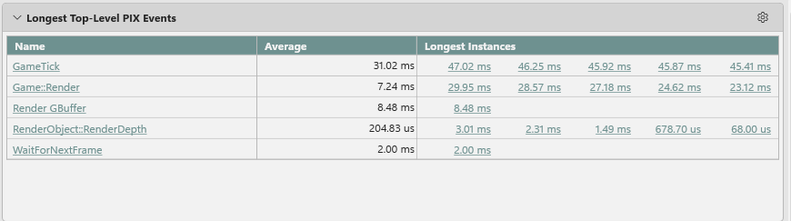
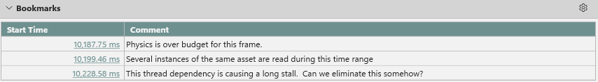
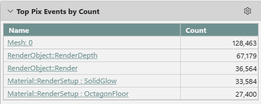
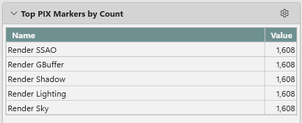
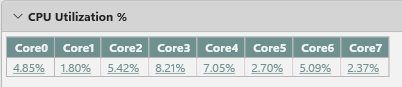
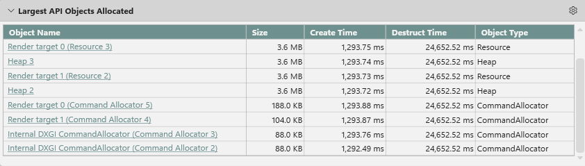
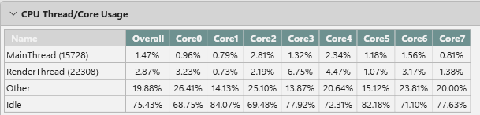
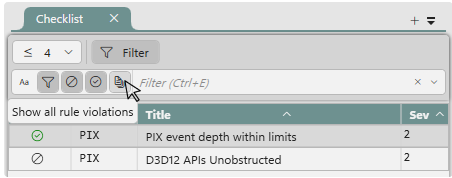

# The Summary layout 

When a [Timing Capture](..\pix-timing-captures.md) is opened, PIX performs an initial analysis that produces capture statistics and a set of potential candidates for additional performance analysis.  The analysis is grouped into several sections.  The Summary layout consists of three views: the **Capture Details** view, the **Summary** view and the **Checklist** view.

## Capture Details view

The Capture Details view provides a set of capture statistics, including the capture length, the version of PIX that capture was taken with, and a description of the PC the capture was taken on.

## Summary View

The following sections make up the summary view.

* **Longest Top-Level PIX Events.** A table listing the [PIX events](../../general/pix-instrumenting.md) that have the longest durations in the capture.  The longest instances are recorded for each event.  Clicking on an event name in the table graphs the event in the [Metrics layout](pix-metrics-layout.md).  Clicking on an event instance in the table navigates to that instance in the [Timeline layout](pix-timing-captures-timeline-layout.md).

* **Bookmarks**. A list of the bookmarks in the capture.

* **Top PIX Events by Count.** The PIX events that occurred most frequently in the capture.  Clicking on a hyperlink in the name column graphs the event in the [Metrics layout](pix-metrics-layout.md).

* **Top PIX Markers by Count.** The [PIX markers](../../general/pix-instrumenting.md) that occurred most frequently in the capture.

* **CPU Utilization %.** The utilization of each CPU as determined by CPU sampling.

* **Largest API Objects Allocated.** A table listing the largest D3D API Objects sorted by size.  Clicking on the name of a resource in the table navigates to that instance in the **Range Details** view in the [Timeline layout](pix-timing-captures-timeline-layout.md).

* **CPU Thread and Core Usage.** A table listing the utilization of each CPU and thread as determined by CPU sampling.

## Checklist View

The Checklist view provides a set of requirements that must be met or best practices that, if followed, will maximize the performance of your title.  The set of Checklist items is built into PIX.

For each checklist item that does not pass, the list of specific violations can be found by expanding the checklist item.  

Use the **Filter** bar to control the individual checklist items and violations displayed in the view.

