# The Timeline layout 

The Timeline layout displays a graphical representation of your game's activity over the duration of the capture. The layout displays the profiling data in a series of lanes, each of which is optimized to show a particular type of data. For example, lanes representing CPU cores and threads are optimized to show CPU activity, lanes representing storage devices show file io activity, and the memory usage lane shows the amount of memory your game uses and so on.

The Timeline layout contains the following views and panels.

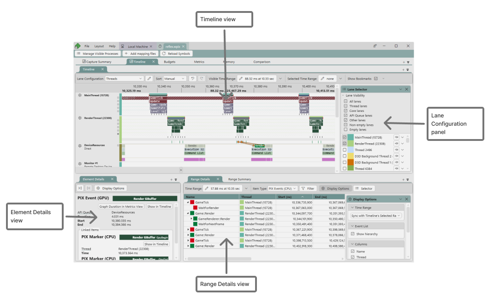

- The [Timeline view](#timeline_view) displays time-oriented profiling data in a series of lanes, each of which is optimized to show a particular type of data.  
- The [Range Details view](#range_details) shows the data displayed graphically in the Timeline in tabular form for a time range you specify. The Range Details View is useful for sorting by metrics like duration and for quickly navigating through all instances of a particular type of data in a time range.
- The [Element Details view](#element_details) provides details about the element that's currently selected in the Timeline or in Range Details. For example, when a CPU sample is selected, Element Details displays the full call stack for the sample. The Element Details View also allows you to navigate to the selected element in the Timeline or to graph the element in the Metrics View.
- The [Lane Configuration panel](#lane_config) is used to customize how the various lane types are displayed in the UI. Several aspects of the UI can be configured, including the ordering of lanes and how the data in each lane is presented.

## The Timeline view

The lane types shown in the Timeline view are:

* [Video frames](https://devblogs.microsoft.com/pix/capturing-video-frames-in-timing-captures/)
* [Core](#core_lanes)
* [Thread](#thread_lanes)
* [D3D12 API Queue](#api_queue_lanes)
* [DirectStorage queue](https://devblogs.microsoft.com/pix/pix-support-for-directstorage/)
* [Win32 file accesses](https://devblogs.microsoft.com/pix/analyzing-win32-file-io-performance-in-timing-captures/)
* [Memory usage](https://devblogs.microsoft.com/pix/new-memory-profiling-features-in-timing-captures/)
* [Critical Path for a PIX Event](https://devblogs.microsoft.com/pix/critical-path-analysis-in-timing-captures/)

A ribbon displayed at the top of the Timeline shows the time range of the capture from beginning to end. The following ribbon shows a capture that's just under 59 minutes in duration.  

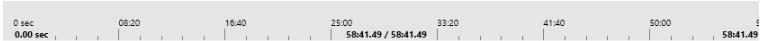

As you zoom in and out by using Ctrl+mouse wheel button, or scroll horizontally, the ribbon updates to show the portion of the capture you're currently viewing.

The Timeline is often zoomed all the way out when opened, depending on how you have navigated to the Timeline. At this zoom level, PIX might not be able to show all the details, such as every event, context switch, and sample. When this happens, PIX aggregates the data and displays a tooltip, showing you the amount of data that has been aggregated.

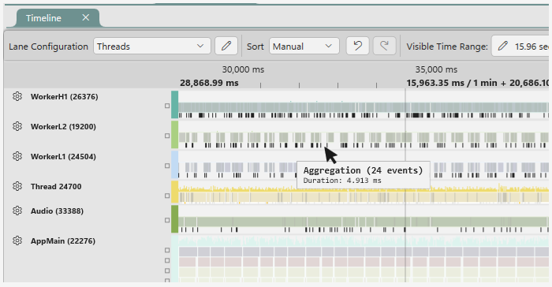

Zoom in using Ctrl+mouse wheel until you reach the desired zoom level.

### Core lanes

PIX automatically creates one Core lane for each CPU in your PC. Core lanes show you the following:

- The CPU utilization for the core at any point in time
- Which thread, if any, is running on each core at any point in time
- When context switches occur
- PIX CPU events (created by calling [PIXBeginEvent](../../general/pix-instrumenting.md))
- PIX CPU Markers (created by calling [PIXSetMarker](../../general/pix-instrumenting.md))
- CPU samples
- API Markers used to populate GPU command lists

At the top of each Core lane is a graph that shows the CPU utilization of that core over time.  A tooltip displays the percentage of the CPU used by your game process.

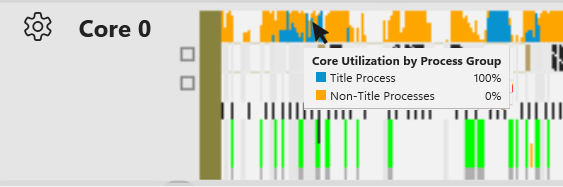

PIX assigns colors to Core and Thread lanes, and uses those colors to help you visualize which thread is running on each core. Hovering over a colored portion of a Core lane causes PIX to display a tooltip that identifies which thread is running. The color displayed on the Core lane matches the color of the Thread lane for the thread that's running on the core.

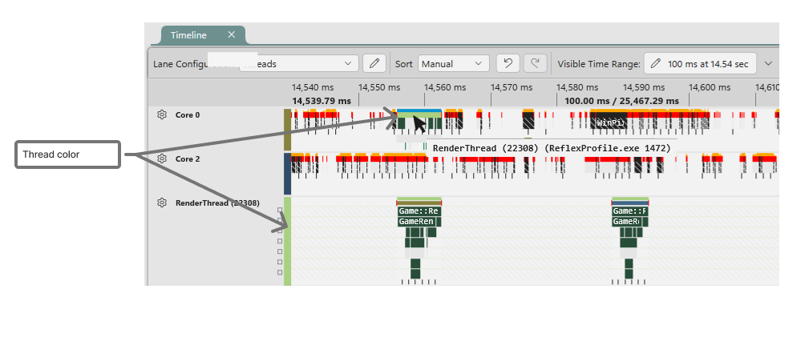

Selecting a colored section of a flattened core lane populates the [Element Details](#element_details) view with details about the thread that is running.  These details include the name and ID of the thread, along with it's affinity settings and priority.

When using the Light Theme, sections of the Core lanes that are white indicates that the core is idle.  When using the Dark Theme, idle time is drawn in black.  Sections drawn in a black crosshatch pattern indicate that the core is active, but  running code from a process other than your game.  The name of the process that is running is displayed in the box.  Sections of the core lane drawn in a white crosshatch pattern indicate that game code is running, but that section of code is not bracketed by a PIX CPU Event.

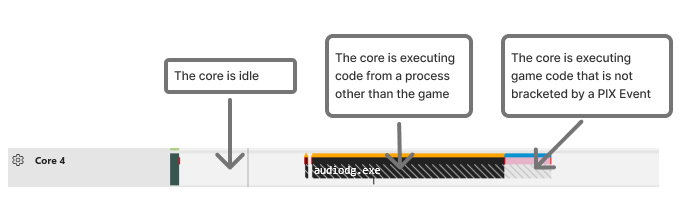

Hovering just below a colored section displays a tooltip that shows the stack of PIX CPU events that are running at that time.  The colors of the events in the tooltip match the colors that were assigned to the event when [PIXBeginEvent](../../general/pix-instrumenting.md) was called.

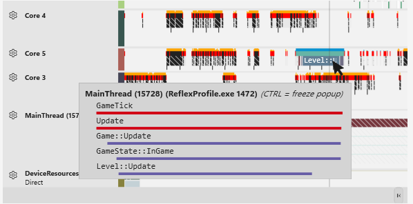

Context switches are identified by red vertical lines on the Core lanes. See [Analyzing stalls and context switches](https://devblogs.microsoft.com/pix/analyzing-stalls-and-context-switches-in-timing-captures/) for more information on identifying when context switches have occurred and what has caused them.

Several aspects of how the Core lanes are displayed can be configured by using the [Lane Configuration panel](#the-lane-configuration-panel). You can choose which types of data to display, whether to display hierarchical data as expanded or flattened, and so on. In the following figure, the Core lanes have been configured to display all PIX CPU events, PIX CPU Markers, API Markers, CPU samples and context switches. CPU Markers are drawn as vertical green lines at the bottom of the Core lane. API Markers and CPU Samples are drawn as vertical black lines at the bottom of the Core lane. Context switches are drawn as vertical red lines.

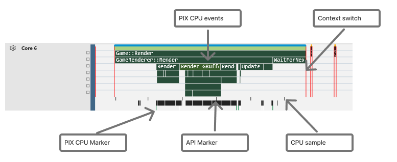

### Thread lanes

PIX creates one Thread lane for every thread that's running in the title process. Threads are identified in the UI by either their ID or their name. If your threads are named by using the [SetThreadDescription](/windows/desktop/api/processthreadsapi/nf-processthreadsapi-setthreaddescription) API, PIX displays the thread's name in the UI. Unnamed threads are identified by their ID. Assigning names to your threads makes it significantly easier to find them in the capture.

By default, PIX sorts threads for display in the Timeline by the amount of activity occurring on the thread. Threads with a large number of PIX CPU events are sorted above those with relatively few events, for example. You can change this default sorting, along with several other aspects of how the Thread lanes are displayed, by using the [Lane Configuration panel](#lane_config).

Thread lanes show you the following:

- Which core a thread is running on at any point in time
- When context switches occur
- CPU events (created by calling [PIXBeginEvent](../../general/pix-instrumenting.md))
- CPU Markers (created by calling [PIXSetMarker](../../general/pix-instrumenting.md))
- CPU samples
- API Markers used to populate GPU command lists

The following figure shows how these various types of data are displayed in the lane.

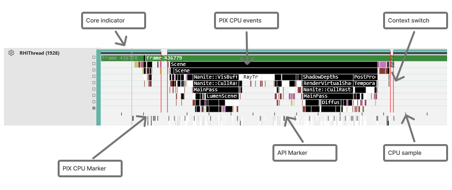

An indication of which core a thread is running on is displayed in a few different ways. First, when hovering over the Core indicator on a Thread lane, a tooltip is displayed, identifying which core the thread is running on. The color of the core indicator matches the color of that core in the Core lane.

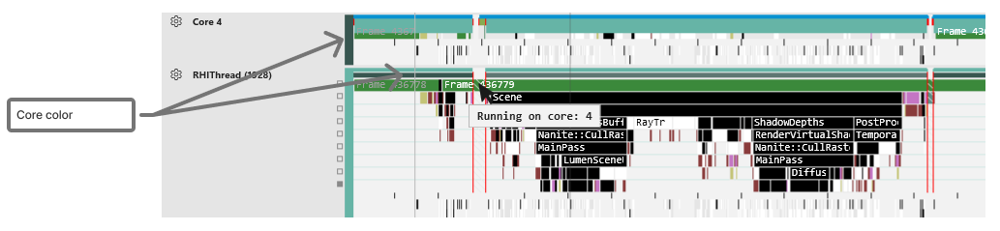

Core information is also shown when you select a PIX CPU event in the Thread lane. When an event is selected, the Core lanes are updated to show where the thread is running. This visualization makes it easy to spot threads that aren't affinitized to a single CPU core. In the following figure, an event named *Physics::Process* is selected in the *Physics* Thread lane. The Core lanes show that the *Physics::Process* event moves between Cores 4 and 5 while executing.

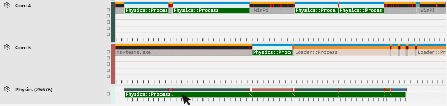

Unscheduled time (time when the thread isn't running) is shown in the Thread lane using a shaded cross-hatched pattern. Periods of unscheduled time always begin and end with a context switch. Note that the periods of unscheduled time align with periods where the Core lanes indicate that the thread isn't running. See [Analyzing stalls and context switches](https://devblogs.microsoft.com/pix/analyzing-stalls-and-context-switches-in-timing-captures/) for more information on identifying when context switches have occurred and what has caused them.

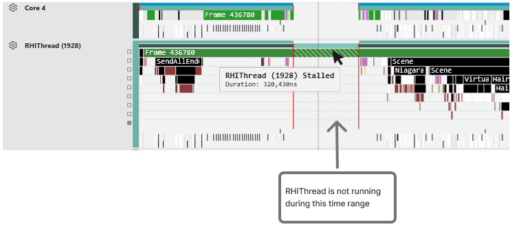

The visualization that shows unscheduled time is on by default. The [Lane Configuration panel](#lane_config) allows you to turn off this visualization.

Selecting the core indicator lane for a period of time in which a thread is running will populate the [Element Details](#element_details) view with details about the thread.  These details include the thread's name and id, along with it's priority and affinity settings.

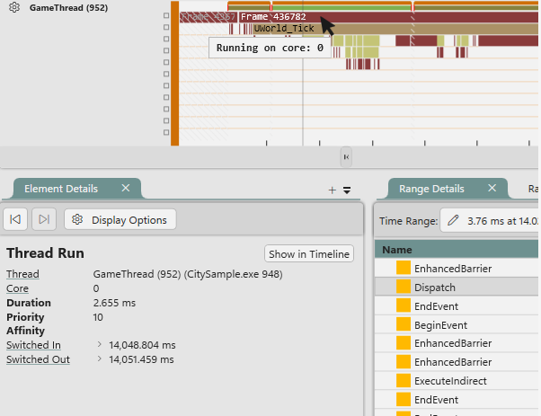

### API Queue lanes

PIX creates one API Queue lane for every DirectX 12 command queue in your title process. API Queue lanes contain three types of data. The top part of an API Queue lane displays PIX GPU Events. These are the events created by calls made to [PIXBeginEvent](../../general/pix-instrumenting.md) when a context is passed. The middle part of the lane shows the DirectX 12 command list executions that contain the GPU commands.  The bottom portion of an API Queue lane shows the GPU work that's executed on the command lists.

Thread lanes show the API Markers that cause GPU work to be added to the command list.

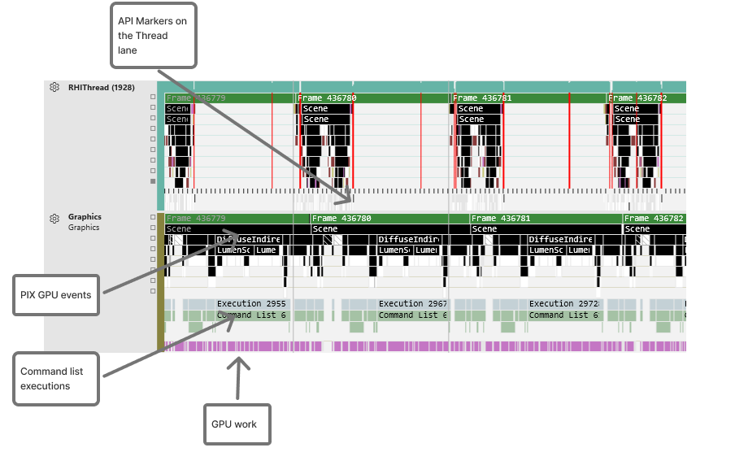

Selecting a PIX GPU event, a command list execution, or a piece of GPU work will cause a correlation arrow to be drawn to the related element in a thread lane.  For example, the following figure shows the correlation between an API marker on a thread lane, and the corresponding command list on the API Queue lane.

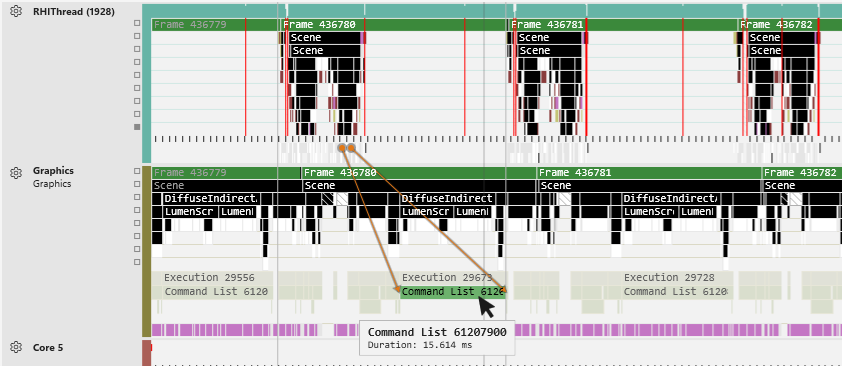

When a PIX GPU event is created, PIX adds PIX CPU Markers to the Thread lane that indicate the starting and ending times for the corresponding CPU work.  Arrows showing the relationship between the start and end times are drawn between the PIX CPU Markers and the corresponding PIX GPU event.  When a PIX GPU event is selected, the information displayed in the [Element Details](#element_details) view includes details about the PIX CPU Markers drawn in the Thread lane, in addition to the details about the selected PIX GPU event.

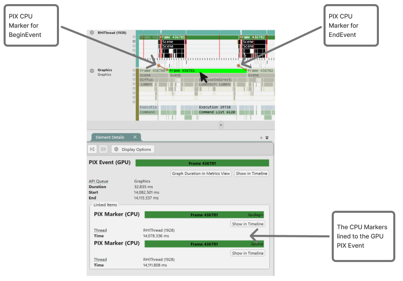

The types of data to display in API Queue lanes can be configured using either the gear icon next to the name of the queue, or by using the [Lane Selector Panel](#lane_config).  Use these controls to specify which types of data to display.  Options to control how the data is display are also provided.

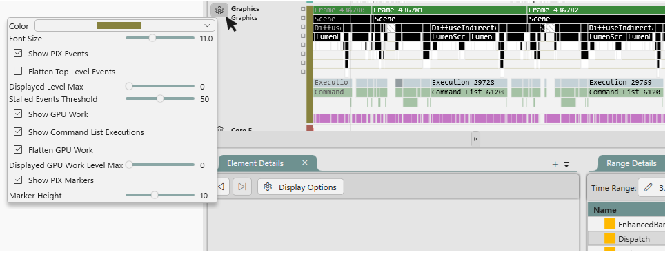

## The Range Details view

The Range Details View displays a tabular representation of all timing data within a selected time range. Viewing data in a table is convenient for sorting the data based on criteria like start time or duration. The Range Details View also allows you to copy the contents of the table so it can be pasted into other analysis tools like Microsoft Excel.

To select a time range, left-click an area of the timeline and drag to the right while holding the mouse button down. A highlight appears and tracks the range you're selecting. The ribbon across the top of the capture also updates to show you the duration of your selected range. After releasing the mouse button, the Range Details View is populated with the data from all lanes in the range you selected as shown in the following figure.

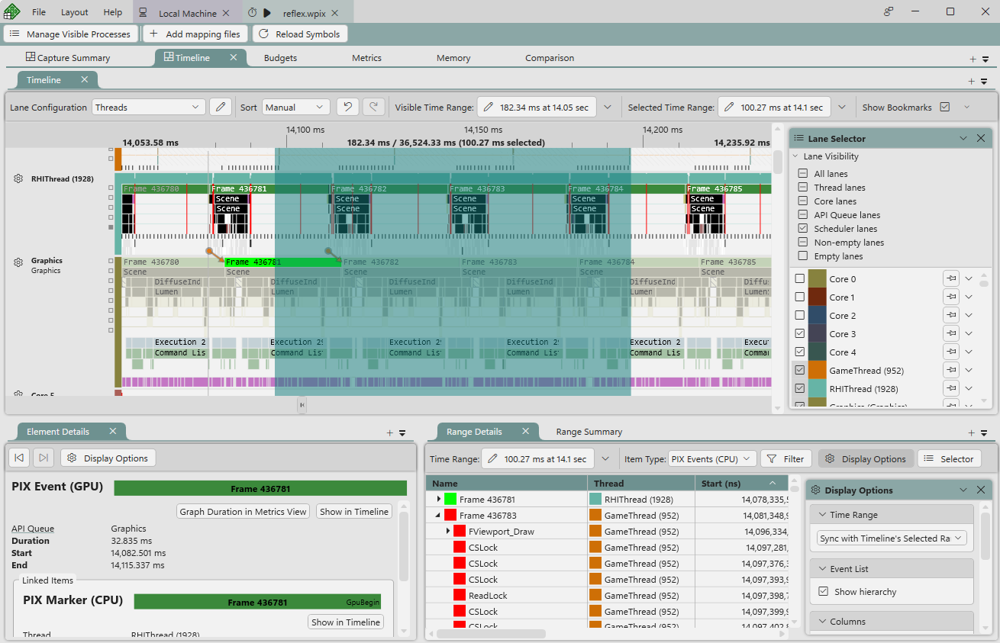

A time range can also be specified in various other ways using the options provided on the **Time Range** dropdown.  Options include the ability to enter a time range manually, or to specify a time range as defined by the start and end times of a selected PIX event.

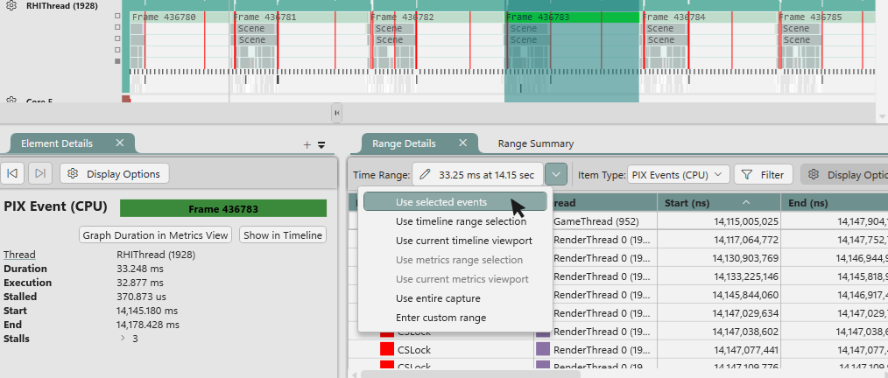

PIX places a limit on the amount of data that Range Details can hold. If you select a time range that contains too much data, Range Details displays a message stating that more data is available, along with a hyperlink used to obtain the next set.

By default, Range Details displays data for PIX CPU events. Other types of data, such as GPU work, DirectStorage events, memory allocations, and others can be viewed by choosing the type in the **Item Type** drop-down list in the upper-right corner of the view.

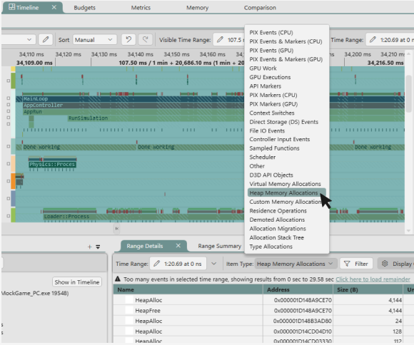

The following topics provide more detail on some of the more complex data types displayed in Range Details:

* Context Switches. [Analyzing stalls and context switches](https://devblogs.microsoft.com/pix/analyzing-stalls-and-context-switches-in-timing-captures/)
* File IO Events. [Analyzing Win32 file IO performance](https://devblogs.microsoft.com/pix/analyzing-win32-file-io-performance-in-timing-captures/)
* Allocation Stack Tree and Virtual Memory Allocations. [Analyzing Memory usage and performance in Timing Captures](https://devblogs.microsoft.com/pix/analyzing-memory-usage-and-performance-in-timing-captures/)

The contents of the table can be sorted by clicking one or more column headers. To sort by more than one column, hold down the Ctrl key while selecting. When sorting by multiple columns, PIX displays a number in the column that identifies the sort order. In the following figure, the table is sorted first by Start and then by Thread.

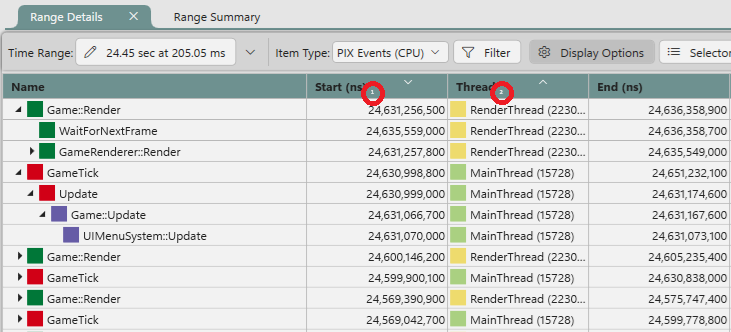

The Selector pane on the left side of the view can be used to restrict the data displayed in the table to particular lanes. The contents of the Selector pane changes based on the type of data you're viewing. For example, when viewing PIX CPU events, use the Selector pane to filter by threads. When viewing GPU work, use the Selector pane to filter by API Queues.

The colors in the Selector pane and in the table match the colors of the lanes in the timeline. This visualization helps you see the relationships between the data displayed in Range Details and that displayed in the Timeline as shown in the following figure.

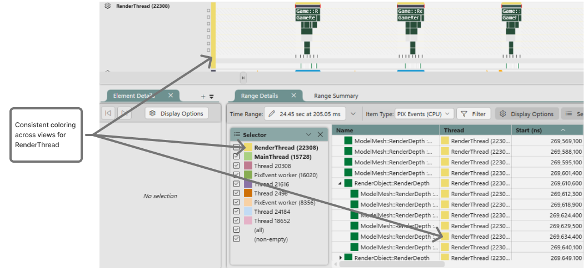

By default, the contents of Range Details remains synchronized with your selection in the timeline. There might be cases where you'd rather synchronize keep the contents of Range Details fixed, regardless of the range you have selected. There may also be times when you' like to synchronize Range Details with something other than a timeline selection, such as a Metrics view selection.  The options for synchronizing the Range Details view are available in the **Time Range** dropdown as shown in the following figure.

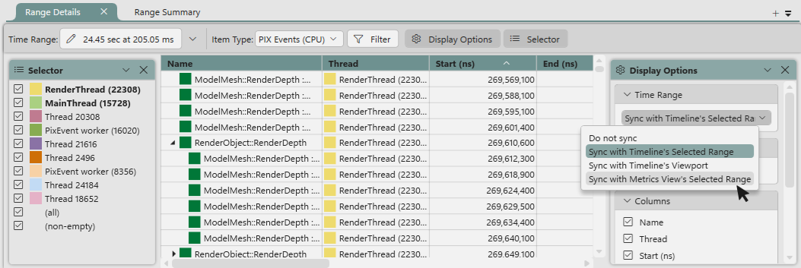

## The Element Details view

The **Element Details** view provides detailed data on the currently selected item. The data shown in the **Element Details** view varies, based on the type of element that's currently selected. For example, **Element Details** displays data including the thread, start time, duration and number of stalls when a PIX event is selected.

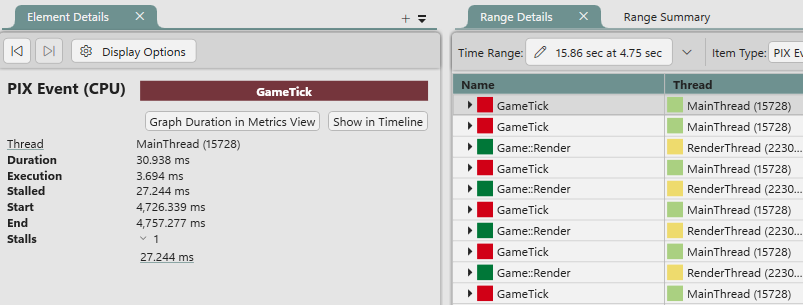

Element Details also includes buttons to graph the duration of the selected element in the Metrics View or to jump to the element in the timeline, if applicable.

## The Lane Configuration panel

Several aspects of how PIX displays data in the Timeline lanes can be configured. For example, the color assigned to the lane, the types of data that are displayed, and the pinning behavior can all be changed either on a temporary or a more permanent basis.

To change the configuration for a single lane, select the gear icon next to the name of the lane. The panel that appears can be used to change the display settings for that lane.

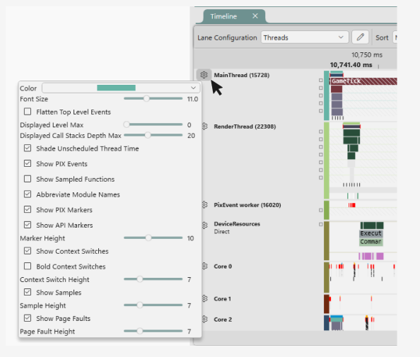

> [!NOTE]
> Changing lane settings in this way applies only to the current UI session and the current capture. The updated settings aren't preserved if you close and reopen PIX, or switch to a different capture.

PIX supports more permanent changes to the Timeline display settings through the concept of *Configuration*. A Configuration is a group of settings that are applied to all lanes in the Timeline. The settings for the various lane types are configured separately.

Configurations are edited by using the Lane Selector. To open the Selector, select the Lane Selector icon just above the Timeline ribbon.

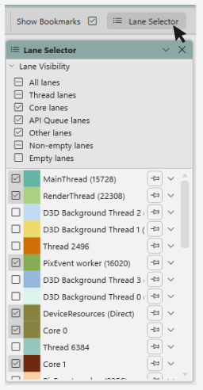

PIX includes five Configurations by default: **Threads**, **Threads with callstacks**, **Graphics**, **I/O** and **Cores**. These default Configurations are oriented around the type of data that's your primary focus when looking at a capture. For example, if your focus is on GPU timings and resource usage the **Graphics** Configuration is likely the one you'd start with.

These built-in Configurations can be edited, and new Configurations can be created. Configurations can also be deleted.

To edit a Configuration, select its name in the drop-down list box and select the pencil icon next to the drop-down.

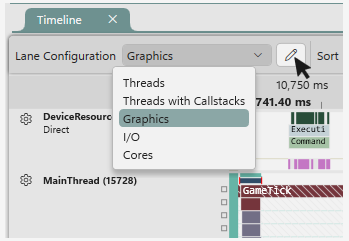

The settings that can be configured are displayed in a dialog box. The settings in the middle of the dialog box control the sort order of lanes in the capture for the selected Configuration. The settings on the right side of the dialog box control the settings for the various lane types.

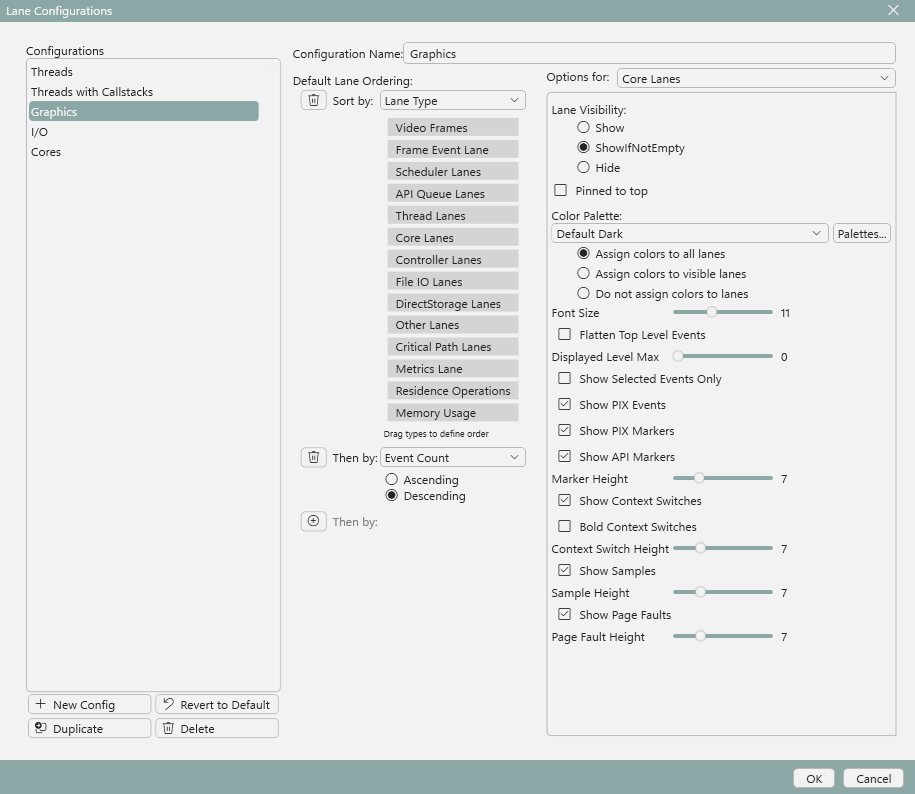

To create a new Configuration, select the **New Config** button at the bottom of the list box containing the names of the Configurations.

To restore the default Configurations to their original state, select the **Revert to Default** button.

PIX retains the Configuration that was in use when you closed a capture or closed PIX itself. The next time you open a capture, the previous Configuration is restored.

The Lane Selector panel also allows you to choose which specific lanes to display, to change the order in which they are displayed, and to specify whether an individual lane should be pinned as shown in the following figure.

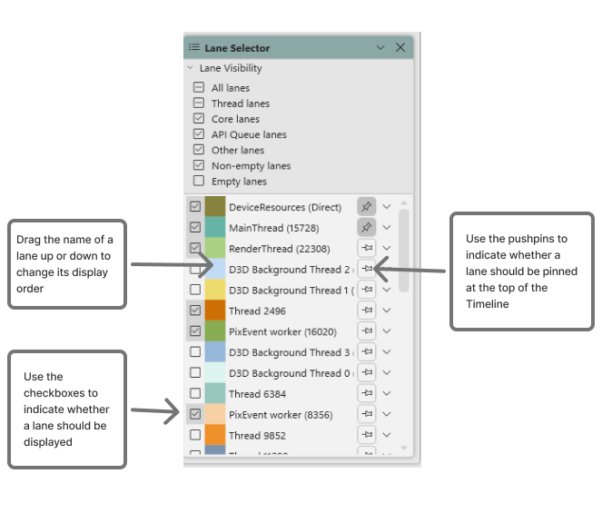

Timeline configurations can be exported from one instance of PIX and imported into another.  See [Configure PIX](../../general/pix-configuring.md) for more information.

