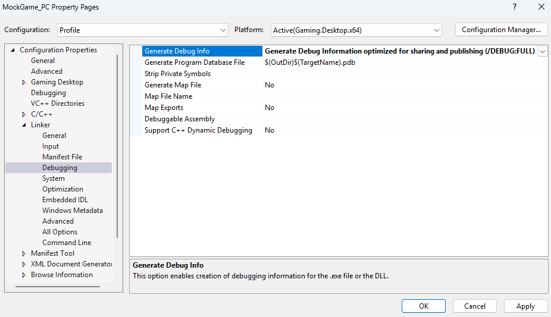
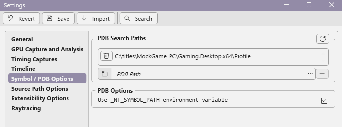
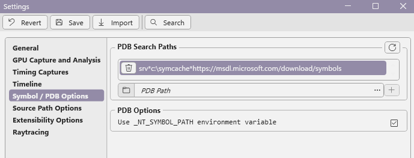
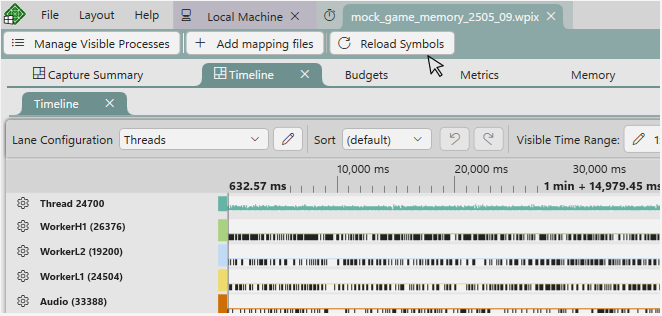

# Configuring PIX to access PDBs for Timing Captures

CPU captures in PIX require access to your title's Program Databases (PDBs) to properly display function names in callstacks, sampled function analysis and so on.

## Generating full PDBs

PIX requires a game's PDBs to be generated using the */DEBUG:FULL* linker switch.  PDBs generated with the */DEBUG:FASTLINK* linker switch are not sufficient.  Note that, depending on the version of Visual Studio you are using, the linker switch */DEBUG* specified without the *FULL* or *FASTLINK* option, may default to *FASTLINK*.

If you see functions named "unknown" in the PIX UI, make sure that you are not using *FASTLINK* PDBs.  The following figure shows the */DEBUG:FULL* linker option in the Visual Studio UI.

## Setting symbol paths

If you're profiling on the same development PC you just built your game on, the path to the PDB that the compiler stored in your game's modules is typically all PIX needs to locate the PDB. However, there are scenarios in which you need to explicitly tell PIX where your PDBs are located. This situation can occur if you're profiling your game on a different PC than the one it was built on. In this case, you can point PIX to your PDBs either by setting the _NT_SYMBOL_PATH environment variable or by using the **PDB Search Paths** option on PIX's **Settings** page. If you're using the _NT_SYMBOL_PATH environment variable to configure PIX to find your PDBs, remember to select the **Use _NT_SYMBOL_PATH** checkbox on the **Settings** page.

    

You may also find it useful to configure PIX so that it can access the PDBs for the Windows OS components.  Configuring PIX in this way will give you more complete callstacks in [Timing Captures](pix-timing-captures.md).  

To configure PIX to access Windows OS symbols, add the URL to the Microsoft symbol server `srv*c:\symcache*https://msdl.microsoft.com/download/symbols` to your PDB settings.

## Reloading symbols

If you make changes to your symbol path settings while a [Timing Capture](pix-timing-captures.md) is open, use the **Reload Symbols** button on the toolbar to cause PIX to re-process the symbols.

