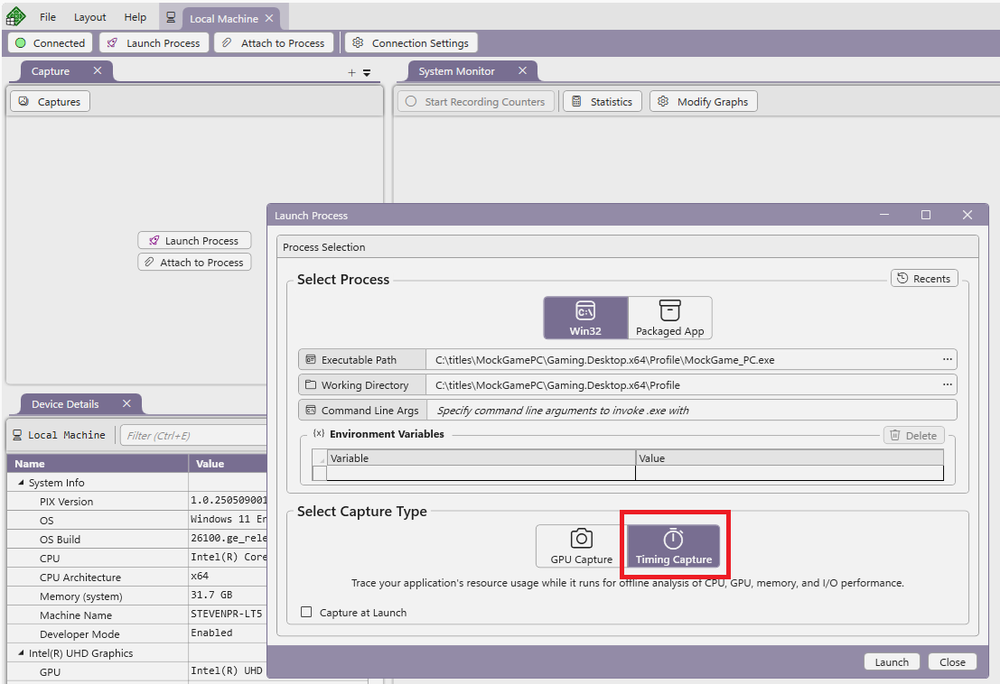
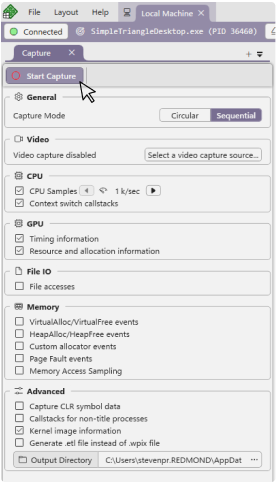
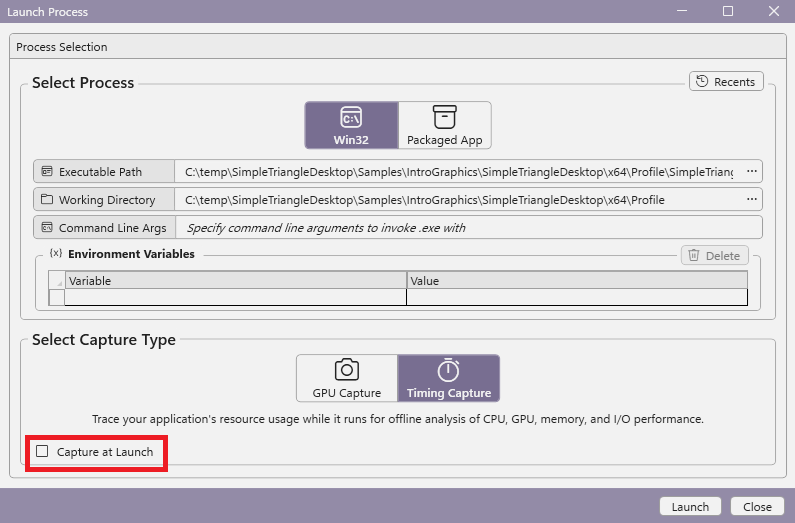
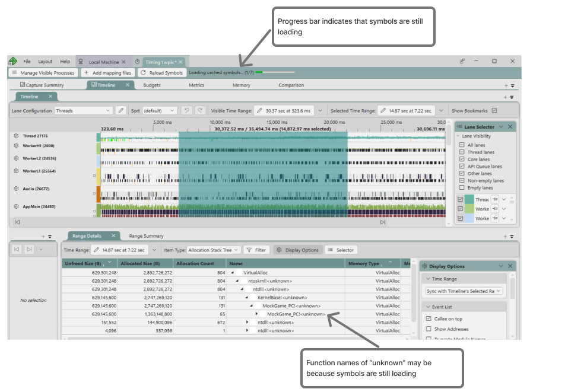
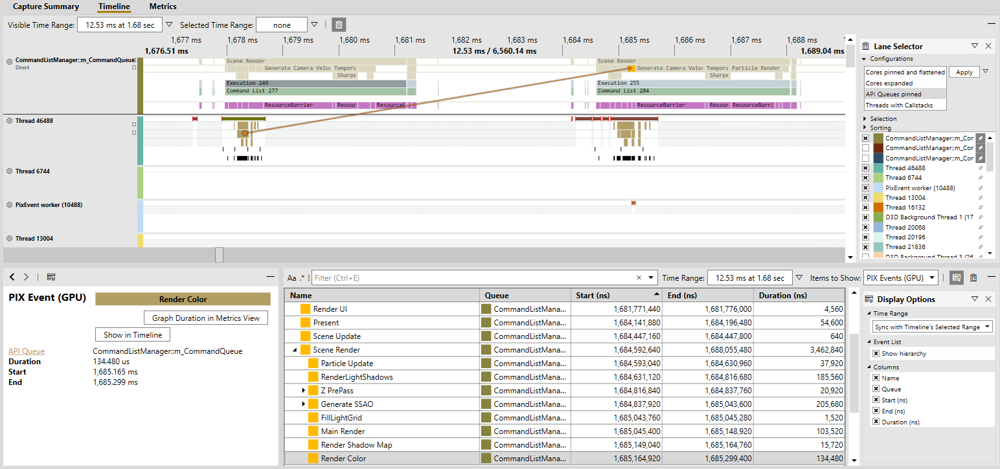
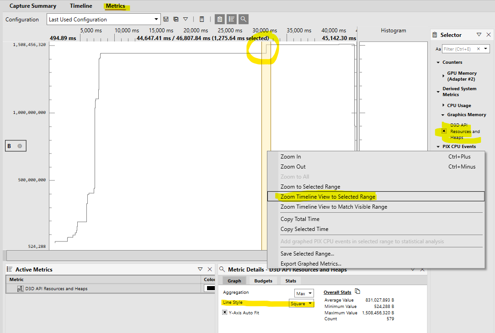
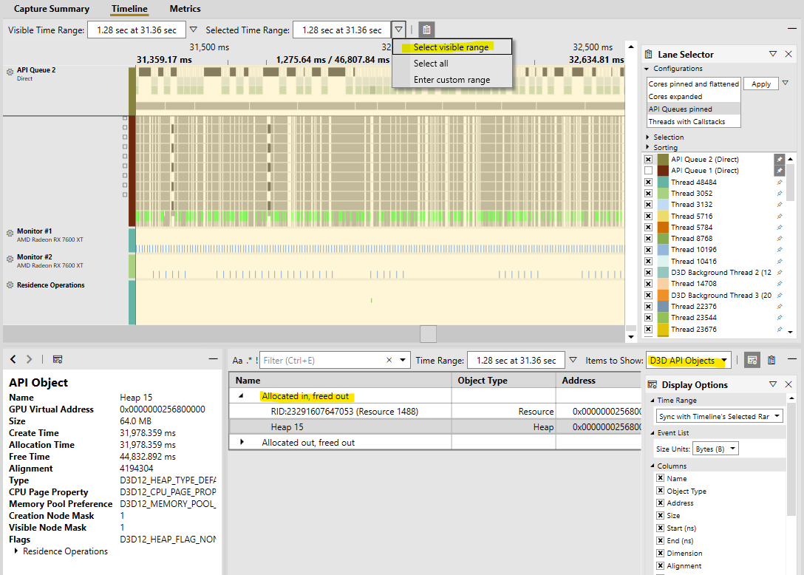
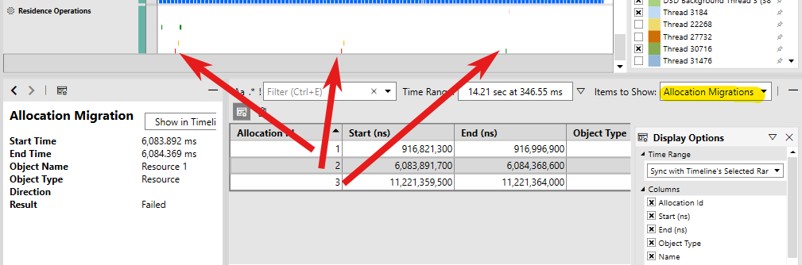
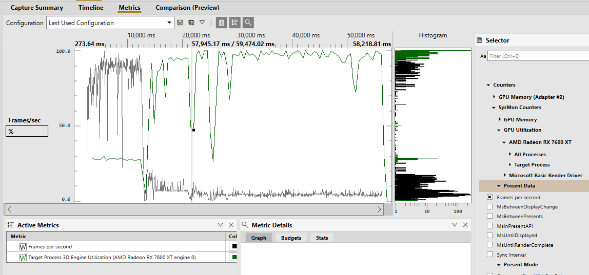
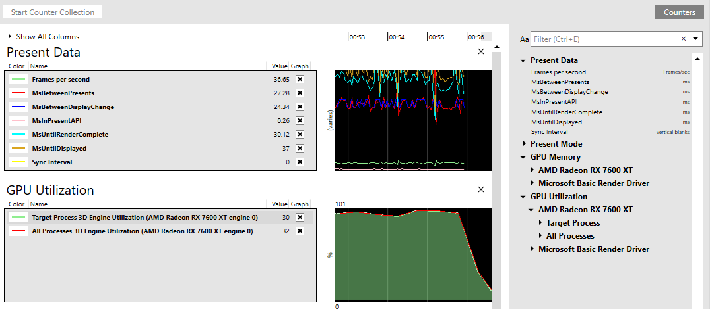

# Profile the CPU and GPU with timing captures

PIX Timing captures combine both CPU and GPU profiling data into a single capture for in-depth analysis of your game. That data is gathered while the game is running, and with minimal overhead, so that you can see things such as how work is distributed across CPU cores, the latency between graphics work being submitted by the CPU and executed by the GPU, when file IO accesses and memory allocations occur, and so on. 

Timing Captures display time-oriented data from a variety of sources both from within your game and from the system itself. To get the most out of Timing Captures, instrument your game with [PIX Events and PIX Markers](..\general\pix-instrumenting.md) by calling APIs in the [WinPixEventRuntime](https://github.com/microsoft/PixEvents).  See [Adding performance​ instrumentation using the PIX APIs](https://www.youtube.com/watch?v=ICM56FI97Ts) for a walkthrough that describes the best practices for instrumenting your game.

Data from the instrumentation you've added to your game is always captured and displayed, but PIX can also be configured to collect and analyze additional data, such as CPU samples, memory allocations, file accesses, GPU timings, residency operations and counter data.

## Taking a timing capture

Captures can be started and stopped either from the [PIX UI](#take_capture_ui) or [programmatically](#take_capture_api) from within your game.  Regardless of the capture method used, Timing Captures can be taken in one of two modes: **Sequential** and **Circular**.  When capturing in **Sequential** mode, PIX will save all data that is captured from the time the capture starts until the time it is stopped.  **Sequential** captures support scenarios in which you need to capture for an extended period of time, like an entire level in a game, for example.  The length of a **Sequential** capture is limited only by the amount of drive space on your PC.

When capturing in **Circular** mode, PIX stores the capture data in a fixed sized buffer on disk. When the buffer is full, the oldest capture data is aged out to make room for newer data. Because the amount of space needed to store capture data is fixed, **Circular** captures can be run continuously.  **Circular** captures can be run overnight in test labs scenarios, especially when taken programmatically, for example.  

PIX requires access to your game's PDBs to display function information. See [Configuring PIX to access PDBs for Timing Captures](pix-timing-captures-pdb-config.md) for information on generating PDBs and configuring PIX to access them.

### Timing capture options

In addition to selecting a capture mode, you can also specify the types of data to collect in addition to the instrumentation you've added to your game.  The types of data that PIX collects directly influences how much overhead is incurred both at runtime and when the capture is opened for analysis.  Collect CPU samples at a high rate, or collect data on all heap allocations are examples of options that often increase capture overhead. 

| Name | Description |
| ---- | ----------- |
| Capture Mode | Sequential: Record all performance data between starting and stopping the capture.  Circular: Record events into a fixed size buffer, only saving the last set of data that will fit in the buffer. |
| Circular Buffer Size (MB) | The size of the circular capture buffer in MB. |
| Video capture | Determines whether video frames are captured along with the timing data. |
| CPU Samples | Perform sample profiling to see where CPU is spending time. Sample rate is configurable. |
| Context Switches Callstacks | Collect callstacks when a thread switches contexts. |
| GPU timings | Collect detailed timing information about when GPU work starts and stops. |
| GPU resources | Collect detailed information about D3D objects like heaps and resources. Also track GPU residency, demoted allocations, and allocation migrations. |
| File accesses | Track Win32 file io and DirectStorage accesses. |
| VirtualAlloc/VirtualFree events | Tracks allocations made via the VirtualAlloc and VirtualFree functions. |
| HeapAlloc/HeapFree events | Tracks allocations made via the HeapAlloc and HeapFree functions. |
| Custom allocator events | Tracks allocations made by [custom memory allocators instrumented with PixEvents](https://devblogs.microsoft.com/pix/memory-profiling-support-for-allocations-made-from-a-titles-custom-allocator/).|
| Memory Access Sampling | Samples memory access to analyze allocations, reads and writes. |
| Page Fault events | Collect data on page faults that occur when the capture is running. The page faults are shown in the timeline and in the element details view. |
| Callstacks for non-title processes | Capture callstacks for processes other than the game process (the launched or attached to process). |
| Kernel image information | Collect information needed to show callstacks for kernel binaries. |
| Generate .etl file instead of .wpix file | The generated .etl file can later be converted to a .wpix file in the File \| Convert menu. This option is useful when reporting bug repros to the PIX team or if you have other tooling for processing ETW data. |

### Taking a capture from the PIX UI

From the **Connection** view, select either the **Launch Process** or the **Attach to Process** button to specify the game you'd like to capture and the options to use.  Select the **Timing Capture** button to indicate you'd like to take a Timing Capture.  Specify your game, then select **Launch** or **Attach**.

The list of [Timing Capture options](#timing_capture_options) is displayed when the dialog is dismissed.  Select the desired options, then press the **Start Capture** button to start the capture.

You can also configure PIX to take a Timing Capture immediately when the game begins running.  This mode is useful to profile the memory allocations or file accesses that occur when a game is starting, for example.  Select the **Capture at launch** checkbox on the **Launch Process** dialog.

### Taking a capture programmatically from a game

You can programmatically take a capture using the WinPixEventRuntime. For details, see the blog post [Programmatic capture](https://devblogs.microsoft.com/pix/programmatic-capture/).

### Symbol Processing

When a Timing Capture is opened, PIX processes the PDBs for your title and for various system components based on your [symbol path settings](pix-timing-captures-pdb-config.md). Depending on the size and location of the PDBs, the time required to process the symbols can be significant. If you see function names that contain "unknown" it could be because PIX hasn't finished processing all PDBs. A progress bar at the top of the Timeline indicates that symbols are still being processed.

 If you make changes to your symbol path settings while a capture is open, use the **Reload Symbols** button option to cause PIX to re-process the symbols.

When a Timing Capture is saved, the symbol data that PIX required to display the capture is saved along with it. Saving symbolic information in a capture allows the capture to open faster the next time it is opened, and makes it easier to share captures between users that have different builds or symbol path settings.

### Timing capture UI layouts

The Timing Capture UI consists of the following layouts:

* [**Capture Summary.**](layouts/pix-timing-captures-summary-layout.md) The Summary layout performs an initial analysis of the capture that provides capture statistics and a set of potential candidates for additional performance analysis.
* [**Timeline.**](layouts/pix-timing-captures-timeline-layout.md)  The Timeline layout displays a graphical representation of your game's activity over the duration of the capture. The layout displays the profiling data in a series of lanes, each of which is optimized to show a particular type of data. 
* [**Budgets.**](layouts/pix-timing-captures-budgets-layout.md)  The Budgets layout supports the creation and management of Budget  Profiles.  These Profiles are a grouping of performance budgets defined for their respective metrics.  A common use of Budget Profiles is to define the performance targets, or profiles, for different hardware specifications.
* [**Metrics.**](layouts/pix-metrics-layout.md) The Metrics layout is a graphical analysis tool aimed at helping you navigate large amounts of data to quickly find and diagnose anomalies in game behavior. The duration of PIX events, and the values of both system and game-defined counters can be graphed to more quickly identify correlations between different aspects of your game.
* [**Memory.**](layouts/pix-timing-captures-memory-layout.md)  The Memory layout enables you to analyze the memory allocations and accesses made during the capture. The analysis supports several key memory profiling scenarios, including the ability to identify memory allocations that were not freed, and memory that was allocated but then never accessed.
* [**Comparison.**](layouts/pix-timing-captures-comparison-layout.md) The Comparison layout is used to produce a statistical comparision of the average duration for the points that represent PIX event hierarchies in two selected ranges of time, or for the points above and below a metric's budget.  Statistical comparisions help determine which portions of the event hierarchies had statistically different durations for the set of points being compared.

## CPU profiling

Enabling the **CPU Samples** option when taking a capture can help you pinpoint slow functions in your application's hot path, as well as find issues related to thread waits and context switches. You'll also be able to track different kinds of allocations (with the appropriate capture option enabled).

There are several blog posts that cover those features in detail:

- [Analyzing CPU Samples in Timing Captures blog post](https://devblogs.microsoft.com/pix/analyzing-cpu-samples-in-timing-captures/).
- [Analyzing Stalls and Context Switches in Timing Captures](https://devblogs.microsoft.com/pix/analyzing-stalls-and-context-switches-in-timing-captures/)
- [Analyzing Memory Usage and Performance in Timing Captures](https://devblogs.microsoft.com/pix/analyzing-memory-usage-and-performance-in-timing-captures/)
  - You can also instrument your own custom allocators. For more details, see the blog post [Memory profiling support for allocations made from a title’s custom allocator](https://devblogs.microsoft.com/pix/memory-profiling-support-for-allocations-made-from-a-titles-custom-allocator/).

## GPU profiling

Is your app experiencing intermittent frame drops? Excessive VRAM usage? Unexpected paging operations between system memory and VRAM? The GPU profiling features in PIX can help you get to the bottom of these common and difficult-to-analyze situations.

### GPU timings

Enable the **GPU timings** option when taking a capture to collect timing data for GPU work. In the **Timeline** view, you can find lanes for each GPU queue (in the **Lane Selector**, you can quickly pin those lanes with the **API Queues pinned** configuration). Those lanes contain several sublanes:
- PIX Events (GPU): Hierarchical, application-defined regions of GPU Work. See [PixEvents](../general/pix-instrumenting.md).
- GPU Executions: Executions correspond to work submissions at the API level; for example, via ExecuteCommandLists.
- GPU Work: Any work that occurs on the GPU; for example, Draws, Dispatches, Copies.
- PIX Markers (GPU): Application-defined markers. See [PixEvents](../general/pix-instrumenting.md).

When you select an event in the lane, you'll see arrows showing where on the CPU that event originated. There are also various visualization options in the lane options menu (the gear icon next to the lane name). Most notably, the **Flatten Events** and **Flatten GPU Work** options are enabled by default to preserve space, but you might want to see the full PIX Event hierarchy or GPU Work parallelization when diving into a specific frame.

That data is also available in tabular form via **Range Details** view by selecting the relevant category in the **Items to Show** drop-down.

#### Presentation and display info

Vsyncs are displayed as markers in a separate **Monitor** lane, and can be found in **Range Details** view within the **Other** category.

### GPU memory and Direct3D objects

Enable the **GPU resources** option when taking a capture to collect information about Direct3D objects. To graph overall memory usage, you can find several counters in **Metrics** view. You can configure various budget lines to get a quick idea of whether you're meeting your memory usage goals. When you find an area of interest, you might want to investigate further by selecting the time range, clicking **Zoom Timeline view to Select Range** in the right-click context menu, and setting the **Selected Time Range** drop-down to **Select Visible Range**.

> [!TIP]
> Setting the **Line Style** to *Square* makes it easier to see where the allocations are made.

In **Range Details** view, you can view various information about Direct3D API objects such as heaps, resources, and pipeline state objects. To make it easier to pinpoint any suspicious objects, that information is grouped by when it was allocated and freed.

#### Residency

For residency related issues, see out the **Residence Operations**, **Demoted Allocations**, and **Allocation Migrations** categories of **Range Detail**s view. Those markers and events are also shown in the **Residence Operations** lane.

Residence operations include the MakeResident and Evict operations (initiated via the Direct3D 12 API) as well as any PageIn and PageOut operations (For more details, see [Residency](~/direct3d12/residency.md)). Demoted allocations occur when the graphics kernel (DXGK) can't allocate a resource in your GPU's VRAM (due to either memory pressure or fragmentation). If that happens, then DXGK will also attempt to perform allocation migrations for those demoted allocations. Note that those migrations are expensive operations, because they require suspending the GPU.

### GPU utilization and presentation counters

Enable the **Capture SysMon counters** option when taking a capture to collect counters present in the System Monitor (aka SysMon), which includes various counters related to GPU performance. Notably, there are counters for:
- GPU utilization broken down by GPU engine for both the target process and all processes.
- Presentation data, like frames per second (and the inverse, in milliseconds, MsBetweenPresents) and MsUntilRenderComplete (time between a present start and GPU work completion).
- GPU Memory information, including local and non-local memory usage, residence, and budgets.

> [!TIP]
> Hover over the counter names in the **System Monitor** for a description.

These counters can also be monitored in real-time, either while taking a timing capture or by clicking the **Start Counter Collection** button in the **System Monitor** view. The graphs can be rearranged and counters can be added or removed dynamically. Click **Counters** to view all available counters.

## Win32 file-I/O

See the blog post [Analyzing Win32 File IO performance in Timing Captures](https://devblogs.microsoft.com/pix/analyzing-win32-file-io-performance-in-timing-captures/).

## Other analysis features

- Statistical comparisions help determine which portions of a PIX event hierarchy have statistically different durations for the set of points being compared. For details, see the blog post [Timing Capture Statistical Comparison Features](https://devblogs.microsoft.com/pix/timing-capture-statistical-comparison-features/).
- Setting performance budgets can help you to quickly identify problematic areas of the capture. For more details, see the blog post [Using performance budgets in the Timing Capture metrics view](https://devblogs.microsoft.com/pix/using-performance-budgets-in-the-timing-capture-metrics-view/).
- Also see the blog post [Critical path analysis in Timing Captures](https://devblogs.microsoft.com/pix/critical-path-analysis-in-timing-captures/).
