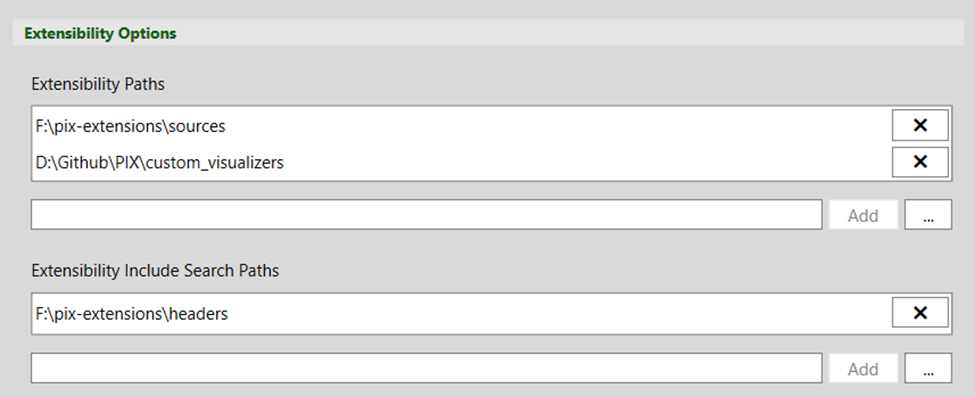
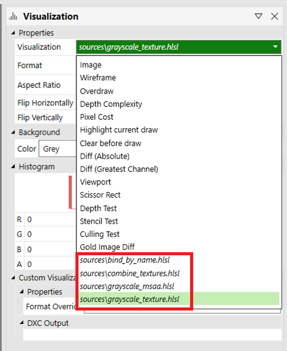
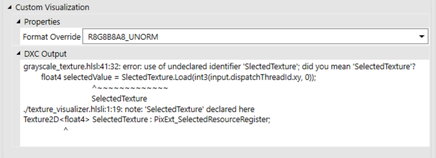
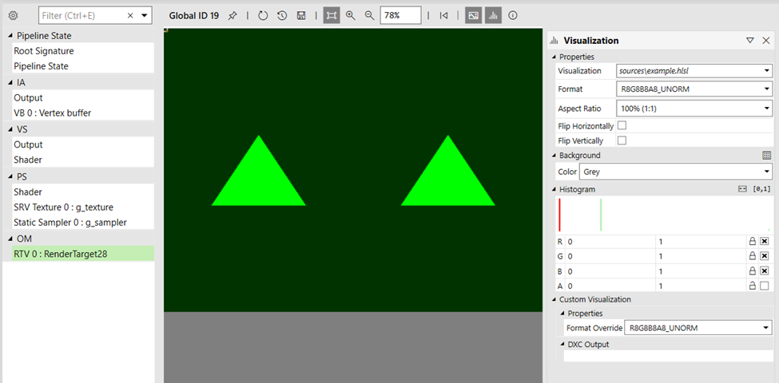
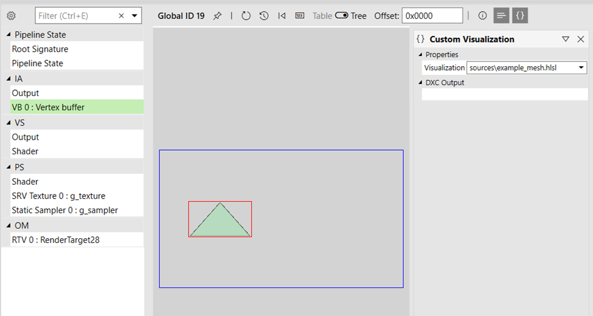

# Custom texture/mesh visualizers in PIX

Custom visualizers allow you to do mainly two things: 

1. Extend the pipeline view texture viewer to run a custom compute shader, which can read any resource bound to any stage of the pipeline, and output a 2D texture displayed in the viewer.

2. Extend the pipeline view buffer viewer to run a custom compute shader, which can read any resource bound to any stage of the pipeline, and output both an index buffer and a vertex buffer to be displayed in the mesh viewer.

## PIX extensibility settings 

By using the *Extensibility Paths* setting, you can specify any number of folders for PIX to search for visualizers (`*.hlsl` files).

If your visualizer shaders `#include` any file that's not sitting next to the main HLSL visualizer files, then you can use the *Extensibility Include Search Paths* setting to add search paths for those files.



## Custom texture visualizer 

Assuming that you've configured paths to your visualizer shaders in the settings, you can now see your visualizers listed in the **Visualization** panel.



### Visualization panel 

Once you've selected a custom visualizer from the list in the **Visualization** panel, the *Custom Visualization* section appears. From there, you can select to override the default texture format for your visualizer output. By default, the selected output format will be compatible with the pipeline view's currently selected texture. That's also where any shader compilation warnings/errors will be displayed.



### Creating a custom texture visualizer 

A visualizer is a compute shader running against the selected event (that is, draw, dispatch, dispatch mesh) and which output will be displayed in the texture viewer in place of the currently selected texture/render target. In order to be successfully recognized by PIX, your entry point must be named **main**.

You can select the thread group size of your compute shader the same way you do with any compute shader by specifying it as an attribute (for example, `[numthreads(8, 8, 1)]`). PIX will invoke your compute shader so that one thread can execute per pixel.  

For instance, if you have a texture of size 512x512 pixels, and your compute shader uses a threadgroup size of `(8, 8, 1)`, then the resulting invocation done internally by the PIX engine would be `Dispatch(64, 64, 1)`. If the texture size isn't a multiple of the threadgroup size, then more threads than pixels are invoked to cover all of them.

The output texture generated by your compute shader will reflect the largest coordinates that it outputs through the HLSL API (for example, `PixExt_StorePixel_Float(uint2 offset, float4 pixel)`).

When your shader code is compiled in the PIX engine, the root signature used is a modified version of the one bound at the selected event. That means that (through the PIX HLSL API) you get access to all resources as they are available to that event plus all resources bound to the IA and OM stages.

If you have errors in your shader (displayed in the **Visualization** panel > **Custom Visualization** section in the **DXC Output** text box), then you can simply edit the file to correct the errors, and use the refresh button in the texture viewer to rebuild and re-execute your visualizer.

#### Example

Here's a basic example of a visualizer shader. 

```hlsl
Texture2D<float4> SelectedTexture : PixExt_SelectedResourceRegister;

// For the custom PSO to successfully build, the root signature 
// of the selected event must have a valid binding for t0.
Texture2D<float4> SRV0 : register(t0);

[numthreads(8, 8, 1)]
void main(PixExt_ComputeInput input)
{
    uint2 selSize, srvSize;
    SelectedTexture.GetDimensions(selSize.x, selSize.y);
    SRV0.GetDimensions(srvSize.x, srvSize.y);

    float2 uvs = input.dispatchThreadId.xy / (float2)selSize;
    int2 srvCoords = (int2)(srvSize * uvs);
	
    float4 selectedValue = SelectedTexture.Load(int3(input.dispatchThreadId.xy, 0));
    float4 srv0Value = SRV0.Load(int3(srvCoords, 0)); 
    float4 finalValue = selectedValue * srv0Value.yzxw;

    PixExt_StorePixel_Float(input.dispatchThreadId.xy, finalValue);
}
```

In the example above, we declare `SelectedTexture` to point to the pipeline view's currently selected texture by using the PIX HLSL API special register `PixExt_SelectedResourceRegister`. We also declare SRV0 at t0, knowing it will be present in the root signature of the GPU capture we're working against. You can always make your extension as generic or specific as your use case dictates. Finally, we output to the texture viewer using the `PixExt_StorePixel_Float` function, which takes a pixel position and a value as arguments.

To get more information on the API, refer to the HLSL API section.



## Custom buffer visualizer 

Assuming you've set up paths to your visualizer shaders in the settings, you can now see your visualizers listed in the *Custom Visualization* panel, which you can open using the following buffer viewer toolbar icon: `{}`.

### Custom Visualization panel 

From that panel, you can select any available custom visualizer, and see any warning/error messages from the shader compiler. 


### Creating a custom buffer visualizer 

A visualizer is a compute shader running against the selected event, and whose output will be displayed in the mesh viewer in place of the buffer viewer showing the currently selected buffer data. To be successfully recognized by PIX, your entry point must be named **main**.

You can select the thread group size of your compute shader as you do for any compute shader by specifying it as an attribute (for example, `[numthreads(32, 1, 1)]`). PIX will invoke your compute shader so that one thread can execute per buffer element.

For instance, if you have a buffer of 100 elements, and your compute shader uses a threadgroup size of `(32, 1, 1)`, then the resulting invocation done internally by the PIX engine would be `Dispatch(4, 1, 1)`. If the buffer size is not a multiple of the threadgroup size, then more threads than buffer elements are invoked to cover all of them. 

The output index and vertex buffers allocated to your compute shader dynamically grow to fit all the data you output. You can output as much data as you need. Indices are 32-bit, and vertices are allowed to be only float4 positions. 

When your shader code is compiled in the PIX engine, the root signature used is a modified version of the one bound at the selected event. That means that (through the PIX HLSL API) you get access to all resources as they are available to that event plus all resources bound to the IA and OM stages.

If you have errors in your shader (displayed in the **Custom Visualization** panel > **DXC Output** text box), then you can simply edit the file to correct the errors, and hit the refresh button  in the mesh viewer to rebuild and re-execute your visualizer.

#### Example

Here's a basic example of a visualizer shader

```hlsl
struct Vertex
{
    float3 position;
    float2 uv;
};

StructuredBuffer<Vertex> Vertices : PixExt_VertexBufferRegister0;

[numthreads(32, 1, 1)]
void main(PixExt_ComputeInput input)
{
    const uint vertexCount = PixExt_GetVertexCountPerInstance();

    if (input.dispatchThreadId.x < vertexCount)
    {
        const uint vertexStart = PixExt_GetStartVertexLocation();

        uint vertexOffset = input.dispatchThreadId.x + vertexStart;
        Vertex vertex = Vertices[vertexOffset];
        float4 newPosition = float4(vertex.position, 1.f);
        PixExt_StoreIndex(input.dispatchThreadId.x, input.dispatchThreadId.x);
        PixExt_StoreVertex(input.dispatchThreadId.x, newPosition);
    }
}
```

In the example above, we access vertices declaring `Vertices` to point to the pipeline view currently bound vertex buffer 0 using the PIX HLSL API special register `PixExt_VertexBufferRegister0`. We then output to the mesh viewer using the `PixExt_StoreIndex` and `PixExt_StoreVertex` functions, which take buffer offsets and respectively index and vertex values as arguments.

To get more information on the API, refer to the HLSL API section.



## PIX HLSL API 

To give you access to all resources, and to have a standard mean of outputting data to the viewers, PIX will inject internal implementation code when compiling your shader. The implementation is always subject to change, but the following documented API is stable across PIX versions.

### Resource access 

The API defines a set of special registers that you can use to get access to resources of different pipeline stages that are not inherently accessible.

#### Selected resource 

`PixExt_SelectedResourceRegister`: Gives access to the resource currently selected in the pipeline view. 

#### Render targets 

```PixExt_RenderTargetRegister0```<br>
```PixExt_RenderTargetRegister1```<br>
```PixExt_RenderTargetRegister2```<br>
```PixExt_RenderTargetRegister3```<br>
```PixExt_RenderTargetRegister4```<br>
```PixExt_RenderTargetRegister5```<br>
```PixExt_RenderTargetRegister6```<br>
```PixExt_RenderTargetRegister7```

#### Depth/stencil 

```PixExt_DepthRegister```<br>
```PixExt_StencilRegister```

#### Input assembly stage resources 

```PixExt_IndexBufferRegister```<br>
```PixExt_VertexBufferRegister0```<br>
```PixExt_VertexBufferRegister1```<br>
```PixExt_VertexBufferRegister2```<br>
```PixExt_VertexBufferRegister3```<br>
```PixExt_VertexBufferRegister4```<br>
```PixExt_VertexBufferRegister5```<br>
```PixExt_VertexBufferRegister6```<br>
```PixExt_VertexBufferRegister7```<br>
```PixExt_VertexBufferRegister8```<br>
```PixExt_VertexBufferRegister9```<br>
```PixExt_VertexBufferRegister10```<br>
```PixExt_VertexBufferRegister11```<br>
```PixExt_VertexBufferRegister12```<br>
```PixExt_VertexBufferRegister13```<br>
```PixExt_VertexBufferRegister14```<br>
```PixExt_VertexBufferRegister15```<br>
```PixExt_VertexBufferRegister16```<br>
```PixExt_VertexBufferRegister17```<br>
```PixExt_VertexBufferRegister18```<br>
```PixExt_VertexBufferRegister19```<br>
```PixExt_VertexBufferRegister20```<br>
```PixExt_VertexBufferRegister21```<br>
```PixExt_VertexBufferRegister22```<br>
```PixExt_VertexBufferRegister23```<br>
```PixExt_VertexBufferRegister24```<br>
```PixExt_VertexBufferRegister25```<br>
```PixExt_VertexBufferRegister26```<br>
```PixExt_VertexBufferRegister27```<br>
```PixExt_VertexBufferRegister28```<br>
```PixExt_VertexBufferRegister29```<br>
```PixExt_VertexBufferRegister30```<br>
```PixExt_VertexBufferRegister31```<br>

#### Shader inputs 

You can use the `PixExt_ComputeInput` structure as an input to your main shader function. This is a helper, and isn't mandatory. 

```hlsl
struct PixExt_ComputeInput
{
    uint3 dispatchThreadId : SV_DispatchThreadID;
    uint3 groupId : SV_GroupID;
    uint3 groupThreadId : SV_GroupThreadID;
    uint groupIndex : SV_GroupIndex;
};
```

#### Selected texture information 

```hlsl
// Returns the currently selected sample.
uint PixExt_GetSelectedSample();

// Returns the currently selected mip.
uint PixExt_GetSelectedMip();

// Returns the currently selected slice.
uint PixExt_GetSelectedSlice();
```

#### Selected event arguments 

```hlsl
// For a DrawIndexedInstanced event,
// returns the IndexCountPerInstance.
uint PixExt_GetIndexCountPerInstance();

// For a DrawIndexedInstanced event,
// returns the StartIndexLocation
uint PixExt_GetStartIndexLocation();

// For a DrawInstanced event,
// returns the VertexCountPerInstance.
uint PixExt_GetVertexCountPerInstance();

// For a DrawInstanced event,
// returns the StartVertexLocation.
uint PixExt_GetStartVertexLocation();

// For a DrawInstanced or DrawIndexedInstanced event,
// returns the InstanceCount.
uint PixExt_GetInstanceCount();

// For a DrawInstanced or DrawIndexedInstanced event,
// returns the StartInstanceLocation.
uint PixExt_GetStartInstanceLocation();

// For a Dispatch or DispatchMesh event,
// returns the ThreadGroupCountX.
uint PixExt_GetThreadGroupCountX();

// For a Dispatch or DispatchMesh event,
// returns the ThreadGroupCountY.
uint PixExt_GetThreadGroupCountY();

// For a Dispatch or DispatchMesh event,
// returns the ThreadGroupCountZ.
uint PixExt_GetThreadGroupCountZ();
```

#### Shader outputs 

You output data to the viewers using the following functions. 

##### Texture

```hlsl
// Stores the given INT pixel data for texture viewer display.
//
// offset: Pixel position to write to.
// pixel: Pixel data to write.
void PixExt_StorePixel_Int(uint2 offset, int4 pixel);

// Stores the given UINT pixel data for texture viewer display.
//
// offset: Pixel position to write to.
// pixel: Pixel data to write.
void PixExt_StorePixel_Uint(uint2 offset, uint4 pixel);

// Stores the given FLOAT pixel data for texture viewer display.
//
// offset: Pixel position to write to.
// pixel: Pixel data to write.
void PixExt_StorePixel_Float(uint2 offset, float4 pixel);
```

##### Mesh

```hlsl
// Stores the given index for mesh viewer display.
//
// offset: Offset into the index buffer to write to.
// index: Index to write.
void PixExt_StoreIndex(uint offset, uint index);

// Stores the given vertex position for mesh viewer display.
//
// offset: Offset into the vertex buffer to write to.
// vertex: Vertex position to write.
void PixExt_StoreVertex(uint offset, float4 vertex);
```

## Requirements

Custom visualizer shaders will be compiled using Shader Model 6.6 (namely cs_6_6) and HLSL version 2021. We plan to support newer shader models and relax the restriction on HLSL 2021 in a future release.
