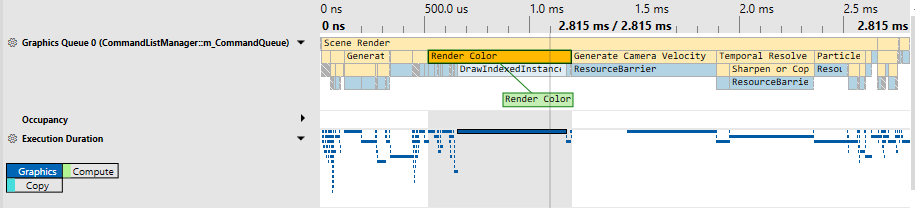
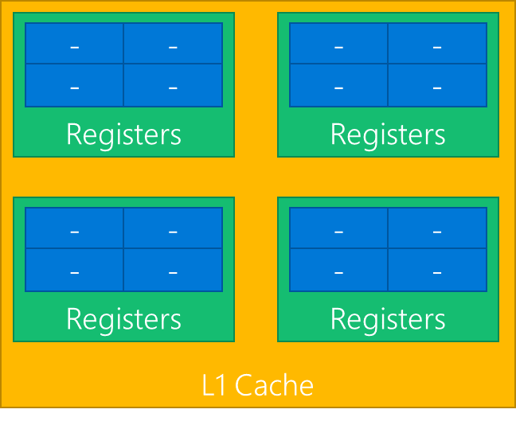
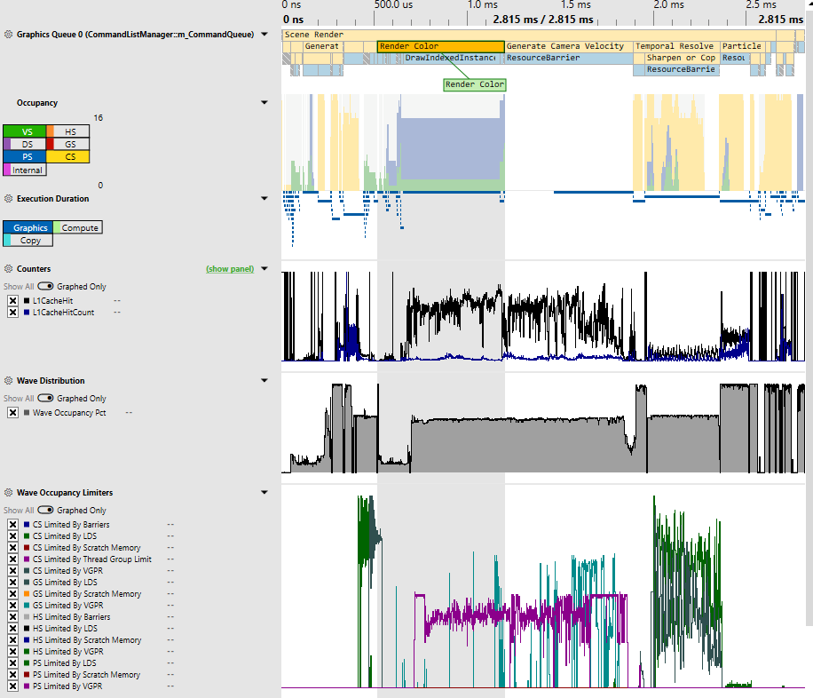
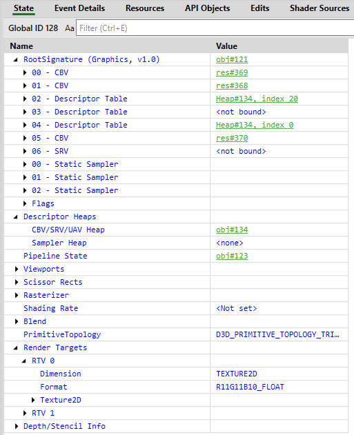
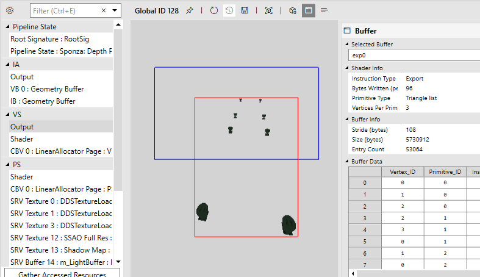

# Analyzing Frames with GPU Captures
GPU, or Frame, Captures record all of the Direct3D 12 API calls your application makes, typically in a single frame (see [Taking a GPU Capture](#taking-a-gpu-capture)). PIX can replay these API calls to show you information about API call parameters, pipeline and resource states, resource contents, and more.

> [!TIP]
> It is not always possible for PIX to successfully take a GPU capture if a game is calling Direct3D 12 in invalid ways. PIX makes a best effort to be robust even in the case of incorrect usage patterns, but this is inevitably sometimes a case of garbage in, garbage out. If you are having difficulty taking GPU captures, try using the [D3D12 Debug Layer and GPU-Based Validation](~/direct3d12/using-d3d12-debug-layer-gpu-based-validation.md) to find and fix any bad API calls.

## Taking a GPU Capture
From the Connection view, either launch or attach to your desired process (ensuring the relevant "For GPU Capture" option is checked).

Configure your GPU Capture options as necessary. To take the capture, either click the Take GPU Capture button in PIX or press Alt+Print Screen (or F11, configurable in PIX settings). You will see a thumbnail of the capture in the PIX UI. At this point you can terminate your application if desired. Click on the thumbnail to open the capture.

### Programmatic Captures
You can programmatically take a capture using the WinPixEventRuntime. Details can be found at https://devblogs.microsoft.com/pix/programmatic-capture/.

## Viewing API Calls with the Events View
The Events view shows all the API calls that were recorded into a GPU capture. There is a separate list for each Direct3D 12 queue (graphics, compute, or copy) that was used by the game.

The event list can be filtered, optionally using regular expressions (click the button labeled .*). By default it only shows events that resulted in actual rendering work for the GPU hardware, as opposed to simply preparing state for use by later operations. To include non-GPU events, click the button labelled !G.

More information about each event, such as the full set of API call parameters, is available in the Event Details view. This view is included by default in the Pipeline tab, but can also be added to your current layout via the Layout Design Mode button in the upper right corner of the main PIX window.

## Frame Profiling
With a GPU capture open, switch to the Overview tab. Here you'll see some basic details about the capture.

To start profiling, you'll need to collect timing data. To do this, click the "Collect Timing Data" button at the top right of the Events view or click the "Click here to start analysis and collect timing data" text in the Timeline view. This will replay the GPU work in the capture and collect basic timing data like Execution Durations (annoted with [PixEvents](pix-instrumenting.md), if your application has them). Once finished, you can collect additional data to be graphed in Timeline lanes, like occupancy information and other GPU-specific counters.

> [!TIP]
> For best results, do not interact with your computer while PIX is collecting timing data, and close any other applications that might be using the GPU.

You can also see counters broken down by API call in the Events view. To enable/disable counters, click the Event List Counters button (top right of the Events view).

### Timing Data
There are two sources of GPU timing information:

1. Start-of-pipe timestamps report when the GPU starts processing each piece of work. Note that this data is only available when running Windows 10 build 14393 or greater with a [suitable graphics driver](https://devblogs.microsoft.com/pix/requirements/). Timing data takes longer to collect if start-of-pipe timestamps are not available.
2. End-of-pipe (EOP) timestamps report when the GPU has finished processing each piece of work.

Because GPUs are massively parallel and deeply pipelined, it is common for more than one piece of work to be executing at the same time, and for adjacent operations to overlap. PIX measures time in two different ways that can offer insight into the parallel execution model of the hardware:

1. Execution Duration is measured from the start-of-pipe to the end-of-pipe timestamp of each separate piece of work. When measured in this way, GPU work items that run in parallel with prior items may appear longer than if they were run in isolation due to contention on the GPU.
2. EOP Duration is measured from the previous item’s end-of-pipe (EOP) timestamp to this item’s EOP timestamp. Work items that run in parallel with prior items will therefore appear shorter than if they ran in isolation, and some items may even be reported as zero duration if they completed entirely in parallel with the previous item.

The Timeline view displays one or more lanes showing the timing of each GPU operation. There is a separate lane containing EOP Duration data for each queue (graphics, compute, or copy) used by the game, plus a single lane showing Execution Duration data (where available) combined across all the queues.

> [!TIP]
> Note that PIX on Windows does not currently overlap GPU work on different queues while analyzing timing in GPU Captures. Consider taking a [Timing Capture](pix-timing-captures.md) if you want to see overlapping async compute timing data. In GPU Captures, if a game uses async compute to execute rendering and compute work simultaneously, then PIX will instead measure first one and then the other. This may result in shorter reported durations for each part of the work compared to how it would execute inside the original game (due to reduced contention on the GPU) but a longer total time (due to reduced parallelization).

### GPU Counters and Occupancy
PIX exposes hardware-specific performance counters provided by IHVs via a GPU plugin. These counters can be enabled and collected in either the Event List Counters view (button to enable at top right of Events view) or the Timeline Counters view (button to enable at top right of Timeline view).

On some GPUs, PIX can also gather occupancy information. GPUs are usually constructed as a hierarchy of repeated blocks, where each level might share a resource. For example, an imaginary GPU might be structured like this

GPUs execute shaders by breaking up the shader work into waves (these are also called warps or wave fronts). In the above diagram, each blue block is capable of executing one wave. Each green block could execute up to four waves.

As all the blues share a single set of registers, if a workload needs all the registers then only one wave at a time can execute in the green block. In this case the occupancy of the green block would be 1, out of a total possible occupancy of 4.

At any point in time, all the green blocks may be executing different number of waves. Of the four green blocks above, one might be executing 3 waves, another 2 waves, and the remaining 1 wave. PIX boils all this data down to a single value --- the maximum occupancy, which would be 3 in this example.

This is presented in PIX in the Occupancy lane, which shows the maximum occupancy, separated by shader stage. This is an indication of how much work the GPU is able to do in parallel --- higher bars show better GPU utilization.

## Debugging Rendering Issues
With a GPU capture open, switch to the Pipeline tab. This tab contains an Events view, several state and resource inspector views, and a Pipeline view.

Selecting an event in the Events view will populate various view, notably the Pipeline view, which can be used to inspect root signatures, pipeline state, and bound resources. The Pipeline view is also the entry point into Shader Debugging.

> [!TIP]
> To perform most features, you will need to Start Analysis. Analysis is how PIX collects timing data, state information, and resources. There are many ways to Start Analysis, but the global way is via the Start Analysis "Play" button at the top right of the application. Make sure the desired GPU is selected!

### Viewing Direct3D 12 Objects, Parameters, and State
After selecting an event in the Events view, the State and Pipeline views (found in the Pipeline tab) will show details of the Direct3D state at the time of that event. Here you can view what resources are bound to the pipeline, shader code, inputs, outputs, and the currently bound rendertarget(s).

### Shader Debugging
After selecting an appropriate event and running analysis, you can debug your shaders. In the Pipeline view, there are several ways to initiate shader debugging:
1. Select the "Shader" entry under the desired shader stage and click the green play button. Before starting the debug session, ensure you configure the appropriate shader parameters (eg instance and vertex IDs for vertex shaders or pixel coordinates for pixel shaders).
2. Right clicking in a resource viewer (eg VS Output or an SRV/UAV/RTV) and selecting the appropriate Debug option.
3. Clicking the Debug Pixel button in the Pixel Details view when viewing an appropriate resource (eg SRV/UAV/RTV).

> [!TIP]
> If you are not able to see the shader source when debugging, you are likely missing debug information. Ensure you are generating the shader PDBs for your application and have [configured PIX to load those PDBs](pix-configuring.md#debug-symbols).

#### Shader Edit & Continue
HLSL shader code can be edited directly inside PIX, allowing you to immediately see the effect of your changes on rendering results or performance.  This can be useful for prototyping and optimizing shaders, as it can greatly reduce the turnaround time when trying out different ideas.

After selecting a shader you can edit its code however you like, then click Edit->Apply. Other views (such as OM RTV 0) will update to show the effect of your change.  You may find it useful to dock more than one instance of the Pipeline view next to each other in order to view rendertarget results at the same time as editing shader code.

If you lose track of exactly what you have changed, right-click on the shader code and choose Diff with Original.

> [!TIP]
> Note that PIX on Windows does not yet support saving modified shaders back into the capture file.

### Debug Visualizers
Rendertarget visualizers are available in the Pipeline view when inspecting the contents of a rendertarget. The default Image visualizer just shows the image as normal, and can be changed by selecting a different Visualization in the Visualization view.

### Pixel History
For any pixel-like resource (eg RTVs, UAVs, Depth buffers), you can view all operations that affected a particular pixel using Pixel History. This can be accessed by right clicking on the desired pixel and selecting Show Pixel History or by clicking the Pixel History button in the Pixel Details view.

## Caveats and Miscellaneous Notes
- It is not always possible for PIX to successfully take a GPU capture if a game is calling Direct3D 12 in invalid ways. PIX makes a best effort to be robust even in the case of incorrect usage patterns, but this is inevitably sometimes a case of garbage in, garbage out. If you are having difficulty taking GPU captures, try using the [D3D12 Debug Layer and GPU-Based Validation](~/direct3d12/using-d3d12-debug-layer-gpu-based-validation.md) to find and fix any bad API calls.
- Windows GPU captures are not in general portable across different GPU hardware and driver versions. In most cases a capture taken on one machine will play back correctly on other similar GPUs from the same hardware family, and captures of some games may even work across GPUs from entirely different manufacturers, but it is also possible that something as trivial as a driver upgrade could break compatibility with older captures. PIX can only guarantee playback will succeed when the GPU and driver are exactly the same, so PIX will warn before starting analysis if there is not a perfect match.  Proceed past this at your own risk!
- PIX has limited support for multiple GPUs. It will always play back GPU captures on a single adapter, regardless of how many adapters the application used. PIX allows you to select the playback adapter from a drop-down in the PIX toolbar. PIX will attempt to auto-select the playback adapter if the application used only one adapter.
- For non-deterministic ExecuteIndirect workloads, you may want to enable the "Use replay-time ExecuteIndirect argument buffers" setting.