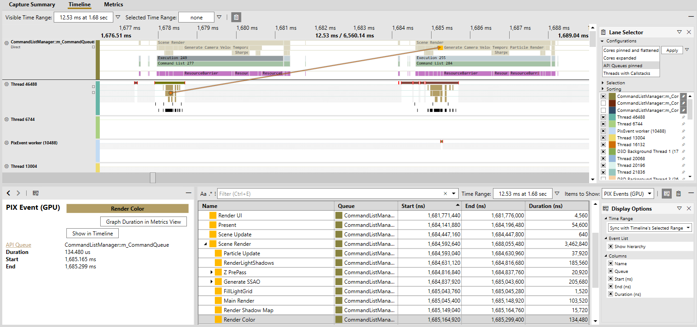
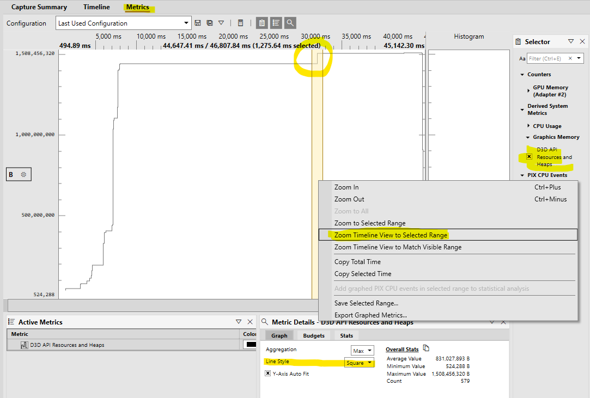
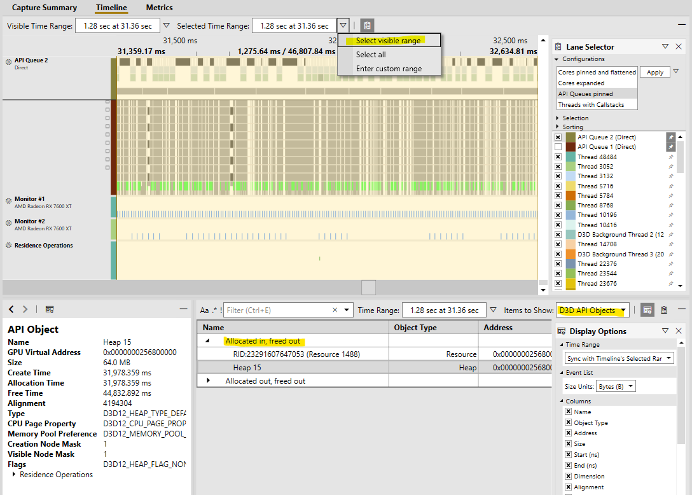
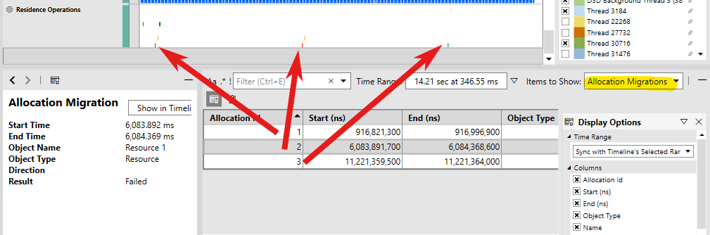
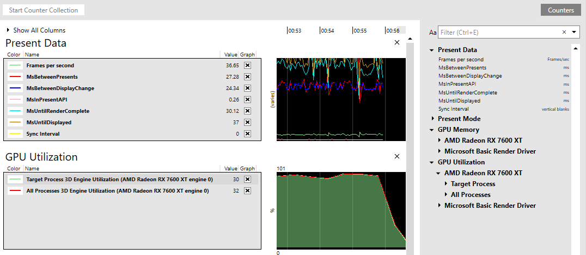

# Profile the CPU and GPU with timing captures

Timing captures combine both CPU and GPU profiling data into a single capture for in-depth analysis of your application. That data is gathered while the game is running, and with minimal overhead, so that you can see things such as how work is distributed across CPU cores, the latency between graphics work being submitted by the CPU and executed by the GPU, when file IO accesses and memory allocations occur, and so on. That also includes [application-defined events, markers, and counters via PixEvents](pix-instrumenting.md).

## Taking a timing capture

From the **Connection** view, either launch or attach to your desired process (ensuring the relevant **For GPU Capture** option is unchecked).

Configure your timing capture options as necessary and, when ready, click the **Start Timing Capture** button to begin recording. Click **Stop Timing Capture** (or terminate your app) to end the recording. After a brief processing period, the capture will open.

### Timing capture options

| Name | Description |
| ---- | ----------- |
| Capture Mode | Sequential: Record entirety of events between starting and stopping the capture.  Circular: Record events into a fixed size buffer, only saving the last n seconds of data. See this [Circular Timing Captures blog post](https://devblogs.microsoft.com/pix/circular-timing-captures/) for more details. |
| CPU Samples | Perform sample profiling to see where CPU is spending time. Sample rate is configurable. |
| Callstacks on Context Switches | Collect callstacks when a thread switches contexts. |
| File accesses | Track file accesses. |
| GPU timings | Collect detailed timing information about when GPU work starts and stops. |
| GPU resources | Collect *detailed* information about D3D objects like heaps and resources. Also track GPU residency, demoted allocations, and allocation migrations. |
| VirtualAlloc/VirtualFree events | Tracks allocations made via the VirtualAlloc and VirtualFree functions. |
| HeapAlloc/HeapFree events | Tracks allocations made via the HeapAlloc and HeapFree functions. |
| Custom allocator events | Tracks allocations made by [custom memory allocators instrumented with PixEvents](https://devblogs.microsoft.com/pix/memory-profiling-support-for-allocations-made-from-a-titles-custom-allocator/).|
| Page Fault events | Collect data on page faults that occur when the capture is running. The page faults are shown in the timeline and in the element details view. |
| Callstacks for non-title processes | Capture callstacks for processes other than the title process (the launched or attached to process). |
| Kernel image information | Collect information need to show callstacks for kernel binaries. |
| Generate .etl file instead of .wpix file | The generated .etl file can later be converted to a .wpix file in the File \| Convert menu. This option is useful when reporting bug repros to the PIX team or if you have other tooling for processing ETW data. |

### Programmatic captures

You can programmatically take a capture using the WinPixEventRuntime. For details, see the blog post [Programmatic capture](https://devblogs.microsoft.com/pix/programmatic-capture/).

## CPU profiling

Enabling the **CPU Samples** option when taking a capture can help you pinpoint slow functions in your application's hot path, as well as find issues related to thread waits and context switches. You'll also be able to track different kinds of allocations (with the appropriate capture option enabled).

There are several blog posts that cover those features in detail:
- [Overview of Timing Captures](https://devblogs.microsoft.com/pix/timing-captures-new/)
- [Analyzing CPU Samples in Timing Captures blog post](https://devblogs.microsoft.com/pix/analyzing-cpu-samples-in-timing-captures/).
- [Analyzing Stalls and Context Switches in Timing Captures](https://devblogs.microsoft.com/pix/analyzing-stalls-and-context-switches-in-timing-captures/)
- [Analyzing Memory Usage and Performance in Timing Captures](https://devblogs.microsoft.com/pix/analyzing-memory-usage-and-performance-in-timing-captures/)
  - You can also instrument your own custom allocators. For more details, see the blog post [Memory profiling support for allocations made from a title’s custom allocator](https://devblogs.microsoft.com/pix/memory-profiling-support-for-allocations-made-from-a-titles-custom-allocator/).

## GPU profiling

Is your app experiencing intermittent frame drops? Excessive VRAM usage? Unexpected paging operations between system memory and VRAM? The GPU profiling features in PIX can help you get to the bottom of these common and difficult-to-analyze situations.

### GPU timings

Enable the **GPU timings** option when taking a capture to collect timing data for GPU work. In the **Timeline** view, you can find lanes for each GPU queue (in the **Lane Selector**, you can quickly pin those lanes with the **API Queues pinned** configuration). Those lanes contain several sublanes:
- PIX Events (GPU): Hierarchicial, application-defined regions of GPU Work. See [PixEvents](pix-instrumenting.md).
- GPU Executions: Executions correspond to work submissions at the API level; for example, via ExecuteCommandLists.
- GPU Work: Any work that occurs on the GPU; for example, Draws, Dispatches, Copies.
- PIX Markers (GPU): Application-defined markers. See [PixEvents](pix-instrumenting.md).

When you select an event in the lane, you'll see arrows showing where on the CPU that event originated. There are also various visualization options in the lane options menu (the gear icon next to the lane name). Most notably, the **Flatten Events** and **Flatten GPU Work** options are enabled by default to preserve space, but you might want to see the full PIX Event hierarchy or GPU Work paralellization when diving into a specific frame.

That data is also available in tabular form via **Range Details** view by selecting the relevant category in the **Items to Show** drop-down.

#### Presentation and display info

Vsyncs are displayed as markers in a separate **Monitor** lane, and can be found in **Range Details** view within the **Other** category.

### GPU memory and Direct3D objects

Enable the **GPU resources** option when taking a capture to collect information about Direct3D objects. To graph overall memory usage, you can find several counters in **Metrics** view. You can configure various budget lines to get a quick idea of whether you're meeting your memory usage goals. When you find an area of interest, you might want to investigate further by selecting the time range, clicking **Zoom Timeline view to Select Range** in the right-click context menu, and setting the **Selected Time Range** drop-down to **Select Visible Range**.

> [!TIP]
> Setting the **Line Style** to *Square* makes it easier to see where the allocations are made.

In **Range Details** view, you can view various information about Direct3D API objects such as heaps, resources, and pipeline state objects. To make it easier to pinpoint any suspicious objects, that information is grouped by when it was allocated and freed.

#### Residency

For residency related issues, see out the **Residence Operations**, **Demoted Allocations**, and **Allocation Migrations** categories of **Range Detail**s view. Those markers and events are also shown in the **Residence Operations** lane.

Residence operations include the MakeResident and Evict operations (initiated via the Direct3D 12 API) as well as any PageIn and PageOut operations (For more details, see [Residency](../../direct3d12/residency.md)). Demoted allocations occur when the graphics kernel (DXGK) can't allocate a resource in your GPU's VRAM (due to either memory pressure or fragmentation). If that happens, then DXGK will also attempt to perform allocation migrations for those demoted allocations. Note that those migrations are expensive operations, because they require suspending the GPU.

### GPU utilization and presentation counters

Enable the **Capture SysMon counters** option when taking a capture to collect counters present in the System Monitor (aka SysMon), which includes various counters related to GPU performance. Notably, there are counters for:
- GPU utilization broken down by GPU engine for both the target process and all processes.
- Presentation data, like frames per second (and the inverse, in milliseconds, MsBetweenPresents) and MsUntilRenderComplete (time between a present start and GPU work completion).
- GPU Memory information, including local and non-local memory usage, residence, and budgets.

> [!TIP]
> Hover over the counter names in the **System Monitor** for a description.

These counters can also be monitored in real-time, either while taking a timing capture or by clicking the **Start Counter Collection** button in the **System Monitor** view. The graphs can be rearranged and counters can be added or removed dynamically. Click **Counters** to view all available counters.

## Win32 file-I/O

See the blog post [Analyzing Win32 File IO performance in Timing Captures](https://devblogs.microsoft.com/pix/analyzing-win32-file-io-performance-in-timing-captures/).

## Other analysis features

- Statistical comparisions help determine which portions of a PIX event hierarchy have statistically different durations for the set of points being compared. For details, see the blog post [Timing Capture Statistical Comparison Features](https://devblogs.microsoft.com/pix/timing-capture-statistical-comparison-features/).
- Setting performance budgets can help you to quickly identify problematic areas of the capture. For more details, see the blog post [Using performance budgets in the Timing Capture metrics view](https://devblogs.microsoft.com/pix/using-performance-budgets-in-the-timing-capture-metrics-view/).
- Also see the blog post [Critical path analysis in Timing Captures](https://devblogs.microsoft.com/pix/critical-path-analysis-in-timing-captures/).
