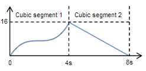
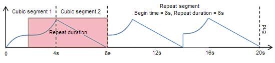

# Animation (DirectComposition)

> [!NOTE]
> For apps on Windows 10, we recommend using Windows.UI.Composition APIs instead of DirectComposition. For more info, see [Modernize your desktop app using the Visual layer](/windows/uwp/composition/visual-layer-in-desktop-apps).

This topic discusses the basics of Microsoft DirectComposition animation. It contains the following topics:

-   [What is an animation?](#what-is-an-animation)
-   [Properties that can be animated](#properties-that-can-be-animated)
-   [Animation functions](#animation-functions)
-   [Animation segments](#animation-segments)
    -   [Cubic segment](#cubic-segment)
    -   [Sinusoidal segment](#sinusoidal-segment)
    -   [Repeat segment](#repeat-segment)
    -   [End segment](#end-segment)
-   [Compatibility with Windows Animation Manager](#compatibility-with-windows-animation-manager)
-   [Related topics](#related-topics)

## What is an animation?

*Animation* is an optical illusion created by quickly making incremental changes to a visual over a period of time while redrawing the visual after each change is made. Because the redraws occur quickly, the brain perceives the incremental changes as a single changing scene, just as in a movie or video of live action.

The following table describes some of the typical ways of using animation.

| Animation                 | Description                                                                                                                                                                                                                                          |
|---------------------------|------------------------------------------------------------------------------------------------------------------------------------------------------------------------------------------------------------------------------------------------------|
| Scrolling                 | Use animation to add features like physics-emulating momentum to a scrolling list control.                                                                                                                                                           |
| Scene transitions         | Use animation to create navigational scene transitions that provide continuity between tasks in a workflow. Navigational scene transitions provide context that shows the user where they have been, where they are, and where they need to go next. |
| Cross-window interactions | Animate UI elements of different applications in a way that gives the perception of seamless continuity between them to help the user complete tasks that involve switching from one application to another.                                         |

 

## Properties that can be animated

In DirectComposition, you animate a visual by applying animation to individual properties of the objects that define the visual. For example, if you want to move a visual horizontally across the screen, you would apply animation to the OffsetX property of the visual. Similarly, if you wanted to do a simple animated 2D rotation of a visual, you would apply animation to the Angle property of a 2D transform object, and then apply the 2D transform object to the Transform property of the visual.

DirectComposition enables you to apply animation to any object property that takes a scalar value. You can apply simultaneous animations to multiple properties and multiple objects.

DirectComposition runs animations on a separate thread. You can start an animation or set of animations and then do other work on your application threads, or even put threads to sleep, while the composition engine runs the animations at the appropriate frame rate.

## Animation functions

DirectComposition animates an object property based on an animation function that you define. An *animation function* is a construct that specifies how the value of an object property changes over a period of time. For example, you could define an animation function that changes the value of a property from 1 to 360 over the course of 4 seconds. Then, if you apply the animation function to the Angle property of a 2D rotate transform object, and then apply the transform object to the Transform property of a visual, the animation function would rotate the visual in a full circle over the course of 4 seconds.

An animation function is represented by an *animation object* created by a call to the [**IDCompositionDevice::CreateAnimation**](/windows/win32/api/dcomp/nf-dcomp-idcompositiondevice-createanimation) method. You create an animation function by using the methods of an animation object's [**IDCompositionAnimation**](/windows/desktop/api/DcompAnimation/nn-dcompanimation-idcompositionanimation) interface to append *animation segments*, one at a time, to the array that defines the animation function. When appending a segment, you specify a zero-based offset that marks the begin time of the segment, relative to the beginning of the animation function. Animation segments must be appended in increasing order of begin times. Attempting to append an animation segment whose begin time is before or equal to a preceding segment will fail. An animation function can have a specified end time, indicating when the function should conclude.

Unless otherwise specified, an animation function starts when the Desktop Window Manager (DWM) receives the command to execute the animation. Each segment runs until the begin time of the next segment is reached. Any discontinuous changes that occur in the animated property value between segments are considered to be discrete changes.

You apply an animation function to a property by setting the property value to the [**IDCompositionAnimation**](/windows/desktop/api/DcompAnimation/nn-dcompanimation-idcompositionanimation) pointer of the animation object that represents the animation function. The same animation object can be applied to multiple properties of the same object, as well as to the properties of other objects created by the same device.

## Animation segments

Animation segments are the fundamental timing definitions of an animation function; they are the primitives from which more complex and higher level animation functions are built. An animation segment is constructed from a series of parameters that describe the function and the time when the segment begins, relative to the beginning of the animation function. For every segment, time (*t*) progresses along the horizontal axis and begins at *t* = 0.

### Cubic segment

The timing of a cubic segment is defined by a cubic polynomial. For a given time input (*t*), the output value is given by the following equation:

*x*(*t*) = *at*³ + *bt*² + *ct* + *d*

The following diagram shows an animation function that contains of two cubic segments. The first segment transitions a value from 0 to 16 over 4 seconds, and the second changes the value linearly from 16 to 0 over the next 4 seconds. The first transition occurs along this cubic polynomial:

*x*(*t*) = *t*³ - 6*t*² + 12*t*

and the second transition occurs along this one:

*x*(*t*) = - 4*t* + 16

You add a cubic segment to an animation function by using the [**IDCompositionAnimation::AddCubic**](/windows/desktop/api/DcompAnimation/nf-dcompanimation-idcompositionanimation-addcubic) method.

### Sinusoidal segment

The timing of a sinusoidal segment is defined by the following equation:

*x*(*t*) = *Bias* + *Amplitude* \* sin(*t*\**Frequency*\*2\*PI + *Phase*\*PI/180.0)

You add a sinusoidal segment to an animation function by using the [**IDCompositionAnimation::AddSinusoidal**](/windows/desktop/api/DcompAnimation/nf-dcompanimation-idcompositionanimation-addsinusoidal) method.

### Repeat segment

A repeat segment repeats a specified preceding portion of an animation function. A repeat segment causes the specified portion of the animation function to loop indefinitely until the next segment is encountered or the specified end of the animation is reached. The preceding portion of an animation is made of other segments, including other repeat segments. A repeat segment cannot be used as the first segment in an animation function.

The following diagram shows an animation function that consists two cubic segments of 4 seconds duration each, followed by a repeat segment that lasts 12 seconds. The repeat segment begins 8 seconds into the animation and repeats the previous 6 seconds of the animation two times until the end segment is reached at 20 seconds.

To add a repeat segment to an animation function, use the [**IDCompositionAnimation::AddRepeat**](/windows/desktop/api/DcompAnimation/nf-dcompanimation-idcompositionanimation-addrepeat) method.

### End segment

After constructing an animation function from segments, you can append an end segment to cause the animation function to end at a particular time. If you do not append an end segment, the final segment of the animation function runs indefinitely.

You append an end segment by calling the [**IDCompositionAnimation::End**](/windows/desktop/api/DcompAnimation/nf-dcompanimation-idcompositionanimation-end) method, specifying an offset from the beginning of the animation function which indicates the function's end point. The offset must be greater than the beginning offset of the preceding segment. Also, an end segment cannot be used as the first primitive in an animation function.

When you call [**End**](/windows/desktop/api/DcompAnimation/nf-dcompanimation-idcompositionanimation-end), you also specify a final value for the property being animated. The property is set to the specified final value at the moment when the end point of the animation function is reached.

After appending an end segment, you cannot append any other segments to the animation function. That is, all method calls on the animation object fail except [**IDCompositionAnimation::Reset**](/windows/desktop/api/DcompAnimation/nf-dcompanimation-idcompositionanimation-reset). Calling **Reset** returns the animation object to clean state in which the animation function contains no segments, at which point you can once again add segments.

## Compatibility with Windows Animation Manager

Windows Animation Manager (Windows Animation) outputs animation primitives in a format that is compatible with the DirectComposition API. This means that DirectComposition can create animations based on animation primitives created by Windows Animation.

For more information, see [Windows Animation Manager](/windows/desktop/UIAnimation/-main-portal), the [**IUIAnimationVariable2::GetCurve**](/windows/desktop/api/uianimation/nf-uianimation-iuianimationvariable2-getcurve) method, and [Managing DirectComposition Animation with Windows Animation Manager v2](https://github.com/microsoft/Windows-classic-samples/tree/master/Samples/DirectCompositionWindowsAnimationManager).

## Related topics

<dl> <dt>

[DirectComposition Concepts](directcomposition-concepts.md)
</dt> </dl>

 

 
