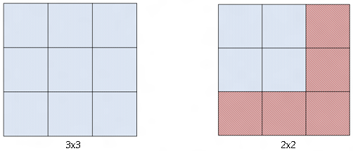

# Composition surface

> [!NOTE]
> For apps on Windows 10, we recommend using Windows.UI.Composition APIs instead of DirectComposition. For more info, see [Modernize your desktop app using the Visual layer](/windows/uwp/composition/visual-layer-in-desktop-apps).

This topic describes the types of types of surfaces that Microsoft DirectComposition supports.

-   [DirectComposition logical surface](#directcomposition-logical-surface)
    -   [Updating a logical surface](#updating-a-logical-surface)
    -   [Suspending updates to a logical surface](#suspending-updates-to-a-logical-surface)
    -   [Resuming updates to a logical surface](#resuming-updates-to-a-logical-surface)
    -   [Ending updates to a logical surface](#suspending-updates-to-a-logical-surface)
    -   [Example of using a logical surface](#example-of-using-a-logical-surface)
-   [DirectComposition virtual surface](#directcomposition-virtual-surface)
    -   [Resizing a virtual surface](#resizing-a-virtual-surface)
    -   [Trimming a virtual surface](#trimming-a-virtual-surface)
-   [Related topics](#related-topics)

## DirectComposition logical surface

DirectComposition exposes the [**IDCompositionSurface**](/windows/win32/api/dcomp/nn-dcomp-idcompositionsurface) object to represent a logical composition surface. DirectComposition exposes APIs that you can use to create, update, and delete these logical surfaces. Each surface can be associated with one or more visuals. An application is responsible for managing the lifetime of logical surfaces.

### Updating a logical surface

An application can update a logical surface by calling [**BeginDraw**](/windows/win32/api/dcomp/nf-dcomp-idcompositionsurface-begindraw) and specifying the size and offset of the rectangle on the logical surface that the app wants to update. DirectComposition allocates a rectangle of the specified size, and then returns the surface and the corresponding offset that the application needs to draw or update. The update rectangle’s limits are bound by the surface size. For example, the update rectangle for a 40-by-100 pixel surface can be up to (0,0,40,100). Also, the updatable region is enforced by a guard rectangle. Because there can be only one guard rectangle at a time, only one logical surface can be updated at a time. **BeginDraw** returns an error code if [**EndDraw**](/windows/win32/api/dcomp/nf-dcomp-idcompositionsurface-enddraw) or [**SuspendDraw**](/windows/win32/api/dcomp/nf-dcomp-idcompositionsurface-suspenddraw) has not been called after a previous call to **BeginDraw**. An application can add a committed call to **BeginDraw** to a batch, but it does not take effect until **EndDraw** is called and committed.

### Suspending updates to a logical surface

An application that needs to update different surfaces can call [**SuspendDraw**](/windows/win32/api/dcomp/nf-dcomp-idcompositionsurface-suspenddraw) on the current update, and then call [**BeginDraw**](/windows/win32/api/dcomp/nf-dcomp-idcompositionsurface-begindraw) to begin a new update. Microsoft DirectComposition allows multiple updates, but only one can be active at a time. This means that you need to call **SuspendDraw** or [**EndDraw**](/windows/win32/api/dcomp/nf-dcomp-idcompositionsurface-enddraw) on one surface before calling **BeginDraw** on the next one. Unlike **EndDraw**, a committed batch can contain a surface that is in a **SuspendDraw** state, but such updates won’t be shown on the screen until **EndDraw** is called.

### Resuming updates to a logical surface

An application can resume an update to a surface that is in a [**SuspendDraw**](/windows/win32/api/dcomp/nf-dcomp-idcompositionsurface-suspenddraw) state by calling [**ResumeDraw**](/windows/win32/api/dcomp/nf-dcomp-idcompositionsurface-resumedraw). This method can be called only on a suspended surface.

### Ending updates to a logical surface

Calling [**EndDraw**](/windows/win32/api/dcomp/nf-dcomp-idcompositionsurface-enddraw) and [**Commit**](/windows/win32/api/dcomp/nf-dcomp-idcompositiondevice-commit) is the only way to see bitmap update changes on the screen. Each call to **EndDraw** must have a corresponding call to [**BeginDraw**](/windows/win32/api/dcomp/nf-dcomp-idcompositionsurface-begindraw) to remove the guard rectangle. The logical surface retains all the updates until **Commit** is called. You can also call **EndDraw** on a surface that is in the [**SuspendDraw**](/windows/win32/api/dcomp/nf-dcomp-idcompositionsurface-suspenddraw) state because **EndDraw** is an implied resume/end. After you call **EndDraw**, the updated content is presented to the screen and discarded so that the memory for the update can be reused for a later update.

### Example of using a logical surface

The following example describes the steps that an application would take if it created a visual tree consisting of two visuals, and then needed to update specific regions of the two logical surfaces associated with the visuals:

1.  Create a DirectComposition device.
2.  Create the visual tree consisting of a root node and visuals 1 and 2.
3.  Create logical surfaces 1 and 2.
4.  Call [**SetContent**](/windows/win32/api/dcomp/nf-dcomp-idcompositionvisual-setcontent) to associate a logical surface with visuals 1 and 2.
5.  Call [**BeginDraw**](/windows/win32/api/dcomp/nf-dcomp-idcompositionsurface-begindraw) on a sub-rectangle of logical surface 1.
6.  Update the surface at the offset returned by DirectComposition.
7.  Optional steps:
    1.  Call [**SuspendDraw**](/windows/win32/api/dcomp/nf-dcomp-idcompositionsurface-suspenddraw) on logical surface 1.
    2.  Call [**BeginDraw**](/windows/win32/api/dcomp/nf-dcomp-idcompositionsurface-begindraw) on sub-rect of logical surface 2.
    3.  Update the surface at the offset returned by DirectComposition.
    4.  Call [**EndDraw**](/windows/win32/api/dcomp/nf-dcomp-idcompositionsurface-enddraw) on logical surface 2.
    5.  Call [**ResumeDraw**](/windows/win32/api/dcomp/nf-dcomp-idcompositionsurface-resumedraw) on logical surface 1.
8.  Update the surface at the offset returned by DirectComposition.
9.  Call [**EndDraw**](/windows/win32/api/dcomp/nf-dcomp-idcompositionsurface-enddraw) on logical surface 1.
10. Call [**Commit**](/windows/win32/api/dcomp/nf-dcomp-idcompositiondevice-commit).

## DirectComposition virtual surface

DirectComposition exposes the [**IDCompositionVirtualSurface**](/windows/win32/api/dcomp/nn-dcomp-idcompositionvirtualsurface) interface to represent a virtual surface, which is a collection of logical surfaces (tiles) arranged in a fixed grid with tiles of a fixed size. The application specifies the size of the virtual texture at creation time. The size establishes the boundaries for the virtual surface. The surface can be associated with one or more visuals.

When a virtual surface is initialized, it is not backed by actual allocations. In other words, it doesn’t hold any bits. DirectComposition allocates tiles (that is, composition surface objects) after the application starts updating the surface. The application updates the virtual surface by calling [**BeginDraw**](/windows/win32/api/dcomp/nf-dcomp-idcompositionsurface-begindraw) and specifying the region of interest with respect to the coordinates of the virtual surface. Then, DirectComposition allocates the necessary tiles to hold the update, and returns the composition surface and offset to update.

As with logical surfaces, you can call [**BeginDraw**](/windows/win32/api/dcomp/nf-dcomp-idcompositionsurface-begindraw), [**SuspendDraw**](/windows/win32/api/dcomp/nf-dcomp-idcompositionsurface-suspenddraw), [**ResumeDraw**](/windows/win32/api/dcomp/nf-dcomp-idcompositionsurface-resumedraw) and [**EndDraw**](/windows/win32/api/dcomp/nf-dcomp-idcompositionsurface-enddraw) on a virtual surface. In addition, DirectComposition exposes methods that you can use to resize and trim an existing virtual surface.

### Resizing a virtual surface

The [**Resize**](/windows/win32/api/dcomp/nf-dcomp-idcompositionvirtualsurface-resize) method changes the boundaries of the virtual surface, meaning that any new updates or allocations must fall in the boundaries set by the new size. An application uses **Resize** to tell DirectComposition that a particular region of the virtual surface is no longer needed and can be reclaimed. If **Resize** shrinks the virtual surface, the application can no longer update the regions outside the new boundaries.

The following illustration shows a 3-by-3 virtual surface resized to 2-by-2. The red region represents tiles that are discarded as part of the resize operation, and the memory is reclaimed by DirectComposition. After the resize, the application can't make updates to the red region without resizing the virtual surface again.



The resize operation takes effect immediately. DirectComposition doesn't wait for the application to call [**Commit**](/windows/win32/api/dcomp/nf-dcomp-idcompositiondevice-commit) to make the resize updates. For example, suppose an application makes the following sequence of calls.


```
pVirtualSurface->Resize(0, 0);
pVirtualSurface->Resize(INT_MAX, INT_MAX);
pDevice->Commit();
```


In this example, the application loses all content on the first resize. The second resize has no effect even though it was called before [**Commit**](/windows/win32/api/dcomp/nf-dcomp-idcompositiondevice-commit). In this case nothing shows on the screen.

### Trimming a virtual surface

The [**Trim**](/windows/win32/api/dcomp/nf-dcomp-idcompositionvirtualsurface-trim) method identifies the region of the virtual surface that the application needs. It doesn't resize the boundaries of the virtual surface, but it does tell DirectComposition which logical surfaces currently need to be allocated.

In the following illustration, the green square is the application’s viewport. The application initially renders to the first six tiles (blue) of the virtual surface (light gray) that are in the viewport. As the page that is represented by the virtual surface scrolls, the application needs to render the last six tiles. The application calls [**Trim**](/windows/win32/api/dcomp/nf-dcomp-idcompositionvirtualsurface-trim) to indicate that the region defined by the last six tiles is where the content is, and the rest is not needed at the moment. DirectComposition can then choose to recycle the logical surfaces that originally represented the first six tiles (dark gray).


## Related topics

<dl> <dt>

[DirectComposition Concepts](directcomposition-concepts.md)
</dt> </dl>

 

 