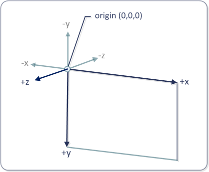

# Effects (DirectComposition)

> [!NOTE]
> For apps on Windows 10, we recommend using Windows.UI.Composition APIs instead of DirectComposition. For more info, see [Modernize your desktop app using the Visual layer](/windows/uwp/composition/visual-layer-in-desktop-apps).

This topic discusses the basics of Microsoft DirectComposition effects, and describes the types of effects that DirectComposition supports.

This topic contains the following sections:

-   [What is a DirectComposition effect?](#what-is-a-directcomposition-effect)
-   [Opacity](#opacity)
-   [3D perspective transform effects](#3d-perspective-transform-effects)
    -   [The DirectComposition 3D coordinate space](#the-directcomposition-3d-coordinate-space)
    -   [3D rotation transform effect](#3d-rotation-transform-effect)
    -   [3D scaling transform effect](#3d-scaling-transform-effect)
    -   [3D translation transform effect](#3d-translation-transform-effect)
    -   [3D matrix transform effect](#3d-matrix-transform-effect)
    -   [3D transform effect group](#3d-transform-effect-group)
-   [Effect objects](#effect-objects)
-   [Related topics](#related-topics)

## What is a DirectComposition effect?

A DirectComposition *effect* is a bitmap operation that is applied during the rasterization of a visual to change the appearance of the visual in some way.

DirectComposition creates an effect by taking a visual subtree and rendering it into a single bitmap before applying the effect. For example, to create a 3D perspective transform effect, DirectComposition produces an image of a visual sub-tree and then textures the image onto a 3D plane that is transformed according to the 3D transform effect’s resulting matrix.

DirectComposition supports the following types of effects.

| Effect type                                                   | Description                                                                |
|---------------------------------------------------------------|----------------------------------------------------------------------------|
| [Opacity](#opacity)                                           | Sets the opacity of an entire visual.                                      |
| [3D perspective transform](#3d-perspective-transform-effects) | Applies a three-dimensional (3D) perspective transform effect to a visual. |

 

> [!Note]  
> DirectComposition does no special processing when applying effects to 3D stereo content. This means the 3D content might appear distorted when an effect is applied to it.

 

## Opacity

The opacity effect lets you set the opacity factor that is applied to an entire visual when the visual is rendered. It differs from an alpha mask in that the same opacity factor is applied to all pixels in the visual. Opacity is specified as a value ranging from 0 (completely transparent) to 1 (completely opaque).

The opacity factor is applied from parent to child visuals, but the visible effects of the nested opacity settings are not indicated in the property value of individual child visuals. For instance, if a root visual has a 50% (0.5) opacity and one of its children has a 20% (0.2) opacity, the net opacity for that child is rendered as 10% (0.1), but the value of the child’s Opacity property would still be 0.2.

## 3D perspective transform effects

This section describes the coordinate space that DirectComposition uses for performing 3D perspective transform effects. It also describes the types of 3D perspective transform effects that DirectComposition supports.

-   [The DirectComposition 3D coordinate space](#the-directcomposition-3d-coordinate-space)
-   [3D rotation transform effect](#3d-rotation-transform-effect)
-   [3D scaling transform effect](#3d-scaling-transform-effect)
-   [3D translation transform effect](#3d-translation-transform-effect)
-   [3D matrix transform effect](#3d-matrix-transform-effect)
-   [3D transform effect group](#3d-transform-effect-group)

> [!Note]  
> In DirectComposition, applying 3D effects to multiple levels in the visual tree does not work in the same way as it does with a full 3D engine such as Microsoft Direct3D. For example, consider a parent visual that has a single child visual. If the child visual is rotated forward in the z direction (around the y-axis) by 90 degrees, the edge of the child visual edge would face the viewer, and so we’d expect the visual to not be visible (because a bitmap has no real depth). If the parent visual is then rotated backward in the negative z direction (around the y-axis) by 90 degrees, we might expect the child visual to become fully visibly (since the transformations negate each other). However, in DirectComposition this is not the case. The child visual will not be visible because it was "flattened into" the parent bitmap.

 

### The DirectComposition 3D coordinate space

The DirectComposition coordinate space for 3D transform effects locates the origin (0,0,0) at the upper-left corner of the bitmap surface, with positive x-axis values proceeding to the right, positive y-axis values proceeding downward, and positive z-axis values proceeding outward from the origin, toward the viewer. This illustration shows the DirectComposition 3D coordinate space.

### 3D rotation transform effect

A 3D rotation transform effect rotates a visual in three dimensions by the specified angle about a rotation axis vector \[x,y,z\] located at the specified center point (x,y,z). The angle is specified in degrees. The default rotation axis vector is \[0,0,-1\], and the default center point is (0,0,0).

Use the [**IDCompositionDevice::CreateRotateTransform3D**](/windows/win32/api/dcomp/nf-dcomp-idcompositiondevice-createrotatetransform3d) method to create a 3D rotation transform object. The method retrieves an [**IDCompositionRotateTransform3D**](/windows/win32/api/dcomp/nn-dcomp-idcompositionrotatetransform3d) interface that you can use to set the properties of the object.

### 3D scaling transform effect

A 3D scaling transform effect makes a visual larger or smaller. It scales a visual in the \[x,y,z\] direction about the center point (x,y,z). The default center point is (0,0,0).

Use the [**IDCompositionDevice::CreateScaleTransform3D**](/windows/win32/api/dcomp/nf-dcomp-idcompositiondevice-createscaletransform3d) method to create a 3D scaling transform object. The method retrieves an [**IDCompositionScaleTransform3D**](/windows/win32/api/dcomp/nn-dcomp-idcompositionscaletransform3d) interface that you can use to set the properties of the object.

### 3D translation transform effect

A 3D translation transform effect changes the position of a visual in the \[x,y,z\] direction.

Use the [**IDCompositionDevice::CreateTranslateTransform3D**](/windows/win32/api/dcomp/nf-dcomp-idcompositiondevice-createtranslatetransform3d) method to create a 3D translation transform object. The method retrieves an [**IDCompositionTranslateTransform3D**](/windows/win32/api/dcomp/nn-dcomp-idcompositiontranslatetransform3d) interface that you can use to set the properties of the object.

### 3D matrix transform effect

The [**IDCompositionMatrixTransform3D**](/windows/win32/api/dcomp/nn-dcomp-idcompositionmatrixtransform) interface enables you to define your own 4-by-4 transformation matrix and apply it to a visual. This interface is useful if you need to apply a type of 3D perspective transform effect that is not available through the other DirectComposition 3D transform effect interfaces. You define the matrix by filling a [**D3DMATRIX**](/windows/desktop/direct3d10/d3d10-d3dmatrix) structure and passing it to the [**IDCompositionMatrixTransform3D::SetMatrix**](/windows/win32/api/dcomp/nf-dcomp-idcompositionmatrixtransform-setmatrix) method. Alternatively, you can set each element of the matrix by using the [**IDCompositionMatrixTransform3D::SetMatrixElement**](/previous-versions/windows/desktop/legacy/hh437429(v=vs.85)) method.

### 3D transform effect group

The [**IDCompositionDevice::CreateTransform3DGroup**](/windows/win32/api/dcomp/nf-dcomp-idcompositiondevice-createtransform3dgroup) creates a collection of 3D transform effects that you can apply to a visual as a group. The array can include any number of transform objects, and can include matrix, rotate, scale, and translate transforms. The collection of 3D transform objects results in a transform whose value is the matrix multiplication of the individual transform matrices in the collection.

The order of individual transforms in the group is important. For example, if you first rotate, then scale, then translate, you get a different result than if you first translate, then rotate, then scale. DirectComposition respects the order in which you specify 3D transforms within a transform 3D group the same way it does for 2D transforms. Additionally, 3D perspective transforms result in flattening of the visual tree after all 3D transforms in the current visual have been applied. This is done to ensure that the scene looks as close to 3D as possible.

## Effect objects

To apply an effect to a visual, you first need to create and set the properties of an effect object that represents the type of effect that you want to produce on the visual. Then, you need to apply the effect object to the visual's Effect property.

To create an effect object, use one of the following [**IDCompositionDevice**](/windows/win32/api/dcomp/nn-dcomp-idcompositiondevice) interface methods to create an effect object for the type of effect that you want. The following methods create effect objects:

-   [**CreateMatrixTransform3D**](/windows/win32/api/dcomp/nf-dcomp-idcompositiondevice-creatematrixtransform3d)
-   [**CreateRotateTransform3D**](/windows/win32/api/dcomp/nf-dcomp-idcompositiondevice-createrotatetransform3d)
-   [**CreateScaleTransform3D**](/windows/win32/api/dcomp/nf-dcomp-idcompositiondevice-createscaletransform3d)
-   [**CreateTranslateTransform3D**](/windows/win32/api/dcomp/nf-dcomp-idcompositiondevice-createtranslatetransform3d)

Each of the preceding methods retrieves an interface that you can use to set the properties of the newly created effect object. Use the interface methods to set the properties as necessary to produce the visual effect that you want.

Most properties of an effect object can be animated. To animate a particular property, create an animation object and apply it to the property that you want to animate; otherwise, set the property to a static value that produces the effect that you want. For more information about animating properties, see [Animation](animation.md).

To apply an effect object to visual, call the [**IDCompositionVisual::SetEffect**](/windows/win32/api/dcomp/nf-dcomp-idcompositionvisual-seteffect) method. When you apply an effect to a visual, the effect is applied to the entire visual subtree rooted at that visual. So, for example, if you set the opacity of a visual to 50 percent, the opacity of all child visuals in the visual subtree will be reduced by 50 percent. You can apply the same effect object to one or more visuals. If you modify the properties of an effect object after applying it to visuals, all of the visuals are re-composed to reflect the change.

By using an effect group object, you can simultaneously apply multiple effects to a visual. First call [**IDCompositionDevice::CreateEffectGroup**](/windows/win32/api/dcomp/nf-dcomp-idcompositiondevice-createeffectgroup) to create the effect group object, and then add effects to the group by using the object's [**IDCompositionEffectGroup**](/windows/win32/api/dcomp/nn-dcomp-idcompositioneffectgroup) interface.

## Related topics

<dl> <dt>

[DirectComposition Concepts](directcomposition-concepts.md)
</dt> </dl>

 

 