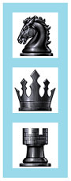

# How to build a simple visual tree

This topic demonstrates how to build a simple Microsoft DirectComposition visual tree. The example in this topic builds and composes a visual tree that consists of a root visual and three child visuals. The content of the root visual is a light-blue bitmap that serves as the background for the child visuals. This illustration shows the composition created by the example code in this topic.



## What you need to know

### Technologies

-   [DirectComposition](directcomposition-portal.md)
-   [Direct3D 11 Graphics](https://msdn.microsoft.com/library/windows/desktop/ff476080)
-   [DirectX Graphics Infrastructure (DXGI)](https://msdn.microsoft.com/library/windows/desktop/hh404534)

### Prerequisites

-   C/C++
-   Microsoft Win32
-   Component Object Model (COM)

## Instructions

### Step 1: Initialize the device and composition target objects

For more information, see [How to initialize DirectComposition](initialize-directcomposition.md).

### Step 2: Create the visual objects and set the bitmap content

Use the [**IDCompositionDevice::CreateVisual**](https://msdn.microsoft.com/en-us/library/Hh437414(v=VS.85).aspx) method to create the visuals, and the [**IDCompositionVisual::SetContent**](https://msdn.microsoft.com/en-us/library/Hh449157(v=VS.85).aspx) method to set the bitmap content of the visuals.

> [!Note]  
> In the following example, the first element of the `m_hBitmaps` array contains the bitmap for the root visual, and the remaining elements contain the bitmaps for the child visuals.

 


```C++
#define NUM_VISUALS 4       // number of visuals in the composition
```

<span codelanguage="ManagedCPlusPlus"></span>

<table>
<colgroup>
<col style="width: 100%" />
</colgroup>
<thead>
<tr class="header">
<th>C++</th>
</tr>
</thead>
<tbody>
<tr class="odd">
<td><pre><code>    HBITMAP m_hBitmaps[NUM_VISUALS];</code></pre></td>
</tr>
</tbody>
</table>

<span codelanguage="ManagedCPlusPlus"></span>

<table>
<colgroup>
<col style="width: 100%" />
</colgroup>
<thead>
<tr class="header">
<th>C++</th>
</tr>
</thead>
<tbody>
<tr class="odd">
<td><pre><code>    HRESULT hr = S_OK;

    IDCompositionVisual *pVisuals[NUM_VISUALS] = { };
    IDCompositionSurface *pSurface = nullptr;
    
    // Create a visual objects and set their content.   
    for (int i = 0; i < NUM_VISUALS; i++)
    {
        hr = m_pDevice->CreateVisual(&pVisuals[i]); 
        if (SUCCEEDED(hr))
        {
            // This application-defined function creates a DirectComposition
            // surface and renders a GDI bitmap onto the surface. 
            hr = MyCreateGDIRenderedDCompSurface(m_hBitmaps[i], &pSurface);

            if (SUCCEEDED(hr))
            {
                // Set the bitmap content.  
                hr = pVisuals[i]->SetContent(pSurface);
            }

            SafeRelease(&pSurface);
        }

        if (FAILED(hr))
        {
            goto Cleanup;
        }
    }</code></pre></td>
</tr>
</tbody>
</table>


The following application defined function shows how to create the Microsoft DirectComposition surface and render a Windows Graphics Device Interface (GDI) bitmap to the surface.


```C++
// MyCreateGDIRenderedDCompSurface - Creates a DirectComposition surface and 
//   copies the bitmap to the surface. 
//
// Parameters:
//   hBitmap - a GDI bitmap.
//   ppSurface - the composition surface object.
//                                                                 
HRESULT DemoApp::MyCreateGDIRenderedDCompSurface(HBITMAP hBitmap, IDCompositionSurface **ppSurface)
{
    HRESULT hr = S_OK;

    int bitmapWidth = 0;
    int bitmapHeight = 0;
    int bmpSize = 0;
     BITMAP bmp = { };
    HBITMAP hBitmapOld = NULL;

    HDC hSurfaceDC = NULL;  
    HDC hBitmapDC = NULL;

    IDXGISurface1 *pDXGISurface = nullptr;
    POINT pointOffset = { };

    hr =  hBitmap ? S_OK : E_FAIL;
    if (SUCCEEDED(hr))
    {
        // Get information about the bitmap.
        bmpSize = GetObject(hBitmap, sizeof(BITMAP), &bmp);
    }

    hr = bmpSize ? S_OK : E_FAIL;
    if (SUCCEEDED(hr))
    {
        // Save the bitmap dimensions.
        bitmapWidth = bmp.bmWidth;
        bitmapHeight = bmp.bmHeight;

        // Create a DirectComposition-compatible surface that is the same size 
        // as the bitmap.
        hr = m_pDevice->CreateSurface(bitmapWidth, bitmapHeight, 
            DXGI_FORMAT_B8G8R8A8_UNORM, DXGI_ALPHA_MODE_IGNORE, ppSurface);
    }

    hr = ppSurface ? S_OK : E_FAIL;
    if (SUCCEEDED(hr)) 
    {
        hr = (*ppSurface)->BeginDraw(NULL, __uuidof(IDXGISurface1), 
            reinterpret_cast<void**>(&pDXGISurface), &pointOffset);
    }

    if (SUCCEEDED(hr)) 
    {
        pDXGISurface->GetDC(FALSE, &hSurfaceDC);
    }

    hr = hSurfaceDC ? S_OK : E_FAIL;
    if (SUCCEEDED(hr))
    {
        hBitmapDC = CreateCompatibleDC(hSurfaceDC);
        if (hBitmapDC != NULL)
        {
            hBitmapOld = (HBITMAP)SelectObject(hBitmapDC, hBitmap);
            BitBlt(hSurfaceDC, pointOffset.x, pointOffset.y, 
                bitmapWidth, bitmapHeight, hBitmapDC, 0, 0, SRCCOPY);
            
            if (hBitmapOld)
            {
                SelectObject(hBitmapDC, hBitmapOld);
            }
            DeleteDC(hBitmapDC);
        }

        pDXGISurface->ReleaseDC(NULL);
    }

    (*ppSurface)->EndDraw();

    SafeRelease(&pDXGISurface);

    return hr;
}
```


### Step 3: Set the root visual

Set the horizontal and vertical offsets of the root visual, and then add it to the visual tree by calling the [**IDCompositionTarget::SetRoot**](https://msdn.microsoft.com/en-us/library/Hh449109(v=VS.85).aspx) method.


```C++
    float xPosRoot = 50.0; 
    float yPosRoot = 50.0; 

    // Set the horizontal and vertical position of the root visual. 
    pVisuals[0]->SetOffsetX(xPosRoot);  
    pVisuals[0]->SetOffsetY(yPosRoot);  

    // Set the root visual of the visual tree.          
    hr = m_pCompTarget->SetRoot(pVisuals[0]);  
```


### Step 4: Add the child visuals and commit the composition

Use methods exposed by each child visual's [**IDCompositionVisual**](https://msdn.microsoft.com/en-us/library/Hh449139(v=VS.85).aspx) interface to set the bitmap content and other properties, and then use the root visual's [**IDCompositionVisual::AddVisual**](https://msdn.microsoft.com/en-us/library/Hh449141(v=VS.85).aspx) method to add the child visuals to the root of the visual tree. Call [**IDCompositionDevice::Commit**](https://msdn.microsoft.com/en-us/library/Hh437393(v=VS.85).aspx) to commit the batch of commands to DirectComposition for processing. The resulting composition appears in the target window.


```C++
    float xPosChild = 20.0f;
    float yPosChild = 20.0f;

    if (SUCCEEDED(hr))
    {
        // Set the positions of the child visuals and add them to the visual tree.
        for (int i = 1; i < NUM_VISUALS; i++)
        {
            pVisuals[i]->SetOffsetX(xPosChild);
            pVisuals[i]->SetOffsetY(
                static_cast<float>((yPosChild * i) + (CHILD_BITMAP_HEIGHT * (i - 1))));

            // Add the child visuals as children of the root visual.
            pVisuals[0]->AddVisual(pVisuals[i], TRUE, nullptr);
        }
    }
    
    // Commit the visual to be composed and displayed.
    hr = m_pDevice->Commit();  
```


### Step 5: Free the DirectComposition objects

Free the visual objects as soon as you no longer need them. This next bit of code calls the application-defined [**SafeRelease**](https://msdn.microsoft.com/library/windows/desktop/dd940435) macro to free the visual objects.


```C++
Cleanup:
    // Free the visuals.
    for (int i = 0; i < NUM_VISUALS; i++) 
    {
        SafeRelease(&pVisuals[i]);
    }
```


Also, remember to free the device and composition target objects before your application exits.


```C++
    SafeRelease(&m_pD3D11Device);
    SafeRelease(&m_pDevice);
    SafeRelease(&m_pCompTarget);
```


## Complete example


```C++
// THIS CODE AND INFORMATION IS PROVIDED "AS IS" WITHOUT WARRANTY OF
// ANY KIND, EITHER EXPRESSED OR IMPLIED, INCLUDING BUT NOT LIMITED TO
// THE IMPLIED WARRANTIES OF MERCHANTABILITY AND/OR FITNESS FOR A
// PARTICULAR PURPOSE.
//
// Copyright (c) Microsoft Corporation. All rights reserved

#pragma once
// Modify the following definitions if you need to target a platform prior to the ones specified below.
// Refer to MSDN for the latest info on corresponding values for different platforms.
#ifndef WINVER              // Allow use of features specific to Windows 7 or later.
#define WINVER 0x0700       // Change this to the appropriate value to target other versions of Windows.
#endif

#ifndef _WIN32_WINNT        // Allow use of features specific to Windows 7 or later.
#define _WIN32_WINNT 0x0700 // Change this to the appropriate value to target other versions of Windows.
#endif

#ifndef UNICODE
#define UNICODE
#endif

#define WIN32_LEAN_AND_MEAN     // Exclude rarely-used items from Windows headers

// Windows Header Files:
#include <windows.h>

// C RunTime Header Files
#include <math.h>

#include <dcomp.h>
#include <d3d11.h>

/******************************************************************
*                                                                 *
*  Macros                                                         *
*                                                                 *
******************************************************************/
template<class Interface>
inline void
SafeRelease(
    Interface **ppInterfaceToRelease
    )
{
    if (*ppInterfaceToRelease != NULL)
    {
        (*ppInterfaceToRelease)->Release();

        (*ppInterfaceToRelease) = NULL;
    }
}
#ifndef Assert
#if defined( DEBUG ) || defined( _DEBUG )
#define Assert(b) if (!(b)) {OutputDebugStringA("Assert: " #b "\n");}
#else
#define Assert(b)
#endif //DEBUG || _DEBUG
#endif


#ifndef HINST_THISCOMPONENT
EXTERN_C IMAGE_DOS_HEADER __ImageBase;
#define HINST_THISCOMPONENT ((HINSTANCE)&__ImageBase)
#endif

// Application-defined constants
#define NUM_VISUALS 4       // number of visuals in the composition
#define CHILD_BITMAP_HEIGHT 96    // height, in pixels, of a child visual
#define NUM_BITMAPS 4       // number of bitmaps in the composition

/******************************************************************
*                                                                 *
*  DemoApp                                                        *
*                                                                 *
******************************************************************/

class DemoApp
{
public:
    DemoApp();
    ~DemoApp();

    HRESULT Initialize();

    void RunMessageLoop();

private:
    HRESULT InitializeDirectCompositionDevice();

    HRESULT CreateResources();
    void DiscardResources();

    HRESULT OnClientClick();

    HRESULT DemoApp::LoadResourceGDIBitmap(
        PCWSTR resourceName, 
        HBITMAP &hbmp
        );
    HRESULT DemoApp::MyCreateGDIRenderedDCompSurface(HBITMAP hBitmap, IDCompositionSurface **ppSurface);

    static LRESULT CALLBACK WndProc(
        HWND hWnd,
        UINT message,
        WPARAM wParam,
        LPARAM lParam
        );

 private:
    HWND m_hwnd;

    HBITMAP m_hBitmaps[NUM_VISUALS];
    ID3D11Device *m_pD3D11Device;
    IDCompositionDevice *m_pDevice;
    IDCompositionTarget *m_pCompTarget;
 };
```

<span codelanguage="ManagedCPlusPlus"></span>

<table>
<colgroup>
<col style="width: 100%" />
</colgroup>
<thead>
<tr class="header">
<th>C++</th>
</tr>
</thead>
<tbody>
<tr class="odd">
<td><pre><code>// THIS CODE AND INFORMATION IS PROVIDED &quot;AS IS&quot; WITHOUT WARRANTY OF
// ANY KIND, EITHER EXPRESSED OR IMPLIED, INCLUDING BUT NOT LIMITED TO
// THE IMPLIED WARRANTIES OF MERCHANTABILITY AND/OR FITNESS FOR A
// PARTICULAR PURPOSE.
//
// Copyright (c) Microsoft Corporation. All rights reserved

// Instructions: Right-click in the client area to cause DirectCompostion
// to create a simple composition consisting a root visual and three child 
// visuals. The root visual provides the background bitmap for the 
// composition, and the three child visuals provide bitmaps that are 
// composed on top of the root. All bitmaps are GDI.

#include &quot;SimpleVisualTree.h&quot;

/******************************************************************
*                                                                 *
*  The application entry point.                                   *
*                                                                 *
******************************************************************/

int WINAPI WinMain(
    HINSTANCE /* hInstance */,
    HINSTANCE /* hPrevInstance */,
    LPSTR /* lpCmdLine */,
    int /* nCmdShow */
    )
{
    // Ignore the return value because we want to run the program even in the
    // unlikely event that HeapSetInformation fails.
    HeapSetInformation(NULL, HeapEnableTerminationOnCorruption, NULL, 0);
    if (SUCCEEDED(CoInitialize(NULL)))
    {
        {
            DemoApp app;

            if (SUCCEEDED(app.Initialize()))
            {
                app.RunMessageLoop();
            }
        }
        CoUninitialize();
    }

    return 0;
}

/******************************************************************
*                                                                 *
*  DemoApp::DemoApp constructor                                   *
*                                                                 *
*  Initialize member data.                                         *
*                                                                 *
******************************************************************/

DemoApp::DemoApp() :
    m_hwnd(NULL),
    m_hBitmaps(),
    m_pD3D11Device(nullptr),
    m_pDevice(nullptr),
    m_pCompTarget(nullptr)
{
}

/******************************************************************
*                                                                 *
*  Release resources.                                             *
*                                                                 *
******************************************************************/

DemoApp::~DemoApp()
{
    SafeRelease(&m_pD3D11Device);
    SafeRelease(&m_pDevice);
    SafeRelease(&m_pCompTarget);
}

/*******************************************************************
*                                                                  *
*  Create the application window.                                  *
*                                                                  *
*******************************************************************/

HRESULT DemoApp::Initialize()
{
    HRESULT hr;

    // Register the window class.
    WNDCLASSEX wcex = { sizeof(WNDCLASSEX) };
    wcex.style         = CS_HREDRAW | CS_VREDRAW;
    wcex.lpfnWndProc   = DemoApp::WndProc;
    wcex.cbClsExtra    = 0;
    wcex.cbWndExtra    = sizeof(LONG_PTR);
    wcex.hInstance     = HINST_THISCOMPONENT;
    wcex.hbrBackground = (HBRUSH)(COLOR_WINDOW+1);;
    wcex.lpszMenuName  = NULL;
    wcex.hCursor       = LoadCursor(NULL, IDC_ARROW);
    wcex.lpszClassName = L&quot;DirectCompDemoApp&quot;;

    RegisterClassEx(&wcex);

    // Create the application window.
    //
    // Because the CreateWindow function takes its size in pixels, we
    // obtain the system DPI and use it to scale the window size.
    int dpiX = 0;
    int dpiY = 0;
    HDC hdc = GetDC(NULL);
    if (hdc)
    {
        dpiX = GetDeviceCaps(hdc, LOGPIXELSX);
        dpiY = GetDeviceCaps(hdc, LOGPIXELSY);
        ReleaseDC(NULL, hdc);
    }

    m_hwnd = CreateWindow(
        L&quot;DirectCompDemoApp&quot;,
        L&quot;DirectComposition Demo Application&quot;,
        WS_OVERLAPPEDWINDOW,
        CW_USEDEFAULT,
        CW_USEDEFAULT,
        static_cast<UINT>(ceil(640.f * dpiX / 96.f)),
        static_cast<UINT>(ceil(480.f * dpiY / 96.f)),
        NULL,
        NULL,
        HINST_THISCOMPONENT,
        this
        );

    hr = m_hwnd ? S_OK : E_FAIL;
    if (SUCCEEDED(hr))
    {
        ShowWindow(m_hwnd, SW_SHOWNORMAL);
        UpdateWindow(m_hwnd);

        // Initialize DirectComposition resources, such as the
        // device object and composition target object.
        hr = InitializeDirectCompositionDevice();
    }

    if (SUCCEEDED(hr))
    {
        hr = CreateResources();
    }

    return hr;
}

/******************************************************************
*                                                                 *
*  This method creates the DirectComposition device object and    *
*  and the composition target object. These objects endure for    *
*  the lifetime of the application.                               *
*                                                                 *
******************************************************************/

HRESULT DemoApp::InitializeDirectCompositionDevice()
{
    HRESULT hr = S_OK;

    D3D_FEATURE_LEVEL featureLevelSupported;
    IDXGIDevice *pDXGIDevice = nullptr;

    // Create the D3D device object.
    D3D11CreateDevice(
        nullptr,
        D3D_DRIVER_TYPE_HARDWARE,
        NULL,
        D3D11_CREATE_DEVICE_BGRA_SUPPORT,
        NULL,
        0,
        D3D11_SDK_VERSION,
        &m_pD3D11Device,
        &featureLevelSupported,
        NULL);

    hr = (m_pD3D11Device == nullptr) ? E_UNEXPECTED : S_OK;
    if (SUCCEEDED(hr))
    {
        // Create the DXGI device used to create bitmap surfaces.
        hr = m_pD3D11Device->QueryInterface(&pDXGIDevice);
    }

    if (SUCCEEDED(hr))
    {
        // Create the DirectComposition device object.
        hr = DCompositionCreateDevice(pDXGIDevice, __uuidof(IDCompositionDevice), 
            reinterpret_cast<void **>(&m_pDevice));
    }

    if (SUCCEEDED(hr))
    {
        // Create the composition target object.
        hr = m_pDevice->CreateTargetForHwnd(m_hwnd, TRUE, &m_pCompTarget);   
    }

    SafeRelease(&pDXGIDevice);
    return hr;
}

/******************************************************************
*                                                                 *
*  This method creates the GDI bitmaps to be associated with      *
*  DirectComposition visual objects.                              *
*                                                                 *
******************************************************************/

HRESULT DemoApp::CreateResources()
{
    HRESULT hr = S_OK;

    hr = LoadResourceGDIBitmap(L&quot;Background&quot;, m_hBitmaps[0]);
    hr = LoadResourceGDIBitmap(L&quot;BlkKnight&quot;, m_hBitmaps[1]);
    hr = LoadResourceGDIBitmap(L&quot;BlkQueen&quot;, m_hBitmaps[2]);
    hr = LoadResourceGDIBitmap(L&quot;BlkRook&quot;, m_hBitmaps[3]);
   
    return hr;
}

/******************************************************************
*                                                                 *
*  Discard device-specific resources.                             *
*                                                                 *
******************************************************************/

void DemoApp::DiscardResources()
{
    int i = 0;
    while (i < NUM_VISUALS) 
    {
        DeleteObject(m_hBitmaps[i++]);
    }
}

/******************************************************************
*                                                                 *
*  The main window&#39;s message loop.                                *
*                                                                 *
******************************************************************/

void DemoApp::RunMessageLoop()
{
    MSG msg;

    while (GetMessage(&msg, NULL, 0, 0))
    {
        TranslateMessage(&msg);
        DispatchMessage(&msg);
    }
}

/******************************************************************
*                                                                 *
*  Called whenever the user clicks the client area of the main    *
*  window. This method builds a simple visual tree consisting of  *   
*  a root visual and three child visuals.                         *
******************************************************************/

HRESULT DemoApp::OnClientClick()
{
    HRESULT hr = S_OK;

    IDCompositionVisual *pVisuals[NUM_VISUALS] = { };
    IDCompositionSurface *pSurface = nullptr;
    
    // Create a visual objects and set their content.   
    for (int i = 0; i < NUM_VISUALS; i++)
    {
        hr = m_pDevice->CreateVisual(&pVisuals[i]); 
        if (SUCCEEDED(hr))
        {
            // This application-defined function creates a DirectComposition
            // surface and renders a GDI bitmap onto the surface. 
            hr = MyCreateGDIRenderedDCompSurface(m_hBitmaps[i], &pSurface);

            if (SUCCEEDED(hr))
            {
                // Set the bitmap content.  
                hr = pVisuals[i]->SetContent(pSurface);
            }

            SafeRelease(&pSurface);
        }

        if (FAILED(hr))
        {
            goto Cleanup;
        }
    }

    float xPosRoot = 50.0; 
    float yPosRoot = 50.0; 

    // Set the horizontal and vertical position of the root visual. 
    pVisuals[0]->SetOffsetX(xPosRoot);  
    pVisuals[0]->SetOffsetY(yPosRoot);  

    // Set the root visual of the visual tree.          
    hr = m_pCompTarget->SetRoot(pVisuals[0]);  

    float xPosChild = 20.0f;
    float yPosChild = 20.0f;

    if (SUCCEEDED(hr))
    {
        // Set the positions of the child visuals and add them to the visual tree.
        for (int i = 1; i < NUM_VISUALS; i++)
        {
            pVisuals[i]->SetOffsetX(xPosChild);
            pVisuals[i]->SetOffsetY(
                static_cast<float>((yPosChild * i) + (CHILD_BITMAP_HEIGHT * (i - 1))));

            // Add the child visuals as children of the root visual.
            pVisuals[0]->AddVisual(pVisuals[i], TRUE, nullptr);
        }
    }
    
    // Commit the visual to be composed and displayed.
    hr = m_pDevice->Commit();  

Cleanup:
    // Free the visuals.
    for (int i = 0; i < NUM_VISUALS; i++) 
    {
        SafeRelease(&pVisuals[i]);
    }

    return hr;
}

/******************************************************************
*                                                                 *
*  The window&#39;s message handler.                                  *
*                                                                 *
******************************************************************/

LRESULT CALLBACK DemoApp::WndProc(HWND hwnd, UINT message, WPARAM wParam, LPARAM lParam)
{
    LRESULT result = 0;

    if (message == WM_CREATE)
    {
        LPCREATESTRUCT pcs = (LPCREATESTRUCT)lParam;
        DemoApp *pDemoApp = (DemoApp *)pcs->lpCreateParams;

        ::SetWindowLongPtrW(
            hwnd,
            GWLP_USERDATA,
            PtrToUlong(pDemoApp)
            );

        result = 1;
    }
    else
    {
        DemoApp *pDemoApp = reinterpret_cast<DemoApp *>(static_cast<LONG_PTR>(
            ::GetWindowLongPtrW(
                hwnd,
                GWLP_USERDATA
                )));

        bool wasHandled = false;

        if (pDemoApp)
        {
            switch (message)
            {
            case WM_LBUTTONDOWN:
                {
                    pDemoApp->OnClientClick();
                }
 
            case WM_DISPLAYCHANGE:
                {
                    InvalidateRect(hwnd, NULL, FALSE);
                }
                wasHandled = true;
                result = 0;
                break;

            case WM_DESTROY:
                {
                    PostQuitMessage(0);
                    pDemoApp->DiscardResources();
                }
                wasHandled = true;
                result = 1;
                break;
            }
        }

        if (!wasHandled)
        {
            result = DefWindowProc(hwnd, message, wParam, lParam);
        }
    }

    return result;
}

/******************************************************************
*                                                                 *
*  This method loads the specified GDI bitmap from the            *
*  application resources, creates a new bitmap that is in a       *
*  format that DirectComposition can use, and copies the contents *
*  of the original bitmap to the new bitmap.                      *
*                                                                 *
******************************************************************/

HRESULT DemoApp::LoadResourceGDIBitmap(PCWSTR resourceName, HBITMAP &hbmp)
{
    // Load the bitmap from the application resources.
    hbmp = static_cast<HBITMAP>(LoadImageW(HINST_THISCOMPONENT, resourceName, 
        IMAGE_BITMAP, 0, 0, LR_DEFAULTCOLOR));  
 
    return hbmp ? S_OK : E_FAIL;
}

// MyCreateGDIRenderedDCompSurface - Creates a DirectComposition surface and 
//   copies the bitmap to the surface. 
//
// Parameters:
//   hBitmap - a GDI bitmap.
//   ppSurface - the composition surface object.
//                                                                 
HRESULT DemoApp::MyCreateGDIRenderedDCompSurface(HBITMAP hBitmap, IDCompositionSurface **ppSurface)
{
    HRESULT hr = S_OK;

    int bitmapWidth = 0;
    int bitmapHeight = 0;
    int bmpSize = 0;
     BITMAP bmp = { };
    HBITMAP hBitmapOld = NULL;

    HDC hSurfaceDC = NULL;  
    HDC hBitmapDC = NULL;

    IDXGISurface1 *pDXGISurface = nullptr;
    POINT pointOffset = { };

    hr =  hBitmap ? S_OK : E_FAIL;
    if (SUCCEEDED(hr))
    {
        // Get information about the bitmap.
        bmpSize = GetObject(hBitmap, sizeof(BITMAP), &bmp);
    }

    hr = bmpSize ? S_OK : E_FAIL;
    if (SUCCEEDED(hr))
    {
        // Save the bitmap dimensions.
        bitmapWidth = bmp.bmWidth;
        bitmapHeight = bmp.bmHeight;

        // Create a DirectComposition-compatible surface that is the same size 
        // as the bitmap.
        hr = m_pDevice->CreateSurface(bitmapWidth, bitmapHeight, 
            DXGI_FORMAT_B8G8R8A8_UNORM, DXGI_ALPHA_MODE_IGNORE, ppSurface);
    }

    hr = ppSurface ? S_OK : E_FAIL;
    if (SUCCEEDED(hr)) 
    {
        hr = (*ppSurface)->BeginDraw(NULL, __uuidof(IDXGISurface1), 
            reinterpret_cast<void**>(&pDXGISurface), &pointOffset);
    }

    if (SUCCEEDED(hr)) 
    {
        pDXGISurface->GetDC(FALSE, &hSurfaceDC);
    }

    hr = hSurfaceDC ? S_OK : E_FAIL;
    if (SUCCEEDED(hr))
    {
        hBitmapDC = CreateCompatibleDC(hSurfaceDC);
        if (hBitmapDC != NULL)
        {
            hBitmapOld = (HBITMAP)SelectObject(hBitmapDC, hBitmap);
            BitBlt(hSurfaceDC, pointOffset.x, pointOffset.y, 
                bitmapWidth, bitmapHeight, hBitmapDC, 0, 0, SRCCOPY);
            
            if (hBitmapOld)
            {
                SelectObject(hBitmapDC, hBitmapOld);
            }
            DeleteDC(hBitmapDC);
        }

        pDXGISurface->ReleaseDC(NULL);
    }

    (*ppSurface)->EndDraw();

    SafeRelease(&pDXGISurface);

    return hr;
}</code></pre></td>
</tr>
</tbody>
</table>


## Related topics

<dl> <dt>

[**DCompositionCreateDevice**](/windows/desktop/api/Dcomp/nf-dcomp-dcompositioncreatedevice)
</dt> <dt>

[**IDCompositionDevice::Commit**](https://msdn.microsoft.com/en-us/library/Hh437393(v=VS.85).aspx)
</dt> <dt>

[**IDCompositionDevice::CreateTargetForHwnd**](https://msdn.microsoft.com/en-us/library/Hh437396(v=VS.85).aspx)
</dt> <dt>

[**IDCompositionDevice::CreateVisual**](https://msdn.microsoft.com/en-us/library/Hh437414(v=VS.85).aspx)
</dt> <dt>

[**IDCompositionTarget::SetRoot**](https://msdn.microsoft.com/en-us/library/Hh449109(v=VS.85).aspx)
</dt> <dt>

[**IDCompositionVisual::SetContent**](https://msdn.microsoft.com/en-us/library/Hh449157(v=VS.85).aspx)
</dt> <dt>

[**SafeRelease**](https://msdn.microsoft.com/library/windows/desktop/dd940435)
</dt> </dl>

 

 


