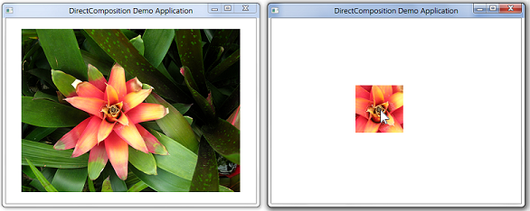

# How to clip with a rectangle clip object

> [!NOTE]
> For apps on Windows 10, we recommend using Windows.UI.Composition APIs instead of DirectComposition. For more info, see [Modernize your desktop app using the Visual layer](/windows/uwp/composition/visual-layer-in-desktop-apps).

This topic demonstrates how to use a rectangle clip object to clip a visual or visual tree.

The example in this topic defines a rectangular clip that is centered at the mouse location, and applies the clip to a visual that is centered in the client area of the composition target window. This screen shot shows the result of applying the rectangle clip object to the visual.



## What you need to know

### Technologies

-   [DirectComposition](directcomposition-portal.md)
-   [Direct3D 11 Graphics](/windows/desktop/direct3d11/atoc-dx-graphics-direct3d-11)
-   [DirectX Graphics Infrastructure (DXGI)](/windows/desktop/direct3ddxgi/dx-graphics-dxgi)

### Prerequisites

-   C/C++
-   Microsoft Win32
-   Component Object Model (COM)

## Instructions

### Step 1: Initialize DirectComposition objects

1.  Create the device object and the composition target object.
2.  Create a visual, set its content, and add it to the visual tree.

For more information, see [How to initialize DirectComposition](initialize-directcomposition.md).

### Step 2: Create the rectangle clip object

Use the [**IDCompositionDevice::CreateRectangleClip**](/windows/win32/api/dcomp/nf-dcomp-idcompositiondevice-createrectangleclip) method to create an instance of the rectangle clip object.


```C++
    HRESULT hr = S_OK;
    
    // Create the rectangle clip object.
    if (m_pClip == NULL)
    {
        hr = m_pDevice->CreateRectangleClip(&m_pClip);
    }
```


### Step 3: Set the properties of the rectangle clip object

Call the methods of the rectangle clip object's [**IDCompositionRectangleClip**](/windows/win32/api/dcomp/nn-dcomp-idcompositionrectangleclip) interface to set the properties of the clip rectangle.

The following example defines a clip rectangle that is centered around the current mouse location. The `m_offsetX` and `m_offsetY` member variables contain the values of the OffsetX and OffsetY properties of the visual.


```C++
    if (SUCCEEDED(hr))
    {
        // Get the location of the mouse.
        POINT ptMouse = { };
        GetCursorPos(&ptMouse);
        ScreenToClient(m_hwnd, &ptMouse);

        // Create a 100-by-100 pixel rectangular clip that is 
        // centered at the mouse location, and is mapped to
        // the rectangle of the visual.
        m_pClip->SetLeft((ptMouse.x - m_offsetX) - 50.f);
        m_pClip->SetTop((ptMouse.y - m_offsetY) - 50.f);
        m_pClip->SetRight((ptMouse.x - m_offsetX) + 50.f);
        m_pClip->SetBottom((ptMouse.y - m_offsetY) + 50.f);
    }
```


Note that the [**IDCompositionRectangleClip**](/windows/win32/api/dcomp/nn-dcomp-idcompositionrectangleclip) interface includes the following methods for defining a clip rectangle that has rounded corners:

-   [**SetTopLeftRadiusX**](/windows/win32/api/dcomp/nf-dcomp-idcompositionrectangleclip-settopleftradiusx(float))
-   [**SetTopLeftRadiusY**](/windows/win32/api/dcomp/nf-dcomp-idcompositionrectangleclip-settopleftradiusy(float))
-   [**SetTopRightRadiusX**](/windows/win32/api/dcomp/nf-dcomp-idcompositionrectangleclip-settoprightradiusx(float))
-   [**SetTopRightRadiusY**](/windows/win32/api/dcomp/nf-dcomp-idcompositionrectangleclip-settoprightradiusy(float))

### Step 4: Set the Clip property of the visual

Use the [**IDCompositionVisual::SetClip**](/windows/win32/api/dcomp/nf-dcomp-idcompositionvisual-setclip(idcompositionclip)) method to associate the Clip property of the visual with the rectangle clip object.


```C++
    if (SUCCEEDED(hr))
    {
        // Set the rectangle clip object as the Clip property 
        // of the visual.
        hr = m_pVisual->SetClip(m_pClip);
    }
```


### Step 5: Commit the composition

Call the [**IDCompositionDevice::Commit**](/windows/win32/api/dcomp/nf-dcomp-idcompositiondevice-commit) method to commit the batch of commands to Microsoft DirectComposition for processing. The result of applying the clip rectangle appears in the target window.


```C++
    if (SUCCEEDED(hr))
    {
        // Commit the visual to be composed and displayed.
        hr = m_pDevice->Commit();  
    }
```


### Step 6: Free the DirectComposition objects

Be sure to free the rectangle clip object when you no longer need it, as well as the device object, the composition target object, and any visual objects. The following example calls the application-defined [**SafeRelease**](/windows/desktop/medfound/saferelease) macro to free the DirectComposition objects.


```C++
    SafeRelease(&m_pClip);
    SafeRelease(&m_pDevice);
    SafeRelease(&m_pD3D11Device);
    SafeRelease(&m_pCompTarget);
    SafeRelease(&m_pVisual);
    SafeRelease(&m_pSurface);
```


## Related topics

<dl> <dt>

[Clipping](clipping.md)
</dt> </dl>

 

 