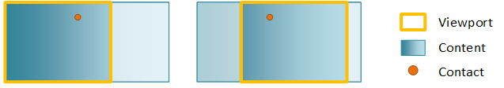

# Direct Manipulation

The Direct Manipulation APIs let you create great pan, zoom, and drag user experiences. To do this, it processes touch input on a region or object, generates output transforms, and applies the transforms to UI elements. You can use Direct Manipulation to optimize responsiveness and reduce latency through off-thread input processing, optional off-thread input hit testing, and input/output prediction.

Any application that uses Direct Manipulation to process touch interactions displays the fluid Windows 8 animations and interaction feedback behaviors that conform to the [Guidelines for common user interactions](/windows/uwp/design/input/).

## Developer Audience

The Direct Manipulation API is for experienced developers who know C/C++, have a solid understanding of the [Component Object Model (COM)](../com/component-object-model--com--portal.md), and are familiar with Windows programming concepts.

## Run-time requirements

Direct Manipulation was introduced in Windows 8. It is included in both 32-bit and 64-bit versions.

## Why use DirectManipulation

### Handles interactions in a straightforward and consistent manner

Direct Manipulation works by pre-declaring the behaviors and interactions for a region or object. For example, a web page is often configured for pan and zoom. At runtime, input is then associated with this region/object through a simple API call. From this point forward Direct Manipulation does all the heavy lifting of processing the input, applying constraints and personality, and generating the output transforms.

### Build responsive touch applications

To optimize responsiveness and minimize latency, Direct Manipulation processing occurs on a separate, independent thread from the UI thread. As a result, output transforms can run in parallel to activity on the UI thread. The UI thread activity may include application logic, rendering, layout, and anything else that consumes cycles on the processor.

### Implementation flexibility

The interfaces included with Direct Manipulation provide comprehensive support for input handling, interaction recognition, feedback notifications, and UI updates. The interfaces also incorporate system services such as [DirectComposition](../directcomp/directcomposition-portal.md).

## Basic concepts

The most basic Direct Manipulation implementation consists of a *viewport*, *content*, and *interactions*. The *viewport* is a region that is able to receive and process input from user interactions. It is also the region of the content that is visible to the end-user. The *content* is the actual object that end-users can see and is what moves or scales in response to a user interaction. The primary user *interactions* (also known as *manipulations*) supported by Direct Manipulation are panning and zooming. These interactions apply a translate or scale transform to the content within the viewport, respectively. Multiple viewports (each with their own content) can be configured in a single window to create a rich UI experience.

This figure shows a basic Direct Manipulation implementation before and after panning.

During initialization of Direct Manipulation a **DCompDirectManipulationCompositor** object is instantiated and is associated with Direct Manipulation. This object is a wrapper around [DirectComposition](../directcomp/directcomposition-portal.md), which is the system compositor. The object is responsible for applying the output transforms and driving visual updates.

A contact represents a touch point identified by the **pointerId** provided in the [WM/_POINTERDOWN](../inputmsg/wm-pointerdown.md) message. When a **WM\_POINTERDOWN** message is received, the application calls [**SetContact**](/windows/win32/api/DirectManipulation/nf-directmanipulation-idirectmanipulationviewport-setcontact). The application notifies Direct Manipulationabout the contacts that should be handled and the viewport(s) that should react to those contacts. Keyboard and mouse input have special **pointerId** values so they can be handled appropriately by Direct Manipulation.

In our basic case above, when [**SetContact**](/windows/win32/api/DirectManipulation/nf-directmanipulation-idirectmanipulationviewport-setcontact) is called a few things happen:

- When the user performs a pan, a [WM/_POINTERCAPTURECHANGED](../inputmsg/wm-pointercapturechanged.md) message is sent to the application to notify that the contact has been consumed by Direct Manipulation.
- When the user moves the moves, the viewport fires update events which are used by the [DirectComposition](../directcomp/directcomposition-portal.md) wrapper to drive visual updates to the screen. To a user panning in a viewport, the content will appear to move smoothly under the contact.
- When the user lifts the contact, the user sees the content continue to move as it transitions into an inertia animation, gradually decelerating until it reaches its final resting place.

## Processing keyboard and mouse input

Direct Manipulation allows keyboard and mouse messages to be forwarded manually from the application UI thread via the [**ProcessInput**](/windows/win32/api/DirectManipulation/nf-directmanipulation-idirectmanipulationmanager-processinput) API such that they can be handled appropriately by Direct Manipulation.

## DirectManipulation and the HWND

Direct Manipulation is associated with a Win32 HWND in order to receive and process pointer input messages for that window. As Direct Manipulation computes output values, it makes asynchronous callbacks to the Direct Manipulation [Component Object Model (COM)](../com/component-object-model--com--portal.md) objects that are implemented in the application. These callbacks inform the application about the transform that was applied to the objects. Direct Manipulation is activated on the specified HWND by calling [**Activate**](/windows/win32/api/DirectManipulation/nf-directmanipulation-idirectmanipulationmanager-activate).

## Supporting documentation

- [Viewports and content](directmanipulation-viewports-and-content.md)
- [Using multiple viewports in DirectManipulation](directmanipulation-multiple-vieports.md)
- [Processing input with DirectManipulation](directmanipulation-processing-input-with-directmanipulation.md)
- [Composition engine](directmanipulation-composition-engine.md)
- [Direct Manipulation Reference](direct-manipulation-reference.md)

- [BUILD 2013: WCL-022: Make your desktop app great with touch, mouse, and pen](https://channel9.msdn.com/Events/Build/2013/4-022)
- [Process touch input with Direct Manipulation sample](https://github.com/microsoft/Windows-classic-samples/tree/1d363ff4bd17d8e20415b92e2ee989d615cc0d91/Samples/TouchInputDirectManipulation)
