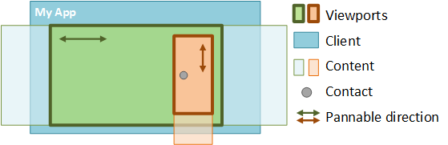
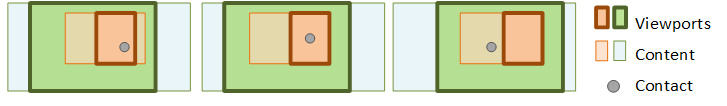

# Using multiple viewports in DirectManipulation

When using multiple viewports, *Hit testing*determines which viewport(s) are affected by user input by taking the screen location of a contact and determining which viewport rectangle the contact hits.

A common scenario in [Direct Manipulation](direct-manipulation-portal.md) is to place one viewport inside another, also known as *nesting viewports*. If the contact hits more than one viewport, the order of  [**SetContact**](/windows/win32/api/DirectManipulation/nf-directmanipulation-idirectmanipulationviewport-setcontact) calls by the window's [*WndProc*](/previous-versions/windows/desktop/legacy/ms644975(v=vs.85)) determines the parent-child relationship of the nested viewports.

Rule: The child element should call [**SetContact**](/windows/win32/api/DirectManipulation/nf-directmanipulation-idirectmanipulationviewport-setcontact)before calling the parent.

A contact comes down in a viewport. [**SetContact**](/windows/win32/api/DirectManipulation/nf-directmanipulation-idirectmanipulationviewport-setcontact) should first be called on the orange (child) viewport and then the green (parent) viewport to establish the correct hierarchy.

## Targeting the correct viewport

A contact can be associated with any number of viewports and each contact can be assigned to a different set of viewports.

Each viewport can be configured to support specific interactions, as required.

Based on these settings, [Direct Manipulation](direct-manipulation-portal.md) identifies which viewport handles the input. The child-most viewport in the hit testing hierarchy has the first chance to handle the input. However, both chaining and parent promotion can change which viewport handles the input.

## Chaining

When the end of the content is reached during a manipulation, [Direct Manipulation](direct-manipulation-portal.md) applies a boundary effect to indicate that the content can go no further. However, if a child viewport is *chained* to a parent viewport, this effect is suppressed. Instead, the closest ancestor viewport in the hit testing hierarchy that supports the manipulation, handles the input. If the direction of the manipulation is reversed such that the ancestor returns to the point where chaining was triggered, the manipulation "unchains" and control transfers back to the child viewport.

When the user pans the child viewport all the way to the edge of the content, the manipulation "chains" to the parent viewport, and the user begins panning the parent content instead.

> [!Note]  
> The X and Y axes chain independently of one another, so if a diagonal pan hits the x boundary before the y boundary, the manipulation moves the parent in the x direction while continuing to move the child in the y direction. To enable or disable chaining, call the [**SetChaining**](/windows/win32/api/DirectManipulation/nf-directmanipulation-idirectmanipulationviewport-setchaining) API on the child viewport.

### Rails

Specifying rails in a viewport’s configuration affects the way input is chained from the viewport. Specifically, input cannot chain from a railed child viewport to its parent in the “unrailed” panning mode of rails. To chain input when rails are set, the user must have panned vertically or horizontally and be locked to the rails.

### Zooming

If a child viewport is nested inside a parent, and both are configured for zoom, a zoom manipulation can chain from child to parent. However, if the manipulation continues, it works only on the parent and cannot “unchain” to the child. If the user chains a zoom from child to parent, [Direct Manipulation](direct-manipulation-portal.md) suspends the child until all contacts associated with the manipulation are removed from the screen. At this point, the child is released from suspension and the user can pan the child viewport.

## Gesture targeting: Parent promotion

*Gesture targeting* is the process by which [Direct Manipulation](direct-manipulation-portal.md) groups contacts together and determines which viewport processes the input. *Parent promotion* refers to cases where the input is transferred from the child to the parent. For example, when a user puts down two contacts and pinches within a child viewport configured only for scrolling, the input is promoted to the parent so that zooming occurs. Parent promotion occurs regardless of whether chaining is enabled on the child viewport.

Unlike chaining, parent promotion is not reversed. The parent viewport continues to process the interaction input until all contacts are lifted (child viewports stop processing the input).
