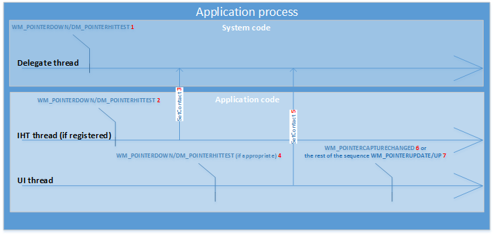

# Processing input with DirectManipulation

This section provides an overview of the [Direct Manipulation](direct-manipulation-portal.md) threading model, how window messages are processed by Direct Manipulation, and how the state of a viewport changes as input is mapped to output motions.

- [Input flow](#input-flow)
- [Remarks](#remarks)

[Direct Manipulation](direct-manipulation-portal.md) uses two threads to coordinate asynchronous operations:

*UI thread* - the thread that owns the **HWND** associated with input. This thread owns initialization of [Direct Manipulation](direct-manipulation-portal.md). Mouse and keyboard input processing also happens on the UI thread.

*Delegate thread* - the thread created and owned by [Direct Manipulation](direct-manipulation-portal.md). Touch input processing happens on the delegate thread.

## Input flow

In a typical configuration where hit testing is done on the UI thread, window messages are processed by [Direct Manipulation](direct-manipulation-portal.md) in the following order:

For a viewport at rest:

1. A series of window messages reach the delegate thread.
2. [WM_POINTERDOWN](../inputmsg/wm-pointerdown.md) and [DM_POINTERHITTEST](../inputmsg/dm-pointerhittest.md) messages are sent by the delegate thread to the Independent Hit Test (IHT) thread.
3. If [**SetContact**](/windows/win32/api/DirectManipulation/nf-directmanipulation-idirectmanipulationviewport-setcontact) is called from the IHT thread, messages might get sent to the UI thread by the delegate thread, depending on the value of [**DIRECTMANIPULATION\_HITTEST\_TYPE**](/windows/win32/api/directmanipulation/ne-directmanipulation-directmanipulation_hittest_type) when [**RegisterHitTestTarget**](/windows/win32/api/DirectManipulation/nf-directmanipulation-idirectmanipulationmanager-registerhittesttarget) was called.
4. If [**SetContact**](/windows/win32/api/DirectManipulation/nf-directmanipulation-idirectmanipulationviewport-setcontact) is not called from the IHT thread, messages are always sent by the delegate thread to the UI thread.
5. The client can call [**SetContact**](/windows/win32/api/DirectManipulation/nf-directmanipulation-idirectmanipulationviewport-setcontact) from the UI thread to let [Direct Manipulation](direct-manipulation-portal.md) detect a manipulation.
6. If a manipulation is detected, [Direct Manipulation](direct-manipulation-portal.md) sends a [WM/_POINTERCAPTURECHANGED](../inputmsg/wm-pointercapturechanged.md) message to notify the client that the input is being handled by Direct Manipulation. The viewport status is set to **RUNNING** and the output transform will be updated.
7. If an interaction other than a manipulation is detected, [Direct Manipulation](direct-manipulation-portal.md) sends remaining messages to the UI thread.

For a viewport in motion (with a status of RUNNING or INERTIA), the window message reaches the delegate thread first, where [Direct Manipulation](direct-manipulation-portal.md) hit tests against all running viewports. Direct Manipulation automatically assigns the contact to the appropriate viewports identified by hit testing. The viewport status is RUNNING and the output transform will be updated.

In some cases, an application UI thread may be too slow to respond to hit testing. A hit test thread may be used ([**RegisterHitTestTarget**](/windows/win32/api/DirectManipulation/nf-directmanipulation-idirectmanipulationmanager-registerhittesttarget)) to allow the client to move [WM/_POINTERDOWN](../inputmsg/wm-pointerdown.md) and [DM/_POINTERHITTEST](../inputmsg/dm-pointerhittest.md) messages to a specific thread to allow for hit testing.

## Remarks

Typically, [Direct Manipulation](direct-manipulation-portal.md) sends only [WM/_POINTERDOWN](../inputmsg/wm-pointerdown.md) and [DM/_POINTERHITTEST](../inputmsg/dm-pointerhittest.md) messages to the UI thread, withholding later messages while waiting for a response from the client. If the client calls [**SetContact**](/windows/win32/api/DirectManipulation/nf-directmanipulation-idirectmanipulationviewport-setcontact), the only messages the UI thread receives when a manipulation is detected are [WM/_POINTERDOWN](../inputmsg/wm-pointerdown.md) and [DM/_POINTERHITTEST](../inputmsg/dm-pointerhittest.md), and [WM/_POINTERCAPTURECHANGED message](../inputmsg/wm-pointercapturechanged.md).

The client might not call [**SetContact**](/windows/win32/api/DirectManipulation/nf-directmanipulation-idirectmanipulationviewport-setcontact) when processing [WM/_POINTERDOWN](../inputmsg/wm-pointerdown.md) and [DM/_POINTERHITTEST](../inputmsg/dm-pointerhittest.md) messages. In this case, [Direct Manipulation](direct-manipulation-portal.md) sends all messages to the UI thread without analyzing the messages to see if there is a manipulation. The client can then choose any point to call **SetContact** and have Direct Manipulation start detecting manipulations, and send [WM/_POINTERCAPTURECHANGED message](../inputmsg/wm-pointercapturechanged.md) messages when one is detected.

**Windows 10 and later:** You can decide which manipulations you want to handle by calling [**DeferContact**](/windows/win32/api/DirectManipulation/nf-directmanipulation-idirectmanipulationdefercontactservice-defercontact) before calling [**SetContact**](/windows/win32/api/DirectManipulation/nf-directmanipulation-idirectmanipulationviewport-setcontact) on a [WM/_POINTERDOWN](../inputmsg/wm-pointerdown.md) or [DM/_POINTERHITTEST](../inputmsg/dm-pointerhittest.md) message. **DeferContact** ensures all subsequent messages are sent to the UI thread for the specified period of time.
