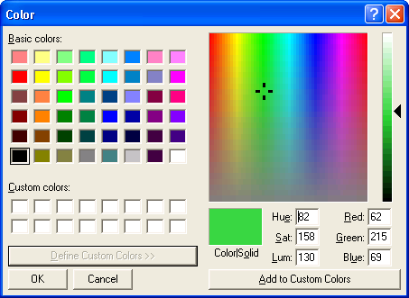

# Color Dialog Box

Displays a modal dialog box that allows the user to choose a specific color value. The user can choose a color from either a set of basic or custom color palettes. Alternatively, the user can generate a color value by modifying the RGB or hue, saturation, luminosity (HSL) color values of the dialog box user interface. The **Color** dialog box returns the RGB value of the color selected by the user.

You create and display a **Color** dialog box by initializing a [**CHOOSECOLOR**](/windows/win32/api/commdlg/ns-commdlg-choosecolora-r1) structure and passing the structure to the [**ChooseColor**](/previous-versions/windows/desktop/legacy/ms646912(v=vs.85)) function. By setting different parameter values for the **CHOOSECOLOR** structure, you can affect how the Color dialog box appears. For example, you can display either a full or partial user interface version of the dialog box. The following illustration shows the full user interface version of the **Color** dialog box.

If the user clicks the **OK** button, [**ChooseColor**](/previous-versions/windows/desktop/legacy/ms646912(v=vs.85)) returns **TRUE**. The **rgbResult** member of the [**CHOOSECOLOR**](/windows/win32/api/commdlg/ns-commdlg-choosecolora-r1) structure contains the RGB color value of the color selected by the user. The RGB color value specifies the intensities of the individual red, green, and blue colors that make up the selected color. The individual values range from 0 through 255. Use the [**GetRValue**](/windows/desktop/api/wingdi/nf-wingdi-getrvalue), [**GetGValue**](/windows/desktop/api/wingdi/nf-wingdi-getgvalue), and [**GetBValue**](/windows/desktop/api/wingdi/nf-wingdi-getbvalue) macros to extract individual colors from an RGB color value.

If the user cancels the **Color** dialog box or an error occurs, [**ChooseColor**](/previous-versions/windows/desktop/legacy/ms646912(v=vs.85)) returns **FALSE** and the **rgbResult** member is not defined. To determine the cause of the error, call the [**CommDlgExtendedError**](/windows/desktop/api/Commdlg/nf-commdlg-commdlgextendederror) function to retrieve the extended error value.

The following subjects are covered in this section

-   [Full and Partial Color Dialog Boxes](#full-and-partial-color-dialog-boxes)
-   [Customizing the Color Dialog Box](#customizing-the-color-dialog-box)
    -   [To provide a custom template for the Color dialog box](#to-provide-a-custom-template-for-the-color-dialog-box)
    -   [To enable a hook procedure for the Color dialog box](#to-enable-a-hook-procedure-for-the-color-dialog-box)
-   [Color Models Used by the Color Dialog Box](#color-models-used-by-the-color-dialog-box)
    -   [RGB Color Model](#rgb-color-model)
    -   [HSL Color Model](#hsl-color-model)
    -   [Converting HSL Values to RGB Values](#converting-hsl-values-to-rgb-values)

## Full and Partial Color Dialog Boxes

The Color dialog box has a full version and a partial version of the user interface. The full version includes the basic controls and has additional controls that allow the user to create custom colors. The partial version has controls that display the basic and custom color palettes from which the user can select a color value.

The partial version of the Color dialog box includes a **Define Custom Colors** button. The user can click this button to display the full version. You can direct the Color dialog box to always display the full version by setting the **CC\_FULLOPEN** flag in the **Flags** member of the [**CHOOSECOLOR**](/windows/win32/api/commdlg/ns-commdlg-choosecolora-r1) structure. To prevent the user from creating custom colors, you can set the **CC\_PREVENTFULLOPEN** flag to disable the **Define Custom Colors** button.

The basic colors represent a selection of the colors available on the specified device. The actual number of colors displayed is determined by the display driver. For example, a VGA driver displays 48 colors, and a monochrome display driver displays only 16.

The custom colors are those that you specify or that the user creates. When you create a Color dialog box, you must use the **lpCustColors** member of the [**CHOOSECOLOR**](/windows/win32/api/commdlg/ns-commdlg-choosecolora-r1) structure to specify the initial values for the 16 custom colors. If the full version of the Color dialog box is open, the user can create a custom color by one the following methods:

-   Moving the cursor in the color spectrum control and the luminosity slide control
-   Typing RGB values in the **Red**, **Green**, and **Blue** edit controls
-   Typing HSL values in the **Hue**, **Sat**, and **Lum** edit controls

To add a new custom color to the custom colors display, the user can click the **Add to Custom Colors** button. This also causes the dialog box to copy the RGB value of the new color to the corresponding element in the array pointed to by the **lpCustColors** member. To preserve new custom colors between calls to [**ChooseColor**](/previous-versions/windows/desktop/legacy/ms646912(v=vs.85)), you should allocate static memory for the array. For more information about the RGB and HSL color models, see [Color Models Used by the Color Dialog Box](#color-models-used-by-the-color-dialog-box).

## Customizing the Color Dialog Box

To customize a Color dialog box, you can use any of the following methods:

-   Specify values in the [**CHOOSECOLOR**](/windows/win32/api/commdlg/ns-commdlg-choosecolora-r1) structure when you create the dialog box
-   Provide a custom template
-   Provide a hook procedure

You can modify the appearance and behavior of the Color dialog box by setting flags in the **Flags** member of the [**CHOOSECOLOR**](/windows/win32/api/commdlg/ns-commdlg-choosecolora-r1) structure. For example, you can set the **CC\_SOLIDCOLOR** flag to direct the dialog box to display only solid colors. To cause the dialog box to initially select a color other than black, set the **CC\_RGBINIT** flag and specify a color in the **rgbResult** member.

You can provide a custom template for the Color dialog box, for example, if you want to include additional controls that are unique to your application. The [**ChooseColor**](/previous-versions/windows/desktop/legacy/ms646912(v=vs.85)) function uses your custom template in place of the default template.

### To provide a custom template for the Color dialog box

1.  Create the custom template by modifying the default template specified in the Color.dlg file. The control identifiers used in the default Color dialog template are defined in the Color.dlg file.
2.  Use the [**CHOOSECOLOR**](/windows/win32/api/commdlg/ns-commdlg-choosecolora-r1) structure to enable the template as follows:
    -   If your custom template is a resource in an application or dynamic link library, set the **CC\_ENABLETEMPLATE** flag in the **Flags** member. Use the **hInstance** and **lpTemplateName** members of the structure to identify the module and resource name.

        -Or-

    -   If your custom template is already in memory, set the **CC\_ENABLETEMPLATEHANDLE** flag. Use the **hInstance** member to identify the memory object that contains the template.

You can provide a [**CCHookProc**](/windows/win32/api/commdlg/nc-commdlg-lpcchookproc) hook procedure for the Color dialog box. The hook procedure can process messages sent to the dialog box. It can also use registered messages to control the behavior of the dialog box. If you use a custom template to define additional controls, you must provide a hook procedure to process input for your controls.

### To enable a hook procedure for the Color dialog box

1.  Set the **CC\_ENABLEHOOK** flag in the **Flags** member of the [**CHOOSECOLOR**](/windows/win32/api/commdlg/ns-commdlg-choosecolora-r1) structure.
2.  Specify the address of the hook procedure in the **lpfnHook** member.

After processing its [**WM\_INITDIALOG**](wm-initdialog.md) message, the dialog box procedure sends a **WM\_INITDIALOG** message to the hook procedure. The *lParam* parameter of this message is a pointer to the [**CHOOSECOLOR**](/windows/win32/api/commdlg/ns-commdlg-choosecolora-r1) structure used to initialize the dialog box.

The dialog box sends the [**COLOROKSTRING**](colorokstring.md) registered message to the hook procedure when the user clicks the **OK** button. The hook procedure can reject the selected color and force the dialog box to remain open by returning zero when it receives this message. The hook procedure can force the dialog box to select a particular color by sending the [**SETRGBSTRING**](setrgbstring.md) registered message to the dialog box. To use these registered messages, you must pass the **COLOROKSTRING** and **SETRGBSTRING** constants to the [**RegisterWindowMessage**](/windows/desktop/api/winuser/nf-winuser-registerwindowmessagea) function to get a message identifier. You can then use the identifier to detect and process messages sent from the dialog box, or to send messages to the dialog box.

## Color Models Used by the Color Dialog Box

The custom colors extension of the Color dialog box allows the user to specify a color using RGB or HSL values. However, the [**CHOOSECOLOR**](/windows/win32/api/commdlg/ns-commdlg-choosecolora-r1) structure uses only RGB values to report the colors created or selected by the user.

-   [RGB Color Model](#rgb-color-model)
-   [HSL Color Model](#hsl-color-model)
-   [Converting HSL Values to RGB Values](#converting-hsl-values-to-rgb-values)

### RGB Color Model

The RGB model is used to designate colors for displays and other devices that emit light. Valid red, green, and blue values range from 0 through 255, with 0 indicating minimum intensity and 255 indicating maximum intensity. The following illustration shows how the primary colors red, green, and blue can be combined to produce four additional colors. (For display devices, the color black results when the red, green, and blue values are set to 0. In display technology, black is the absence of all colors.)

The following table lists eight colors of the RGB model and their associated RGB values.

| Color   | RGB values    |
|---------|---------------|
| Red     | 255, 0, 0     |
| Green   | 0, 255, 0     |
| Blue    | 0, 0, 255     |
| Cyan    | 0, 255, 255   |
| Magenta | 255, 0, 255   |
| Yellow  | 255, 255, 0   |
| White   | 255, 255, 255 |
| Black   | 0, 0, 0       |

 

The system stores internal colors as 32-bit RGB values that have the following hexadecimal form: 0x00bbggrr.

The low-order byte contains a value for the relative intensity of red; the second byte contains a value for green; and the third byte contains a value for blue. The high-order byte must be zero.

You can use the [**RGB**](/windows/desktop/api/wingdi/nf-wingdi-rgb) macro to get an RGB value based on specified intensities for the red, green, and blue components. Use the [**GetRValue**](/windows/desktop/api/wingdi/nf-wingdi-getrvalue), [**GetBValue**](/windows/desktop/api/wingdi/nf-wingdi-getbvalue), and [**GetGValue**](/windows/desktop/api/wingdi/nf-wingdi-getgvalue) macros to extract individual colors from an RGB color value.

### HSL Color Model

The Color dialog box provides controls for specifying HSL values. The following illustration shows the color spectrum control and the luminosity slide control that appear in the Color dialog box. The illustration also shows the ranges of values the user can specify with these controls.

In the Color dialog box, the saturation and luminosity values must be in the range 0 through 240, and the hue value must be in the range 0 through 239.

### Converting HSL Values to RGB Values

The dialog box procedure provided in Comdlg32.dll for the Color dialog box contains code that converts HSL values to the corresponding RGB values. The following table lists eight colors of the RGB model and their associated HSL and RGB values.

| Color   | HSL values      | RGB values      |
|---------|-----------------|-----------------|
| Red     | (0, 240, 120)   | (255, 0, 0)     |
| Yellow  | (40, 240, 120)  | (255, 255, 0)   |
| Green   | (80, 240, 120)  | (0, 255, 0)     |
| Cyan    | (120, 240, 120) | (0, 255, 255)   |
| Blue    | (160, 240, 120) | (0, 0, 255)     |
| Magenta | (200, 240, 120) | (255, 0, 255)   |
| White   | (0, 0, 240)     | (255, 255, 255) |
| Black   | (0, 0, 0)       | (0, 0, 0)       |

 

 

 
