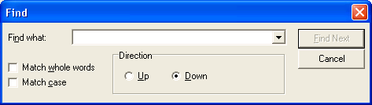
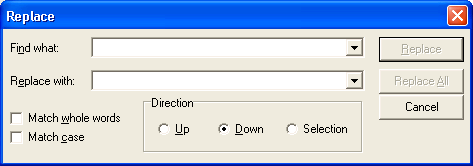

# Find and Replace Dialog Boxes

Displays a modeless dialog box that allows the user to specify a string to search for, as well as options to use when searching for text in a document. The **Replace** dialog box lets the user specify a string to search for and a replacement string, as well as options to control the operation.

You create and display a **Find** dialog box by initializing a [**FINDREPLACE**](/windows/win32/api/commdlg/ns-commdlg-findreplacea) structure and passing the structure to the [**FindText**](/windows/desktop/api/Commdlg/nf-commdlg-findtexta) function. The following illustration shows a typical **Find** dialog box.



You create and display a **Replace** dialog box by initializing a [**FINDREPLACE**](/windows/win32/api/commdlg/ns-commdlg-findreplacea) structure and passing the structure to the [**ReplaceText**](/windows/desktop/api/Commdlg/nf-commdlg-replacetexta) function. The following illustration shows a typical **Replace** dialog box.



Unlike other common dialog boxes, the **Find** and **Replace** dialog boxes are modeless. A modeless dialog box allows the user to switch between the dialog box and the window that created it. This is useful for letting the user search for a string, switch to the application window to work on the string, and switch back to the dialog box to search for another string without repeating the command needed to open the dialog box.

If the [**FindText**](/windows/desktop/api/Commdlg/nf-commdlg-findtexta) or [**ReplaceText**](/windows/desktop/api/Commdlg/nf-commdlg-replacetexta) function successfully creates the dialog box, it returns a handle to the dialog box. You can use this handle to move and communicate with the dialog box. If the function cannot create the dialog box, it returns **NULL**. You can determine the cause of an error by calling the [**CommDlgExtendedError**](/windows/desktop/api/Commdlg/nf-commdlg-commdlgextendederror) function to retrieve the extended error value.

This section discusses the following topics.

-   [The FINDMSGSTRING Registered Message](#the-findmsgstring-registered-message)
-   [Customizing the Find or Replace Dialog Box](#customizing-the-find-or-replace-dialog-box)

## The FINDMSGSTRING Registered Message

Before creating a **Find** or **Replace** dialog box, you must call the [**RegisterWindowMessage**](/windows/desktop/api/winuser/nf-winuser-registerwindowmessagea) function to get a message identifier for the [**FINDMSGSTRING**](findmsgstring.md) registered message. You can then use the identifier to detect and process messages sent from the dialog box. When the user clicks the **Find Next**, **Replace**, or **Replace All** button in a dialog box, the dialog box procedure sends a **FINDMSGSTRING** message to the window procedure of the owner window. When you create the dialog box, the **hwndOwner** member of the [**FINDREPLACE**](/windows/win32/api/commdlg/ns-commdlg-findreplacea) structure identifies the owner window.

The *lParam* parameter of a [**FINDMSGSTRING**](findmsgstring.md) message is a pointer to the [**FINDREPLACE**](/windows/win32/api/commdlg/ns-commdlg-findreplacea) structure that you specified when you created the dialog box. Before sending the message, the dialog box sets the members of this structure with the latest user input, including the string to search for, the replacement string (if any), and options for the find-and-replace operation.

In a [**FINDMSGSTRING**](findmsgstring.md) message, the **Flags** member of the [**FINDREPLACE**](/windows/win32/api/commdlg/ns-commdlg-findreplacea) structure includes one of the following flags to indicate the event that caused the message.


| Flag               | Meaning                                                                                                                                                                                                     |
|--------------------|-------------------------------------------------------------------------------------------------------------------------------------------------------------------------------------------------------------|
| **FR\_DIALOGTERM** | The dialog box is closing. After the owner window processes this message, a handle to the dialog box is no longer valid.                                                                                    |
| **FR\_FINDNEXT**   | The user clicked the **Find Next** button in a **Find** or **Replace** dialog box. The **lpstrFindWhat** member specifies the string to search for.                                                         |
| **FR\_REPLACE**    | The user clicked the **Replace** button in a **Replace** dialog box. The **lpstrFindWhat** member specifies the string to replace and the **lpstrReplaceWith** member specifies the replacement string.     |
| **FR\_REPLACEALL** | The user clicked the **Replace All** button in a **Replace** dialog box. The **lpstrFindWhat** member specifies the string to replace and the **lpstrReplaceWith** member specifies the replacement string. |


 

For a **Find Next** or **Replace All** message, the **Flags** member can include any combination of the following flags to indicate the search options.


| Flag              | Meaning                                                                                                                                                                                                                                                                                          |
|-------------------|--------------------------------------------------------------------------------------------------------------------------------------------------------------------------------------------------------------------------------------------------------------------------------------------------|
| **FR\_DOWN**      | If set, the **Down** button of the direction radio buttons is selected, indicating that user wants to search from the current location to the end of the document. If **FR\_DOWN** is not set, the **Up** button is selected so the user wants to search to the beginning of the document.       |
| **FR\_MATCHCASE** | If set, the **Match Case** check box is selected, indicating that the user wants the search to be case sensitive. If **FR\_MATCHCASE** is not set, the check box is unselected so that the search can be case insensitive.                                                                       |
| **FR\_WHOLEWORD** | If set, the **Match Whole Word Only** check box is selected, indicating that the user wants to search only for whole words that match the search string. If **FR\_WHOLEWORD** is not set, the check box is unselected so you should also search for word fragments that match the search string. |


 

## Customizing the Find or Replace Dialog Box

To customize a **Find** or **Replace** dialog box, you can use any of the following methods:

-   Specify values in the [**FINDREPLACE**](/windows/win32/api/commdlg/ns-commdlg-findreplacea) structure when you create the dialog box
-   Provide a custom template
-   Provide a hook procedure

When you create a **Find** or **Replace** dialog box, you can set flags in the **Flags** member of the [**FINDREPLACE**](/windows/win32/api/commdlg/ns-commdlg-findreplacea) structure to hide or disable any of the search option controls. For example, you can set the FR\_NOMATCHCASE flag to disable the **Match Case** check box or set the FR\_HIDEMATCHCASE flag to hide it.

You can provide a custom template for a **Find** or **Replace** dialog box, for example, if you want to include additional controls that are unique to your application. The [**FindText**](/windows/desktop/api/Commdlg/nf-commdlg-findtexta) and [**ReplaceText**](/windows/desktop/api/Commdlg/nf-commdlg-replacetexta) functions use your custom template in place of the default template.

**To provide a custom template for a Find or Replace dialog box**

1.  Create the custom template by modifying the default template specified in the Findtext.dlg file. The control identifiers used in the default **Find** or **Replace** dialog template are defined in the Dlgs.h file.
2.  Use the [**FINDREPLACE**](/windows/win32/api/commdlg/ns-commdlg-findreplacea) structure to enable the template as follows:
    -   -   If your custom template is a resource in an application or dynamic-link library, set the FR\_ENABLETEMPLATE flag in the **Flags** member. Use the **hInstance** and **lpTemplateName** members of the structure to identify the module and resource name.

            -Or-

        -   If your custom template is already in memory, set the FR\_ENABLETEMPLATEHANDLE flag. Use the **hInstance** member to identify the memory object that contains the template.

You can provide an [**FRHookProc**](/windows/win32/api/commdlg/nc-commdlg-lpfrhookproc) hook procedure for a **Find** or **Replace** dialog box. The hook procedure can process messages sent to the dialog box. If you use a custom template to define additional controls, you must provide a hook procedure to process input for your controls.

**To enable a hook procedure for a Find or Replace dialog box**

1.  Set the FR\_ENABLEHOOK flag in the **Flags** member of the [**FINDREPLACE**](/windows/win32/api/commdlg/ns-commdlg-findreplacea) structure.
2.  Specify the address of the hook procedure in the **lpfnHook** member.

After processing its [**WM\_INITDIALOG**](wm-initdialog.md) message, the dialog box procedure sends a **WM\_INITDIALOG** message to the hook procedure. The *lParam* parameter of this message is a pointer to the [**FINDREPLACE**](/windows/win32/api/commdlg/ns-commdlg-findreplacea) structure used to initialize the dialog box.

If the hook procedure returns **FALSE** in response to the [**WM\_INITDIALOG**](wm-initdialog.md) message, the dialog box will not be shown unless the hook procedure displays it. To do this, first perform any other paint operations, and then call the [**ShowWindow**](/windows/desktop/api/winuser/nf-winuser-showwindow) and [**UpdateWindow**](/windows/desktop/api/winuser/nf-winuser-updatewindow) functions. The following code provides an example:


```
// We've returned FALSE in response to WM_INITDIALOG. 
// We've performed any other paint operations. 
// Now we display the dialog box. 
ShowWindow(hDlg, SW_SHOWNORMAL); 
UpdateWindow(hDlg); 
```


 

 