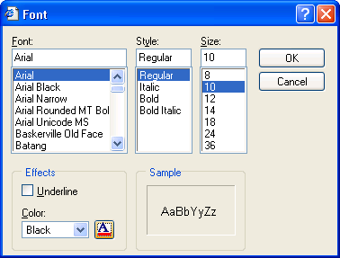
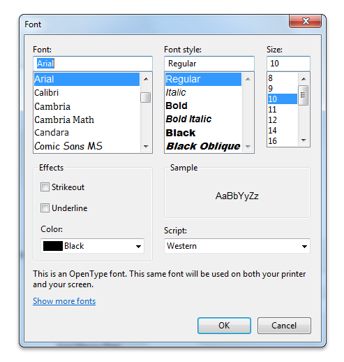
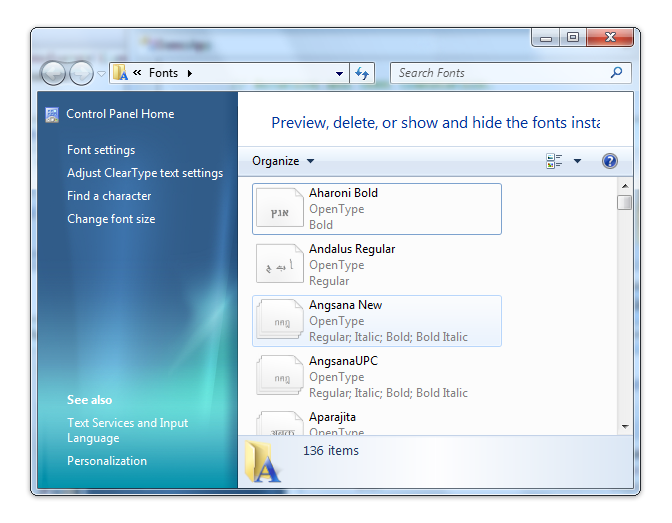

# Font Dialog Box

The **Font** dialog box lets the user choose attributes for a logical font, such as font family and associated font style, point size, effects (underline, strikeout, and text color), and a script (or character set).

You create and display a **Font** dialog box by initializing a [**CHOOSEFONT**](/windows/win32/api/commdlg/ns-commdlg-choosefonta) structure and passing the structure to the [**ChooseFont**](/windows/win32/api/commdlg/ns-commdlg-choosefonta) function.

The following screen shot shows a typical **Font** dialog box.

If the user clicks the **OK** button, the [**ChooseFont**](/windows/win32/api/commdlg/ns-commdlg-choosefonta) function returns **TRUE** and sets the information about the user's selection in the [**CHOOSEFONT**](/windows/win32/api/commdlg/ns-commdlg-choosefonta) structure.

If the user cancels the **Font** dialog box or an error occurs, [**ChooseFont**](/windows/win32/api/commdlg/ns-commdlg-choosefonta) returns **FALSE** and the contents of the [**LOGFONT**](/windows/win32/api/wingdi/ns-wingdi-logfonta) structure are not defined. You can determine the cause of an error by using the [**CommDlgExtendedError**](/windows/desktop/api/Commdlg/nf-commdlg-commdlgextendederror) function to retrieve the extended error value.

The following topics are discussed in this section.

-   [Font Dialog Box Initialization Flags](#font-dialog-box-initialization-flags)
-   [Customizing the Font Dialog Box on earlier versions of Windows](#customizing-the-font-dialog-box-on-earlier-versions-of-windows)
-   [Customizing the Font Dialog Box on Windows 7](#customizing-the-font-dialog-box-on-windows-7)

## Font Dialog Box Initialization Flags

Before calling [**ChooseFont**](/windows/win32/api/commdlg/ns-commdlg-choosefonta), the **Flags** member of the [**CHOOSEFONT**](/windows/win32/api/commdlg/ns-commdlg-choosefonta) structure must specify **CF\_SCREENFONTS**, **CF\_PRINTERFONTS**, or **CF\_BOTH**, to indicate whether the dialog box should list screen fonts, printer fonts, or both. If you specify **CF\_PRINTERFONTS** or **CF\_BOTH**, the **hDC** member of the **CHOOSEFONT** structure must specify a handle to a device context for the printer.

If the **CF\_PRINTERFONTS** or **CF\_BOTH** flag is set, the font type description label appears at the bottom of the **Font** dialog box.

Starting with Windows 7, the **CF\_PRINTERFONTS**, **CF\_SCREENFONTS**, **CF\_BOTH**, and **CF\_WYSIWYG** flags are no longer used by the [**ChooseFont**](/windows/win32/api/commdlg/ns-commdlg-choosefonta) function for font enumeration. They are obsolete in Windows 7. However, the **CF\_PRINTERFONTS** flag retains one function: to display the font type description label at the bottom of the **Font** dialog box.

You can use the **Flags** member to enable or disable some of the **Font** dialog box controls, and you can use the **Flags** member in conjunction with other [**CHOOSEFONT**](/windows/win32/api/commdlg/ns-commdlg-choosefonta) members to control the initial values of some controls.

**To display the controls that allow the user to select strikeout, underline, and color options:**

-   Set the **CF\_EFFECTS** flag. You can use the **rgbColors** member of the [**CHOOSEFONT**](/windows/win32/api/commdlg/ns-commdlg-choosefonta) structure to specify an initial font color.

**To specify the initial values for the Font, Font Style, Size, Strikeout, and Underline dialog box controls:**

1.  To specify the initial values for the Font, Font Style, Size, Strikeout, and Underline dialog box controls:
2.  Set the **CF\_INITTOLOGFONTSTRUCT** flag in the **Flags** member, along with members of the [**LOGFONT**](/windows/win32/api/wingdi/ns-wingdi-logfonta) structure that is pointed to by the **lpLogFont**, to specify the initial values for the font attributes.
3.  You can also use the **CF\_NOFACESEL**, **CF\_NOSTYLESEL**, and **CF\_NOSIZESEL** flags to prevent the **Font** dialog box from displaying initial values for the corresponding controls. This is useful when you are working with a selection of text that has more than one typeface, style, or point size. These values will also be set in **Flags** when [**ChooseFont**](/windows/win32/api/commdlg/ns-commdlg-choosefonta) returns, if the user did not select a corresponding value.

**To initialize the Font Style control to a specified style name**

-   Set the **CF\_USESTYLE** flag and use the **lpszStyle** member to specify the style name.

> [!Note]  
> To globalize your application, specify the style by using the **lfWeight** and **lfItalic** members of the [**LOGFONT**](/windows/win32/api/wingdi/ns-wingdi-logfonta) structure that is pointed to by **lpLogFont**. The style name may change depending on the system user interface language.

 

**To display the Apply button**

-   Set the **CF\_APPLY** flag and provide a hook procedure to process [**WM\_COMMAND**](/windows/desktop/menurc/wm-command) messages for the **Apply** button. The hook procedure can send the [**WM\_CHOOSEFONT\_GETLOGFONT**](wm-choosefont-getlogfont.md) message to the dialog box to retrieve the address of the [**LOGFONT**](/windows/win32/api/wingdi/ns-wingdi-logfonta) structure that contains the current selections for the font.

**To display the Help button**

-   Set the **CF\_SHOWHELP** flag. The **hwndOwner** member must identify the window to receive the [**HELPMSGSTRING**](helpmsgstring.md) registered message when the user clicks the **Help** button.

**To restrict the fonts displayed in the dialog box**

-   Set any combination of the **CF\_TTONLY**, **CF\_FIXEDPITCHONLY**, **CF\_NOVECTORFONTS**, **CF\_NOVERTFONTS**, **CF\_SCALABLEONLY**, and **CF\_WYSIWYG** flags. You can also restrict the available styles that the dialog box displays for some fonts by using the **CF\_NOSIMULATIONS** value.

Starting with Windows 7, the list of fonts displayed in the dialog box is restricted based on the user's shown fonts. To remove the restriction, set the **CF\_INACTIVEFONTS** flag.

**To restrict the typeface names, styles, and point sizes that the user can specify**

1.  Set the **CF\_FORCEFONTEXIST** flag to restrict the user to specifying only valid typeface names, styles, and point sizes listed in the dialog box.
2.  Set the **CF\_LIMITSIZE** flag to restrict the user to specifying point sizes in the range specified by the **nSizeMin** and **nSizeMax** members.

**To restrict or disable the Scripts combo box**

-   Set the **CF\_NOSCRIPTSEL** flag to disable the **Scripts** combo box, or set the **CF\_SELECTSCRIPT** flag to restrict selections in the **Scripts** combo box to a specified character set.

## Customizing the Font Dialog Box on earlier versions of Windows

You can provide a custom template for the **Font** dialog box, for example, if you want to include additional controls that are unique to your application. The [**ChooseFont**](/windows/win32/api/commdlg/ns-commdlg-choosefonta) function uses your custom template in place of the default template.

**To provide a custom template for the Font dialog box**

1.  Create the custom template by modifying the default template specified in the Font.dlg file. The control identifiers used in the default Font dialog template are defined in the Dlgs.h file.
2.  Use the [**CHOOSEFONT**](/windows/win32/api/commdlg/ns-commdlg-choosefonta) structure to enable the template as follows:
    -   If your custom template is a resource in an application or dynamic link library, set the **CF\_ENABLETEMPLATE** flag in the **Flags** member. Use the **hInstance** and **lpTemplateName** members of the structure to identify the module and resource name.
    -   If your custom template is already in memory, set the **CF\_ENABLETEMPLATEHANDLE** flag. Use the **hInstance** member to identify the memory object that contains the template.

You can provide a [**CFHookProc**](/windows/win32/api/commdlg/nc-commdlg-lpcfhookproc) hook procedure for the **Font** dialog box. The hook procedure can process messages sent to the dialog box and send messages to the dialog box. If you use a custom template to define additional controls, you must provide a hook procedure to process input for your controls.

**To enable a hook procedure for the Font dialog box**

1.  Set the **CF\_ENABLEHOOK** flag in the **Flags** member of the [**CHOOSEFONT**](/windows/win32/api/commdlg/ns-commdlg-choosefonta) structure.
2.  Specify the address of the hook procedure in the **lpfnHook** member.

After processing the [**WM\_INITDIALOG**](wm-initdialog.md) message, the dialog box procedure sends a **WM\_INITDIALOG** message to the hook procedure. The *lParam* parameter of this message is a pointer to the [**CHOOSEFONT**](/windows/win32/api/commdlg/ns-commdlg-choosefonta) structure that is used to initialize the dialog box.

The hook procedure can send the [**WM\_CHOOSEFONT\_GETLOGFONT**](wm-choosefont-getlogfont.md), [**WM\_CHOOSEFONT\_SETLOGFONT**](wm-choosefont-setlogfont.md), and [**WM\_CHOOSEFONT\_SETFLAGS**](wm-choosefont-setflags.md) messages to the dialog box to get and set the current values and flags of the dialog box.

## Customizing the Font Dialog Box on Windows 7

The following screen shot shows a typical **Font** dialog box in Windows 7.

In earlier Windows versions, the font.dlg template file contains one default ChooseFont template. The font.dlg template file on Windows 7 contains two default templates: the default template from earlier Windows versions and the new Windows 7 ChooseFont template. Therefore, when you customize the **Font** dialog box on Windows 7, you must consider the following issues.

1.  Use the new template when you create custom templates for applications that run on Windows 7. This new template contains a link control that the user can click to launch the **Fonts Control Panel** window, as shown in the following screen shot.

    

2.  To use this link control, your calling application must use the COMCTL32.DLL version 6 or later. Otherwise, the [**ChooseFont**](/windows/win32/api/commdlg/ns-commdlg-choosefonta) function returns an error when it tries to create the link control in your custom template. To determine if this control is enabled, compile your calling application against COMCTL32.DLL version 6.0. For more information, see [Enabling Visual Styles with Common Controls](/previous-versions//ms649781(v=vs.85)).
3.  If your application uses COMCTL32.DLL version 5.0 or earlier, you must do the following when you create a custom template:

    -   Specify the control as a **PUSHBUTTON**. The control used to launch the **Fonts Control Panel** will appear as a button rather than as a link.
    -   Replace the following text in the font.dlg:

        `CONTROL         "<A>Show more fonts</A>", IDC_MANAGE_LINK, "SysLink", WS_TABSTOP, 7, 199, 227, 9`

        with the following text:

        `PUSHBUTTON      "S&how more fonts", IDC_MANAGE_LINK, 7, 199, 74, 14 , WS_TABSTOP`

    -   To ensure that your application uses a custom template, you must specify a custom template with the **CF\_ENABLETEMPLATE** flag, create a custom template based on the Windows 7 ChooseFont template, and then optionally enable a hook procedure.

        If you enable a hook procedure without creating a custom template, the default ChooseFont template for earlier Windows versions will be loaded.

> [!Note]  
> You must specify the **CONTROL** or **PUSHBUTTON** control type in your new template, depending on the version of COMMCTL.DLL that your application compiles against. Also note that Windows 7 specific features, such as WYSIWYG display of font lists and extended families, are not available when your applications run on earlier versions of the Windows operating system.

 

 

 