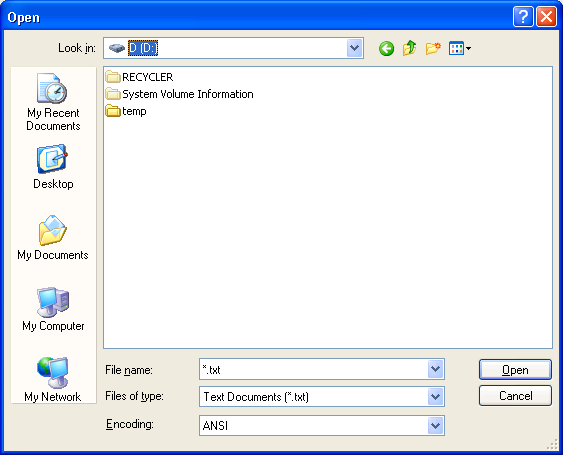
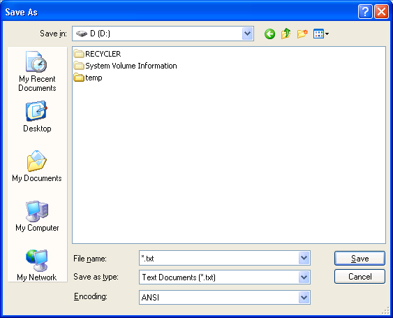

# Open and Save As dialog boxes

> [!NOTE]
> The [**GetOpenFileName**](/windows/desktop/api/Commdlg/nf-commdlg-getopenfilenamea) function is demonstrated in the [File is in use sample](https://github.com/microsoft/Windows-classic-samples/tree/master/Samples/Win7Samples/winui/shell/appplatform/fileisinuse).

\[Starting with Windows Vista, the **Open** and **Save As** common dialog boxes have been superseded by the [Common Item Dialog](../shell/common-file-dialog.md). We recommended that you use the Common Item Dialog API instead of these dialog boxes from the Common Dialog Box Library.\]

The **Open** dialog box lets the user specify the drive, directory, and the name of a file or set of files to open. You create and display an **Open** dialog box by initializing an [**OPENFILENAME**](/windows/win32/api/commdlg/ns-commdlg-openfilenamea) structure and passing the structure to the [**GetOpenFileName**](/windows/desktop/api/Commdlg/nf-commdlg-getopenfilenamea) function.

The **Save As** dialog box lets the user specify the drive, directory, and name of a file to save. You create and display a **Save As** dialog box by initializing an [**OPENFILENAME**](/windows/win32/api/commdlg/ns-commdlg-openfilenamea) structure and passing the structure to the [**GetSaveFileName**](/windows/desktop/api/Commdlg/nf-commdlg-getsavefilenamea) function.

Explorer-style **Open** and **Save As** dialog boxes provide user-interface features that are similar to the Windows Explorer. However, the system continues to support old-style **Open** and **Save As** dialog boxes for applications that must be consistent with the old-style user interface.

In addition to the difference in appearance, the Explorer-style and old-style dialog boxes differ in their use of custom templates and hook procedures for customizing the dialog boxes. However, the Explorer-style and old-style dialog boxes have the same behavior for most basic operations, such as specifying a file name filter, validating the user's input, and getting the file name specified by the user. For more information about the Explorer-style and old-style dialog boxes, see [Open and Save As Dialog Box Customization](#open-and-save-as-dialog-box-customization).

The following illustration shows a typical Explorer-style **Open** dialog box.



The following illustration shows a typical Explorer-style **Save As** dialog box.



If the user specifies a file name and clicks the **OK** button, [**GetOpenFileName**](/windows/desktop/api/Commdlg/nf-commdlg-getopenfilenamea) or [**GetSaveFileName**](/windows/desktop/api/Commdlg/nf-commdlg-getsavefilenamea) returns **TRUE**. The buffer pointed to by the **lpstrFile** member of the [**OPENFILENAME**](/windows/win32/api/commdlg/ns-commdlg-openfilenamea) structure contains the full path and file name specified by the user.

If the user cancels the **Open** or **Save As** dialog box or an error occurs, the function returns **FALSE**. To determine the cause of the error, call the [**CommDlgExtendedError**](/windows/desktop/api/Commdlg/nf-commdlg-commdlgextendederror) function to retrieve the extended error value. If the **lpstrFile** buffer is too small to receive the full name, **CommDlgExtendedError** returns **FNERR\_BUFFERTOOSMALL** and the first 2 bytes of the buffer pointed to by the **lpstrFile** member are set to an integer value specifying the size required to receive the full name.

The following topics are discussed in this section.

-   [File Names and Directories](#file-names-and-directories)
-   [Filters](#filters)
-   [File and Directory Validation](#file-and-directory-validation)
-   [Open and Save As Dialog Box Customization](#open-and-save-as-dialog-box-customization)
-   [Explorer-Style Hook Procedures](#explorer-style-hook-procedures)
-   [Explorer-Style Custom Templates](#explorer-style-custom-templates)
-   [Explorer-Style Control Identifiers](#explorer-style-control-identifiers)
-   [Customizing Old-Style Dialog Boxes](#customizing-old-style-dialog-boxes)

## File Names and Directories

The information in this section applies to both Explorer-style and old-style **Open** and **Save As** dialog boxes.

Before calling the [**GetOpenFileName**](/windows/desktop/api/Commdlg/nf-commdlg-getopenfilenamea) or [**GetSaveFileName**](/windows/desktop/api/Commdlg/nf-commdlg-getsavefilenamea) functions, the **lpstrFile** member of the [**OPENFILENAME**](/windows/win32/api/commdlg/ns-commdlg-openfilenamea) structure must point to the buffer to receive the file name. The **nMaxFile** member must specify the size, in characters, of the **lpstrFile** buffer. For an ANSI function this is the number of bytes, but for a Unicode function this is the number of characters.

If the user specifies a file name and clicks the **OK** button, the dialog box copies the selected drive, directory, and file name to the **lpstrFile** buffer. The function also sets the **nFileOffset** and **nFileExtension** members to the offsets, in characters, from the start of the buffer to the file name and to the file name extension, respectively.

To retrieve just the file name and extension, set the **lpstrFileTitle** member to point to a buffer and set the **nMaxFileTitle** member to the size, in characters, of the buffer. Alternatively, you can pass the **lpstrFile** buffer in a call to the [**GetFileTitle**](/windows/desktop/api/Commdlg/nf-commdlg-getfiletitlea) function to get the display name of the selected file. Note, however, that the file name that **GetFileTitle** returns includes an extension only if that is the user's preference for displaying file names.

The dialog box uses the current directory for the calling process as the initial directory from which to display files and directories. Use the [**GetCurrentDirectory**](/windows/desktop/api/winbase/nf-winbase-getcurrentdirectory) and [**SetCurrentDirectory**](/windows/desktop/api/winbase/nf-winbase-setcurrentdirectory) functions to get and change the current directory of a process. To specify a different initial directory without changing your current directory, use the **lpstrInitialDir** member to specify the name of a directory. The dialog box automatically changes your current directory when the user selects a different drive or directory. To prevent the dialog box from changing your current directory, set the **OFN\_NOCHANGEDIR** flag. This flag does not prevent the user from changing directories to find a file.

To specify a default file name extension, use the **lpstrDefExt** member. If the user specifies a file name that does not have an extension, the dialog box adds your default extension. If you specify a default extension and the user specifies a file name with a different extension, the dialog box sets the **OFN\_EXTENSIONDIFFERENT** flag.

To let the user select more than one file from a directory, set the **OFN\_ALLOWMULTISELECT** flag. For compatibility with older applications, the default multiple selection dialog box uses the old-style user interface. To display an Explorer-style multiple selection dialog box, you must also set the **OFN\_EXPLORER** flag.

If the user selects more than one file, the buffer pointed to by the **lpstrFile** member returns the path to the current directory followed by the file names of the selected files. The **nFileOffset** member is the offset to the first file name, and the **nFileExtension** member is not used. The following table describes the difference between Explorer-style and old-style dialog boxes in returning multiple file names.


| Dialog box style            | Description                                                                                                                                                                                                               |
|-----------------------------|---------------------------------------------------------------------------------------------------------------------------------------------------------------------------------------------------------------------------|
| Explorer-style dialog boxes | The directory and file name strings are **NULL** separated, with an extra **NULL** character after the last file name. This format enables the Explorer-style dialog boxes to return long file names that include spaces. |
| Old-style dialog boxes      | The directory and file name strings are separated by spaces. For file names with spaces, the function uses short file names.                                                                                              |


 

You can use the [**FindFirstFile**](/windows/desktop/api/fileapi/nf-fileapi-findfirstfilea) function to convert between long and short file names.

If you specify **OFN\_ALLOWMULTISELECT** and the user selects only one file, the **lpstrFile** string does not have a separator between the path and file name.

## Filters

The information in this section applies to both Explorer-style and old style **Open** and **Save As** dialog boxes.

You can provide file name filters to assist the user in limiting the file names that the dialog box displays. A file name filter consists of a pair of null-terminated strings, a description and a pattern, one concatenated to the other. The dialog box displays the description to let the user pick which filter to use; and it uses the pattern to select the files to display.

To specify the filters, set the **lpstrFilter** member of the [**OPENFILENAME**](/windows/win32/api/commdlg/ns-commdlg-openfilenamea) structure to point to a buffer that contains an array of filter string pairs. The last string in the array must be followed by an extra null character.

A pattern string can be a combination of valid file name characters and the asterisk (\*). The asterisk is a wildcard that represents any combination of valid file name characters. The dialog box displays only those files that match the pattern. To specify multiple patterns for the same description, you must use a semicolon (;) to separate the patterns. Note that space characters in the pattern string can produce unexpected results.

The following code fragment specifies two filters. The filter with the "Source" description has two patterns. If the user selects this filter, the dialog box displays only files that have the .C and .CXX extensions. Note, in the C programming language, a string enclosed in double quotes is null-terminated.


```
OPENFILENAME ofn;       // common dialog box structure

ofn.lpstrFilter = "Source\0*.C;*.CXX\0All\0*.*\0"
ofn.nFilterIndex = 1;
```


The **nFilterIndex** member of the [**OPENFILENAME**](/windows/win32/api/commdlg/ns-commdlg-openfilenamea) structure specifies an index that indicates which filter the dialog box initially uses. The first filter in the buffer has index 1, the second 2, and so on. If the user changes the filter while using the dialog box, the **nFilterIndex** member is set to the index of the selected filter on return.

You can create a custom filter by setting the **lpstrCustomFilter** member to the address of a buffer that contains a single filter, and by setting the **nMaxCustFilter** member to the size of the buffer, in characters or bytes. The dialog box always places the custom filter at the beginning of the list of filters and, on return, always updates the pattern part of the filter with the pattern from the filter selected by the user.

For Explorer-style dialog boxes, the default extension may change if the user selects a different filter. If the user selects a filter whose first pattern is of the form \*.*xxx* (that is, the extension does not include a wildcard character), the dialog box uses *xxx* as the default extension. This occurs only if you specified a default extension in the **lpstrDefExt** member of the [**OPENFILENAME**](/windows/win32/api/commdlg/ns-commdlg-openfilenamea) structure. For example, if the user selects the "Source\\0\*.C;\*.CXX\\0" filter, the default extension changes to "C". However, if you had defined the filter as "Source\\0\*.C\*\\0", the default extension would not change because the extension includes a wildcard.

The [**CDN\_INCLUDEITEM**](cdn-includeitem.md) notification message provides another way to filter the names that the dialog box displays. To use this message, provide an [**OFNHookProc**](/windows/win32/api/commdlg/nc-commdlg-lpofnhookproc) hook procedure and specify the **OFN\_ENABLEINCLUDENOTIFY** flag in the [**OPENFILENAME**](/windows/win32/api/commdlg/ns-commdlg-openfilenamea) structure when you create the dialog box. Each time the user opens a folder, the dialog box sends a **CDN\_INCLUDEITEM** notification to your hook procedure for each item in the newly opened folder. The return value of the hook procedure indicates whether the dialog box should display the item in the folder's item list.

## File and Directory Validation

Except as noted, the information in this section applies to both Explorer-style and old-style **Open** and **Save As** dialog boxes.

The dialog box automatically validates file names typed by the user to ensure that the names contain only valid characters. To override the file name character validation, set the **OFN\_NOVALIDATE** flag.

To force the dialog box to verify that the user specified the name of an existing file, set the **OFN\_FILEMUSTEXIST** flag. To force verification that the specified path exists, set the **OFN\_PATHMUSTEXIST** flag. If you set the **OFN\_CREATEPROMPT** flag, the dialog box prompts the user for permission to create a nonexistent file. If this flag is set and the user chooses to create a new file, the dialog box closes, and the function returns the specified name. Otherwise, the dialog box remains open.

When using the **Save As** dialog box, you can direct the dialog box to prompt the user for permission to overwrite an existing file by setting the **OFN\_OVERWRITEPROMPT** flag.

By default, the dialog box creates a zero-length test file to determine whether a new file can be created in the selected directory. To prevent the creation of this test file, set the **OFN\_NOTESTFILECREATE** flag.

If you enable a hook procedure, the dialog box notifies your hook procedure when a network sharing violation occurs for the file name specified by the user. If you set the **OFN\_EXPLORER** flag, the dialog box sends the [**CDN\_SHAREVIOLATION**](cdn-shareviolation.md) message to the hook procedure. If you do not set **OFN\_EXPLORER**, the dialog box sends the [**SHAREVISTRING**](sharevistring.md) registered message to the hook procedure. To prevent the dialog box from sending any notifications for sharing violations, set the **OFN\_SHAREAWARE** flag.

If the user selects the read-only check box, the dialog box sets the **OFN\_READONLY** flag on return. To hide the **Open As Read Only** check box, set the **OFN\_HIDEREADONLY** flag. To prevent the dialog box from returning names of existing files that have the read-only attribute, set the **OFN\_NOREADONLYRETURN** flag.

To prevent the dialog box from dereferencing link files, set the **OFN\_NODEREFERENCELINKS** value. In this case, the dialog box returns the name of the link file rather than the name of the file referenced by the link file.

## Open and Save As Dialog Box Customization

You can customize an **Open** or **Save As** dialog box by providing a hook procedure, a custom template, or both. However, the Explorer-style and old-style versions of the dialog boxes differ in their use of custom templates and hook procedures.

For information about customizing an Explorer-style dialog box, see [Explorer-Style Hook Procedures](#explorer-style-hook-procedures), [Explorer-Style Custom Templates](#explorer-style-custom-templates), and [Explorer-Style Control Identifiers](#explorer-style-control-identifiers). For information about customizing an old-style dialog box, see [Customizing Old-Style Dialog Boxes](#customizing-old-style-dialog-boxes).

The following table summarizes the differences between the two styles.


| Customization                  | Description                                                                                                                                                                                                                                                                          |
|--------------------------------|--------------------------------------------------------------------------------------------------------------------------------------------------------------------------------------------------------------------------------------------------------------------------------------|
| Explorer-style Hook procedure  | The hook procedure receives notification messages sent from the common dialog box and messages for any additional controls that you defined by specifying a child dialog template. The hook procedure does not receive messages for the standard controls of the default dialog box. |
| Explorer-style Custom template | The system uses the custom template to create a child dialog box. The template can define additional controls, and can specify the location of the cluster of standard controls. The custom template does not replace the default template.                                          |
| Old-style Hook procedure       | The hook procedure receives all messages sent to the dialog box, including messages for the standard controls and any custom controls. The hook procedure also receives registered messages sent from the common dialog box.                                                         |
| Old-style Custom template      | The custom template replaces the default template. Create the custom template by modifying the default template specified in the Fileopen.dlg file.                                                                                                                                  |


 

The default title for both Explorer-style and old-style dialog boxes is either "**Open**" or "**Save As**." To change the title, specify the new title in the **lpstrTitle** member of the [**OPENFILENAME**](/windows/win32/api/commdlg/ns-commdlg-openfilenamea) structure.

A user's **HKEY\_CURRENT\_USER** registry hive can contain values that customize the contents of the Explorer-style **Open** and **Save As** dialog boxes. These registry entries affect only the dialog boxes displayed for the user associated with the registry hive.

To hide features of Explorer-style **Open** and **Save As** dialog boxes, an administrator can set the values in the following table under this subkey:

```
HKEY_CURRENT_USER
   Software
      Microsoft
         Windows
            CurrentVersion
               Policies
                  Comdlg32
```


| Value name       | Value | Meaning                                  |
|------------------|-------|------------------------------------------|
| **NoPlacesBar**  | 1     | Hides the places bar.                    |
| **NoFileMRU**    | 1     | Hides the Most Recently Used (MRU) list. |
| **NoBackButton** | 1     | Hides the **Back** button.               |


 

The contents of the **Places** bar are determined by the contents of the following subkey:

```
HKEY_CURRENT_USER
   Software
      Microsoft
         Windows
            CurrentVersion
               Policies
                  Comdlg32
                     Placesbar
```

Currently, there can only be five entries under this key, and the value/name index is zero-based. The names for the entries should be Place0, Place1, Place2,Place3, and Place4. The values of the entries can be **REG\_DWORD**, **REG\_SZ**, or **REG\_EXPAND\_SZ** values that identify locations to include in the places bar.


| Value type                         | Meaning                                                                                                   |
|------------------------------------|-----------------------------------------------------------------------------------------------------------|
| **REG\_DWORD**                     | A CSIDL value that identifies a folder. For a list of CSIDL values, see [**CSIDL values**](../shell/csidl.md). |
| **REG\_SZ** or **REG\_EXPAND\_SZ** | A null-terminated string that specifies a valid path.                                                     |


 

## Explorer-Style Hook Procedures

You can customize an Explorer-style **Open** or **Save As** dialog box by providing a hook procedure, a custom template, or both. If you provide a hook procedure for an Explorer-style dialog box, the system creates a dialog box that is a child of the default dialog box. The hook procedure acts as the dialog procedure for the child dialog box. This child dialog box is based on the custom template, or on a default template if none is provided. For more information, see [Explorer-Style Custom Templates](#explorer-style-custom-templates).

To enable a hook procedure for an Explorer-style **Open** or **Save As** dialog box, use the [**OPENFILENAME**](/windows/win32/api/commdlg/ns-commdlg-openfilenamea) structure when you create the dialog box. Set the **OFN\_ENABLEHOOK** and **OFN\_EXPLORER** flags in the **Flags** member and specify the address of an [**OFNHookProc**](/windows/win32/api/commdlg/nc-commdlg-lpofnhookproc) hook procedure in the **lpfnHook** member. If you provide a hook procedure and omit the **OFN\_EXPLORER** flag, you must use an [**OFNHookProcOldStyle**](/previous-versions/windows/desktop/legacy/ms646932(v=vs.85)) hook procedure and you will get the old-style user-interface. For more information, see [Customizing Old-Style Dialog Boxes](#customizing-old-style-dialog-boxes).

An Explorer-style hook procedure receives a variety of messages while the dialog box is open. These include the following:

-   The [**WM\_INITDIALOG**](wm-initdialog.md) message and other standard dialog box messages such as the [**WM\_CTLCOLORDLG**](wm-ctlcolordlg.md) control color message.
-   A set of [**WM\_NOTIFY**](../controls/wm-notify.md) notification messages indicating actions taken by the user or other dialog box events.
-   Messages for any additional controls that you defined by specifying a child dialog template.

In addition, there is a set of messages that you can send to an Explorer-style dialog box to get information or to control the behavior and appearance of the dialog box.

If you provide a hook procedure for an Explorer-style dialog box, the default dialog box procedure creates a child dialog box when the default dialog procedure is processing its [**WM\_INITDIALOG**](wm-initdialog.md) message. The hook procedure acts as the dialog procedure for the child dialog box. At this time, the hook procedure receives its own **WM\_INITDIALOG** message with the *lParam* parameter set to the address of the [**OPENFILENAME**](/windows/win32/api/commdlg/ns-commdlg-openfilenamea) structure used to initialize the dialog box. After the child dialog finishes processing its own **WM\_INITDIALOG** message, the default dialog procedure moves the standard controls, if necessary, to make room for any additional controls of the child dialog box. The default dialog procedure then sends the [**CDN\_INITDONE**](cdn-initdone.md) notification message to the hook procedure.

The hook procedure receives [**WM\_NOTIFY**](../controls/wm-notify.md) notification messages indicating actions taken by the user in the dialog box. You can use some of these messages to control the behavior of the dialog box. For example, the hook procedure receives the [**CDN\_FILEOK**](cdn-fileok.md) message when the user chooses a file name and clicks the **OK** button. In response to this message, the hook procedure can use the [**SetWindowLong**](/windows/desktop/api/winuser/nf-winuser-setwindowlonga) function to reject the selected name and force the dialog box to remain open.

The *lParam* parameter for each [**WM\_NOTIFY**](../controls/wm-notify.md) message is a pointer to an [**OFNOTIFY**](/windows/desktop/api/Commdlg/ns-commdlg-ofnotifya) or [**OFNOTIFYEX**](/windows/desktop/api/Commdlg/ns-commdlg-ofnotifyexa) structure that defines the action. The **code** member in the header of this structure contains one of the following notification messages.


| Message                                           | Meaning                                                                                                                                                                                                                                                                                        |
|---------------------------------------------------|------------------------------------------------------------------------------------------------------------------------------------------------------------------------------------------------------------------------------------------------------------------------------------------------|
| [**CDN\_FILEOK**](cdn-fileok.md)                 | The user clicked the **OK** button; the dialog box is about to close.                                                                                                                                                                                                                          |
| [**CDN\_FOLDERCHANGE**](cdn-folderchange.md)     | The user opened a new folder or directory.                                                                                                                                                                                                                                                     |
| [**CDN\_HELP**](cdn-help.md)                     | The user clicked the **Help** button.                                                                                                                                                                                                                                                          |
| [**CDN\_INCLUDEITEM**](cdn-includeitem.md)       | Determines whether an item should be displayed. When the user opens a new folder or directory, the system sends this notification for each item in the folder or directory. The system sends this notification only if the **OFN\_ENABLEINCLUDENOTIFY** flag was set.                          |
| [**CDN\_INITDONE**](cdn-initdone.md)             | The system has finished initializing the dialog box, and the dialog box has finished processing the [**WM\_INITDIALOG**](wm-initdialog.md) message. Also, the system has finished arranging controls in the common dialog box to make room for the controls of the child dialog box (if any). |
| [**CDN\_SELCHANGE**](cdn-selchange.md)           | The user selected a new file or folder from the file list.                                                                                                                                                                                                                                     |
| [**CDN\_SHAREVIOLATION**](cdn-shareviolation.md) | The common dialog box encountered a sharing violation on the file about to be returned.                                                                                                                                                                                                        |
| [**CDN\_TYPECHANGE**](cdn-typechange.md)         | The user selected a new file type from the list of file types.                                                                                                                                                                                                                                 |


 

These [**WM\_NOTIFY**](../controls/wm-notify.md) messages supersede the [**FILEOKSTRING**](fileokstring.md), [**LBSELCHSTRING**](lbselchstring.md), [**SHAREVISTRING**](sharevistring.md), and [**HELPMSGSTRING**](helpmsgstring.md) registered messages used by previous versions of the **Open** and **Save As** dialog boxes. However, the hook procedure also receives the superseded message after the **WM\_NOTIFY** message if the **WM\_NOTIFY** processing does not use [**SetWindowLong**](/windows/desktop/api/winuser/nf-winuser-setwindowlonga) to set a nonzero **DWL\_MSGRESULT** value.

To retrieve information about the status of the dialog box or to control the behavior and appearance of the dialog box, the hook procedure can send the following messages to the dialog box.


| Message                                             | Meaning                                                                                                                                                                                                                  |
|-----------------------------------------------------|--------------------------------------------------------------------------------------------------------------------------------------------------------------------------------------------------------------------------|
| [**CDM\_GETFILEPATH**](cdm-getfilepath.md)         | Retrieves the path and file name of the selected file.                                                                                                                                                                   |
| [**CDM\_GETFOLDERIDLIST**](cdm-getfolderidlist.md) | Retrieves the item identifier list corresponding to the current folder that the dialog box has open. For more information about item identifier lists, see [Introduction to the Shell Namespace](/windows/desktop/shell/namespace-intro). |
| [**CDM\_GETFOLDERPATH**](cdm-getfolderpath.md)     | Retrieves the path of the current folder or directory for the dialog box.                                                                                                                                                |
| [**CDM\_GETSPEC**](cdm-getspec.md)                 | Retrieves the file name (not including the path) of the file currently selected in the dialog box.                                                                                                                       |
| [**CDM\_HIDECONTROL**](cdm-hidecontrol.md)         | Hides the specified control.                                                                                                                                                                                             |
| [**CDM\_SETCONTROLTEXT**](cdm-setcontroltext.md)   | Sets the text in the specified control.                                                                                                                                                                                  |
| [**CDM\_SETDEFEXT**](cdm-setdefext.md)             | Sets the default file name extension for the dialog box.                                                                                                                                                                 |


 

## Explorer-Style Custom Templates

To define additional controls for an Explorer-style **Open** or **Save As** dialog box, use the [**OPENFILENAME**](/windows/win32/api/commdlg/ns-commdlg-openfilenamea) structure to specify a template for a child dialog box that contains the additional controls. If your child dialog template is a resource in an application or dynamic-link library, set the **OFN\_ENABLETEMPLATE** flag in the **Flags** member and use the **hInstance** and **lpTemplateName** members of the structure to identify the module and resource name. If the template is already in memory, set the **OFN\_ENABLETEMPLATEHANDLE** flag and use the **hInstance** member to identify the memory object that contains the template. When providing a child dialog template for an Explorer-style dialog box, you must also set the **OFN\_EXPLORER** flag; otherwise, the system assumes you are providing a replacement template for an old-style dialog box. Typically, if you provide additional controls, you must also provide an [Explorer-style hook procedure](#explorer-style-hook-procedures) to process messages for the new controls.

You can create your child dialog box template as you do any other template, except that you must specify the **WS\_CHILD** and **WS\_CLIPSIBLINGS** styles and should specify the **DS\_3DLOOK** and **DS\_CONTROL** styles. The system requires the **WS\_CHILD** style because your template defines a child dialog of the default **Open** or **Save As** dialog box. The **WS\_CLIPSIBLINGS** style ensures that the child dialog box does not paint over any of the controls in the default dialog box. The **DS\_3DLOOK** style makes sure that the appearance of the controls in the child dialog box is consistent with the controls in the default dialog box. The **DS\_CONTROL** style makes sure that the user can use the TAB and other navigation keys to move between all controls, default or custom, in the customized dialog box.

To make room for the new controls, the system expands the default dialog box by the width and height of the custom dialog box. By default, all controls from the custom dialog box are positioned below the controls in the default dialog box. However, you can override this default positioning by including a static text control in your custom dialog box template and assigning it the control identifier value of **stc32**. (This value is defined in the Dlgs.h header file.) In this case, the system uses the control as the point of reference for determining where to position the new controls. All new controls above and to the left of the **stc32** control are positioned the same amount above and to the left of the controls in the default dialog box. New controls below and to the right of the **stc32** control are positioned below and to the right of the default controls. In general, each new control is positioned so that it has the same position relative to the default controls as it had to the **stc32** control. To make room for these new controls, the system adds space to the left, right, bottom, and top of the default dialog box as needed.

The system requires the hook procedure to process all messages intended for the custom dialog box and therefore sends the same window messages to the hook procedure as to any other dialog box procedure. For example, the hook procedure receives [**WM\_COMMAND**](/windows/desktop/menurc/wm-command) messages when the user clicks on button controls in the custom dialog box. The hook procedure is responsible for initializing these controls and retrieving values from the controls when the dialog box is closed. Note that when the hook procedure receives the [**WM\_INITDIALOG**](wm-initdialog.md) message, the system has not yet moved the controls to their final positions.

The default dialog box procedure handles messages for all the controls in the default dialog box, but the hook procedure receives the notification messages for user actions on these controls as described in [Explorer-Style Hook Procedures](#explorer-style-hook-procedures).

## Explorer-Style Control Identifiers

The Windows Software Development Kit (SDK) provides the default dialog box template for the old-style dialog boxes, but does not include the default template for the Explorer-style dialog boxes. This is because the Explorer-style dialog boxes allow you to add your own controls but do not support modifying the template for the standard controls. However, in some cases, you may need to know the control identifiers used in the default templates. For example, the [**CDM\_HIDECONTROL**](cdm-hidecontrol.md) and [**CDM\_SETCONTROLTEXT**](cdm-setcontroltext.md) messages require a control identifier.

The following table shows the identifiers of the standard controls in the Explorer-style **Open** and **Save As** dialog boxes. The identifiers are constants defined in Dlgs.h and Winuser.h.


| Control identifier | Control description                                                                                                                                                                                                                                                                        |
|--------------------|--------------------------------------------------------------------------------------------------------------------------------------------------------------------------------------------------------------------------------------------------------------------------------------------|
| **chx1**           | The read-only check box                                                                                                                                                                                                                                                                    |
| **cmb1**           | Drop-down combo box that displays the list of file type filters                                                                                                                                                                                                                            |
| **stc2**           | Label for the **cmb1** combo box                                                                                                                                                                                                                                                           |
| **cmb2**           | Drop-down combo box that displays the current drive or folder, and that allows the user to select a drive or folder to open                                                                                                                                                                |
| **stc4**           | Label for the **cmb2** combo box                                                                                                                                                                                                                                                           |
| **cmb13**          | Drop-down combo box that displays the name of the current file, allows the user to type the name of a file to open, and select a file that has been opened or saved recently. This is for earlier Explorer-compatible applications without hook or dialog template. Compare with **edt1**. |
| **edt1**           | Edit control that displays the name of the current file, or allows the user to type the name of the file to open. Compare with **cmb13**.                                                                                                                                                  |
| **stc3**           | Label for the **cmb13** combo box and the edt1 edit control                                                                                                                                                                                                                                |
| **lst1**           | List box that displays the contents of the current drive or folder                                                                                                                                                                                                                         |
| **stc1**           | Label for the **lst1** list box                                                                                                                                                                                                                                                            |
| **IDOK**           | The **OK** command button (push button)                                                                                                                                                                                                                                                    |
| **IDCANCEL**       | The **Cancel** command button (push button)                                                                                                                                                                                                                                                |
| **pshHelp**        | The **Help** command button (push button)                                                                                                                                                                                                                                                  |


 

## Customizing Old-Style Dialog Boxes

You can customize an old-style **Open** or **Save As** dialog box by providing an [*OFNHookProcOldStyle*](/previous-versions/windows/desktop/legacy/ms646932(v=vs.85)) hook procedure that receives messages or notifications intended for the default dialog box procedure. You can also provide a custom template to use in place of the default template. The hook procedures and templates used with the old-style dialog boxes are similar to those used with the other common dialog boxes. For more information, see [Hook Procedures for Common Dialog Boxes](customizing-common-dialog-boxes.md) and [Custom Templates](customizing-common-dialog-boxes.md).

To enable a hook procedure for an old-style **Open** or **Save As** dialog box, use the [**OPENFILENAME**](/windows/win32/api/commdlg/ns-commdlg-openfilenamea) structure when you create the dialog box. Set the **OFN\_ENABLEHOOK** flag in the **Flags** member and specify the address of an [*OFNHookProcOldStyle*](/previous-versions/windows/desktop/legacy/ms646932(v=vs.85)) hook procedure in the **lpfnHook** member. The dialog box procedure sends a [**WM\_INITDIALOG**](wm-initdialog.md) message to the hook procedure with the *Param* parameter set to the address of the **OPENFILENAME** structure used to initialize the dialog box.

You can use the [**OPENFILENAME**](/windows/win32/api/commdlg/ns-commdlg-openfilenamea) structure to specify a custom template for the **Open** or **Save As** dialog box to use in place of the default template. If your custom template is a resource in an application or dynamic-link library, set the **OFN\_ENABLETEMPLATE** flag in the **Flags** member and use the **hInstance** and **lpTemplateName** members of the structure to identify the module and resource name. If your custom template is already in memory, set the **OFN\_ENABLETEMPLATEHANDLE** flag and use the **hInstance** member to identify the memory object that contains the template. Create the custom template by modifying the default template specified in the Fileopen.dlg file. The control identifiers used in the default Find and Replace dialog templates are defined in the Dlgs.h file.

By default, the [**GetOpenFileName**](/windows/desktop/api/Commdlg/nf-commdlg-getopenfilenamea) and [**GetSaveFileName**](/windows/desktop/api/Commdlg/nf-commdlg-getsavefilenamea) functions display the Explorer-style dialog boxes. If you want to display an old-style dialog box, you must provide an [**OFNHookProcOldStyle**](/previous-versions/windows/desktop/legacy/ms646932(v=vs.85)) hook procedure and ensure that the **OFN\_EXPLORER** flag is not set in the **Flags** member of the [**OPENFILENAME**](/windows/win32/api/commdlg/ns-commdlg-openfilenamea) structure.

If you set the **OFN\_EXPLORER** flag, the system treats a hook procedure or custom template as an Explorer-style customization. For information about customizing an Explorer-style dialog box, see [Explorer-Style Custom Templates](#explorer-style-custom-templates).

## See also

* [File is in use sample](https://github.com/microsoft/Windows-classic-samples/tree/master/Samples/Win7Samples/winui/shell/appplatform/fileisinuse)