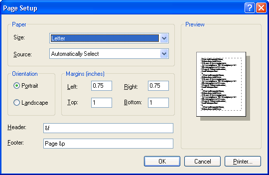

# Page Setup Dialog Box

Displays a modal dialog box that allows the user to set the following attributes of the printed page:

-   The paper type (envelope, legal, letter, and so on)
-   The paper source (manual feed, tractor feed, sheet feeder, and so on)
-   The page orientation (portrait or landscape)
-   The width of the page margins

You create and display a **Page Setup** dialog box by initializing a [**PAGESETUPDLG**](/windows/win32/api/commdlg/ns-commdlg-pagesetupdlga) structure and passing the structure to the [**PageSetupDlg**](/previous-versions/windows/desktop/legacy/ms646937(v=vs.85)) function. However, the attributes presented in the dialog box vary, depending on the capabilities of the printer. The following illustration shows a typical **Page Setup** dialog box.

If the user clicks the **OK** button, [**PageSetupDlg**](/previous-versions/windows/desktop/legacy/ms646937(v=vs.85)) returns **TRUE** after setting various members in the [**PAGESETUPDLG**](/windows/win32/api/commdlg/ns-commdlg-pagesetupdlga) structure to specify the user's selections. The **ptPaperSize** and **rtMargin** members contain the values specified by the user. The **hDevMode** and **hDevNames** members contain global memory handles for the [**DEVMODE**](/windows/win32/api/wingdi/ns-wingdi-devmodea) and [**DEVNAMES**](/windows/win32/api/commdlg/ns-commdlg-devnames) structures. These structures contain additional page information as well as information about the printer. You can use this information to prepare the output to be sent to the selected printer.

If the user cancels the **Page Setup** dialog box or an error occurs, [**PageSetupDlg**](/previous-versions/windows/desktop/legacy/ms646937(v=vs.85)) returns **FALSE**. To determine the cause of the error, call the [**CommDlgExtendedError**](/windows/desktop/api/Commdlg/nf-commdlg-commdlgextendederror) function to retrieve the extended error value.

This section discusses the following topics.

-   [Initializing the Page Setup Dialog Box](#initializing-the-page-setup-dialog-box)
-   [Customizing the Page Setup Dialog Box](#customizing-the-page-setup-dialog-box)
-   [Customizing the Sample Page](#customizing-the-sample-page)

## Initializing the Page Setup Dialog Box

By default, the **Page Setup** dialog box displays information about the current default printer. To direct the dialog box to display information about a specific printer, set the members of a [**DEVMODE**](/windows/win32/api/wingdi/ns-wingdi-devmodea) or [**DEVNAMES**](/windows/win32/api/commdlg/ns-commdlg-devnames) structure and assign the global memory handles of these structures to the corresponding member in [**PAGESETUPDLG**](/windows/win32/api/commdlg/ns-commdlg-pagesetupdlga). If you specify the name of a printer that is not currently installed, the dialog box displays an error message. To prevent the dialog box from displaying error messages, use the **PSD\_NOWARNING** value. To retrieve information about the default printer without displaying the **Page Setup** dialog box, use the **PSD\_RETURNDEFAULT** value.

If the default measurement system is inches, the dialog box uses thousandths of inches as the default unit of measurement. If the default measurement system is metric, the dialog box uses hundredths of millimeters as the default unit of measurement. To override the default unit of measurement, set the **PSD\_INHUNDREDTHSOFMILLIMETERS** or **PSD\_INTHOUSANDTHSOFINCHES** flag in the **Flags** member of the [**PAGESETUPDLG**](/windows/win32/api/commdlg/ns-commdlg-pagesetupdlga) structure.

The initial values for the margins are one inch, by default. If you set the **PSD\_MARGINS** flag, the dialog box displays the initial margin values specified in the **rtMargin** member. The default minimum values that the user can specify for the margins are the minimum margins allowed by the printer. If you set the **PSD\_MINMARGINS** flag, the dialog box enforces the minimum margins specified in the **rtMinMargin** member.

To prevent users from selecting certain options, set any combination of the following flags to disable the corresponding controls.

| Flag                        | Meaning                                                                  |
|-----------------------------|--------------------------------------------------------------------------|
| **PSD\_DISABLEMARGINS**     | Disables the edit controls in which the user enters the margin settings. |
| **PSD\_DISABLEORIENTATION** | Disables the **Portrait** and **Landscape** radio buttons.               |
| **PSD\_DISABLEPAPER**       | Disables the controls for selecting the paper size and paper source.     |
| **PSD\_DISABLEPRINTER**     | Disables the **Printer** button.                                         |

 

## Customizing the Page Setup Dialog Box

You can provide a custom template for the **Page Setup** dialog box, for example, if you want to include additional controls that are unique to your application. The [**PageSetupDlg**](/previous-versions/windows/desktop/legacy/ms646937(v=vs.85)) function uses your custom template in place of the default template.

**To provide a custom template for the Page Setup dialog box**

1.  Create the custom template by modifying the default template specified in the Prnsetup.dlg file. The control identifiers used in the default **Page Setup** dialog template are defined in the Dlgs.h file.
2.  Use the [**PAGESETUPDLG**](/windows/win32/api/commdlg/ns-commdlg-pagesetupdlga) structure to enable the template as follows:
    -   -   If your custom template is a resource in an application or dynamic-link library, set the **PSD\_ENABLEPAGESETUPTEMPLATE** flag in the **Flags** member. Use the **hInstance** and **lpPageSetupTemplateName** members of the structure to identify the module and resource name.

            -Or-

        -   If your custom template is already in memory, set the **PSD\_ENABLEPAGESETUPTEMPLATEHANDLE** flag. Use the **hPageSetupTemplate** member to identify the memory object that contains the template.

To filter messages sent to the dialog box procedure, you can provide a [**PageSetupHook**](/windows/win32/api/commdlg/nc-commdlg-lppagesetuphook) hook procedure. If you use a custom template to define additional controls, you must provide a **PageSetupHook** hook procedure to process input for your controls. In addition, you can provide a [**PagePaintHook**](/windows/win32/api/commdlg/nc-commdlg-lppagepainthook) hook procedure to customize the contents of the sample page displayed by the **Page Setup** dialog box. For more information about the **PagePaintHook** hook procedure, see [Customizing the Sample Page](#customizing-the-sample-page).

**To enable a PageSetupHook hook procedure**

1.  Set the **PSD\_ENABLEPAGESETUPHOOK** flag in the **Flags** member of the [**PAGESETUPDLG**](/windows/win32/api/commdlg/ns-commdlg-pagesetupdlga) structure.
2.  Specify the address of the hook procedure in the **lpfnPageSetupHook** member.

After processing its [**WM\_INITDIALOG**](wm-initdialog.md) message, the dialog box procedure sends a **WM\_INITDIALOG** message to the [**PageSetupHook**](/windows/win32/api/commdlg/nc-commdlg-lppagesetuphook) hook procedure. The *lParam* parameter of this message is a pointer to the [**PAGESETUPDLG**](/windows/win32/api/commdlg/ns-commdlg-pagesetupdlga) structure used to initialize the dialog box.

## Customizing the Sample Page

The **Page Setup** dialog box includes an image of a sample page that shows how the user's selections affect the appearance of the printed output. The image consists of a rectangle that represents the selected paper or envelope type, with a dotted-line rectangle representing the current margins, and partial (Greek text) characters to show how text looks on the printed page.

When you call the [**PageSetupDlg**](/previous-versions/windows/desktop/legacy/ms646937(v=vs.85)) function, you can provide a [**PagePaintHook**](/windows/win32/api/commdlg/nc-commdlg-lppagepainthook) hook procedure to customize the appearance of the sample page.

**To enable a PagePaintHook hook procedure**

1.  Set the **PSD\_ENABLEPAGEPAINTHOOK** flag in the **Flags** member of the [**PAGESETUPDLG**](/windows/win32/api/commdlg/ns-commdlg-pagesetupdlga) structure.
2.  Specify the address of the hook procedure in the **lpfnPagePaintHook** member.

Whenever the dialog box is about to draw the contents of the sample page, the hook procedure receives the following messages in the order in which they are listed.

| Message                                                  | Meaning                                                                                                                                          |
|----------------------------------------------------------|--------------------------------------------------------------------------------------------------------------------------------------------------|
| [**WM\_PSD\_PAGESETUPDLG**](wm-psd-pagesetupdlg.md)     | The dialog box is about to draw the sample page. The hook procedure can use this message to prepare to draw the contents of the sample page.     |
| [**WM\_PSD\_FULLPAGERECT**](wm-psd-fullpagerect.md)     | The dialog box is about to draw the sample page. This message specifies the bounding rectangle of the sample page.                               |
| [**WM\_PSD\_MINMARGINRECT**](wm-psd-minmarginrect.md)   | The dialog box is about to draw the sample page. This message specifies the margin rectangle.                                                    |
| [**WM\_PSD\_MARGINRECT**](wm-psd-marginrect.md)         | The dialog box is about to draw the margin rectangle.                                                                                            |
| [**WM\_PSD\_GREEKTEXTRECT**](wm-psd-greektextrect.md)   | The dialog box is about to draw the Greek text inside the margin rectangle.                                                                      |
| [**WM\_PSD\_ENVSTAMPRECT**](wm-psd-envstamprect.md)     | The dialog box is about to draw in the envelope-stamp rectangle of an envelope sample page. This message is sent for envelopes only.             |
| [**WM\_PSD\_YAFULLPAGERECT**](wm-psd-yafullpagerect.md) | The dialog box is about to draw the return address portion of an envelope sample page. This message is sent for envelopes and other paper sizes. |

 

If the hook procedure returns **TRUE** for any of the first three messages of a drawing sequence ([**WM\_PSD\_PAGESETUPDLG**](wm-psd-pagesetupdlg.md), [**WM\_PSD\_FULLPAGERECT**](wm-psd-fullpagerect.md), or [**WM\_PSD\_MINMARGINRECT**](wm-psd-minmarginrect.md)) the dialog box sends no more messages and does not draw in the sample page until the next time the system needs to redraw the sample page. If the hook procedure returns **FALSE** for all three messages, the dialog box sends the remaining messages of the drawing sequence.

If the hook procedure returns **TRUE** for any of the remaining messages in a drawing sequence, the dialog box does not draw the corresponding portion of the sample page. If the hook procedure returns **FALSE** for any of these messages, the dialog box draws that portion of the sample page.

To prevent the dialog box from drawing the contents of the sample page, you can set the **PSD\_DISABLEPAGEPAINTING** flag. This flag does not affect your [**PagePaintHook**](/windows/win32/api/commdlg/nc-commdlg-lppagepainthook) hook procedure, which still receives all the **WM\_PSD\_\*** messages and can draw the sample page contents.

 

 