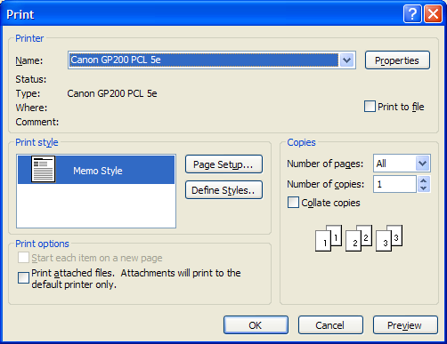

# Print Dialog Box

The **Print** dialog box lets the user select options for a particular print job. For example, the user can specify the printer to use, the range of pages to print, and the number of copies.

You can use the [**PrintDlgEx**](/previous-versions/windows/desktop/legacy/ms646942(v=vs.85)) function to display a [Print Property Sheet](print-property-sheet.md), which has a **General** page containing controls similar to the **Print** dialog box. The property sheet can also have additional application-specific and driver-specific property pages following the **General** page.

You create and display a **Print** dialog box by initializing a [**PRINTDLG**](/windows/win32/api/commdlg/ns-commdlg-printdlga) structure and passing the structure to the [**PrintDlg**](/previous-versions/windows/desktop/legacy/ms646940(v=vs.85)) function.

The following illustration shows a typical **Print** dialog box.

If the user clicks the **OK** button, [**PrintDlg**](/previous-versions/windows/desktop/legacy/ms646940(v=vs.85)) returns **TRUE** and uses the [**PRINTDLG**](/windows/win32/api/commdlg/ns-commdlg-printdlga) structure to return information about the user's selections. For example, the **hDevMode** and **hDevNames** members typically return global memory handles for and [**DEVNAMES**](/windows/win32/api/commdlg/ns-commdlg-devnames) structures. You can use the information in these structures to create a device context or an information context for the selected printer.

If the user cancels the **Print** dialog box or an error occurs, [**PrintDlg**](/previous-versions/windows/desktop/legacy/ms646940(v=vs.85)) returns **FALSE**. You can determine the cause of an error by using the [**CommDlgExtendedError**](/windows/desktop/api/Commdlg/nf-commdlg-commdlgextendederror) function to retrieve the extended error value.

The **Print** dialog box includes a **Print Range** group of radio buttons that indicate whether the user wants to print all pages, a range of pages, or only the selected text. Before calling [**PrintDlg**](/previous-versions/windows/desktop/legacy/ms646940(v=vs.85)), you can set one of the **PD\_ALLPAGES**, **PD\_SELECTION**, or **PD\_PAGENUMS** flags to indicate which button is initially selected. When **PrintDlg** returns **TRUE**, the function sets one of these flags to indicate the user's selections. If **PD\_PAGENUMS** is set, the **nFromPage** and **nToPage** members of the [**PRINTDLG**](/windows/win32/api/commdlg/ns-commdlg-printdlga) structure contain the starting and ending pages specified by the user. To disable the **Pages** radio button and its associated **From** and **To** edit controls, set the **PD\_NOPAGENUMS** flag. To disable the **Selection** radio button, set the **PD\_NOSELECTION** flag.

The dialog box includes an edit control in which the user can type the number of copies to print. If the **hDevMode** member of the [**PRINTDLG**](/windows/win32/api/commdlg/ns-commdlg-printdlga) structure is non-**NULL**, the **dmCopies** member of the structure specifies the initial value for this edit control. If **hDevMode** is **NULL**, the **nCopies** member of the **PRINTDLG** structure specifies the initial value. When [**PrintDlg**](/previous-versions/windows/desktop/legacy/ms646940(v=vs.85)) returns, **nCopies** typically indicates the number of copies specified by the user. However, if you set the **PD\_USEDEVMODECOPIESANDCOLLATE** flag when you create the dialog box, **nCopies** is always set to 1 on return and the **dmCopies** member of [**DEVMODE**](/windows/win32/api/wingdi/ns-wingdi-devmodea) indicates the number of copies to print.

The **Collate** check box indicates whether the user wants to collate the pages if multiple copies are being printed. The **PD\_COLLATE** flag is set if the **Collate** check box is selected. If your application does not support multiple copies or simulated collation, set the **PD\_USEDEVMODECOPIESANDCOLLATE** flag in the **Flags** member of the [**PRINTDLG**](/windows/win32/api/commdlg/ns-commdlg-printdlga) structure. This disables the **Collate** check box and the **Number of Copies** edit control unless the printer driver supports multiple copies and collation.

The **Print To File** check box indicates whether the user wants to send output to a file rather than to a printer. You can set the **PD\_PRINTTOFILE** flag so the check box is initially selected. To hide the check box, set the **PD\_HIDEPRINTTOFILE** flag. To disable it, set the **PD\_DISABLEPRINTTOFILE** flag. If the user selects the **Print To File** option, [**PrintDlg**](/previous-versions/windows/desktop/legacy/ms646940(v=vs.85)) sets the **PD\_PRINTTOFILE** flag and returns "FILE:" at the offset indicated by the **wOutputOffset** member of the [**DEVNAMES**](/windows/win32/api/commdlg/ns-commdlg-devnames) structure. When you call the function to start the printing operation, specify this "FILE:" string in the **lpszOutput** member of the structure. Specifying this string causes the print subsystem to query the user for the name of the output file.

By default, the **Print** dialog box initially displays information about the current default printer. To display information for another installed printer, initialize a and a [**DEVNAMES**](/windows/win32/api/commdlg/ns-commdlg-devnames) structure and assign the global memory handle to the structure to the **hDevMode** and **hDevNames** members. The device name you specify in the **dmDeviceName** member of the [**DEVMODE**](/windows/win32/api/wingdi/ns-wingdi-devmodea) structure and in the **wDriverOffset** member of the **DEVNAMES** structure must identify a printer device that is also listed in the \[Devices\] section of the Win.ini file. If the device is not listed, [**PrintDlg**](/previous-versions/windows/desktop/legacy/ms646940(v=vs.85)) returns an error.

You can direct [**PrintDlg**](/previous-versions/windows/desktop/legacy/ms646940(v=vs.85)) to create a device context or information context for the printer by setting the **PD\_RETURNDC** or **PD\_RETURNIC** flag in the **Flags** member of the [**PRINTDLG**](/windows/win32/api/commdlg/ns-commdlg-printdlga) structure. The function returns a handle to the device context or information context in the **hDC** member. If you use the **PD\_RETURNDC** flag, you can use the device context to generate output for the printer.

To retrieve information about the default printer without displaying the **Print** dialog box, set the **PD\_RETURNDEFAULT** flag. In this case, [**PrintDlg**](/previous-versions/windows/desktop/legacy/ms646940(v=vs.85)) returns immediately after setting the **hDevMode** and **hDevNames** members to handles for structures containing the information.

By default, [**PrintDlg**](/previous-versions/windows/desktop/legacy/ms646940(v=vs.85)) displays message boxes when errors occur. For example, the function displays an error message if no printers are installed. To prevent the function from displaying these warning messages, set the **PD\_NOWARNING** flag.

The following topics are discussed in this section.

-   [Customizing the Print Dialog Box](#customizing-the-print-dialog-box)
-   [Print Setup Dialog Box](#print-setup-dialog-box)

## Customizing the Print Dialog Box

You can provide a custom template for the **Print** dialog box, for example, if you want to include additional controls that are unique to your application. The [**PrintDlg**](/previous-versions/windows/desktop/legacy/ms646940(v=vs.85)) function uses your custom template in place of the default template.

To provide a custom template for the **Print** dialog box:

1.  Create the custom template by modifying the default template specified in the Prnsetup.dlg file. The control identifiers used in the default **Print** dialog template are defined in the Dlgs.h file.
2.  Use the [**PRINTDLG**](/windows/win32/api/commdlg/ns-commdlg-printdlga) structure to enable the template as follows:
    -   If your custom template is a resource in an application or dynamic-link library, set the **PD\_ENABLEPRINTTEMPLATE** flag in the **Flags** member. Use the **hInstance** and **lpPrintTemplateName** members of the structure to identify the module and resource name.

        -Or-

    -   If your custom template is already in memory, set the **PD\_ENABLEPRINTTEMPLATEHANDLE** flag. Use the **hPrintTemplate** member to identify the memory object that contains the template.

You can provide a [**PrintHookProc**](/windows/win32/api/commdlg/nc-commdlg-lpprinthookproc) hook procedure for the **Print** dialog box. The hook procedure can process messages sent to the dialog box. It can also send messages to the dialog box. If you use a custom template to define additional controls, you must provide a hook procedure to process input for your controls.

To enable a hook procedure for the **Print** dialog box:

1.  Set the **PD\_ENABLEPRINTHOOK** flag in the **Flags** member of the [**PRINTDLG**](/windows/win32/api/commdlg/ns-commdlg-printdlga) structure.
2.  Specify the address of the hook procedure in the **lpfnPrintHook** member.

After processing its [**WM\_INITDIALOG**](wm-initdialog.md) message, the dialog box procedure sends a **WM\_INITDIALOG** message to the hook procedure. The *lParam* parameter of this message is a pointer to the [**PRINTDLG**](/windows/win32/api/commdlg/ns-commdlg-printdlga) structure used to initialize the dialog box.

## Print Setup Dialog Box

You can create and display a **Print Setup** dialog box by setting the **PD\_PRINTSETUP** flag in a call to the [**PrintDlg**](/previous-versions/windows/desktop/legacy/ms646940(v=vs.85)) function. However, the **Print Setup** dialog box has been superseded by the **Page Setup** dialog box and should not be used in new applications.

The following flags apply only to the **Print Setup** dialog box:

-   **PD\_ENABLESETUPHOOK**
-   **PD\_ENABLESETUPTEMPLATE**
-   **PD\_ENABLESETUPTEMPLATEHANDLE**

 

 