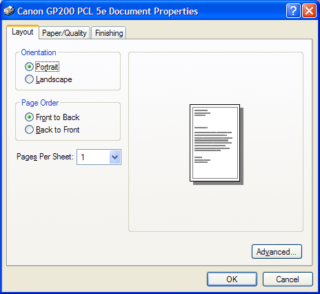

# Print Property Sheet

The **Print** property sheet is a standard user interface that enables the user to specify the properties of a particular print job. The property sheet is composed of a set of property pages that varies by printer or application. To a subset of standard Windows property pages, some printers might add driver-specific property pages and some applications might add application-specific property pages.

To create and display a **Print** property sheet, initialize a [**PRINTDLGEX**](/windows/win32/api/commdlg/ns-commdlg-printdlgexa) structure and pass the structure to the [**PrintDlgEx**](/previous-versions/windows/desktop/legacy/ms646942(v=vs.85)) function.

The following illustration shows a typical **Print** property sheet.

Most members of the [**PRINTDLGEX**](/windows/win32/api/commdlg/ns-commdlg-printdlgexa) structure are identical to those of the [**PRINTDLG**](/windows/win32/api/commdlg/ns-commdlg-printdlga) structure. For descriptions of how to use the common structure members to interact with the dialog box controls, see [Print Dialog Box](print-dialog-box.md). The remainder of this topic describes the **Print** property sheet features that differ from the **Print** dialog box.

You can customize a **Print** property sheet by specifying a custom dialog box template for the lower portion of the **General** page and by specifying additional property pages to follow the **General** page. For more information, see [Customizing the Print Property Sheet](#customizing-the-print-property-sheet).

You can implement a callback object to receive notifications and messages from the [**PrintDlgEx**](/previous-versions/windows/desktop/legacy/ms646942(v=vs.85)) function while the property sheet is displayed. Applications that provide custom templates or additional pages use the callback object to communicate with the property sheet. For more information, see [Callback Object for the Print Property Sheet](#callback-object-for-the-print-property-sheet).

The **Print** property sheet provides support for specifying multiple, noncontiguous page ranges to print. The **lpPageRanges** member of the [**PRINTDLGEX**](/windows/win32/api/commdlg/ns-commdlg-printdlgexa) structure specifies an array of [**PRINTPAGERANGE**](/windows/win32/api/commdlg/ns-commdlg-printpagerange) structures in which each structure specifies a page range.

The **Print** property sheet displays a **Current Page** radio button as part of the **Page Range** group of radio buttons. To control the **Current Page** radio button, use the **PD\_CURRENTPAGE** and **PD\_NOCURRENTPAGE** flags in the **Flags** member of the [**PRINTDLGEX**](/windows/win32/api/commdlg/ns-commdlg-printdlgexa) structure.

This section discusses the following topics.

-   [Customizing the Print Property Sheet](#customizing-the-print-property-sheet)
-   [Callback Object for the Print Property Sheet](#callback-object-for-the-print-property-sheet)

## Customizing the Print Property Sheet

You can customize the **Print** property sheet in the following ways:

-   Provide a custom template for the lower portion of the **General** page. This allows you to include additional controls that are unique to your application. The [**PrintDlgEx**](/previous-versions/windows/desktop/legacy/ms646942(v=vs.85)) function uses your custom template in place of the default template.
-   Provide additional property pages to follow the **General** page.
-   Provide a callback object. For more information, see [Callback Object for the Print Property Sheet](#callback-object-for-the-print-property-sheet).

You cannot change the upper portion of the **General** page. You cannot change property pages provided by the printer driver.

To provide a custom template for the General page:

1.  Create a custom template for the lower portion of the **General** page by modifying the PRINTDLGEXORD template specified in the Prnsetup.dlg file. Typically, the custom template must be the same size as the default template. However, you can enlarge the custom template if you specify the **PD\_USELARGETEMPLATE** flag to create a larger **General** page. The control identifiers used in the default **Print** dialog template are defined in the Dlgs.h file.
2.  Use the [**PRINTDLGEX**](/windows/win32/api/commdlg/ns-commdlg-printdlgexa) structure to enable the template as follows:
    -   If your custom template is a resource in an application or dynamic-link library, set the **PD\_ENABLEPRINTTEMPLATE** flag in the **Flags** member. Use the **hInstance** and **lpPrintTemplateName** members of the structure to identify the module and resource name.

        -Or-

    -   If your custom template is already in memory, set the **PD\_ENABLEPRINTTEMPLATEHANDLE** flag. Use the **hInstance** member to identify the memory object that contains the template.

3.  If you use a custom template to define additional controls, you must provide a callback object to process input for your controls. The callback object implements a [**IPrintDialogCallback::HandleMessage**](/windows/win32/api/commdlg/nf-commdlg-iprintdialogcallback-handlemessage) method which receives messages sent to the custom dialog box.

To provide additional property pages

1.  Use the function to create the additional pages.
2.  Use the **lphPropertyPages** member of the [**PRINTDLGEX**](/windows/win32/api/commdlg/ns-commdlg-printdlgexa) structure to specify an array of handles to the additional pages.

    The dialog box procedures specified when you created each page process messages sent to the pages.

3.  You might want to provide a callback object that implements the interface. The [**PrintDlgEx**](/previous-versions/windows/desktop/legacy/ms646942(v=vs.85)) function uses this interface to pass to the application a pointer to an [**IPrintDialogServices**](/windows/win32/api/commdlg/nn-commdlg-iprintdialogservices) interface. The dialog box procedures for the additional property pages can use this interface to retrieve information about the currently selected printer.

## Callback Object for the Print Property Sheet

An application that displays a **Print** property sheet can implement a callback object to receive notifications and messages from the [**PrintDlgEx**](/previous-versions/windows/desktop/legacy/ms646942(v=vs.85)) function while the property sheet is displayed. To provide a callback object, specify a pointer to the object in the **lpCallback** member of the [**PRINTDLGEX**](/windows/win32/api/commdlg/ns-commdlg-printdlgexa) structure.

The callback object must implement the [**IPrintDialogCallback**](/windows/win32/api/commdlg/nn-commdlg-iprintdialogcallback) interface. The [**PrintDlgEx**](/previous-versions/windows/desktop/legacy/ms646942(v=vs.85)) function calls **IPrintDialogCallback** methods in the following situations:

-   When the dialog box has been initialized
-   When the user selects a different printer from the list of installed printers displayed by the property sheet
-   When it receives messages for the child dialog box in the lower portion of the property sheet's **General** page

The callback object should also implement the [**IObjectWithSite**](/windows/win32/api/ocidl/nn-ocidl-iobjectwithsite) interface. The [**PrintDlgEx**](/previous-versions/windows/desktop/legacy/ms646942(v=vs.85)) function calls the method to pass a pointer to an [**IPrintDialogServices**](/windows/win32/api/commdlg/nn-commdlg-iprintdialogservices) interface to an application. The [**IPrintDialogCallback**](/windows/win32/api/commdlg/nn-commdlg-iprintdialogcallback) methods can use the **IPrintDialogServices** interface to retrieve information about the currently selected printer. The **IPrintDialogServices** interface is also useful for applications that create additional pages to follow the **General** page of the **Print** property sheet. The dialog box procedures for the additional pages can call **IPrintDialogServices** methods.

 

 