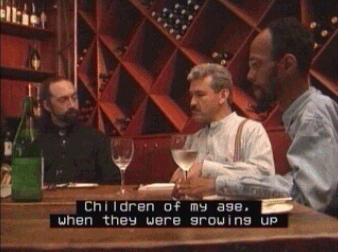

# Captions and Audio Descriptions for PC Multimedia

Microsoft Corporation

March 2002

**Summary:** This article discusses the various types of captions, when to use captions, as well as the various types of audio descriptions. (7 printed pages)

-   [Captions and Audio Descriptions](#captions-and-audio-descriptions)
    -   [Types of Captions](#types-of-captions)
    -   [When to Use Closed Captions](#when-to-use-closed-captions)
    -   [When to Use Open Captions](#when-to-use-open-captions)
    -   [Designing Quality Captions](#designing-quality-captions)
    -   [Audio Descriptions](#audio-descriptions)
    -   [When to Use Audio Descriptions](#when-to-use-audio-descriptions)
    -   [When to Use Text Video](#when-to-use-text-video)
-   [PC Multimedia and Accessibility](#pc-multimedia-and-accessibility)
-   [Case Studies](#case-studies)
    -   [Closed Captions in Encarta Encyclopedia](#closed-captions-in-encarta-encyclopedia)
    -   [SMIL 2.0 Support in Internet Explorer](#smil-20-support-in-internet-explorer)
    -   [Open Captions Embedded in the Video Screen](#open-captions-embedded-in-the-video-screen)
    -   [Text Video Example](#text-video-example)

## Captions and Audio Descriptions

Captions turn the audio content of a visual presentation into text; they are an alternative format used to deliver audio content. Captions address the problems faced by users who are deaf or hard of hearing. Captions can also be used to translate languages for students, supplement poor audio quality, or create a quiet environment.

Audio descriptions turn visual content into sound; they are simply additional narrative that describes a scene or setting. Audio descriptions address the problems faced by users who are blind or have other visual impairments.

Both features can be implemented many different ways, using different technologies. For example, captions appear as DVD movie subtitles or in a Microsoft Windows Media player presentation captioned by a Synchronized Accessible Media Interchange (SAMI) format.

This section discusses these topics:

-   [Types of Captions](#types-of-captions)
-   [When to Use Closed Captions](#when-to-use-closed-captions)
-   [When to Use Open Captions](#when-to-use-open-captions)
-   [Designing Quality Captions](#designing-quality-captions)
-   [Audio Descriptions](#audio-descriptions)
-   [When to Use Audio Descriptions](#when-to-use-audio-descriptions)
-   [When to Use Text Video](#when-to-use-text-video)

### Types of Captions

Today, two types of captions exist: closed and open. To understand the difference, you first need to understand how the terms closed and open originated.

Captions were initially developed for television. Like movie subtitles, television captions display spoken dialog as printed words on the screen. Unlike subtitles, these captions are specifically designed for deaf and hard-of-hearing viewers. Television captions are carefully placed to identify speakers, on- and off-screen sound effects, music, and laughter.

The terms closed and open arose from the technology used to deliver TV captions whereby the captions are hidden in line 21 of the analog video signal (also known as the vertical blanking interval (VBI)). A set-top decoder must be used to decode, or open, the captions. Television captions are called closed because they start out turned off and, after they have been decoded to become part of the television picture, they are called open.

The meaning of closed and open captions is similar, though slightly different, in the computer industry. In a PC environment, a closed caption is caption text that can be turned on or off, formatted programmatically, and even styled by the user. An open caption is a caption that cannot be turned off — it is part of the static or dynamic image file; it is *painted* in the picture pixels.

### When to Use Closed Captions

In computer multimedia, closed captions allow much greater design flexibility than open captions; however, the trade-off is cost. If you can specify the browser or player that your media file will be played in, the cost can be minimized. In general, use closed captions when any of the following is important:

-   Allowing authors or users to control characteristics of the caption text, such as its location on the screen, its font, and its font size.
-   Ability to create and edit caption text in postproduction, for example, to add captions to an existing movie.
-   Ability to translate caption text to different languages.

### When to Use Open Captions

In a computer environment, open captions are simply an additional track that is added at the end of a video production process. They are embedded in the media file itself, and therefore are readable by any player. For example, any MPEG movie that contains open captions can be played in any multimedia player with MPEG decoder support.

In contrast, both TV and computer closed captions require a caption decoder. In the case of TV, it's a literal decoder; a set-top box or chip that decodes the video signal. For computers, you need a browser (for example, Microsoft Internet Explorer) or player (for example, Windows Media Player) that can *decode*, or parse the caption text, which is stored in an additional file.

Use open captions when:

-   You are not sure that your media file(s) will be read by a browser or player that can read the caption text.
-   You are not able to specify which player will be used. Because there are competing standards and implementations, it may be too costly to create caption text for multiple players.

> [!Note]  
> Be sure that the video will be viewed at a high-enough resolution, or have a large-enough screen dimension, so that the open captions can be read. Because open captions are embedded in the media file, they "shrink" to whatever size and resolution at which the media is viewed.

 

### Designing Quality Captions

It is important to design captions properly. To educate yourself or your developers, see [Captioning Key](http://go.microsoft.com/fwlink/p/?linkid=208738) on The Described and Captioned Media Program website.

### Audio Descriptions

Audio descriptions are the judicious use of language to describe visual scenes. In a video, they are "extra" descriptions that characterize a scene for people with poor vision. When done well, they are a modern descendent of the art form of scene description practiced during the radio era (and rarely employed today except by radio sports announcers).

In the television and movie industry, audio descriptions are often referred to as *descriptive video* or *video descriptions*, and they may be added to a popular film in a special DVS (Descriptive Video Service) version. In the computer industry, audio descriptions are typically added as supplemental narrative to the audio tracks of a video file. They are generally in audio form.

However, in a *text video*, which was developed by Microsoft's Accessible Technology Group for the computer industry, the audio descriptions are in text. A text video is a video made up of text; it is a transcript dialog to which audio descriptions have been added. The key point is that a text video is a word-for-word text rendering of all aspects of both the audio and the video. So it includes descriptions of all sounds, not only dialog, but also barking dogs, falling rain, and so forth. And it includes descriptions of all important visual content, for example, "Mary raises her hand."

### When to Use Audio Descriptions

Audio descriptions usually cost much more than captioning because the "describers" are usually experienced writers and researchers. Audio description requires both writing and voice talent specialized to audio descriptions.

An estimated 10 million Americans are blind or low vision, and audio descriptions are being demanded more frequently by consumers now that DVD technology makes audio descriptions available as an alternative audio track. Audio description should be used whenever an audience is blind, has poor vision, or cannot access the video portion of a multimedia presentation.

For more information on the practice of audio description, see [Media Access Group at WGBH](http://go.microsoft.com/fwlink/p/?linkid=208738).

### When to Use Text Video

Text video, which commits both audio and video to text, can be used to translate multimedia for deaf or blind users. Text video also may be a good choice when the cost of audio descriptions is prohibitive.

Text video is easier to create if the media you want to transcribe already has a written script — for example, a conference report or speech. In this case, you simply have to add audio descriptions (in text form). Because you do not have to create an additional audio track and add it to the multimedia presentation, generally, text video may cost less than audio description.

## PC Multimedia and Accessibility

In 1997, when no standard for closed captions in digital media existed, Microsoft developed SAMI and implemented it in Microsoft Encarta Reference Suite, Windows Media Player, and Microsoft DirectShow application programming interface. Concurrently, members of the World Wide Web Consortium (W3C) created Synchronized Multimedia Integration Language (SMIL), which can be used for closed captions. Microsoft Internet Explorer supports the latest version, SMIL 2.0, creating a synchronization framework based on it called HTML+TIME.

Closed captions and audio descriptions are different from other media tracks in a multimedia production because they essentially translate or augment that production. Therefore, in a typical production model, they are created at the very end of the process. (For example, subtitles are added to a movie only after it is completed.) In this sense, they are unlike other text elements in a media production. In practice, to attempt to integrate captions into an existing, fully synchronized SMIL 2.0 media file is sometimes costly. In contrast, a SAMI document contains only closed captions text; it can be edited separately from the media file and requires fewer programming skills.

## Case Studies

This section discusses these topics:

-   [Closed Captions in Microsoft Encarta Encyclopedia](#closed-captions-in-encarta-encyclopedia)
-   [SMIL 2.0 Support in Internet Explorer](#smil-20-support-in-internet-explorer)
-   [Open Captions Embedded in the Video Screen](#open-captions-embedded-in-the-video-screen)
-   [Text Video Example](#text-video-example)

### Closed Captions in Encarta Encyclopedia

Early versions of Microsoft Encarta Encyclopedia included approximately 4,000 media files. All of the video and animations and 99 percent of the audio content were closed-captioned. Encarta used SAMI for captioning because SAMI was the only technology available at the time, and is widely supported by Microsoft products to date. Today, there are approximately 10,000 media files captioned with SAMI. The content is available though several distribution formats, including Encarta CD products and Encarta Online.

SAMI support is available in Windows Media Player, DirectShow, and Internet Explorer. For details about the SAMI format and the platforms, see the [MSDN Library](http://go.microsoft.com/fwlink/p/?linkid=208741). Examples are also available in the MSDN article [Understanding SAMI 1.0](dnacc.understanding_sami_1.0).

### SMIL 2.0 Support in Internet Explorer

Internet Explorer supports SMIL 2.0 as part of HTML+TIME implementation. For details on the specification and examples of HTML+TIME see the [MSDN Library](http://go.microsoft.com/fwlink/p/?linkid=208741). For more information on SMIL 2.0, see the [W3C recommendation](http://go.microsoft.com/fwlink/p/?linkid=208739), and [W3C Synchronized Multimedia page](http://go.microsoft.com/fwlink/p/?linkid=208743).

### Open Captions Embedded in the Video Screen

Open caption is text embedded directly in the video screen. Open captions do not require a caption decoder in the media player.

### Text Video Example

The following text video is from the introduction to the "Enable" documentary.

Karamazov - Accessibility

Time: 0:01:20

A quotation appears:

"What we do today, right now,

will have an accumulated effect

on all our tomorrows."

-Alexandra Stoddard

This next scene takes place in a recording studio. The walls are covered with black drapes and the floor is covered, wall-to-wall, with large, black, shiny tiles. This is the stage where The Flying Karamazov Brothers, Ivan and Dmitri, perform. The Flying Karamazov Brothers themselves are dressed in black tuxedos with a white pant stripe running from waist to pant cuff.

The scene opens in darkness and then fades to The Flying Karamazov Brothers juggling 6 pins (jugglers' clubs) between the two of them. They stand about 7 feet apart and sometimes pass the pins underhand, from under their legs, and sometimes overhand. You hear a short splat sound each time a pin connects with the juggler's hand.

\[Ivan\]

Hut!

\[Ivan\]

Life these days is

complicated at best

and being successful means

being able to accomplish

many things

at the same time.

 

 

