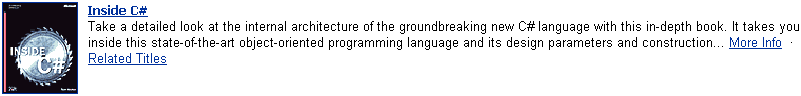
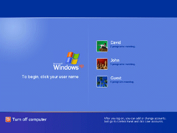

# Creating Text Equivalents for Images

Microsoft Corporation

Updated: April 2002

**Summary:** This article is for developers and content editors seeking to supplement the visual elements of a user interface with text equivalents. This article describes what text equivalents are, why they are required, how to create them, and the best approach to writing and editing them. (6 printed pages)

-   [Introduction](#introduction)
-   [Benefits of Text Equivalents](#benefits-of-text-equivalents)
-   [Implementing Text Equivalents](#implementing-text-equivalents)
-   [Writing Good Text Equivalents](#writing-good-text-equivalents)
    -   [Translating a General Image](#translating-a-general-image)
    -   [Translating an Icon Image](#translating-an-icon-image)
    -   [Translating an Icon Image from a Menu](#translating-an-icon-image-from-a-menu)
    -   [Translating an Image with Text](#translating-an-image-with-text)
    -   [Translating a Linking Image](#translating-a-linking-image)
    -   [Translating Images that Make Up the Main Content of a Page](#translating-images-that-make-up-the-main-content-of-a-page)

## Introduction

A text equivalent is a phrase, sentence, or combination of phrases and sentences that you write and associate with a particular image. The text should describe the image's visual appearance; and it can include instructions on how to take an action, such as navigating through online Help by clicking an arrow image.

A screen reader, such as JAWS for Windows by Freedom Scientific Inc., normally translates text into synthesized speech or a refreshable Braille display. By including text equivalents in your webpage or application, you allow images to be translated as well.

Ideally, a text equivalent provides the user with the same information as the original content. For example, if a webpage displayed an image of an office building with a small lake, you might write "Microsoft campus photo with lake" as the text equivalent.

## Benefits of Text Equivalents

Text equivalents benefit all users, including those with slow Internet connections, those with text-only browsers, and those who are blind or have low vision.

When a user pauses the mouse pointer over an image, the text equivalent appears as a tooltip. In this case, the text equivalent can establish context, provide visual interest, or assist with navigation.

Text equivalents also benefit those with slow Internet connections because such users can opt to turn off the graphics capabilities in their browsers to decrease their download times. For these users, text equivalents might provide the only source of information about the images on a webpage. In some cases, the page already contains additional text that provides some meaningful information. Similarly, text equivalents benefit those with text-only browsers.

For a person who is using a screen reader due to blindness or low vision, text equivalents can provide the only source of information about the images on a webpage. A screen reader user can navigate around a webpage, hearing information about each image and other user interface elements. In another navigation style, a screen reader user can navigate through a page by simply tabbing and listening to information about those elements that receive the focus, such as a linking image. In this case, the screen reader skips non-linking images and any text around a linking image.

Consequently, including text equivalents should be considered a requirement when developing any user interface, regardless of the underlying technology.

## Implementing Text Equivalents

In a web-enabled application that uses HTML, place the text equivalent in the ALT attribute of the IMG tag. If you are using a web authoring tool, see the product documentation for instructions on setting the ALT attribute. For example, in Microsoft Word 2002, select the image and then choose the **Picture** option in the **Format** menu. On the **Web** tab, enter the text equivalent.

In Microsoft FrontPage 2002, select the graphic, and then right-click or press SHIFT+F10 to open the context menu. Select **Picture Properties**, and then select the **General** tab. In the text box under **Alternative Presentations**, enter the text equivalent.

Applications should use Microsoft Active Accessibility to expose the text equivalent for graphics. Either implement [**IAccessible**](https://msdn.microsoft.com/library/windows/desktop/dd318466) and expose the text through the **accName** property of the control; or use the Dynamic Annotation API to set the **accName** property for the graphic. For more information about the **accName** property, see the [**get\_accName**](https://msdn.microsoft.com/library/windows/desktop/dd318483) method.

## Writing Good Text Equivalents

Translate all elements of the following types into text equivalents:

-   General images such as pictures, icons, decorative borders, photos, and thumbnails.
-   Special images such as those used for bullets, graphical buttons, and spacer images (which are transparent images used to visually align elements on a page). Because a spacer image does not contain information, its text equivalent should be ALT="". The screen reader can then choose to ignore the image.
-   Graphical representations of text such as company logos.

Each text equivalent should briefly identify the element to which it's attached and, if appropriate, describe any functionality represented by the element. The text equivalent must therefore be succinct, descriptive and, most of all, accurate.

Due to the limits of some screen readers (such as the default 150-character limit of JAWS for Windows), writing an effective text equivalent is an exercise in extreme economy. The challenge is to get as much information as possible into the fewest number of characters without sacrificing intelligibility.

This section discusses the following topics:

-   [Translating a General Image](#translating-a-general-image)
-   [Translating an Icon Image](#translating-an-icon-image)
-   [Translating an Icon Image from a Menu](#translating-an-icon-image-from-a-menu)
-   [Translating an Image with Text](#translating-an-image-with-text)
-   [Translating a Linking Image](#translating-a-linking-image)
-   [Translating Images that Make Up the Main Content of a Page](#translating-images-that-make-up-the-main-content-of-a-page)

### Translating a General Image

Like all text equivalents, those for general images should be kept short and accurate. Take into account the context and priority of the image. For example, consider the image shown in Figure 1.


If this is a decorative image, the following text equivalent is well written because it is concise and includes the most important information.

``` syntax
<!-- Good text equivalent -->
ALT="Microsoft campus photo"
```

However, if the purpose of the document is to describe the campus, then the following text equivalent provides interesting detai.:

``` syntax
<!-- Good text equivalent -->
ALT="Microsoft campus photo with lake, trees, and U-shaped building"
```

### Translating an Icon Image

If you expect the user to take some action with an icon, such as logging on to a website, the text equivalent should make this clear. For example, consider the image shown in Figure 2.


> [!Note]  
> Passport is an online service that lets you use your email address and a single password for secure access to all Passport-enabled websites and services.

 

The following text equivalent is well written because it specifies the action that the user should take.

``` syntax
<!-- Good text equivalent -->
ALT="Click to sign in to Passport."
```

However, the following text equivalent is less effective because it does not explain the purpose of the image.

``` syntax
<!-- Bad text equivalent -->
ALT="Gray button"
```

### Translating an Icon Image from a Menu

The text equivalent should tell the user what action they can carry out with a user-interface element. For example, consider the image shown in Figure 3, in which the user can click the arrow icons to navigate through the menu options.


The following text equivalent is well written because it specifies the action that the user should take.

``` syntax
<!-- Good text equivalent -->
ALT="Back"
```

However, the following text equivalent does not tell the user what action they should take.

``` syntax
<!-- Bad text equivalent -->
ALT="Previous arrow"
```

### Translating an Image with Text

When writing the text equivalent for an image with text, such as an advertisement or sweepstakes image that contains a marketing message, you should repeat the message in the text equivalent. For example, consider the image from an advertisement that is shown in Figure 4.


The following text equivalent is well written.

``` syntax
<!-- Good text equivalent -->
ALT=" 1 month free"
```

However, the following text equivalent omits some key information.

``` syntax
<!-- Bad text equivalent -->
ALT="ad"
```

### Translating a Linking Image

Consider a webpage that contains both an image of a book cover and a paragraph describing the subject of the book. The image links to details on the book's author, content, and cost. In this scenario, the text equivalent should be meaningful on its own. In other words, the text equivalent should not rely on the paragraph text — in case the screen-reader user tabs through the page and listens to information about only those elements that receive the focus. Figure 5 shows the book-cover image and the text paragraph.



The following text equivalent is well written because it provides some context.

``` syntax
<!-- Good text equivalent -->
ALT="Get information on Inside C# book."
```

However, the following text equivalent is less effective for a linking image because it is not meaningful on its own.

``` syntax
<!-- Bad text equivalent -->
ALT="Book jacket"
```

### Translating Images that Make Up the Main Content of a Page

For images that are the main content on a page, such as in a Help tutorial, use text equivalents that target the main ideas you want the user to take away from the tour or demo. For example, consider the images shown in the Microsoft Windows XP product tour in Figure 6.



The following text equivalent is well written because it explains what the image contains.

``` syntax
<!-- Good text equivalent -->
ALT="The Windows welcome screen, which displays buttons for three 
user accounts. Use the buttons to quickly switch among users."
```

However, the following text equivalent is poorly written for a tutorial because even though it states the purpose of the image, it does not give the user an idea of what the image contains.

``` syntax
<!-- Bad text equivalent -->
ALT="The Windows welcome screen"
```

 

 


