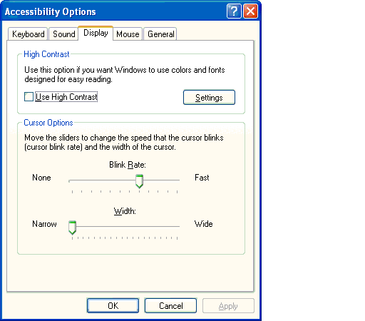

# Flashing User Interface and the GetCaretBlinkTime Function

Microsoft Corporation

March 2002

**Summary:** This article describes how to control the cursor flash rate through Control Panel, or with the **GetCaretBlinkTime** function. (7 printed pages)

-   [Introduction](#introduction)
-   [Solutions](#solutions)
    -   [Customers](#customers)
    -   [Assistive Technology Vendors](#assistive-technology-vendors)
    -   [Software Developers](#software-developers)
-   [Adjusting the Cursor Blink Rate with Control Panel](#adjusting-the-cursor-blink-rate-with-control-panel)
    -   [Using Accessibility Options in Category View](#using-accessibility-options-in-category-view)
    -   [Using Keyboard Properties in Classic View](#using-keyboard-properties-in-classic-view)
-   [Adjusting the Cursor Blink Rate Programmatically](#adjusting-the-cursor-blink-rate-programmatically)
    -   [Using SetCaretBlinkTime](#using-setcaretblinktime)
    -   [Using GetCaretBlinkTime](#using-getcaretblinktime)
    -   [Using the CaretBlinkTime Property](#using-the-caretblinktime-property)
-   [Conclusion](#conclusion)
-   [References](#references)

## Introduction

Presenting visual information on a display in different ways allows users to customize devices and applications for their own specific needs. People who are susceptible to seizures triggered by visual information can adjust the flash rate of the caret or cursor. The flash rate can be changed either by the user through the Microsoft Windows XP operating system or programmatically by the developer. This article describes how to control the cursor flash rate through [Control Panel](#adjusting-the-cursor-blink-rate-with-control-panel), or with the [GetCaretBlinkTime](#adjusting-the-cursor-blink-rate-programmatically) function.

## Solutions

Microsoft recommends that applications keep screens, text, objects, and other elements from flickering, flashing, or pulsating. However, if flashing elements must be included, use the system caret blink rate for adjusting or shutting off the flashing rate. Control Panel gives the user access to turning off the blink rate or to setting it within a range of 0.4 to 2.5 hertz (Hz), which corresponds to a flash interval of between 200 to 1200 milliseconds.

This section describes the cursor flashing solution and its effects on [customers](#customers), [assistive technology vendors (ATVs)](#assistive-technology-vendors), and [software developers](#software-developers).

### Customers

Users can control the cursor-flashing object by specifying the blink rate in the Windows XP operating system. The blink rate can also be used for other types of flashing objects, such as error alerts. By using **Accessibility Options** or **Keyboard Properties** in Control Panel, a user can choose to turn off the blink rate or to adjust it. Other applications must also use this system-wide setting.

### Assistive Technology Vendors

Assistive technology may use a particular blink rate in order to accurately determine the cursor's location or shape. Certain blink rates will need to be avoided to prevent any conflict with the screen sampling rates. In order for assistive technology to follow visual behavior correctly, other applications must use the system-wide cursor blink rate setting.

### Software Developers

Applications with custom controls should share the same system-wide cursor flash rate. Otherwise, a different blink rate for different cursors or other user interface (UI) elements may not only confuse the user, but could possibly contribute to causing seizures as well.

Microsoft Internet Explorer references system settings, so hosted webpages and applications are automatically updated with the current cursor blink-rate setting. However, alternatives must be considered for unique user interface elements on an HTML page or in a web application if they require different flashing rates.

> [!Note]  
> HTML applications do not have direct access to the *CaretBlinkTime* system parameter.

 

## Adjusting the Cursor Blink Rate with Control Panel

Users can easily customize their cursor blink rates by using Control Panel in the Windows XP operating system. You can adjust the blink rate through either [Accessibility Options](#using-accessibility-options-in-category-view) or [Keyboard Properties](#using-keyboard-properties-in-classic-view) in Control Panel. The following two procedures explain how to access the cursor blink-rate setting.

### Using Accessibility Options in Category View

The cursor blink rate or flash interval can be adjusted through **Accessibility Options**.

To change the cursor blink rate:

1.  Click the **Start** button, and then click **Control Panel**.
2.  Under **Pick a category**, click **Accessibility Options**.
3.  Under pick a Control Panel icon, click **Accessibility Options**.
4.  In the **Accessibility Options** dialog box, click the **Display** tab.
5.  In the **Cursor Options** area, click and move the Blink Rate slider to change the cursor blink rate speed. The flash interval can be adjusted by positioning the slider between **None** (no flash) and **Fast**. This changes the flashing rate from 0 to 1200 milliseconds.
6.  Click **Apply**, and then click **OK**.



### Using Keyboard Properties in Classic View

The cursor blink rate or flash interval can be adjusted through Keyboard Properties.

To change the cursor blink rate:

1.  Click the **Start** button, and then click **Control Panel**.
2.  In upper-left corner of Control Panel, click **Switch to Classic View**.
3.  Double-click the **Keyboard** icon.
4.  In the **Keyboard Properties** dialog box, click the **Speed** tab.
5.  In the **Cursor blink rate** area, click and move the blink rate slider to change the cursor blink rate speed. The flash interval can be adjusted by positioning the slider between **None** (no flash) and **Fast**. This changes the flashing speed from 0 to 1200 milliseconds.
6.  Click **Apply**, and then click **OK**.


## Adjusting the Cursor Blink Rate Programmatically

Applications can use the **GetCaretBlinkTime** function to access system options for the cursor. Visual Basic supports the same functionality by using the **Keyboard** class (KEYBOARD.CLS).

### Using SetCaretBlinkTime

An application can use the **SetCaretBlinkTime** function to set the cursor blink rate, which must conform to the user's setting. The **SetCaretBlinkTime** control is reserved for use by Control Panel. An unexpected change in the blink rate can lead to unwanted side effects in the system and its applications.

``` syntax
BOOL SetCaretBlinkTime(
  UINT uMSeconds   //blink time in milliseconds
);
```

### Using GetCaretBlinkTime

The primary use of the **GetCaretBlinkTime** function is to access the current system's cursor blink-rate setting. An application can access the cursor blink rate with the **GetCaretBlinkTime** function. **GetCaretBlinkTime** returns the time required to invert the cursor pixels in milliseconds.

``` syntax
UINT GetCaretBlinkTime(VOID);
```

The **GetCaretBlinkTime** function enables applications to provide a way for custom cursors to emulate the system's cursor blink rate. It is recommended that an application occasionally check the cursor settings — for instance, when the dialog is loaded, not every time the cursor flashes.

The **GetCaretBlinkTime** function also provides an option to change the blink rate in customized user-interface elements or content. It allows the same rate used by the system-cursor settings to be used for other flashing activities as well.

The system cursor can change its actions with the following settings.

**Cursor Blink Rate Settings**


| Return value            | Cursor action                         |
|-------------------------|---------------------------------------|
| &gt; 0 (more than zero) | Cursor blink interval in milliseconds |
| -1                      | Cursor does not flash                 |


 

### Using the CaretBlinkTime Property

For Visual Basic applications, use the **CaretBlinkTime** read and write property of the **Keyboard** class. It can set or retrieve the number of milliseconds between cursor flashes. These values range from 200 to 1200 milliseconds, and can be used in multiples of 100 milliseconds.

## Conclusion

Being able to adjust the flashing cursor rate in several different ways is beneficial for customers, accessible technology vendors, and software developers. It is another solution that provides assistive technology and programs to a wider audience.

## References

-   [**GetCaretBlinkTime**](https://msdn.microsoft.com/library/windows/desktop/ms648401)
-   [**SetCaretBlinkTime**](https://msdn.microsoft.com/library/windows/desktop/ms648404)

 

 


