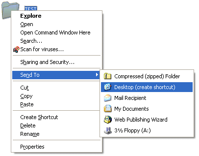
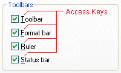
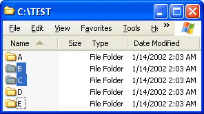

# Guidelines for Keyboard User Interface Design

Microsoft Corporation

April 2002

**Summary**: This article describes the guidelines for designing a keyboard user interface for a Microsoft Windows application. (35 printed pages)

-   [Overview](#overview)
-   [Role of the Keyboard UI in Accessibility](#role-of-the-keyboard-ui-in-accessibility)
-   [Fundamentals of Keyboard UI Design](#fundamentals-of-keyboard-ui-design)
    -   [Keyboard UI Design Rules](#keyboard-ui-design-rules)
    -   [Common Keyboard UI Design Mistakes and Limitations](#common-keyboard-ui-design-mistakes-and-limitations)
-   [Designing the Keyboard UI](#designing-the-keyboard-ui)
    -   [Complying with Standard Keyboard Navigation](#complying-with-standard-keyboard-navigation)
    -   [Navigating in a Logical Order](#navigating-in-a-logical-order)
    -   [Navigating Between Window Panes](#navigating-between-window-panes)
    -   [Navigating Within Fields](#navigating-within-fields)
    -   [Navigating by Matching Characters](#navigating-by-matching-characters)
    -   [Interacting with UI Elements](#interacting-with-ui-elements)
    -   [Accessing Menus and Dialog Boxes](#accessing-menus-and-dialog-boxes)
    -   [Splitting Windows](#splitting-windows)
    -   [Accessing Toolbars](#accessing-toolbars)
    -   [Accessing Tab Controls](#accessing-tab-controls)
    -   [Setting Timed Controls](#setting-timed-controls)
    -   [Displaying Tooltips](#displaying-tooltips)
    -   [Creating Shortcut Keys and Access Keys](#creating-shortcut-keys-and-access-keys)
    -   [Assigning Shortcut Keys](#assigning-shortcut-keys)
    -   [Selecting Access Keys](#selecting-access-keys)
    -   [Providing a Customizable Keyboard UI](#providing-a-customizable-keyboard-ui)
    -   [Anchoring and Extending a Selection](#anchoring-and-extending-a-selection)
    -   [Example of Linear Extended Selection](#example-of-linear-extended-selection)
    -   [Example of Two-Dimensional Extended Selection](#example-of-two-dimensional-extended-selection)
    -   [Illegal Multiple-Selection Operations](#illegal-multiple-selection-operations)
    -   [Providing Auto-Completion](#providing-auto-completion)
    -   [Retrieving the State of a Key](#retrieving-the-state-of-a-key)
-   [Input Focus Location](#input-focus-location)
    -   [Exposing Input Focus Programmatically](#exposing-input-focus-programmatically)
    -   [Input Focus Exceptions](#input-focus-exceptions)
    -   [Input Focus Variations](#input-focus-variations)
    -   [Insertion Bar Within Text](#insertion-bar-within-text)
    -   [Input Focus and Object Selections](#input-focus-and-object-selections)
    -   [Input Focus on Custom Windowless Controls](#input-focus-on-custom-windowless-controls)
    -   [Input Focus in Composite Custom Controls](#input-focus-in-composite-custom-controls)
    -   [Input Focus in a Grid Control or Spreadsheet](#input-focus-in-a-grid-control-or-spreadsheet)
    -   [Input Focus on Objects Only Available for Mouse Devices](#input-focus-on-objects-only-available-for-mouse-devices)
    -   [Input Focus Verification](#input-focus-verification)
-   [Windows System Parameters for the Keyboard UI](#windows-system-parameters-for-the-keyboard-ui)
-   [About the Keyboard Preference Flag](#about-the-keyboard-preference-flag)
-   [Additional Resources](#additional-resources)
-   [Windows Shortcut Keys](#windows-shortcut-keys)

## Overview

This article describes the guidelines for designing a keyboard user interface (UI) for a Microsoft Windows application. A keyboard UI allows users to navigate an application and manipulate UI elements by using a keyboard alone or in combination with a mouse (or another pointing device). Following these guidelines will help you design a keyboard UI that makes your application more accessible to people with disabilities.

## Role of the Keyboard UI in Accessibility

A well-designed keyboard UI is an important aspect of software accessibility. It enables users who are blind or who have certain motor disabilities to navigate an application and interact with its features. Such users may be unable to operate a mouse, and may rely on assistive technologies   such as keyboard enhancement tools, on-screen keyboards, screen enlargers, screen readers, and voice input utilities   all of which depend on an application's keyboard UI.

Many assistive technologies use the keyboard UI programmatically,even if users are not using a standard keyboard input device. Although some assistive technologies may have custom keyboard shortcuts that can make an operation easier, consistency and standardization in keyboard UI design   for assistive technologies and for all aspects of accessibility   are critical to avoid confusing users.

The Windows UI design maximizes input flexibility. **Accessibility Options** in Control Panel offers tools that enhance keyboard functionality, such as StickyKeys, FilterKeys, ToggleKeys, and MouseKeys. These tools can help users to operate applications with the keyboard. However, they do not replace the accessibility provided by a well-designed keyboard UI.

## Fundamentals of Keyboard UI Design

Well-designed applications include two basic requirements:

-   They must be usable even when the keyboard is the sole input device.
-   They must also be functional and user-friendly.

The following sections provide information that you should be familiar with before you begin to design a keyboard UI.

### Keyboard UI Design Rules

To design an effective keyboard UI, use the following design rules:

-   Provide keyboard access to all features, and document the keyboard interface.

    It is recommended that the keyboard be able to perform the same tasks as a mouse device. Document the keyboard UI in the product manual and through online Help. Be sure that the input focus location (the point at which input is being directed in the UI) is provided programmatically as well as visually.

    For more information, see [Input Focus Location](#input-focus-location).

-   Keep keyboard navigation quick and easy.

    Provide simple keyboard navigation methods. Keyboard navigation methods should be as straightforward as mouse navigation methods. Provide programmable, customizable shortcut methods for common and repetitive tasks. Conduct usability studies on an application's keyboard UI design, without the mouse, to ensure ease of use.

    For more information, see [Designing the Keyboard UI](#designing-the-keyboard-ui).

-   Avoid unexpected keyboard UI changes.

    The keystrokes required for a task should not change unexpectedly. For example, the underlined access key for a command should be the same regardless of selection or other modal states.

-   Provide a consistent keyboard navigation model.

    Applications need to be consistent with basic keyboard navigation models to avoid system problems. Avoid unexpected shifts in input focus.

    For more information, see [Complying with Standard Keyboard Navigation](#complying-with-standard-keyboard-navigation).

-   Provide consistent keyboard shortcuts.

    A consistent keyboard UI between applications helps users to learn and interact with new applications. An application must not affect any system-wide shortcut keys (a key or a combination of keys used to perform a command), such as the Windows logo key () that opens the **Start** menu. An application must also follow commonly recognized shortcut key assignments, such as CTRL+C for Copy and CTRL+Z for Undo.

    However, this does not mean that all shortcut keys need to be standardized or that applications must always be forced to support the same shortcut keys. For example, not all applications need to support CTRL+P for printing.

    For more information, see [Assigning Shortcut Keys](#assigning-shortcut-keys) and [Windows Shortcut Keys](#windows-shortcut-keys).

-   Avoid simultaneous multiple key input.

    Applications should not require users to press multiple keys simultaneously, except for the modifier keys SHIFT, CTRL, ALT, and the Windows logo key. The StickyKeys accessibility feature in the Windows operating system can simulate key combinations by allowing users to press keys in a sequential order.

    Unique Original Equipment Manufacturer (OEM) function keys, such as the Fn key on laptop computer keyboards, are not supported as modifiers.

-   Avoid interfering with Windows-supported accessibility options or emulated input devices.

    An application cannot interfere with Windows-supported keyboard and mouse accessibility options, such as StickyKeys, FilterKeys, ToggleKeys, and MouseKeys. Input from emulated input devices must be the same as for standard devices. Applications must be able to take input from keyboard or mouse emulated devices, such as with an on-screen keyboard or SerialKeys device.

    For more information, see [**GetAsyncKeyState**](https://msdn.microsoft.com/library/windows/desktop/ms646293) and [Retrieving the State of a Key](#retrieving-the-state-of-a-key).

### Common Keyboard UI Design Mistakes and Limitations

Ideally, all application features must be accessible through the keyboard. However, this may not always be feasible. Sometimes keyboard access to a feature forces users to follow awkward or complicated steps. Or it may be programmatically challenging to implement a feature through the keyboard UI.

The following list describes issues and challenges associated with creating keyboard UIs.

-   Inconsistent navigation order in dialog boxes.

    The navigation order must be logical and follow the direction in which the language is read. Frequently, the order is corrupted when a new control has been added to an existing dialog box. In a group of controls, the navigation between each control must be sequential and orderly.

-   Input focus stops on each individual option button.

    The input focus must be on the selected item only, and a user must be able to select other options by using arrow keys.

-   Inconsistent or missing navigation between panes and views.

    Panes and views are used to divide a single window in order to display multiple views of information. Navigation between panes and views must be logical and available for keyboard users.

-   Inconsistent navigation in custom tree controls.

    A tree control is a navigation model in Windows, and the keyboard model is typically available though the common control library. A custom tree control must be logical and follow the standard navigation model.

-   Poorly designed custom controls.

    It may be easier to develop a new control by combining different controls and maintaining a similar look and feel to existing controls. The input focus must be made available both visually to the user and programmatically for the developer. When developing controls, use the Microsoft Active Accessibility Dynamic Annotation API.

-   Keyboard UI conflicts.

    You can assign shortcut keys in various ways by using a combination of standard keys and modifier keys. However, this can cause conflicts with applications that provide global key sequences for proprietary features, as do many assistive technologies. To prevent conflicts, do not use the Windows global key sequences or common sequences for shortcut keys.

    Keyboard UIs vary widely among assistive technologies, and may conflict with an application's shortcut keys. Therefore, provide custom shortcut keys for important keystrokes only, and avoid commonly used keys. For example, in many screen readers, users press the CTRL key to stop the speech review process. Therefore, you should perform usability studies on newly assigned shortcut keys and customizable shortcut keys to avoid conflicts with the system and other applications.

-   Keyboard UI for mouse operations.

    Users can use other tools that simulate mouse operations through a keyboard or with another input device. However, these tools do not replace a well-designed keyboard interface. For example, a simple drag-and-drop operation might require more than 40 complex keystrokes, and a user who is blind might find it difficult or impossible to perform visual operations with keystrokes.

    An application that requires extensive use of a mouse could provide an effective keyboard UI by using logical drawing objects and control commands. Rather than operating a control on a pixel-by-pixel basis, an application could provide effective and logical navigation by using commands such as **Rotate**, **Flip**, and **Move** for selected objects.

For information about commonly used shortcut keys, see [Windows Shortcut Keys](#windows-shortcut-keys).

## Designing the Keyboard UI

After you understand the basic rules for designing keyboard UIs, you can start considering how users will use the keyboard UI to navigate your application and interact with its features and UI elements.

### Complying with Standard Keyboard Navigation

A good practice for creating a well-designed keyboard interface is to model it after one that is already familiar to the user, and one that is compatible with other commonly used applications and controls. The following section describes standard keyboard navigation practices to keep in mind when designing a keyboard UI.

### Navigating in a Logical Order

The order in which a user moves, or navigates, through the elements of a UI must be logical and consistent with the natural language in which the UI is written. In a well-designed UI, the navigation order starts with the most commonly used control and flows in the direction in which the language is read. For example, in a dialog box in a UI written in English, the navigation order moves from left to right and top to bottom.

In Windows applications, users navigate by pressing the TAB key to move the input focus from one UI element to another. They press the SPACEBAR or ENTER key to choose the currently selected active region or to activate a control or command. Pressing the SHIFT+TAB key combination reverses the navigation order, moving the input focus backward through the elements, and pressing the arrow keys moves the input focus in specific directions within a group of elements. For more information about input focus, see [Input Focus Location](#input-focus-location).

Figure 1, below, illustrates the navigation order through a group of controls. It has two option buttons, **Default Printer** and **File**, and two command buttons, **OK** and **Cancel**. The **File** option button is an independent control, and the text box is a dependent control, which means that it is used only when the **File** button has been selected.

The navigation order of such controls always starts with the selected option button, such as **File**, and then proceeds in the order of its dependent controls. Then it moves to other controls in the form, such as the **OK** command button. It is important to assign the navigation order correctly to ensure that all controls are available at the appropriate times and in a logical sequence.

Intuitive navigation order is imposed by disabling (graying out) all controls that are currently dependent on unselected option buttons. When an option button is selected, all of its dependent controls are then enabled. To avoid confusing users, when a user selects an option button that has dependent controls, the input focus must notbe automatically moved to the first dependent control.

### Navigating Between Window Panes

When a window is divided into two or more panes, keyboard users can move between them by pressing the TAB key or the SHIFT+TAB key combination. They can press the arrow keys to move the input focus within a group of elements in a single pane. If a window has many active UI elements, consider a hierarchical arrangement of each pane.

The following keystrokes are used for moving between panes within a window:

-   The TAB key moves the input focus to the next area of an active pane only if it is not used by any other controls within the window.
-   The CTRL+TAB shortcut keys or F6 function key moves the input focus to the next pane or palette.
-   The CTRL+F6 combination moves the input focus to the next window in a group of related windows or between multiple-document interface (MDI) windows.

Always document shortcut keys for hierarchical navigations; they are application-specific and provide a unique keyboard interface.

### Navigating Within Fields

It is important that navigation through controls on a dialog box or form be continuous and unobstructed, and occur without causing the user to change values or receive error messages. This can be difficult with controls that validate their contents whenever the user tries to navigate away from them. In these instances, the form or controls must follow one of the following conventions:

-   Never require the user to change a control's initial value during navigation. All controls that validate on exit must start with valid values. For example, users must be able to move the input focus between controls without applying new values, until they press the **Submit** button.
-   Validate the control's value only when it has changed and the user tries to move the input focus off of the control. Navigating to, or navigating from, a field will not change its value.
-   Change to validating fields when the user selects **OK** or an equivalent command that submits the changes. In this case, you must allow the user to cancel the operation or choose a command to restore default values.

### Navigating by Matching Characters

Applications must provide feedback to users who use matching navigation to move the input focus through a list of items. In matching navigation, a user navigates a list by typing characters that match the first few letters of the listed items. There are two ways to show users the letters in the matching-string buffer:

-   When a user moves the input focus to an entry based on a partial match, the input focus indicator is drawn around the matching characters, rather than the entire entry, to show what has been typed.
-   A tooltip opens adjacent to the input focus to show the matching-string buffer contents.

The application must provide feedback to help users complete matching navigation correctly. To ensure that an application provides this type of feedback, use the following guidelines:

-   When the matching-string buffer is cleared (after a period without input or when the user presses the BACKSPACE key), the input focus indicator is drawn around the entire entry.
-   If the buffer contents do not have any entries, the buffer is cleared and the [**PlaySound**](https://msdn.microsoft.com/library/windows/desktop/dd743680) function is called. This plays a default sound that indicates invalid input.
-   The buffer must be emptied when the user carries out another operation, such as when clicking the mouse or pressing a non-printing character to get out of a control, or when manually moving the input focus to another item.

For more information about matching navigation, see [Providing Auto-Completion](#providing-auto-completion).

### Interacting with UI Elements

A well-designed keyboard UI allows users to interact with all UI features and elements. The following section describes features and tasks to keep in mind when considering how to provide keyboard access to your application.

### Accessing Menus and Dialog Boxes

Menus and dialog boxes are two of the most common and standardized UI elements in the Windows operating system. Menus group related commands into lists, dialog boxes group important functions into windows. Be sure that keyboard users can enter and exit menus by pressing the ALT key. To prevent menus from becoming too long and unwieldy, configure them so that most of the commands are hidden from view until the user requests access to the full list.

### Splitting Windows

Many applications support split bars, which allow users to divide a window into multiple panes. Be sure that users can locate and adjust split bars using keyboard commands. A common way to do this is to provide menu commands for adding, removing, and repositioning split bars. Place these commands under the **Window** or **View** menu, or in a shortcut menu. For example, in Microsoft Word users can locate or remove split bar by using the **Split** command in the **Window** menu.

### Adjusting Element Size and Position

Most windows have **Move** and **Size** commands that allow users to adjust the positions and size of UI elements and objects. These commands are located in the **System** or **Control** menu. The **Control** menu is accessed with the ALT+SPACEBAR key combination, and appears on the left end of the title bar. It enables a user to perform **Control** menu operations by using the keyboard. These commands can also be provided for application-specific objects on the menu bar or on the object's shortcut menu.

The **Size** command can be more powerful if done either logically or numerically. For example, in Microsoft Excel, a user can use the **Format** menu to change the width of a column or row either logically or numerically. In List view, the shortcut key CTRL+ (+) key on the numeric keypad adjusts the width of all columns to fit the cells' contents.

### Controlling Complex Attributes

A well-designed keyboard interface also allows users to manipulate objects by adjusting the values on the object's property sheet. For example, Figure 2 shows the property sheet that appears next to a Microsoft Visual Basic form. A user who wanted to adjust the left edge of the **OK** button can use the keyboard to change the value of the Left property in the property sheet.

### Accessing Toolbars

The toolbar is a powerful UI solution for mouse users, but it is generally not accessible to keyboard users. Be sure that your application contains equal or similar functions of the toolbar by using menus, keyboard shortcuts, or tool buttons. For instance, the printing function can be carried out with either the **Print** button on the toolbar or the CTRL+P shortcut keys.

Microsoft Office has an extensive toolbar interface that can be customized and made keyboard accessible.

### Accessing Tab Controls

When a dialog box has a large number of options or UI elements, you can use the Tab control to organize them by categories. The Tab control can divide controls into several pages, as shown in Figure 3, accessed by shortcut keys such as CTRL+TAB, CTRL+PAGE UP, and CTRL+ PAGE DOWN. Generally, the Tab control is within the navigation order of active UI elements. Users can navigate through different elements by using arrow keys when the input focus is on the control. The order of accessing each element must be logical so that users do not get confused.

### Setting Timed Controls

A keyboard UI must provide options for adjusting timings, disabling time-outs, or sharing system-wide settings for timings. This allows users who are unable to respond quickly to access these controls.

Users can set up several different keyboard behaviors though Control Panel, such as **Keyboard Properties** and **Accessibility Options**. A Windows-based application must support the keyboard options set up by its users. Use the [**SystemParametersInfo**](https://msdn.microsoft.com/library/windows/desktop/ms724947) function to read the settings.

For more information, see [Windows System Parameters for the Keyboard UI](#windows-system-parameters-for-the-keyboard-ui).

### Displaying Tooltips

A tooltip is a text balloon that appears when a user positions the cursor over a button or UI control. Tooltips contain important information that must be presented to keyboard users. Use the same mouse timing metrics (SPI\_GETMOUSEHOVERTIME) to make tooltips appear when a user keeps the input focus over a UI control for a period of time.

### Creating Shortcut Keys and Access Keys

Keyboard users can use individual keys and key combinations as shortcuts to bypass menus and carry out commands. These keys are called shortcut keys and access keys, and even mouse users find using them to be faster and less fatiguing than using the mouse to click screen objects. The following guidelines describe how to create shortcut and access keys.

### Assigning Shortcut Keys

A shortcut key is a single key or key combination that allows users to access frequently performed actions quickly by using the keyboard. For example, the Application key () enables users to bring up the shortcut menu to move or copy items. As shown in Figure 4, pressing this key when the input focus is on a folder in Windows Explorer will open a shortcut menu that enables users to move or send files efficiently to other locations. This works similar to the drag-and-drop mouse operation.

When creating shortcut keys, CTRL+*letter* combinations and function keys (F1 though F12) are usually the best choices. For example, the keyboard alternatives for the **Cut**, **Copy**, and **Paste** commands are CTRL+X, CTRL+C, and CTRL+P, respectively.

Keyboard designs vary from country/region to country/region, so avoid using characters that are not available across different languages or in shortcut combinations reserved by the system. It is recommended that shortcut keys in international applications be customizable because mnemonic associations, such as CTRL+B for bold, may not be useful in some languages.

Use the following guidelines for designing shortcut keys:

-   Assign simple and consistent key combinations.
-   Make shortcut keys customizable.
-   Use a shortcut with the CTRL key for actions that represent a large-scale effect, such as CTRL+S for save current document.
-   Use the SHIFT+*key* combination for actions that extend or complement the actions of the standard shortcut key. For example, the ALT+TAB shortcut key displays the primary window of a running application. Alternatively, the SHIFT+ALT+TAB key combination allows you to navigate backward through currently running applications that have been previously accessed.
-   Use the SPACEBAR key as the default action of a control, such as for pressing a button control or toggling the status of a check box control. This is similar to clicking the left or primary mouse button.
-   Use the ENTER key for the default action of a dialog box, if available.
-   Use the ESC key to stop or cancel an operation.
-   Avoid modified or case-sensitive letters for shortcuts.
-   Avoid using the following characters for shortcut keys: @ {} \[\] \\ ~ \| ^ ' &lt; &gt;
-   Avoid ALT+*letter* combinations because they may conflict with access keys. In addition, the system uses many specific key combinations for specialized input; for example, ALT+~ invokes an input editor for the Japanese language.
-   Avoid CTRL+ALT combinations because the system interprets this combination in some language versions as an ALTGR key, which generates alphanumeric characters.
-   Avoid assigning combinations that are reserved or defined by the system or are commonly used by other applications.
-   Do not use the Windows logo key as a modifier key for non-system-level functions.

For more information about shortcut keys, see [Windows Shortcut Keys](#windows-shortcut-keys).

### Selecting Access Keys

Access keys are alphanumeric keys used in conjunction with the ALT key to activate a control. Access keys, as shown in Figure 5, are common and highly visible, and appear as underlined letters on a menu or UI control.

As users become familiar with an application, they are more likely to use access keys to speed up common operations. This tendency is even more common among assistive technology users. For example, screen readers present the UI sequentially so that a user can read or listen to find out what UI element the system selected. Access keys are useful in this complex process, especially when a group has a lot of controls.

In a Microsoft Win32 application, you can assign access keys for common controls by placing an ampersand (&) before the letter assigned to the access key. For instance, the access key for a button control that has been assigned &Settings is S. In an HTML document or application, you can specify the shortcut keys and the navigation order by specifying **ACCESSKEY** and **TABINDEX** attributes.

The following design rules help ensure that access keys provide a solid accessibility solution:

-   Make access keys discoverable.

    Access keys must be easy for the user to find. Choose letters for access keys as close to the beginning of the label as possible   for example, Settings. The following are good letter choices:

    -   Letters at the beginning of the first or second word of the label.
    -   A distinctive consonant or a vowel in the label.
    -   Letters with wide widths, such as w, m, and capital letters.

    Avoid using letters that are difficult to see when they are assigned to access keys. These letters include:

    -   Letters with descenders, such as p, g, q, or y.
    -   Letters next to a letter with a descender.
    -   Letters that are only one pixel wide, such as i or l.

<!-- -->

-   Avoid duplicating access keys.

    Keep access key assignments unique; duplicated access keys can confuse users. If absolutely necessary, you can assign a duplicate access key, but be sure that it does not block a user's keyboard operation. Some controls allow the input focus to move between controls with duplicated access keys within the same scope, such as standard menu and list-view controls.

    If no characters in the label are available, you can either rename the control or append an access key in parentheses to the end of the label   for example, Next (&gt;). Or, depending on how frequently the commands are used, you may omit some of the access keys assigned to some of the UI controls.

<!-- -->

-   Do not use access keys for default buttons or buttons in dialog box templates. More specifically:
    -   Do not assign access keys to the **OK**, **Finish**, or **Cancel** command buttons. **OK** or **Finish** is typically assigned to the ENTER key for a dialog box default action, and **Cancel** is assigned to the ESC key.
    -   Do not assign access keys to the buttons in a dialog box template, such as the **OK**, **Cancel**, and **Apply** buttons. They cannot be allowed to conflict with those of controls on a particular page.

Locating these buttons to a dialog box's TAB order, or assigning default and escape actions to ENTER and ESC, are acceptable solutions.

### Underlining Access Keys

In versions of Windows prior to Microsoft Windows 2000, underlined access keys were visible at all times. In Windows 2000 and later versions, users can hide them if they do not use them.

If your application is using standard menus and dialog boxes, the behavior is automatic. However, applications that draw their own custom controls, such as menus and dialog boxes, must explicitly handle this appropriately. When you are deciding where to underline access keys, keep the following situations in mind:

-   Setting system parameters to display underlining for access keys.

    Users can adjust the default settings for underlining through Control Panel. If the system parameter indicates that access keys are always underlined, an application will always display the underline below the access keys. (The default setting hides underlining.)

    For information about these settings, see the SPI\_GETMENUUNDERLINES or SPI\_SETMENUUNDERLINES parameters for the SystemParametersInfo function in the Platform SDK.

    -   Interacting with a menu or dialog box by using the keyboard.

        A user can do the following:

        -   Invoke a menu by pressing a key combination such as ALT, F10, or SHIFT+F10.
        -   Invoke a menu by using a mouse but then navigate between menus by using the keyboard. After a user interacts with a menu by using the keyboard, all access keys must be underlined until the menu is closed.
        -   Press a key to activate another control, such as when pressing the TAB key to move the input focus to the next control or pressing the SPACEBAR key to select an option control. The underline must remain displayed until the user closes the dialog box or container.

### Providing a Customizable Keyboard UI

To accommodate various accessibility needs, applications must have a keyboard UI that is easy to customize. You can provide this customizability by including the following features in the keyboard UI:

-   Custom shortcut keys.

    These allow users to assign new shortcut keys for frequently used commands. Users can also change default shortcut keys so that they do not conflict with assistive technologies.

<!-- -->

-   Custom menus.

    These allow users to add their own commands. Additionally, they can supply users with a selection of menus that have multiple levels.

<!-- -->

-   Keyboard shortcuts for custom macros.

    Applications can allow users to assign personal keyboard shortcuts for custom macros. Users can then execute multiple commands by using a single keystroke.

System-wide controls, such as a combo box or list-view control, automatically support full keyboard accessibility. However, be sure to supply a custom keyboard interface when you are:

-   Creating custom window classes or controls.
-   Altering the normal behavior of standard windows or controls.
-   Assigning keyboard navigation in windows or controls, such as dialog boxes.
-   Using speech recognition technology for user input or commands.
-   Creating controls by using markup language.
-   Using client-side scripting or plug-ins for user input or commands.

The custom keyboard UI must be consistent with those of similar applications and be thoroughly tested. Altered controls must support keyboard behavior that is equivalent to the behavior of standard controls.

### Anchoring and Extending a Selection

A well-designed keyboard UI allows keyboard users to make extended selections such as selecting two or more items in a list or highlighting several paragraphs of text. The initiation point for an extended selection is called the anchor. The final point for the input focus is called the destination. When a user makes an extended selection, such as when highlighting a paragraph of text by holding the SHIFT key and moving the cursor, all of the items between the anchor and the destination will be in the selected state. Normally, all other items will not be selected, except when the CTRL key is held down.

A single selectable control may need to support a SPACEBAR, CTRL + arrow key, or arrow keys. In a multiple list-view control, the SPACEBAR key in combination with a modifier key and arrow key are needed for selection, input focus, and anchor navigation.

For more information, see [Dialog Box and Common Controls Shortcut Keys](#atg-keyboardshortcuts-dialog-box-and-common-controls-shortcut-keys).

### Example of Linear Extended Selection

One type of extended selection that a user can make is a linear extended selection. The Details view mode of Windows Explorer is an example of a multiple-selection list in a linear, or single, dimension. Figure 6 shows a multiple-selection list-view control consisting of five folders (labeled A through E). The following procedure illustrates the behavior of an anchor and extended selection while navigating the list shown in Figure 6:

1.  Locate the initial input focus by selecting Folder A only.
2.  Press the DOWN ARROW key. Folder A becomes unselected; Folder B becomes selected, and receives the anchor and the input focus.
3.  Press the SHIFT+DOWN ARROW key. Folder B remains selected and retains the anchor, while Folder C becomes selected and gains the input focus. (The anchor did not move because Folder C was selected using an extended selection operation.)
4.  Press the CTRL+DOWN ARROW key. Folders B and C remain selected and Folder B retains the anchor. Folder D gains the input focus. (Folder D did not get selected because the CTRL key was pressed.)
5.  Press the CTRL+DOWN ARROW key. Folders B and C remain selected, Folder B retains the anchor, and Folder E gets the input focus.
6.  Press SHIFT+SPACEBAR to extend the selection. Folders B, C, D and E become selected, Folder B retains the anchor, and Folder E keeps the input focus.
7.  Press CTRL+SPACEBAR to deselect Folder E. Folders B, C, and D remain selected, but the anchor moves to Folder E, which retains the input focus.
8.  Press the CTRL+UP ARROW key twice. Folder C gets the input focus, Folder E retains the anchor, and Folders B through D remains selected.
9.  Press SHIFT+SPACEBAR. The selection extended to Folder C from the anchor location (Folder E, which is unselected). Folders C, D, and E become selected, but Folder B becomes unselected.

List-view controls are flexible and compatible with keyboard UIs and assistive technologies. Although multiple-selection list boxes are not visually distinct from extended-selection list boxes, you might consider designing them to appear as a scrollable list of owner-drawn check boxes as shown in the image on the right in Figure 6. Check boxes are sometimes easier for keyboard users to view and select. You can use window styles that are supported by common controls, such as LVS\_EX\_CHECKBOXES for a list-view control. Or you can use Microsoft Active Accessibility to include information for the additional owner-drawn graphics.

### Example of Two-Dimensional Extended Selection

Another type ofexte extended selection that a user can make is a two-dimensional extended selection. The following table illustrates an array that consists of three rows of four columns.

|       |                                                                              |                                                                                |       |
|-------|------------------------------------------------------------------------------|--------------------------------------------------------------------------------|-------|
| (1,1) | (1,2) Anchor:  Input focus starts when CTRL is pressed.  | (1,3)                                                                          | (1,4) |
| (2,1) | (2,2)                                                                        | (2,3)   Input focus is moved here using CTRL+ arrow keys.  | (2,4) |
| (3,1) | (3,2)                                                                        | (3,3)                                                                          | (3,4) |

 

The following procedures illustrate two methods for selecting Cell (1,2) and extend the selection to include Cell (2,3):

-   Select all items in a rectangular region between the anchor and current input focus (cells (1,2), (1,3), (2,2) and (2,3) will be selected). Use this method in cases where the right edge of a row is not connected to the left edge of the next row, such as in table grid controls.
-   Select all items from the anchor to the current input focus, read in logical order (from left to right and top to bottom in a dialog box written in English). Cells (1,2), (1,3), (1,4), (2,1), (2,2) and (2,3) will be selected. Use this method in cases where the RIGHT ARROW key wraps from the right edge of one row to the left edge of the next. This is the typical behavior for most edit controls, although some may support a block selection, which is similar to the linear extended selection example.

### Illegal Multiple-Selection Operations

Any attempt to create an unsupported extended or disjointed selection, such as scrolling beyond the last item in a list, must activate an error event that generates a warning sound. In addition, the current selection must not be changed in any way by the operation. For example, in the application, an error event must occur if a user tries to select a third item when only two items are permitted.

Some applications ignore the modifier keys intended to make the selection extended or disjointed. This is critical for usability; users may not be aware that the selection is unintentional because they cannot perceive the visual feedback due to a disability, or the items are scrolled out of view.

To prevent illegal multiple-selection operations, follow these guidelines:

-   Provide feedback at the end of lists.

    When a user navigates through a list of items, such as icons in a list-view control, or list controls in a dialog box, the user needs to know when they have reached the end of a list.

    If the user tries to navigate beyond the last item in a list, the application must not move the input focus and must call the [**PlaySound**](https://msdn.microsoft.com/library/windows/desktop/dd743680) functionto play the default sound that normally signals invalid input. Stopping with feedback is generally preferable. Moving the input focus back to the first object in the list without feedback may be problematic. For example, users who are blind or have low vision may not realize that they have returned to the beginning of a list.

-   Activate warning events.

    Whenever the user presses an invalid key or a navigation key fails to move the input focus, the application must activate a warning event. For example, the application must activate the warning event when the insertion point is on the left end of a text field and the user presses the LEFT ARROW key to try to move the input focus beyond the field. When activating the warning event, call the [**PlaySound**](https://msdn.microsoft.com/library/windows/desktop/dd743680)function to play the default sound.

### Providing Auto-Completion

Auto-completion is a function that automatically completes a text string, or suggests possible matches for a text string, as the user enters it from the keyboard. If your application provides auto-completion, be sure that it meets the following criteria:

-   An application should not attempt to complete a string until there is sufficient information to identify the string among the available or predefined values.
-   When the string has been identified, the remainder of the string should appear immediately after the portion already entered, in a selected state. Therefore, any additional characters that the user types will replace the text suggested by the auto-completion function. At this point, additional text will be suggested. It can also behave exactly like having a partially selected string in an edit control.

### Retrieving the State of a Key

Avoid using the [**GetAsyncKeyState**](https://msdn.microsoft.com/library/windows/desktop/ms646293) function to retrieve the state of a key or a mouse button, except when absolutely necessary. **GetAsyncKeyState** queries the hardware driver to determine the physical key or button state, but ignores any keys being artificially held down or simulated by accessibility aids.

When possible, you must use the GetKey[**GetKeyState**](https://msdn.microsoft.com/library/windows/desktop/ms646301) function, which correctly reflects any simulated input. [**GetAsyncKeyState**](https://msdn.microsoft.com/library/windows/desktop/ms646293) can, however, be called in certain cases, such as when the user types a key to interrupt a lengthy processing task.

When handling mouse drag operations, you must avoid using the [**GetAsyncKeyState**](https://msdn.microsoft.com/library/windows/desktop/ms646293)function to detect when a mouse button has been released. Instead, you must use the [**SetCapture**](https://msdn.microsoft.com/library/windows/desktop/ms646262) function and wait for a button-up message.

If you use the [**GetAsyncKeyState**](https://msdn.microsoft.com/library/windows/desktop/ms646293)function, the results might differ from those obtained using other Windows functions and messages. This can cause your application to behave inconsistently with other software on the system.

## Input Focus Location

Most assistive technologies need to know the location of the input focus. For example, screen readers use it to determine the text or object that the user is working with, and screen-magnification utilities use it to determine which objects to pan and zoom in on. Other utilities, such as an on-screen keyboard, use it to rearrange windows to avoid covering the selected object.

It is important for accessibility that applications display the input focus consistently both to the user and programmatically for the developer. The standard controls in Windows-based applications already have appropriate support for the input focus, and additional work is usually not necessary. However, owner-drawn custom controls may require extra work to expose additional information or newly added behaviors.

When designing a keyboard UI, use the following guidelines for input focus:

-   Make the input focus obvious.

    Make input focus visually distinguishable in a way that is obvious, intuitive, and easily seen. Avoid using indicators that are subtle, or provide an option to replace them with an indicator that is highly visible. In Microsoft Windows XP, the size system input focus rectangle became sizeable, and the setting values are stored in SPI\_GETFOCUSBORDERWIDTH and SPI\_GETFOCUSBORDERHEIGHT. For a custom control, call the [**DrawFocusRect**](https://msdn.microsoft.com/library/windows/desktop/dd162479) function or draw lines with the size set by the system parameters.

-   Display an input focus indicator.

    Display an input focus indicator when the window first opens or becomes active.

    For exceptions to this guideline, see [Input Focus Exceptions](#input-focus-exceptions).

-   Show input focus only in the active window.

    An application must hide any input focus indicator when the window loses the input focus. If input focus goes to a control off-screen, the window control must scroll into a view that can show the input focus.

-   Show only one input focus indicator at a time.

    The input focus can be only in one place at any time. If a window has separate panes, only one pane must have the input focus. Input focus indicators in other panes must be hidden.

    It is often important to show an inactive selection in the window or pane that does not have the input focus. However the input focus indicator must never appear in an inactive window or pane.

-   Distinguish between input focus and selection.

    Design your UI so that input focus and selection are displayed separately even though they may usually be linked. This allows applications to support multiple or disjointed selection when needed, and can allow applications to show an inactive selection in a window or pane that does not have the input focus. For example, in a list-view control, a selected item is highlighted with a dotted rectangle around it.

### Exposing Input Focus Programmatically

Windows common controls expose the input focus automatically, but you must use Microsoft Active Accessibility to expose the input focus location for custom controls or window contents in your application. Use the following procedure to expose input focus programmatically in your application:

1.  Call [**NotifyWinEvent**](https://msdn.microsoft.com/library/windows/desktop/dd373603) when the input focus moves to an object that is not an entire window.
2.  Handle the [**WM\_GETOBJECT**](https://msdn.microsoft.com/library/windows/desktop/dd373892) message when used to query the input focus object.
3.  Support the [**IAccessible::get\_accFocus**](https://msdn.microsoft.com/library/windows/desktop/dd318479) property for custom UI elements that are displayed with the Microsoft Active Accessibility [**IAccessible**](https://msdn.microsoft.com/library/windows/desktop/dd318466) COM interface. For more information, see [Microsoft Active Accessibility](https://msdn.microsoft.com/library/windows/desktop/dd373592).

### Input Focus Exceptions

A selected window does not have to show an input focus indicator in these situations:

-   Keystrokes apply to the entire window area, such as when the only valid action is to activate a menu.
-   The window first opens, as long as pressing the TAB key causes the input focus to be displayed on the first object in the window. This does not apply when:
    -   The Keyboard Preference flag is set.
    -   The input focus is returning to a window, which previously showed the input focus on an object.
    -   Pressing the TAB key causes the input focus to move to the second item in the window.

### Input Focus Variations

Sometimes extended or disjointed selection makes it difficult to determine the input focus location. You should consider the input focus independent of a selection, even when they are located in the same position. The following topics provide examples that help to clarify this distinction.

### Insertion Bar Within Text

When a user moves an insertion bar within text, it is usually shown as a blinking vertical bar called a system cursor, shown in Figure 7. The cursor can be placed anywhere on the screen, made into any shape or size, and if needed, made invisible. When an application draws its own insertion point, it must still move the cursor invisibly, tracking the visible indicator's location and bounding rectangle.

The Windows 2000 operating system and later versions support system parameters to specify the width of the cursor through SPI\_GETCARETWIDTH. A user can change the settings through **Accessibility Options** in Control Panel. An application that draws its own insertion point must follow the settings specified for the system.

The cursor must be widened from the base insertion point toward the selected text direction. The direction may change with the edit box orientation or the language in which the user is typing. In Microsoft Windows and Office with right-to-left language support, a small indicator shows the direction of the insertion point.

The cursor must be sized and positioned to cover the screen element's bounding rectangle, so that screen magnification tools can zoom into any part of the object. This helps the user and the accessibility tools to look for the accurate label and size.

To size and shape the system cursor:

1.  Call the [**CreateCaret**](https://msdn.microsoft.com/library/windows/desktop/ms648399) function to set the focus size and shape.
2.  Call the [**SetCaretPos**](https://msdn.microsoft.com/library/windows/desktop/ms648405) function to move the cursor to where the visual input focus indicator is located, such as a highlighted cell, icon, or button.
3.  Call the [**ShowCaret**](https://msdn.microsoft.com/library/windows/desktop/ms648406) function to make the cursor visible if needed. An application can keep the cursor invisible by not calling the **ShowCaret**function.
4.  When the input focus is moved to a different sized object, the application must call the [**DestroyCaret**](https://msdn.microsoft.com/library/windows/desktop/ms648400) function, and start over from the [**CreateCaret**](https://msdn.microsoft.com/library/windows/desktop/ms648399) function to size and locate its new input focus position.

When the window is no longer active or does not have a visual input focus indicator, the application must remove the visual indicator and call the [**DestroyCaret**](https://msdn.microsoft.com/library/windows/desktop/ms648400) function.

### Input Focus and Object Selections

When a user makes an extended selection, one end of the selection is the active or moving end. This represents the definitive input focus location.

Applications must always display a visible insertion point at the selection's active end to indicate the input focus location, as shown in Figure 8.

When a user moves the input focus to an object, such as an icon or bitmap with an adjacent label, applications must position the system caret or cursor invisibly over that object as well as the visual indicator.

If the input focus is within a group of multiple selectable graphic objects, applications must indicate the selected objects with highlighting, and the object with focus with dotted lines. An object that is selected and has the input focus must be distinguishable from other selected objects that do not have the focus and may have both the highlighted and dotted line attributes. To locate the input focus programmatically, applications must locate the invisible system cursor to cover the object.

Disjointed selection is usually supported among discrete items and sometimes it is supported in a document. The input focus can be located on one object, and the visible input focus must be clearly distinguished with the selections. The selected item may be located in or out of the selection.

### Input Focus on Custom Windowless Controls

When an application has a custom control that does not have its own window handle, such as a windowless custom-command button, the input focus is associated with the entire control. An invisible system cursor must cover the input focus completely. If such controls contain multiple UI components that behave as individual controls, the input focus must be adequately located on the individual subcomponents.

If the control has its own window handle, it might not be necessary to identify the location by using the system cursor. If the control is a windowless control, use the tools available from [Microsoft Active Accessibility](https://msdn.microsoft.com/library/windows/desktop/dd373592) to test the input focus.

For more information, see [Input Focus in Composite Custom Controls](#input-focus-in-composite-custom-controls) and [Input Focus Verification](#input-focus-verification).

### Input Focus in Composite Custom Controls

A composite control, such as a list box, positions the input focus on individual elements within the larger control. In a composite control, an application must display the input focus location as the bounding rectangle of the element that has the input focus. Even though the application may consider the collection of items to be a single control, each item must be treated as a separate control element for the purpose of exposing input focus.

The drop-down list is a typical composite control with an edit box and a list. When the control opens the drop-down list, the focus is located on the highlighted item in the list, as shown in Figure 9.

### Input Focus in a Grid Control or Spreadsheet

Within a spreadsheet or grid control, the input focus is usually placed on a cell, rather than in the formula bar. A bold cell border indicates the input focus, and an application must display the input focus location as a bounding rectangle over the selected cell. If a user begins editing the contents of a cell, the application must indicate the input focus appropriately depending on the content text or graphics.

### Input Focus on Objects Only Available for Mouse Devices

Although applications must provide keyboard access for all functionality, some objects can only be manipulated using a mouse. Whenever a mouse selects the object and the object can receive keyboard input, an application must display the bounding rectangle with the appropriate system input focus. The application can release the input focus when the input focus is moved to another object that may take future keyboard input.

### Input Focus Verification

Testing tools are available for verifying input focus location and size. In the Microsoft Active Accessibility SDK, Inspect Objects (Inspect.exe) and Accessible Event Watcher (AccEvent.exe) can be used to test the location of the system input focus and the cursor that is displayed to assistive technologies.

Microsoft Magnifier is also a useful tool for checking the input focus and cursor availability, but does not always give detailed information. For official application testing, it is recommended that the testing tools available in the Microsoft Active Accessibility SDK be used. These tools can show exact locations and events coming from the input focus.

For more information about the Inspect Objects and Accessible Event Watcher testing tools, see [Testing Tools](https://msdn.microsoft.com/library/windows/desktop/dd373661). For related programming interfaces, see [Active Accessibility User Interface Services](https://msdn.microsoft.com/library/windows/desktop/dd317990).

## Windows System Parameters for the Keyboard UI

The Windows operating system supports many system parameters that share the system-wide option settings between applications and the system itself. Applications can access the system-wide settings by calling the [SystemParametersInfo](https://msdn.microsoft.com/library/windows/desktop/ms724947) function with the specific SPI values. Applications that use the settings must watch for the WM\_SETTINGSCHANGE message to respond or adjust configurations adequately.

There are many keyboard UI-related system parameters available in the operating system. Many of the system parameter values have read and write procedures through the API, although an application usually only reads those settings because most of the system parameters are controlled through Control Panel. System parameters and their corresponding API names and descriptions are shown in the following table.

**Keyboard UI Related System Parameters**

| System parameters                                       | SPI values                | Description                                              |
|---------------------------------------------------------|---------------------------|----------------------------------------------------------|
| Keyboard Preference                                     | SPI\_GETKEYBOARDPREF      | Get settings for a user's keyboard interface preference. |
| Access Key Underlines                                   | SPI\_GETKEYBOARDCUES      | Get settings for underline of access keys.               |
|                                                         | SPI\_GETMENUUNDERLINES    | Get settings for underline of access keys.               |
| Focus Rectangle Border                                  | SPI\_GETFOCUSBORDERHEIGHT | Get settings for focus border height.                    |
|                                                         | SPI\_GETFOCUSBORDERWIDTH  | Get settings for focus border width.                     |
| Cursor Width                                            | SPI\_GETCARETWIDTH        | Get settings for system cursor width.                    |
| Windows Accessibility Options and Keyboard Repeat Rates | SPI\_GETFILTERKEYS        | Get settings for FilterKeys options.                     |
|                                                         | SPI\_GETMOUSEKEYS         | Get settings for MouseKeys options.                      |
|                                                         | SPI\_GETSTICKYKEYS        | Get settings for StickyKeys options.                     |
|                                                         | SPI\_GETTOGGLEKEYS        | Get settings for ToggleKeys options.                     |
|                                                         | SPI\_GETKEYBOARDDELAY     | Get settings for delay time of key inputs.               |
|                                                         | SPI\_GETKEYBOARDSPEED     | Get settings for repeat rate of key inputs.              |
| Tooltips                                                | SPI\_GETMOUSEHOVERTIME    | Get settings for delay time to display tooltips.         |

 

> [!Note]  
> SPI\_GETSERIALKEYS is not listed here because it is only supported in earlier Windows platforms. The input from serial key devices must be received by applications in the same manner as those from standard keyboard or mouse input devices.

 

## About the Keyboard Preference Flag

An application that normally hides some keyboard UI elements or omits some keyboard mechanisms altogether must present them when the keyboard preference flag (SPI\_GETKEYBOARDPREF) is set. The flag, which is set by the user in Control Panel, advises an application that the user relies on the keyboard rather than a mouse, so additional support must be provided when appropriate.

## Additional Resources

For more information about UI design and development, see [User Interface](https://msdn.microsoft.com/library/windows/desktop/ff657751) and [Microsoft Windows User Experience](http://go.microsoft.com/fwlink/p/?linkid=208735) (Microsoft Press; ISBN: 0-7356-0566-1).

For more information about assistive technology products, see [Assistive Technology Products](http://go.microsoft.com/fwlink/p/?linkid=165634).

## Windows Shortcut Keys

As noted in the [Designing the Keyboard UI](#designing-the-keyboard-ui) section, it is important for applications to be consistent with other applications when using shortcut keys. This section introduces a series of shortcut keys that are used in Windows. To be consistent with other Windows-based applications, it is recommended that you map shortcut keys in a similar way. For more information, see [General Shortcut Keys for Applications](#atg-keyboardshortcuts-general-shortcut-keys-for-applications).

> [!Note]  
> This section is an overview of commonly used shortcut keys. If you are connected to Windows through Microsoft Terminal Services Client, some shortcuts may have changed depending on your configuration. Some keyboard shortcuts may require Microsoft Natural Keyboard or another compatible keyboard that includes the Windows logo key ().

 

**System-Wide Shortcut Keys**

| Press                                                            | To                                                                                                                                                                                |
|------------------------------------------------------------------|-----------------------------------------------------------------------------------------------------------------------------------------------------------------------------------|
|                          | Display or hide the **Start** menu.                                                                                                                                               |
| CTRL+ESC                                                         | Display or hide the **Start** menu (same as ).                                                                                            |
| CTRL+ALT+DELETE                                                  | Display Windows Security screen or Windows Task Manager.                                                                                                                          |
| +B                       | Set focus on a notification.                                                                                                                                                      |
| +D                       | Show the desktop.                                                                                                                                                                 |
| +E                       | Open My Computer by Windows Explorer.                                                                                                                                             |
| +F                       | Search for a file or folder.                                                                                                                                                      |
| CTRL++F                  | Search for computers.                                                                                                                                                             |
| +G                       | Toggle through Sidebar gadgets (new with Windows Vista).                                                                                                                          |
| +P                       | Toggle through the projection mode (new with Windows 7).                                                                                                                          |
| +L                       | Lock your computer if you are connected to a network domain, or switch users if you are not connected to a network domain.                                                        |
| +M                       | Minimize all windows.                                                                                                                                                             |
| +SHIFT+M                 | Restore minimized windows.                                                                                                                                                        |
| +R                       | Open the **Run** dialog box.                                                                                                                                                      |
| +T                       | Set focus to the taskbar.                                                                                                                                                         |
| +DOWN ARROW              | Un-maximize/minimize window (new with Windows 7).                                                                                                                                 |
| +UP ARROW                | Maximize window.                                                                                                                                                                  |
| +RIGHT\|LEFT ARROW       | Dock/undock window to the right or left of the desktop.                                                                                                                           |
| +SHIFT+RIGHT\|LEFT ARROW | Move window among the desktops (available with Windows 7 installed with more than one monitor).                                                                                   |
| +SPACE                   | Peek at gadgets. Hold down the  key to hold the state (new with Windows 7).                                                               |
| +*number*                | Launch or toggle between applications on the taskbar (new with Windows 7).                                                                                                        |
| +F1                      | Display Windows Help.                                                                                                                                                             |
| +BREAK                   | Display the **System Properties** dialog box.                                                                                                                                     |
| +TAB                     | Switch between open windows (new with Windows Vista).                                                                                                                             |
| ALT+TAB(s)                                                       | Switch between open windows. While holding the ALT key down, you can press TAB several times to navigate through the system display of each previously used window.               |
| ALT+SHIFT+TAB(s)                                                 | Similar to ALT+TAB(s), switch backward between open windows. You can switch between moving backward or forward by holding or releasing SHIFT key.                                 |
| ALT+ESC(s)                                                       | Cycle the input focus through the windows in the order that they were opened; compare to ALT+TAB.                                                                                 |
| ALT+SHIFT+ESC(s)                                                 | Similar to ALT+ESC(s), cycle focus backward through windows. You can switch between moving backward or forward by holding or releasing the SHIFT key.                             |
| PRINTSCREEN                                                      | Copy an image of the screen.                                                                                                                                                      |
| ALT+PRINTSCREEN                                                  | Copy an image of the current window.                                                                                                                                              |
| Left ALT+SHIFT                                                   | Switch input languages or keyboard layouts (available and configurable when the user installed multiple keyboard layouts through Regional and Language Options in Control Panel). |
| CTRL+SHIFT                                                       | Switch keyboard layouts or input languages (available and configurable when the user installed multiple keyboard layouts through Regional and Language Options in Control Panel). |
| CTRL or left ALT+SHIFT + ~, number (0~9), or grave accent key    | Hot key for input languages (available and configurable when the user installed multiple keyboard layouts through Regional and Language Options in Control Panel).                |

 

 

**System-Wide Accessibility Options and Tools Shortcut Keys**

> [!Note]  
> This section does not list all keyboard shortcuts offered by accessibility tools. For more information about keyboard shortcuts offered by a particular accessibility tool, please see the online Help for that tool.

 

| Press                                                   | To                                                                   |
|---------------------------------------------------------|----------------------------------------------------------------------|
| Holding right SHIFT for eight seconds                   | Switch FilterKeys on and off.                                        |
| Left ALT + left SHIFT+PRINT SCREEN                      | Switch High Contrast on and off.                                     |
| Left ALT + left SHIFT+NUM LOCK                          | Switch MouseKeys on and off.                                         |
| SHIFT five times                                        | Switch StickyKeys on and off.                                        |
| Holding NUM LOCK for five seconds                       | Switch ToggleKeys on and off.                                        |
| +U    | Open Utility Manager or Ease of Access Center.                       |
| +"+"  | Launch Magnifier or increase the magnification (new with Windows 7). |

 

**General Shortcut Keys for Applications**

| Press                                    | To                                                                                                  |
|------------------------------------------|-----------------------------------------------------------------------------------------------------|
| F1                                       | Display Application Help.                                                                           |
| SHIFT+F1                                 | Display tips help (context-sensitive help) near the selected control.                               |
|  | Display the shortcut menu for the selected item.                                                    |
| SHIFT+F10                                | Display the shortcut menu for the selected item (same as ). |
| CTRL+C                                   | Copy selected items.                                                                                |
| CTRL+X                                   | Cut selected items.                                                                                 |
| CTRL+V                                   | Paste, cut or copied items.                                                                         |
| CTRL+Z                                   | Undo the last action.                                                                               |
| CTRL+Y                                   | Redo the last action.                                                                               |
| ESC                                      | Cancel the current task.                                                                            |
| DELETE                                   | Delete selected items.                                                                              |

 

**Navigation and Window Controls Shortcut Keys**

| Press          | To                                                                                                       |
|----------------|----------------------------------------------------------------------------------------------------------|
| CTRL+F4        | Close the active document in applications that allow you to have multiple documents open simultaneously. |
| ALT+F4         | Close the active item, or quit the active application.                                                   |
| CTRL+TAB       | Moves to next pane or palette.                                                                           |
| CTRL+SHIFT+TAB | Moves to previous pane or palette.                                                                       |
| F6             | Moves to next pane or palette (same as CTRL+TAB).                                                        |
| SHIFT+F6       | Moves to previous pane or palette (same as CTRL+SHIFT+TAB).                                              |
| CTRL+F6        | Moves to next window in a group of related windows (or between MDI document windows).                    |
| CTRL+SHIFT+F6  | Moves to previous window in a group of related windows (or between MDI document windows).                |

 

**Menu Controls Shortcut Keys**

| Press                                            | To                                                                                                                              |
|--------------------------------------------------|---------------------------------------------------------------------------------------------------------------------------------|
| ALT+SPACE                                        | Display shortcut menu for the active window.                                                                                    |
| ALT+"-" (Hyphen)                                 | Display shortcut menu for the active child window (MDI application).                                                            |
| ALT                                              | Activate the menu bar and enter menu mode.                                                                                      |
| F10                                              | Activate the menu bar and enter menu mode (same as ALT).                                                                        |
| ALT+(access keys on menu or dialog box selected) | Activate the menu bar and open corresponding menu to the access key.                                                            |
| Access key                                       | \[Menu mode\] Carry out the corresponding command.                                                                              |
| DOWN ARROW                                       | \[Menu mode\] Open menu item, move to the one item below, or move to top of menu if focus is located in the bottom of the menu. |
| UP ARROW                                         | \[Menu mode\] Move to the one menu item above, or move to the bottom if focus is located in the top of the menu.                |
| RIGHT ARROW                                      | \[Menu mode\] Open the next menu to the right, or open a submenu.                                                               |
| LEFT ARROW                                       | \[Menu mode\] Open the next menu to the left, or close a submenu.                                                               |

 

 

**Edit Box Shortcut Keys**

| Press                                                      | To                                                              |
|------------------------------------------------------------|-----------------------------------------------------------------|
| HOME                                                       | Move cursor to beginning of the line.                           |
| END                                                        | Move cursor to end of the line.                                 |
| CTRL+A                                                     | Select all.                                                     |
| CTRL + RIGHT or LEFT ARROW                                 | Move cursor to the beginning of the next or previous word.      |
| CTRL + DOWN or UP ARROW                                    | Move cursor to the beginning of the next or previous paragraph. |
| CTRL+HOME                                                  | Move cursor to the top of the document.                         |
| CTRL+END                                                   | Move cursor to the end of the document.                         |
| Holding SHIFT + cursor movement (arrow, HOME, or END keys) | Select or extend the selection.                                 |
| Holding SHIFT + CTRL + Cursor movement                     | Select or extend the selection by words or block of text.       |
| INSERT                                                     | Toggle the insertion mode.                                      |

 

**Dialog Box and Common Controls Shortcut Keys**

> [!Note]  
> Arrow keys, PAGE UP or PAGE DOWN, HOME, and END keys for general navigation are omitted from the next table.

 

| Control type                               | Press                     | To                                                                                                                                                                                        |
|--------------------------------------------|---------------------------|-------------------------------------------------------------------------------------------------------------------------------------------------------------------------------------------|
| General                                    | TAB                       | Move forward through options.                                                                                                                                                             |
|                                            | SHIFT+TAB                 | Move backward through options.                                                                                                                                                            |
| Dialog box                                 | ALT+access key            | Select or carry out the corresponding command or control.                                                                                                                                 |
|                                            | ENTER                     | Carry out the default command of the dialog box or command of the selected control.                                                                                                       |
|                                            | SPACE                     | Toggle the selection status or carry out the selected option or control command.                                                                                                          |
|                                            | Arrow keys                | Move focus or selection in a group of controls or items.                                                                                                                                  |
| Tab control                                | CTRL + TAB                | Move forward through tabs.                                                                                                                                                                |
|                                            | CTRL + SHIFT+TAB          | Move backward through tabs.                                                                                                                                                               |
|                                            | CTRL + PAGE DOWN          | Move forward through tabs (same as CTRL+TAB).                                                                                                                                             |
|                                            | CTRL + PAGE UP            | Move backward through tabs (same as CTRL+SHIFT+TAB).                                                                                                                                      |
|                                            | Arrow keys                | Move between tabs when focusing on the control.                                                                                                                                           |
| Combo box                                  | F4                        | Display or hide the items in the active list.                                                                                                                                             |
|                                            | ALT + DOWN or UP          | Display or hide the items in the active list (same as F4).                                                                                                                                |
|                                            | Any printable key or keys | Moves the selection to the item matching prefix letters in the beginning of title. For more information, see [Navigating by Matching Characters](#navigating-by-matching-characters).     |
| List view                                  | SPACE                     | Locates new selection and anchor for the item.                                                                                                                                            |
|                                            | SHIFT+SPACE               | Extends the selection from anchor to the item.                                                                                                                                            |
|                                            | CTRL+SPACE                | Invoke additional selection or deselection and move the anchor to the selected item.                                                                                                      |
|                                            | Arrow keys                | Move focus and remove all selection and the anchor previously made.                                                                                                                       |
|                                            | CTRL+arrow keys           | Move focus without move of selection or the anchor.                                                                                                                                       |
|                                            | Any printable key or keys | Moves the selection to the item matching prefix letters in the beginning of the label. For more information, see [Navigating by Matching Characters](#navigating-by-matching-characters). |
|                                            | CTRL + "+" (numeric pad)  | Adjusts the width of all columns to fit their contents.                                                                                                                                   |
| Header (where keyboard focus is supported) | RIGHT/LEFT                | Move selection of the header right and left.                                                                                                                                              |
|                                            | CTRL+SHIFT+RIGHT/LEFT     | Adjust the width of the selected header.                                                                                                                                                  |
|                                            | CTRL+ALT+RIGHT/LEFT       | Move the selected header right and left.                                                                                                                                                  |
|                                            | SPACE                     | \[Windows Explorer\] Toggle the sort condition of the selected header.                                                                                                                    |
|                                            | DOWN ARROW                | \[Windows Explorer\] Open more options for the selected header.                                                                                                                           |
| Tree view                                  | \* (Numpad)               | Display all sub-items under the selected item.                                                                                                                                            |
|                                            | \+ (Numpad)               | Display sub-items directly under the selected item.                                                                                                                                       |
|                                            | \- (Numpad)               | Collapse the items directly under the selected item group.                                                                                                                                |
|                                            | RIGHT ARROW               | Display sub-items directly under the selected item (same as +).                                                                                                                           |
|                                            | LEFT ARROW                | Collapse the selected item group and move focus to the group leaf root.                                                                                                                   |
|                                            | CTRL+UP ARROW             | Scroll the view without change of the selection.                                                                                                                                          |
|                                            | CTRL+DOWN ARROW           | Scroll the view without change of the selection.                                                                                                                                          |
|                                            | Any printable key or keys | Moves the selection to the item matching prefix letters in the beginning of title. For more information, see [Navigating by Matching Characters](#navigating-by-matching-characters).     |
| Date and time picker                       | F4                        | Display calendar below the control.                                                                                                                                                       |
|                                            | ALT+DOWN                  | Display calendar below the control.                                                                                                                                                       |
|                                            | ALT+UP                    | Hide calendar below the control.                                                                                                                                                          |
|                                            | PAGE UP                   | Move to next month in the calendar.                                                                                                                                                       |
|                                            | PAGE DOWN                 | Move to previous month in the calendar.                                                                                                                                                   |
|                                            | CTRL+PAGE UP              | Move to next year in the calendar.                                                                                                                                                        |
|                                            | CTRL+PAGE DOWN            | Move to previous year in the calendar.                                                                                                                                                    |
| Check box                                  | SPACE                     | Toggles the selected option.                                                                                                                                                              |
|                                            | \-                        | Clear the option.                                                                                                                                                                         |
|                                            | \+                        | Select the option.                                                                                                                                                                        |
| Slider                                     | Arrow keys                | Move the slider to the next value. The direction can be reversed by selecting the slider control style LBS\_DOWNISLEFT.                                                                   |
|                                            | PAGE UP and DOWN          | Move the slider to next value in specified incremental amount. The direction can be reversed by selecting the slider control style LBS\_DOWNISLEFT.                                       |

 

**Windows Explorer Shortcut Keys**

> [!Note]  
> The shortcut keys in the next table are presented only as examples and do not represent all of the available shortcut keys.

 

| Press           | To                                                                            |
|-----------------|-------------------------------------------------------------------------------|
| F2              | Rename selected item.                                                         |
| F3              | Search for a file or folder.                                                  |
| F4              | Display the Address bar list.                                                 |
| F5              | Refresh the active window or reload document in the active window.            |
| F6              | Cycle through screen elements in a window or on the desktop.                  |
| ALT+RIGHT ARROW | Move to next page or folder viewed.                                           |
| ALT+LEFT ARROW  | Move to previous or folder viewed.                                            |
| ALT+ENTER       | View properties for the selected item.                                        |
| SHIFT+DELETE    | Delete selected item permanently without placing the item in the Recycle Bin. |
| HOME            | Display the top of the active window.                                         |
| END             | Display the bottom of the active window.                                      |
| BACKSPACE       | View the folder one level up.                                                 |

 

**Microsoft Office XP Shortcut Keys**

> [!Note]  
> The shortcut keys in the next table are presented only as examples and do not represent all of the available shortcut keys. A complete list of shortcut keys is provided in the online documentation of each Microsoft Office application.

 

| Press         | To                                                                 |
|---------------|--------------------------------------------------------------------|
| INSERT        | Toggle the insertion mode.                                         |
| F6            | Move between task pane and the document window.                    |
| SHIFT+F6      | Move backward between task pane and the document window.           |
| CTRL+F6       | Switch to next window, when more than one window is open.          |
| CTRL+SHIFT+F6 | Switch backward to next window, when more than one window is open. |
| CTRL+TAB      | Move focus between menu and tool bars in menu mode.                |
| F1            | Displays the Assistant balloon (if Office Assistant is turned on). |
| ALT+SHIFT+F10 | Displays the menu or message for a Smart Tag near the input focus. |
| CTRL + O      | Opens the **Open** dialog box.                                     |
| CTRL + N      | Opens a new blank document.                                        |
| CTRL + F      | Opens the **Find** dialog box.                                     |
| CTRL + P      | Opens the **Print** dialog box.                                    |
| CTRL + S      | Saves the document that currently has the input focus.             |
| CTRL + A      | Select all.                                                        |

 

 

 

