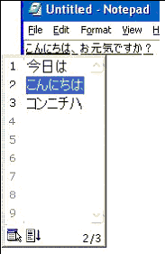

# Input Method Editor and Text Services Framework Accessibility in Windows XP

Microsoft Corporation

June 2002

**Summary:** Learn how to use the Input Method Editor (IME) and Microsoft Windows Text Services Framework-enabled applications to ensure that users who require assistive technology can successfully enter complex languages. These tools are used to access composition and alternative strings. The reader should be familiar with TSF and with Microsoft Active Accessibility. (8 printed pages)

Download the [ReadComp.exe](http://download.microsoft.com/download/0/2/7/0270634f-e059-4ce8-88b9-0668c4d17e5c/ReadComp.exe) code sample.

> [!Note]  
> This article uses Japanese IME as an example, though a similar technique should be useful for other language versions of IME or different input services such as voice input and handwriting input service.

 

> [!Note]  
> This specification does not explain basics of Active Accessibility and TSF. For more detail about IAccessible, WinEvents, and TSF interfaces, refer to the Microsoft Windows SDK.

 

-   [Introduction](#introduction)
    -   [Input Method Editor](#input-method-editor-and-text-services-framework-accessibility-in-windows-xp)
    -   [Text Services Framework](#input-method-editor-and-text-services-framework-accessibility-in-windows-xp)
-   [Accessing Candidate Strings using Active Accessibility Support by IME](#accessing-candidate-strings-using-active-accessibility-support-by-ime)
-   [Accessing Compositions Strings Using Text Services Framework](#accessing-compositions-strings-using-text-services-framework)
    -   [Initialization](#initialization)
    -   [Access Composition Strings Under Edit](#access-composition-strings-under-edit)
    -   [1. Register callback function to ITfTextEditSink](#1-register-callback-function-to-itftexteditsink)
    -   [2. Get text of the composition string being edited](#2-get-text-of-the-composition-string-being-edited)
-   [Reference Documents](#reference-documents)

## Introduction

For East Asian language versions of operating systems and applications (Simplified Chinese, Traditional Chinese, Japanese, and Korean), Input Method Editor (IME) is a critical portion of the operating system services that ensures the user can successfully enter these complex languages.

The input process of Eastern Asia languages requires an interactive user interface, and the accessibility is critical to users who require assistive technology products to type. The process is very different from typing in English. The typed commands are immediately converted into different characters and alternative candidates. Assistive technology products such as screen reader help users to translate the processing for each conversion and candidate enumeration. All key changes or text must be recognized or the user may lose track of what he or she just typed.

The success of translating the processing in a way that is clear to the user is fully dependent on how the key interaction information (corresponding events and node to key text) is shared by applications. Text Services Framework (TSF) provides text services to the application and to users. The same interface is also used in assistive technology products such as the screen reviewing tool or on-screen keyboard.

By supporting TSF, developers can leverage a wide variety of input services so that assistive technology products can access key information more effectively than with the legacy IMM32-based solutions.

The techniques introduced in this article are examples that are available today. Developers of Microsoft Windows applications should be aware of these techniques and related variations.

### Input Method Editor

In addition to the graphical user interface (GUI) elements, it is critical for these assistive technology products to get real-time text events and strings in proper timings to effectively translate a user's input in various forms.

With the complexity of the East Asian languages, it is impossible to map all language-specific characters into Western alphabet maps. For this reason, input services were designed to support the complex typing steps.

Assistive technology products translate all user interactions between IME and key inputs while the user is typing. The following examples are Chinese and Japanese IME user interaction translated by screen reader.

> [!Note]  
> The screen reader may transform the UI activities into synthetic speech (text-to-speech engine) or a refreshable Braille display.

 

Typically, in East Asian versions of screen reader, the tools need to access both composition strings and alternative candidate strings (or hint text) explain what is being displayed on screen. Composition strings appear as text on the line of the edit field as focused (typically underlined) and alternative candidate text is stored as a list item shown in the IME candidate UI. Refer to Figure 1 Composition String and Candidate String examples with Japanese IME.


Figure 2 Chinese IME and screen reader is a screen shot from Chinese (PRC) IME in the Notepad edit field. The user typed "n, i, h, a, o" (for instance, this could be supported by the Chinese screen reader by pronounced "N I 'nii' H A O".). The small tip ("hao\_") window that appears next to the Chinese character "Ni" is a composition reading window created by the Chinese (PRC) IME.

The IME may have a unique user interface to show user input feedback (the Chinese (PRC) IME composition reading window) and the accessibility support may vary in a different IME.


Figure 3 screen shot from Japanese IME and screen reader is a screen shot from Japanese IME in the Notepad edit field. User typed "k, o, n, n, n, i, t, i, h, a, (comma), o, g, e, n, k, i, d, e, s, u, k, a, ?, (space)". For instance, this could be supported by Japanese screen reader by pronounced "K 'ko' N 'n' N 'ni' T 'chi' H 'ha' 'ten' . . . ".



### Text Services Framework

> [!Note]  
> TSF is a system service in Microsoft Windows XP and will be present in future versions of the Windows operating system. The support may also be installed as part of Microsoft Office XP applications on Microsoft Windows 2000 and other down-level operating systems. In Windows XP and in down-level systems, TSF is only available for TSF-enabled applications, such as Office XP and Microsoft Internet Explorer. In Windows XP SP1, all non-TSF-enabled applications, except 16-bit and console window applications, are empowered by the TSF-based text services through a compatibility layer.

 

The TSF layer supporting full TSF functionality provides an interface between the TSF-enabled application and IME (TSF-based input) service for composition string exchanges.

For the alternative text in the IME candidate UI, assistive technology products access the UI directly though Active Accessibility.

However, some assistive technology products require access to only the composition string by way of the TSF layer and control the user interaction by using the programmatic interface provided by the framework.

For example, a software keyboard may be written to display the candidate text in its UI rather than allow the user to actually access the text though the IME candidate UI. TSF is a powerful tool to access not only the composition string but also the whole Document Object Model of the target application.

For more information about TSF, refer to the [Text Services Framework](https://msdn.microsoft.com/library/windows/desktop/ms629032).

> [!Note]  
> Windows Text Services Framework is a relatively new interface, supported since Office XP, Windows XP, and future versions of the Windows operating system. Assistive Technology products can still use the older input manager (IMM32) for the programmatic access to composition and candidate strings (IMMGetCompositionString), although new input services may be available only though the new interface.

 

## Accessing Candidate Strings using Active Accessibility Support by IME

This section introduces Active Accessibility support by one of most common text input services' user interface, the Microsoft IME candidate UI.

The Microsoft IME candidate selection UI notifies WinEvents for the UI object changes. You can get the change by calling **AccessibleObjectFromEvent** API.

Refer to MSDN Library [Microsoft Active Accessibility](https://msdn.microsoft.com/library/windows/desktop/dd373592) for more information.

When the Candidate selection UI window opens, **OBJECT\_SHOW** WinEvent should be notified from the window. The window will contain child **IAccessible** objects as individual alternate strings and the selected item is the one with **STATE\_SYSTEM\_SELECTED** state for the state property flag.

Every time the user changes the candidate string, the UI notifies applications by way of the **OBJECT\_SELECTION** WinEvent.

When the candidate string changes, the accessible technology tool can track the activity through the following steps:

1.  Hook the key WinEvents: **OBJECT\_SHOW** and **OBJECT\_SELECTION**.
2.  When **OBJECT\_SHOW** event is received, look for the child **IAccessible** object with **STATE\_SYSTEM\_SELECTED** state to find the current candidate string.
3.  When **OBJECT\_SELECTION** event is received, get the **IAccessible** for the selected candidate string.

Currently, the IME 2002 Candidate UI contains some Active Accessibility design issues. Workaround techniques are described in the Knowledge Base article [J070189: How to Get Candidate Strings from IME 2002 Candidate UI](http://go.microsoft.com/fwlink/p/?linkid=208732).

> [!Note]  
> The article J070189 is currently available only in Japanese. Contact your local PSS if you need a translated version.

 

> [!Note]  
> Composition strings are available though TSF when the support exists (refer to the [Accessing Compositions Strings Using Text Services Framework](#accessing-compositions-strings-using-text-services-framework) section of this document).

 

> [!Note]  
> Active Accessibility can be the alternative choice for the composition string interface when the composition window is drawn by IME. The UI object overlaid to the edit field is only available when it is the target application supporting IME level 2. For example, Notepad and Windows Shell controls support IME level 2.

 

> [!Note]  
> IME Level 2: IME draws composition string, IME Level 3: Edit Control draws composition string.

 

## Accessing Compositions Strings Using Text Services Framework

This section describes use of the TSF layer for accessibility.

### Initialization

All TSF clients must create the **ITfThreadMgr** interface and register **ITfThreadMgrEventSink**.

By registering the **ITfThreadMgrEventSink**, the client can be notified of events corresponding to certain thread manager events, that is, when input context is added or removed.

To access the composition string managed in TSF, the assistive technology products must create the **ITfThreadMgr** in the process of creating the target TSF-enabled applications.

Those interfaces must be released when the thread manager and the event sink are no longer needed (that is, when the capture of the composition strings is complete).

When the application creates a document, it usually creates a Document Input Manager (Dim) and the corresponding input context would start to be added to the TSF context stack (i.e. **ITfThreadMgrEventSink::OnInitDocumentMgr**).

Begin to capture the composition string at this point. Assistive technology products can then prepare to acquire the text.

> [!Note]  
> If you need to detect when IME turns the conversion on and off, you can use **ITfCompartmentMgr** to retrieve the **GUID\_COMPARTMENT\_KEYBOARD\_OPENCLOSE** compartment with **ITfCompartment** interface.

 

> [!Note]  
> You can implement the **ITfCompartmentEventSink** and advise it to capture **ITfCompartment** so you will get the notification of the changes to **GUID\_COMPARTMENT\_KEYBOARD\_OPENCLOSE**.

 

### Access Composition Strings Under Edit

Initialization is a per application-thread event. The following steps are also required on a per application-thread basis.

### 1. Register callback function to ITfTextEditSink

The **ITfTextEditSink** interface supports completion of an edit session that involves read/write access.

Install this **AdviseSink** by calling **ITSFource::AdviseSink** with **IID\_ITfTextEditSink**. The accessible technology product can register the callback function to the **ITfTextEditSink::OnEndEdit** method to get called every time the composition changes.

The accessible technology product can register the **ITfTextEditSink** interface when **ITfThreadMgrEventSink::OnInitDocumentMgr** is called (that is when to start capturing the composition string).

**ITfTextEditSink** must be advised to the edit context defined by **ITfContext**. The **ITfContext** interface for the application's document can be retrieved by **ITfDocumentMgr::GetBase**.

When **ITfThreadMgrEventSink::OnUninitDocumentMgr** is called, the registered **ITfEditSink** should be released properly.

### 2. Get text of the composition string being edited

To start acquiring text for the composition, the accessible technology product needs to get the pointer to the **ITfContextComposition** interface from the **ITfContxt** interface through the **QueryInterface**.

**ITfContextComposition** may store multiple instances of **ITfCompositionView** and one **ITfCompositionView** instance that include a range of data corresponding to each composition segment.

To get a full composition text capture in the edit context, all composition view objects must be enumerated. Use the **IEnumITfCompositionView** interface for the enumeration, and it will be retrieved from the **ITfContextComposition::EnumCompositions** method.

**ITfCompositionView::GetRange** returns the range for the composition string, and **ITfRange::GetText** returns the text of the composition string.

To track the changes of the edit context, the assistive technology product can also use the **ITfEditRecord** passed by **ITfTextEditSink::OnEndEdit**.

For more information about TSF edit context and range, see [Common Elements](https://msdn.microsoft.com/library/windows/desktop/ms538057).

The following example code is digesting the steps described above. For detailed steps, refer to the [ReadComp.exe](http://download.microsoft.com/download/0/2/7/0270634f-e059-4ce8-88b9-0668c4d17e5c/ReadComp.exe) code sample.

``` syntax
 ...
ITfContext *pic;

// get pointer to ITfContextComposition interface
pic->QueryInterface(IID_ITfContextComposition, _
                                (void**)&pContextComposition);

// creates enumerator object for all compositions in context
pContextComposition->EnumCompositions(&pEnumComposition);

// obtain pointer to the composition view from the current 
// position to the end
while(pEnumComposition->Next(1, &pCompositionView, NULL) == S_OK) {
      ITfRange *pvRange;
      ULONG writeSize;
      WCHAR wStr[WCHAR_MAX];

      // get range object and receive the text into buffer (wStr)
      pCompositionView->GetRange(&pvRange);
      pvRange->GetText(pTESEndEdit->ecReadOnly, _
                  TF_TF_IGNOREEND, wStr, WCHAR_MAX, &writeSize);
      wStr[writeSize] = NULL;

      // store the composition string into bstr
      bstr = SysAllocString(wStr);

      SysFreeString(bstr);
      pvRange->Release();
      pCompositionView->Release();
      }
pEnumComposition->Release();
pContextComposition->Release();
...
```

## Reference Documents


| Document                                                                           | Purpose                                                                                                                                |
|------------------------------------------------------------------------------------|----------------------------------------------------------------------------------------------------------------------------------------|
| [Text Services Framework](https://msdn.microsoft.com/library/windows/desktop/ms629032)                             | Technical reference of Text Services Framework (TSF)                                                                                   |
| [Microsoft Active Accessibility](https://msdn.microsoft.com/library/windows/desktop/dd373592)           | Technical reference of Microsoft Active Accessibility                                                                                  |
| [Knowledge Base Article JP418798](http://go.microsoft.com/fwlink/p/?linkid=208732) | Knowledge Base article that explains Japanese IME 2002 Active Accessibility design and behaviors (currently in Japanese language only) |


 

 

 


