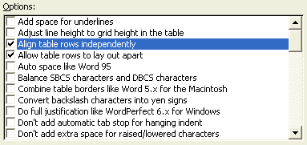

# Microsoft Active Accessibility Support for Container Objects

Microsoft Corporation

October 2002

**Summary:** Learn how to correctly interpret the Active Accessibility properties of container objects filled with non-standard child elements, such as a List-view control filled with checkboxes.

-   [Introduction](#introduction)
-   [Understanding the Components of this Article](#understanding-the-components-of-this-article)
-   [Basic: Leverage Default Control Options](#basic-leverage-default-control-options)
-   [Advanced: Container Objects Filled with Non-Standard Child Elements](#advanced-container-objects-filled-with-non-standard-child-elements)
    -   [Three Rules for Best Practice](#three-rules-for-best-practice)
    -   [Example Implementations](#example-implementations)
    -   [Provide Active Accessibility support for new controls](#provide-active-accessibility-support-for-new-controls)
    -   [Leverage Active Accessibility support for existing controls](#leverage-active-accessibility-support-for-existing-controls)
    -   [Example](#example-implementations)
-   [Summary](#summary)

This technical article describes Microsoft Active Accessibility support for container objects filled with non-standard child elements, such as a List-view control filled with checkboxes.

It is intended for developers and for assistive technology vendors (ATVs) who need to use assistive technology tools to correctly interpret the Active Accessibility properties of this type of control.

This special style of list box is often used when an application has many related options, but there are too many to fit in a static dialog box. Figure 1 shows an example of a List-view filled with check boxes. It is taken from the Microsoft Word Options dialog box.



## Introduction

A standard container object (for example, List-view control) may have non-standard elements, therefore an ATV needs to interpret the Active Accessibility properties of this type of control correctly to the user. Assistive technology users are the most affected group—they need to understand what actions can be performed on the active elements.

Such controls may be implemented by customizing existing controls. The [Advanced: Container Objects Filled with Non-Standard Child Elements](#advanced-container-objects-filled-with-non-standard-child-elements) section of this topic describes how custom behavior can be implemented and exposed through Active Accessibility.

## Understanding the Components of this Article

The Basic section of this article describes how a developer can leverage built-in support for non-standard list elements within control libraries available today. Applications that do not use the standard control support of different styles may need to simulate other controls manually.

The Advanced section of this article explains how custom controls can support the non-standard child element object using Active Accessibility.

## Basic: Leverage Default Control Options

The control style is useful when you want to display series of dynamic options in a control.

Check boxes were not originally a standard element for List-view control, although standard list controls, such as List-view and Tree-view controls support a check box option today (See Table 1.). Other standard controls may support similar options.

**Table 1. Check box support by Tree-view and List-view controls**


| Control                           | Style constants/property for check boxes |
|-----------------------------------|------------------------------------------|
| Tree-view control (SysTreeView32) | TVS\_CHECKBOXES                          |
| List-view control (SysListView32) | LVS\_EX\_CHECKBOX                        |
| Tree-view Windows Form Class      | TreeView.CheckBoxes property             |
| List-view Windows Form Class      | ListView.CheckBoxes property             |


 

By using the built-in support within these default controls, you can get correct programmatic access of List-view with check boxes for free.

Active Accessibility will expose the container as a List-view control and its children (checkable items) as check boxes. You may find other options for advanced styles in other standard controls, and you may get the Active Accessibility support for free. The following example shows a simple Active Accessibility object hierarchy of a List-view control (accRole) filled with check boxes.

``` syntax
 - ROLE_SYSTEM_LIST
  |- ROLE_SYSTEM_CHECKBUTTON
  |- ROLE_SYSTEM_CHECKBUTTON
  |- ROLE_SYSTEM_CHECKBUTTON
```

The **accRole** property is not the only property that is affected, but it is a clear example.

It is important to remember that non-standard List-item and multiple selections cannot coexist. Whenever you apply such an option to a List-view control, you must set the control to single selectable because it is difficult to manage a multi-select list of checkable items. Check box provides a new selection matrix to the list; thus the multiple selectable option becomes unnecessary.

The multiple selectable option adds another step to select items, but the selection is not directly related to check boxes. The following example shows sample C\# code for Windows Form ListView control with check boxes.

``` syntax
   YourListViewControl.CheckBoxes = <code><b class="cfe">true;</b></code>
   YourListViewControl.MultiSelect = <code><b class="cfe">false;</b></code>
```

> [!Note]  
> The hit-test area of these list check boxes may be slightly different from standard check box controls. The hit-test region for these list check boxes only includes the small check box rectangle to the side of the label text.

 

> [!Note]  
> The hit-test area is slightly different in List-view and Tree-view control. The hit-test area difference is OK when the container obviously looks a standard list container, because the check box item also acts like a List-item.

 

> [!Note]  
> A standard check box can be checked and deselected by clicking the hit area or pressing the space key when the item is selected. The space key works both for standard check boxes and for listed check boxes.

 

## Advanced: Container Objects Filled with Non-Standard Child Elements

Although some standard list controls allow you to add check boxes, your application may require more complexity to achieve the design goal. For example, you may want to bind some check box items with an outline item from the folder icon, or you may want to list non-standard elements that are not supported by default (that is, combo boxes and radio buttons).

### Three Rules for Best Practice

The baseline rule can be summarized in three rules. You should follow these rules whenever you create a new customized control that holds non-standard child elements.

### Rule 1: The container should be "single selectable" for usability and simplicity, if the container object has anything other than items with plain text (a non-standard List-item such as checkbox or push button).

Multiple selectable containers are only possible when you have filled the control with standard List-items (for example, static text and static graphics such as an icon). If you have listed anything other than standard List-items in a container object (such as check boxes and push buttons), the selection should be in the same location as the focus.

### Rule 2: Child elements should operate in the same way they operate on a standard dialog box.

The behavior of non-standard list elements must match that of the standard control for usability and simplicity. You may slightly change behavior only when it is necessary to increase usability.

For example, clicking on the check box or its title changes the state of a traditional check box in a static dialog box. For a checkable List-view control, the clickable area includes only the small check box to maintain the container’s (List-view) navigation model for the elements.

### Rule 3: The state, events, and properties for the Active Accessibility objects of a container and a child element object must always be consistent with its visual representation.

The programmatic access model of a custom control must be consistent with its navigation model and with the visual representation. The implementations that support this third rule differ depending on how the controls are developed. Refer to the following section, Example Implementations.

### Example Implementations

There are many different ways to implement customized controls; however you need to make certain the customized controls are visually and programmatically consistent with its similar controls. This section introduces the major examples for additional information for Rule 3.

### Provide Active Accessibility support for new controls

If you develop a new custom control, you will need to develop the full Active Accessibility support as well.

The implementation must be consistent with similar common controls. For example, if you create a new custom control that looks like a Tree-view or List-view control, you will also need to use ROLE\_SYSTEM\_OUTLINEITEM as the **accRole** for tree nodes or ROLE\_SYSTEM\_LISTITEM for List-items. If the List-item acts as an option button, the role should be ROLE\_SYSTEM\_RADIOBUTTON.

### Leverage Active Accessibility support for existing controls

If you use a Tree-view or List-view control that is manually replaced by icons with functional bitmaps (for example, check boxes or radio buttons), you may use Dynamic Annotation to leverage the Active Accessibility support for the control.

Dynamic Annotation allows you to change or replace the specific role or methods that are affected by the customization. Refer to the reference material about dynamic annotation in the MSDN article *Create More Accessible UI with Dynamic Annotation*.

### Example

This example pertains to the Windows Control Panel Folder Options View tab.

Figure 2 is a screen shot of the dialog box.

The grouping items (items with a folder icon but without a check box) have **accRole** SYSTEM\_ROLE\_OUTLINEITEM and **accName** equal to the label. Check box items have **accRole** SYSTEM\_ROLE\_CHECKBUTTON, and option button items have **accRole** SYSTEM\_ROLE\_RADIOBUTTON. The **accValue** of each list item represents the different levels of hierarchy.

``` syntax
'- "Advanced Settings" (ROLE_SYSTEM_OUTLINE)
 |- "Files and Folders" (SYSTEM_ROLE_OUTLINEITEM) (accValue=0)
 |- "Automatically search ..." (SYSTEM_ROLE_CHECKBUTTON) (accValue=1)
 |- "Display file size ..." (SYSTEM_ROLE_CHECKBUTTON) (accValue=1)
 |-    ...
 |- "Hidden files and folders" (SYSTEM_ROLE_OUTLINEITEM) (accValue=1)
 |- "Do not show hidden files ..." SYSTEM_ROLE_RADIOBUTTON (accValue=2)
 |- "Show hidden files and folders" (SYSTEM_ROLE_RADIOBUTTON) (accValue=2)
 |- "Hide extensions for known ..." (SYSTEM_ROLE_CHECKBUTTON) (accValue=1)
```

In this example, the accRole property is widely used to explain the proper object behavior because it is the most obvious. The property, however, is not the only property that is affected by control modification. Other object properties (for example, accState and accName) and accessible WinEvents should be treated accordingly.


## Summary

As described in this article, a container object may have non-standard elements. Assistive technology tools can interpret the Active Accessibility properties of this type of control correctly to users even if it is unusual element in a standard container object.

Developers and vendors who follow the three rules and implementation examples listed in this article will ensure that all users will understand the customized elements.

 

 


