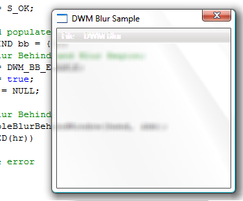

# DWM Blur Behind Overview

One of the signature Desktop Window Manager (DWM) effects is a translucent and blurred non-client area. The DWM APIs enable applications to apply these effects to the client area of their top-level windows.

> [!Note]  
> Windows Vista Home Basic edition does not support the transparent glass effect. Areas that would typically render with the transparent glass effect on other Windows editions are rendered as opaque.
> Beginning with Windows 8, calling this function doesn't result in the blur effect, due to a style change in the way windows are rendered.


 

This topic discusses the following client blur-behind scenarios that the DWM enables.

-   [Adding Blur to a Specific Region of the Client Area](#adding-blur-to-a-specific-region-of-the-client-area)
-   [Extending the Window Frame into the Client Area](#extending-the-window-frame-into-the-client-area)
-   [Related topics](#related-topics)

## Adding Blur to a Specific Region of the Client Area

An application can apply the blur effect behind the whole client region of the window or to a specific subregion. This enables applications to add styled path and search bars that are visually separate from the rest of the application.

The API used in this scenario is the [**DwmEnableBlurBehindWindow**](/windows/desktop/api/Dwmapi/nf-dwmapi-dwmenableblurbehindwindow) function, which makes use of the [**DWM Blur Behind Constants**](dwm-bb-constants.md) and the [**DWM\_BLURBEHIND**](/windows/desktop/api/Dwmapi/ns-dwmapi-dwm_blurbehind) structure.

The following example function, `EnableBlurBehind`, illustrates how to apply the blur-behind effect to the whole window.


```
HRESULT EnableBlurBehind(HWND hwnd)
{
    HRESULT hr = S_OK;

    // Create and populate the blur-behind structure.
    DWM_BLURBEHIND bb = {0};

    // Specify blur-behind and blur region.
    bb.dwFlags = DWM_BB_ENABLE;
    bb.fEnable = true;
    bb.hRgnBlur = NULL;

    // Enable blur-behind.
    hr = DwmEnableBlurBehindWindow(hwnd, &bb);
    if (SUCCEEDED(hr))
    {
        // ...
    }
    return hr;
}
```


Note that **NULL** is specified in the *hRgnBlur* parameter. This tells the DWM to apply the blur behind the whole window.

The following image illustrates the blur-behind effect applied to the whole window.



To apply the blur behind a subregion, apply a valid region handle (HRGN) to the **hRgnBlur** member of the [**DWM\_BLURBEHIND**](/windows/desktop/api/Dwmapi/ns-dwmapi-dwm_blurbehind) structure and add the **DWM\_BB\_BLURREGION** flag to the **dwFlags** member.

When you apply the blur-behind effect to a subregion of the window, the alpha channel of the window is used for the nonblurred area. This can cause an unexpected transparency in the nonblurred region of a window. Therefore, be careful when you apply a blur effect to a subregion.

## Extending the Window Frame into the Client Area

An application can extend the blur of the window frame into the client area. This is useful when you apply the blur effect behind a window with a docked toolbar or visually separate controls from the rest of an application. This functionality is exposed by the [**DwmExtendFrameIntoClientArea**](/windows/desktop/api/Dwmapi/nf-dwmapi-dwmextendframeintoclientarea) function.

To enable blur by using [**DwmExtendFrameIntoClientArea**](/windows/desktop/api/Dwmapi/nf-dwmapi-dwmextendframeintoclientarea), use the [**MARGINS**](/windows/win32/api/uxtheme/ns-uxtheme-margins) structure to indicate how much to extend into the client area. The following example function, `ExtendIntoClientBottom`, toggles the blur extension on the bottom of the non-client frame into the client area.


```
HRESULT ExtendIntoClientBottom(HWND hwnd)
{
    HRESULT hr = S_OK;

    // Set the margins, extending the bottom margin.
    MARGINS margins = {0,0,0,25};

    // Extend the frame on the bottom of the client area.
    hr = DwmExtendFrameIntoClientArea(hwnd,&margins);
    if (SUCCEEDED(hr))
    {
        // ...
    }
    return hr;
}
```


The following image illustrates the blur-behind effect extended into the bottom of the client area.


Also available through the [**DwmExtendFrameIntoClientArea**](/windows/desktop/api/Dwmapi/nf-dwmapi-dwmextendframeintoclientarea) method is the "sheet of glass" effect, where the blur effect is applied to the whole surface of the window without a visible window border. The following example demonstrates this effect where the client area is rendered without a window border.


```
HRESULT ExtendIntoClientAll(HWND hwnd)
{
    HRESULT hr = S_OK;

    // Negative margins have special meaning to DwmExtendFrameIntoClientArea.
    // Negative margins create the "sheet of glass" effect, where the client 
    // area is rendered as a solid surface without a window border.
    MARGINS margins = {-1};

    // Extend the frame across the whole window.
    hr = DwmExtendFrameIntoClientArea(hwnd,&margins);
    if (SUCCEEDED(hr))
    {
        // ...
    }
    return hr;
}
```


The following image illustrates the blur-behind in the "sheet of glass" window style.


## Related topics

<dl> <dt>

[Desktop Window Manager Overview](dwm-overview.md)
</dt> <dt>

[Enable and Control DWM Composition](composition-ovw.md)
</dt> <dt>

[Performance Considerations and Best Practices](bestpractices-ovw.md)
</dt> </dl>

 

 