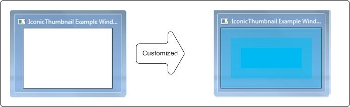

# Customize an Iconic Thumbnail and a Live Preview Bitmap

This topic contains the following sections:

-   [Description](#description)
-   [Requirements](#requirements)
-   [Building the Sample](#building-the-sample)
-   [Related topics](#related-topics)

## Description

This sample shows how to customize an iconic thumbnail and a *live preview* (or *Peek preview*) bitmap by using functions and messages that are introduced in the Windows 7 Desktop Window Manager (DWM) APIs. Specifically, this sample uses the [**DwmSetIconicThumbnail**](/windows/desktop/api/Dwmapi/nf-dwmapi-dwmseticonicthumbnail) function and the [**WM\_SENDICONICTHUMBNAILBITMAP**](wm-dwmsendiconicthumbnail.md) message to customize an iconic thumbnail. It also uses the [**DwmSetIconicLivePreviewBitmap**](/windows/desktop/api/Dwmapi/nf-dwmapi-dwmseticoniclivepreviewbitmap) function and the [**WM\_SENDICONICLIVEPREVIEWBITMAP**](wm-dwmsendiconiclivepreviewbitmap.md) message to set an iconic live preview bitmap.

The following illustration shows a default thumbnail transformed into a customized thumbnail.

## Requirements

|                          |                                                                                                                     |
|--------------------------|---------------------------------------------------------------------------------------------------------------------|
| Minimum supported client | Windows 7 or Windows Vista with Service Pack 2 (SP2) and Platform Update for Windows Vista                          |
| Minimum supported server | Windows Server 2008 R2 or Windows Server 2008 with Service Pack 2 (SP2) and Platform Update for Windows Server 2008 |
| Windows SDK              | [Windows Software Development Kit (SDK) for Windows 7](https://msdn.microsoft.com/windows/bb980924.aspx)             |

## Building the Sample

**To build the sample by using the command prompt**

1.  Open a Command Prompt window and browse to the sample directory.
2.  Enter `msbuild IconicThumbnail.sln`.

**To build the sample by using Microsoft Visual Studio 2008 (preferred method)**

1.  Open Windows Explorer and browse to the folder where the IconicThumbnail.sln file is located.
2.  Double-click the solution file (.sln) to open the file in Microsoft Visual Studio.
3.  On the **Build** menu, click **Build Solution**. The application is built in the default \\Debug or \\Release directory.

## Related topics

[Desktop Window Manager](dwm-overview.md)

[Windows Development](/windows/desktop/win32-and-com-development)