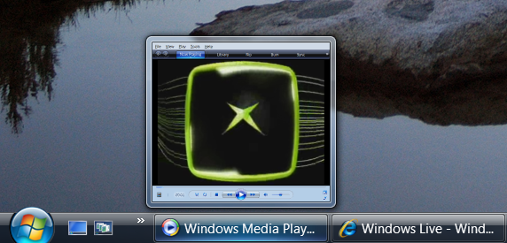
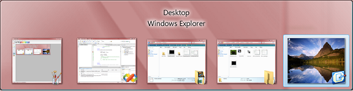

# DWM Thumbnail Overview

Desktop Window Manager (DWM) enables the display of thumbnail representations of application windows. These are not static snapshots of a window, but are instead dynamic, constant connections between a thumbnail source window and a location on a destination window that receives the live thumbnail rendering. This allows a quick view of running applications by hovering over the application on the taskbar or using the ALT-TAB key gesture to see and quickly switch to an application.

The following image illustrates the Windows Vista live thumbnail seen when you hover over the application on the taskbar.



The following image illustrates the Windows Vista Flip (ALT-TAB) enabled by DWM.



> [!Note]  
> DWM thumbnails do not enable developers to create applications like the Windows Vista Flip3D (WINKEY-TAB) feature. Thumbnails are rendered directly to the destination window in 2-D.

 

## DWM Thumbnail Relationships

To display thumbnails in your application, you must first establish a relationship between a source window and a destination window. This is done by calling the [**DwmRegisterThumbnail**](/windows/desktop/api/Dwmapi/nf-dwmapi-dwmregisterthumbnail) function.

[**DwmRegisterThumbnail**](/windows/desktop/api/Dwmapi/nf-dwmapi-dwmregisterthumbnail) does not render a thumbnail on the destination window but merely creates the relationship and provides the thumbnail handle. The thumbnail is rendered after the [**DWM\_THUMBNAIL\_PROPERTIES**](/windows/desktop/api/Dwmapi/ns-dwmapi-dwm_thumbnail_properties) have been set and the [**DwmUpdateThumbnailProperties**](/windows/desktop/api/Dwmapi/nf-dwmapi-dwmupdatethumbnailproperties) function has been called. Subsequent calls to **DwmUpdateThumbnailProperties** update the thumbnail with a new set of properties. The DWM also provides the helper function [**DwmQueryThumbnailSourceSize**](/windows/desktop/api/Dwmapi/nf-dwmapi-dwmquerythumbnailsourcesize) to obtain the size of the source window from the thumbnail.

To end a thumbnail relationship, call the [**DwmUnregisterThumbnail**](/windows/desktop/api/Dwmapi/nf-dwmapi-dwmunregisterthumbnail) function.

The following example demonstrates how to create a releationship with the Windows desktop and display it in an application.


```
HRESULT hr = S_OK;
HTHUMBNAIL thumbnail = NULL;

// Register the thumbnail
hr = DwmRegisterThumbnail(hwnd, FindWindow(_T("Progman"), NULL), &thumbnail);
if (SUCCEEDED(hr))
{
    // Specify the destination rectangle size
    RECT dest = {0,50,100,150};

    // Set the thumbnail properties for use
    DWM_THUMBNAIL_PROPERTIES dskThumbProps;
    dskThumbProps.dwFlags = DWM_TNP_SOURCECLIENTAREAONLY | DWM_TNP_VISIBLE | DWM_TNP_OPACITY | DWM_TNP_RECTDESTINATION;
    dskThumbProps.fSourceClientAreaOnly = FALSE; 
    dskThumbProps.fVisible = TRUE;
    dskThumbProps.opacity = (255 * 70)/100;
    dskThumbProps.rcDestination = dest;

    // Display the thumbnail
    hr = DwmUpdateThumbnailProperties(thumbnail,&dskThumbProps);
    if (SUCCEEDED(hr))
    {
        // ...
    }
}
return hr;
```


## Related topics

<dl> <dt>

[Desktop Window Manager Overview](dwm-overview.md)
</dt> <dt>

[Enable and Control DWM Composition](composition-ovw.md)
</dt> <dt>

[Performance Considerations and Best Practices](bestpractices-ovw.md)
</dt> </dl>

 

 


