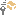

# EsentNoCurrentIndexException methods

Include protected members  
Include inherited members  

The [EsentNoCurrentIndexException](./esentnocurrentindexexception-class.md) type exposes the following members.

## Methods

<table>
<thead>
<tr class="header">
<th> </th>
<th>Name</th>
<th>Description</th>
</tr>
</thead>
<tbody>
<tr class="odd">
<td></td>
<td><a href="/dotnet/api/system.object.equals#System_Object_Equals_System_Object_">Equals</a></td>
<td>(Inherited from <a href="/dotnet/api/system.object">Object</a>.)</td>
</tr>
<tr class="even">
<td></td>
<td><a href="/dotnet/api/system.object.finalize#System_Object_Finalize">Finalize</a></td>
<td>(Inherited from <a href="/dotnet/api/system.object">Object</a>.)</td>
</tr>
<tr class="odd">
<td></td>
<td><a href="/dotnet/api/system.exception.getbaseexception#System_Exception_GetBaseException">GetBaseException</a></td>
<td>(Inherited from <a href="/dotnet/api/system.exception">Exception</a>.)</td>
</tr>
<tr class="even">
<td></td>
<td><a href="/dotnet/api/system.object.gethashcode#System_Object_GetHashCode">GetHashCode</a></td>
<td>(Inherited from <a href="/dotnet/api/system.object">Object</a>.)</td>
</tr>
<tr class="odd">
<td></td>
<td><a href="dn334369(v=exchg.10).md">GetObjectData</a></td>
<td>When overridden in a derived class, sets the <a href="/dotnet/api/system.runtime.serialization.serializationinfo">SerializationInfo</a> with information about the exception. (Inherited from <a href="dn274314(v=exchg.10).md">EsentErrorException</a>.)</td>
</tr>
<tr class="even">
<td></td>
<td><a href="/dotnet/api/system.exception.gettype#System_Exception_GetType">GetType</a></td>
<td>(Inherited from <a href="/dotnet/api/system.exception">Exception</a>.)</td>
</tr>
<tr class="odd">
<td></td>
<td><a href="/dotnet/api/system.object.memberwiseclone#System_Object_MemberwiseClone">MemberwiseClone</a></td>
<td>(Inherited from <a href="/dotnet/api/system.object">Object</a>.)</td>
</tr>
<tr class="even">
<td></td>
<td><a href="/dotnet/api/system.exception.tostring#System_Exception_ToString">ToString</a></td>
<td>(Inherited from <a href="/dotnet/api/system.exception">Exception</a>.)</td>
</tr>
</tbody>
</table>

Top

## See also

#### Reference

[EsentNoCurrentIndexException class](./esentnocurrentindexexception-class.md)

[Microsoft.Isam.Esent.Interop namespace](./microsoft.isam.esent.interop-namespace.md)
