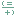

# JET_HANDLE members

Include protected members  
Include inherited members  

A JET_HANDLE contains a generic handle.

The [JET_HANDLE](./jet-handle-structure.md) type exposes the following members.

## Properties

<table>
<thead>
<tr class="header">
<th> </th>
<th>Name</th>
<th>Description</th>
</tr>
</thead>
<tbody>
<tr class="odd">
<td></td>
<td><a href="hh557005(v=exchg.10).md">Nil</a></td>
<td>Gets a null JET_HANDLE.</td>
</tr>
</tbody>
</table>

Top

## Methods

<table>
<thead>
<tr class="header">
<th> </th>
<th>Name</th>
<th>Description</th>
</tr>
</thead>
<tbody>
<tr class="odd">
<td></td>
<td><a href="hh596545(v=exchg.10).md">Equals(Object)</a></td>
<td>Returns a value indicating whether this instance is equal to another instance. (Overrides <a href="/dotnet/api/system.valuetype.equals#System_ValueType_Equals_System_Object_">ValueType.Equals(Object)</a>.)</td>
</tr>
<tr class="even">
<td></td>
<td><a href="hh596213(v=exchg.10).md">Equals(JET_HANDLE)</a></td>
<td>Returns a value indicating whether this instance is equal to another instance.</td>
</tr>
<tr class="odd">
<td></td>
<td><a href="/dotnet/api/system.object.finalize#System_Object_Finalize">Finalize</a></td>
<td>(Inherited from <a href="/dotnet/api/system.object">Object</a>.)</td>
</tr>
<tr class="even">
<td></td>
<td><a href="hh577493(v=exchg.10).md">GetHashCode</a></td>
<td>Returns the hash code for this instance. (Overrides <a href="/dotnet/api/system.valuetype.gethashcode#System_ValueType_GetHashCode">ValueType.GetHashCode()</a>.)</td>
</tr>
<tr class="odd">
<td></td>
<td><a href="/dotnet/api/system.object.gettype#System_Object_GetType">GetType</a></td>
<td>(Inherited from <a href="/dotnet/api/system.object">Object</a>.)</td>
</tr>
<tr class="even">
<td></td>
<td><a href="/dotnet/api/system.object.memberwiseclone#System_Object_MemberwiseClone">MemberwiseClone</a></td>
<td>(Inherited from <a href="/dotnet/api/system.object">Object</a>.)</td>
</tr>
<tr class="odd">
<td></td>
<td><a href="hh566023(v=exchg.10).md">ToString()</a></td>
<td>Generate a string representation of the structure. (Overrides <a href="/dotnet/api/system.valuetype.tostring#System_ValueType_ToString">ValueType.ToString()</a>.)</td>
</tr>
<tr class="even">
<td></td>
<td><a href="hh558626(v=exchg.10).md">ToString(String, IFormatProvider)</a></td>
<td>Formats the value of the current instance using the specified format.</td>
</tr>
</tbody>
</table>

Top

## Operators

<table>
<thead>
<tr class="header">
<th> </th>
<th>Name</th>
<th>Description</th>
</tr>
</thead>
<tbody>
<tr class="odd">
<td></td>
<td><a href="hh557740(v=exchg.10).md">Equality</a></td>
<td>Determines whether two specified instances of JET_HANDLE are equal.</td>
</tr>
<tr class="even">
<td></td>
<td><a href="hh578013(v=exchg.10).md">Inequality</a></td>
<td>Determines whether two specified instances of JET_HANDLE are not equal.</td>
</tr>
</tbody>
</table>

Top

## See also

#### Reference

[JET_HANDLE structure](./jet-handle-structure.md)

[Microsoft.Isam.Esent.Interop namespace](./microsoft.isam.esent.interop-namespace.md)
