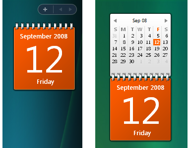
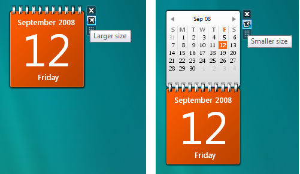

# Introduction to the Gadget Platform

\[ The Windows Gadget Platform/Sidebar is available for use in the following versions of Windows: Windows 7, Windows Vista, and Windows Server 2008. It may be altered or unavailable in subsequent versions. \]

This topic introduces the Windows Gadget Platform. It discusses the evolution of the Gadget Platform from the Windows Vista Sidebar, the differences between the two platforms, and what you need to know when you transition Sidebar gadgets to the new Windows Gadget Platform.

-   [Introduction](#introduction-to-the-gadget-platform)
-   [What's New for Gadgets in Windows 7](#whats-new-for-gadgets-in-windows-7)
    -   [Gadget Management](#gadget-management)
    -   [Gadget Development](#gadget-development)
-   [Windows Sidebar](#windows-sidebar)

## Introduction

The Windows Sidebar, introduced as a gadget presentation and development platform in Windows Vista, ships as the Windows Gadget Platform in Windows 7.

Gadgets are mini-applications that are based on a platform of XML, HTML, CSS, and script, that exposes functionality and information derived from local applications or Web services.

As a presentation platform, the Windows Vista Sidebar is a translucent, lockable panel on the desktop that acts as a "container" to host, display, and manage gadgets.

> [!Note]  
> Container is used loosely here because gadgets can be dragged easily from the Sidebar to the Windows desktop.

 

The design goals for the Gadget Platform emphasize backward compatibility with Vista Sidebar gadgets, tighter integration with the Windows desktop, and reduction of visual clutter through a refined and unified UI. To meet these goals, the Windows desktop replaces the Sidebar as the gadget container and management layer. Gadgets were never physically constrained to the Sidebar, so removing this middle layer visually streamlines the platform and maintains the full functionality of Sidebar gadgets.

## What's New for Gadgets in Windows 7

The Gadget Platform provides several improvements for gadget developers.

> [!Note]  
> A major goal for Gadget Platform is maintaining backward compatibility with Windows Vista. Implementing any of the following modifications on existing Sidebar gadgets does not prevent them from running on Windows Vista.

 

### Gadget Management

First and foremost of the improvements to Windows gadgets are the changes to gadget management.

### Good Bye Sidebar

Gone is the concept of the Sidebar as a container. Instead, gadgets are now hosted and displayed on the desktop. A **Gadgets** item on the Desktop context menu provides access to the **Gadgets Gallery** so that you can choose, install, and use gadgets. This change simplifies gadget management, streamlines and unifies the overall desktop UI, and eliminates the need for special Sidebar settings. Note that all gadgets are still owned by the sidebar.exe process.

The following screen shot compares the Sidebar context menu and the Windows 7 Desktop context menu.


### Show Desktop Gadgets

A new desktop option to hide or show all gadgets by stopping and starting the sidebar.exe process is now available. On the Desktop context menu, click the **View** command, and then uncheck the **Show Desktop Gadgets** option. By turning off the **Show Desktop Gadgets** option, you can achieve power-saving benefits on your laptop computer, and privacy concerns for people who use their computers for presentations are addressed.

> [!Note]  
> Screen location and settings are restored for each gadget when the sidebar.exe process is restarted.

 

The **Show Desktop Gadgets** option on the Windows 7 Desktop context menu is illustrated in the following screen shot.


### The Sidebar Process

Another performance improvement for Windows 7 is management of the sidebar.exe process. In Windows Vista, the Sidebar starts multiple instances of the sidebar.exe process. In Windows 7, only one instance of the sidebar.exe process starts. This single instance does not start until a gadget is added to the desktop, the **Gadget Picker** starts, or a new user session starts with existing gadgets on the desktop. If the **Gadget Picker** is closed with no gadgets added to the desktop, or the last gadget is deleted from the desktop, the sidebar.exe process stops automatically.

### Gadget Development

For gadget developers, the Windows 7 Gadget Platform provides significant improvements without breaking Windows Vista gadget functionality.

### Debugging

To help developers debug gadget applications, the following registry key has been added to Windows 7, which enables the display of script errors at run time.

`[HKEY_CURRENT_USER\Software\Microsoft\Windows\CurrentVersion\Sidebar] "ShowScriptErrors"=dword:00000001`

### Security

There are no significant changes to the security model of the Gadget Platform compared with the Windows Vista Sidebar. For further guidelines on writing secure gadgets, see [Inspect Your Gadget](http://msdn.microsoft.com/library/bb498012.aspx).

The following table describes the gadget installation locations and write and execute permissions for those locations.


<table>
<colgroup>
<col style="width: 33%" />
<col style="width: 33%" />
<col style="width: 33%" />
</colgroup>
<thead>
<tr class="header">
<th>Gadget type</th>
<th>Location</th>
<th>Permissions</th>
</tr>
</thead>
<tbody>
<tr class="odd">
<td>User gadgets</td>
<td>%localappdata%\Microsoft\Windows Sidebar\Gadgets</td>
<td>All users can write to this location.</td>
</tr>
<tr class="even">
<td>Shared gadgets</td>
<td>%programfiles%\Windows Sidebar\Shared Gadgets</td>
<td>Only members of the Administrators group can write to this location.</td>
</tr>
<tr class="odd">
<td>Windows gadgets</td>
<td>%programfiles%\Windows Sidebar\Gadgets</td>
<td>This location is reserved for Microsoft gadgets.
<blockquote>
[!Note]<br />
Even though members of the Administrators group can write to this location, third-party gadgets should never be installed here. Only gadgets that are written to this location by TrustedInstaller are recognized as Windows gadgets; all other gadgets are considered User gadgets.
</blockquote>
<br/></td>
</tr>
</tbody>
</table>


 

### Gadget Manifest

The gadget manifest is an XML file that contains general configuration and presentation information for a gadget. This information is displayed in the **Gadgets Gallery** as gadget and developer details, along with functional or informational icons. Each gadget package must include a manifest.

### Support for HighDPI

So that the Gadget Platform can support high-DPI capabilities, the `<autoscaleDPI>` element has been added to the manifest. It contains a boolean value of **true** or **false** (default). When set to **true**, the adaptive **Zoom** feature of the Internet Explorer rendering engine is enabled. The **Zoom** feature scales text and images for this gadget to match the DPI settings of the current user. If `<autoscaleDPI>` is set to **false**, or it is not declared in the manifest, the **Zoom** feature is not enabled.

The following is a sample manifest with the `<autoscaleDPI/>` node set to **true**.

> [!Note]  
> See [Developing a Gadget for Windows Sidebar Part 2: The G:BACKGROUND, G:IMAGE, G:TEXT Presentation Elements and GIMAGE Protocol](http://msdn.microsoft.com/library/bb676240.aspx) for best practices on using images and text in gadgets.

 


```XML
<?xml version="1.0" encoding="utf-8" ?>
<gadget>
        <name>Sample Gadget</name>
        <namespace>windows.sdk</namespace>
        <version>1.0.0.0</version>
        <author name="Microsoft">
                <info url="msdn.microsoft.com" />
                <logo src="logo.png" />
        </author>
        <copyright>&amp;amp;#169; Microsoft Corporation.</copyright>
        <description>Sidebar gadget sample.</description>
        <icons>
                <icon height="48" width="48" src="icon.png" />
        </icons>
        <hosts>
                <host name="sidebar">

                        <!-- New autoscaleDPI node -->
                        <autoscaleDPI>true</autoscaleDPI>

                        <base type="HTML" apiVersion="1.0.0" src="sample.html" />
                        <permissions>Full</permissions>
                        <platform minPlatformVersion="1.0" />
                        <defaultImage src="icon.png" />
                </host>
        </hosts>
</gadget>
```


### Scripting Element and Other API Changes

This section describes changes to the core set of scripting elements and APIs for the Gadget Platform.

### Programmatic Installation

[IDesktopGadget](http://msdn.microsoft.com/library/dd378389.aspx) is a new Windows Shell interface. It exposes the [RunGadget](http://msdn.microsoft.com/library/dd378390.aspx) method, which allows the programmatic addition of an installed gadget to the Windows 7 desktop.

> [!Note]  
> The gadget must be installed before calling this method for the method to return successfully.

 

This method can be called during the installation of an application that includes a supporting gadget as part of the installation package, for example, installing a calendar application that includes a gadget that displays upcoming appointments.

> \[!Important\]  
> Applications should not call [RunGadget](http://msdn.microsoft.com/library/dd378390.aspx) without asking the user for permission. If the permission choice is a check box, that check box should be unchecked, by default.

 

This [RunGadget](http://msdn.microsoft.com/library/dd378390.aspx) method cannot be used to add a gadget that is already running. If an instance of the gadget at the supplied path is already running, this method returns **SCHED\_E\_ALREADY\_RUNNING**.

The [RunGadget](http://msdn.microsoft.com/library/dd378390.aspx) method can be used to add Shared gadgets or Windows gadgets. The following table describes the installation locations for gadgets added by using the RunGadget method, and permissions for those locations.


| Gadget type     | Location                                        | Permissions                                                                                                                                                                                                                                               |
|-----------------|-------------------------------------------------|-----------------------------------------------------------------------------------------------------------------------------------------------------------------------------------------------------------------------------------------------------------|
| Shared gadgets  | %programfiles%\\Windows Sidebar\\Shared Gadgets | Only members of the Administrators group can write to this location. All gadgets located in this folder may be added with this method.                                                                                                                    |
| Windows gadgets | %programfiles%\\Windows Sidebar\\Gadgets        | Only members of the Administrators group can write to this location. The only gadgets that are recognized are those installed by TrustedInstaller. Consequently, only those gadgets that are installed by TrustedInstaller may be added with this method. |


 

If GadgetPath resolves to a gadget that is not a Shared gadget or a Windows gadget, E\_ACCESSDENIED is returned.

### System.Gadget.onDock and System.Gadget.onUndock Events

In Windows Vista Sidebar gadgets, you could link **onDock** and **onUndock** events to event handlers, so that a visual transition effect was automatically used when the gadget was docked to or undocked from the Sidebar.

An example of the visual transition that is defined in the dock and undock event handlers is shown in the following screen shot.



Because there is no Sidebar associated with the Gadget Platform in Windows 7, there are no dock and undock events. However, to maintain backward compatibility, the same code can be used for a similar effect. First, define a dock or undock event handler. When the mouse pointer hovers over the gadget or the gadget receives focus, an additional icon is displayed. Click this icon to raise the dock event (Smaller size) or undock event (Larger size). The gadget performs the visual transition, as shown in the following screen shots.



The following code example demonstrates how the same code works to connect the dock and undock event handlers for the Sidebar and the Gadget Platform.


```JScript
// Gadget width and height.
var gadgetWidth = 130;
var gadgetHeight = 108;

// Amount to scale gadget when docked or undocked.
var scaleDocked = 1;
var scaleUndocked = 2;

// Declare the dock and undock event handlers.
System.Gadget.onDock = CheckDockState;
System.Gadget.onUndock = CheckDockState;

// --------------------------------------------------------------------
// Check the gadget dock state; set the gadget style.
// imgBackground is the value of the 'id' attribute for the 
// g:background element.
// --------------------------------------------------------------------
function CheckDockState()
{
    var oBackground = document.getElementById("imgBackground");
    
    var oBody = document.body.style;
    if (System.Gadget.docked)
    {
        oBody.width = gadgetWidth*scaleDocked;
        oBody.height = gadgetHeight*scaleDocked;
        
        oBackground.src = "url(../images/bg_docked.png)";
        
        txtDocked.className = 'gadgetDocked';
        txtDocked.innerText = 'Docked';
    }
    else
    {
        oBody.width = gadgetWidth*scaleUndocked;
        oBody.height = gadgetHeight*scaleUndocked;  
        
        oBackground.src = "url(../images/bg_undocked.png)";
        
        txtDocked.className = 'gadgetUndocked';
        txtDocked.innerText = 'Undocked';
    }
}
```


### System.Gadget.beginTransition and System.Gadget.endTransition methods

For Windows 7, the default transition behavior for the **onDock** and **onUndock** events is a smooth resizing, or morphing, from one visual state to the other.

Since no other options exist for the transition behavior in the Gadget Platform, calls to the **System.Gadget.beginTransition** and **System.Gadget.endTransition** methods are ignored.

### System.Shell.knownFolderPath method

For Windows 7, this method can accept a [KNOWNFOLDERID](http://msdn.microsoft.com/library/bb762584.aspx) GUID.

## Windows Sidebar

For further information on developing gadgets for the Windows Gadget platform, see the documentation for [Windows Sidebar](http://msdn.microsoft.com/library/aa965850.aspx).

 

 


