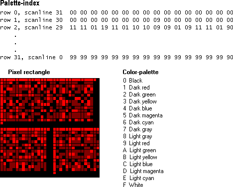

# About Bitmaps

A bitmap is one of the GDI objects that can be selected into a *device context* (DC). [Device contexts](device-contexts.md) are structures that define a set of graphic objects and their associated attributes, and graphic modes that affect output. The table below describes the GDI objects that can be selected into a device context.

| Graphic object                         | Description                                                                                                                                                                                          |
|----------------------------------------|------------------------------------------------------------------------------------------------------------------------------------------------------------------------------------------------------|
| [Bitmaps](bitmaps.md)                 | Creates, manipulates (scale, scroll, rotate, and paint), and stores images as files on a disk.                                                                                                       |
| [Brushes](brushes.md)                 | Paints the interior of polygons, ellipses, and paths.                                                                                                                                                |
| [Fonts](fonts-and-text.md)            | Draws text on video displays and other output devices.                                                                                                                                               |
| [Logical Palette](logical-palette.md) | A color palette created by an application and associated with a given device context.                                                                                                                |
| [Paths](paths.md)                     | One or more figures (or shapes) that are filled and/or outlined.                                                                                                                                     |
| [Pens](pens.md)                       | A graphics tool that an application uses to draw lines and curves.                                                                                                                                   |
| [Regions](regions.md)                 | A rectangle, polygon, or ellipse (or a combination of two or more of these shapes) that can be filled, painted, inverted, framed, and used to perform hit testing (testing for the cursor location). |

 

From a developer's perspective, a bitmap consists of a collection of structures that specify or contain the following elements:

-   A header that describes the resolution of the device on which the rectangle of pixels was created, the dimensions of the rectangle, the size of the array of bits, and so on.
-   A logical palette.
-   An array of bits that defines the relationship between pixels in the bitmapped image and entries in the logical palette.

A bitmap size is related to the type of image it contains. Bitmap images can be either monochrome or color. In an image, each pixel corresponds to one or more bits in a bitmap. Monochrome images have a ratio of 1 bit per pixel (bpp). Color imaging is more complex. The number of colors that can be displayed by a bitmap is equal to two raised to the number of bits per pixel. Thus, a 256-color bitmap requires 8 bpp (2^8 = 256).

Control Panel applications are examples of applications that use bitmaps. When you select a background (or wallpaper) for your desktop, you actually select a bitmap, which the system uses to paint the desktop background. The system creates the selected background pattern by repeatedly drawing a 32-by-32 pixel pattern on the desktop.

The following illustration shows the developer's perspective of the bitmap found in the file Redbrick.bmp. It shows a palette array, a 32-by-32 pixel rectangle, and the index array that maps colors from the palette to pixels in the rectangle.

In the preceding example, the rectangle of pixels was created on a VGA display device using a palette of 16 colors. A 16-color palette requires 4-bit indexes; therefore, the array that maps palette colors to pixel colors is composed of 4-bit indexes as well. (For more information about logical color-palettes, see [Colors](colors.md).)

> [!Note]
>
> In the above bitmap, the system maps indexes to pixels beginning with the bottom scan line of the rectangular region and ending with the top scan line. A *scan line* is a single row of adjacent pixels on a video display. For example, the first row of the array (row 0) corresponds to the bottom row of pixels, scan line 31. This is because the above bitmap is a bottom-up device-independent bitmap (DIB), a common type of bitmap. In top-down DIBs and in device-dependent bitmaps (DDB), the system maps indexes to pixels beginning with the top scan line.

 

The following topics describe different areas of bitmaps.

-   [Bitmap Classifications](bitmap-classifications.md)
-   [Bitmap Header Types](bitmap-header-types.md)
-   [JPEG and PNG Extensions for Specific Bitmap Functions and Structures](jpeg-and-png-extensions-for-specific-bitmap-functions-and-structures.md)
-   [Bitmaps, Device Contexts, and Drawing Surfaces](bitmaps--device-contexts--and-drawing-surfaces.md)
-   [Bitmap Creation](bitmap-creation.md)
-   [Bitmap Rotation](bitmap-rotation.md)
-   [Bitmap Scaling](bitmap-scaling.md)
-   [Bitmaps as Brushes](bitmaps-as-brushes.md)
-   [Bitmap Storage](bitmap-storage.md)
-   [Bitmap Compression](bitmap-compression.md)
-   [Alpha Blending](alpha-blending.md)
-   [Smooth Shading](smooth-shading.md)
-   [ICM-Enabled Bitmap Functions](icm-enabled-bitmap-functions.md)

 

 

