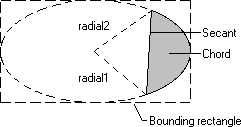

# About Chords

A *chord* is a region bounded by the intersection of an ellipse and a line segment called a *secant*. The following illustration shows a chord drawn by using the [**Chord**](/windows/win32/Wingdi/nf-wingdi-chord?branch=master) function.

When calling [**Chord**](gdi.Chord), an application supplies the coordinates of the upper-left and lower-right corners of the ellipse's bounding rectangle, as well as the coordinates of two points defining two radials. A radial is a line drawn from the center of an ellipse's bounding rectangle to a point on the ellipse.

When the system draws the curved part of the chord, it does so by using the current arc direction for the specified device context. The default arc direction is counterclockwise. You can have your application reset the arc direction by calling the [**SetArcDirection**](/windows/win32/Wingdi/nf-wingdi-setarcdirection?branch=master) function.

 

 

