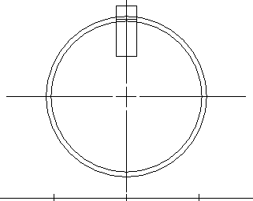

# About Coordinate Spaces and Transformations

Coordinate spaces and transformations are used by the following types of applications:

-   Desktop publishing applications (to "zoom" parts of a page or to display adjacent pages in a window).
-   Computer-aided design (CAD) applications (to rotate objects, scale drawings, or create perspective views).
-   Spreadsheet applications (to move and size graphs).

The following illustrations show successive views of an object created in a drawing application. The first illustration shows the object as it appears in the original drawing; the succeeding five illustrations show the effects of applying various transformations.

The following subtopics describe various aspects of coordinate spaces and transformations.

-   [Transformation of Coordinate Spaces](transformation-of-coordinate-spaces.md)
-   [World-Space to Page-Space Transformations](world-space-to-page-space-transformations.md)
-   [Page-Space to Device-Space Transformations](page-space-to-device-space-transformations.md)
-   [Device-Space to Physical-Device Transformation](device-space-to-physical-device-transformation.md)
-   [Default Transformations](default-transformations.md)

 

 

