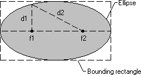

# About Ellipses

An ellipse is a closed curve defined by two fixed points (f1 and f2 ) such that the sum of the distances (d1 +d2 ) from any point on the curve to the two fixed points is constant. The following illustration shows an ellipse drawn by using the [**Ellipse**](/windows/desktop/api/Wingdi/nf-wingdi-ellipse) function.

When calling [**Ellipse**](/windows/desktop/api/Wingdi/nf-wingdi-ellipse), an application supplies the coordinates of the upper-left and lower-right corners of the ellipse's bounding rectangle. A *bounding rectangle* is the smallest rectangle completely surrounding the ellipse. When the system draws the ellipse, it excludes the right and lower sides if no world transformations are set. Therefore, for any rectangle measuring x units wide by y units high, the associated ellipse measures x1 units wide by y1 units high. If the application sets a world transformation by calling the [**SetWorldTransform**](/windows/desktop/api/Wingdi/nf-wingdi-setworldtransform) or [**ModifyWorldTransform**](/windows/desktop/api/Wingdi/nf-wingdi-modifyworldtransform) function, the system includes the right and lower sides.

 

 

