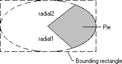

# About Pies

A *pie* is a region bounded by the intersection of an ellipse curve and two radials. The following illustration shows a pie drawn by using the [**Pie**](/windows/win32/Wingdi/nf-wingdi-pie?branch=master) function.

When calling [**Pie**](gdi.Pie), an application supplies the coordinates of the upper-left and lower-right corners of the ellipse's bounding rectangle, as well as the coordinates of two points defining two radials.

When the system draws the curved part of the pie, it uses the current arc direction for the given device context. The default arc direction is counterclockwise. An application can reset the arc direction by calling the [**SetArcDirection**](/windows/win32/Wingdi/nf-wingdi-setarcdirection?branch=master) function.

 

 

