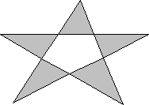

# About Polygons

A *polygon* is a filled shape with straight sides. The sides of a polygon are drawn by using the current pen. When the system fills a polygon, it uses the current brush and the current polygon fill mode. The two fill modes, alternate (the default) and winding, determine whether regions within a complex polygon are filled or left unpainted. An application can select either mode by calling the [**SetPolyFillMode**](/windows/desktop/api/Wingdi/nf-wingdi-setpolyfillmode) function. For more information about polygon fill modes, see [Regions](regions.md).

The following illustration shows a polygon drawn by using [**Polygon**](/windows/desktop/api/Wingdi/nf-wingdi-polygon).

In addition to drawing a single polygon by using [**Polygon**](/windows/win32/api/wingdi/nf-wingdi-polygon), an application can draw multiple polygons by using the [**PolyPolygon**](/windows/desktop/api/Wingdi/nf-wingdi-polypolygon) function.

 

 
