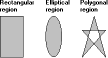

# About Regions

Following are three types of regions that have been filled and framed.

-   [Region Creation and Selection](region-creation-and-selection.md)
-   [Region Operations](region-operations.md)

 

 

