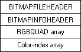

# Bitmap Storage

Bitmaps should be saved in a file that uses the established bitmap file format and assigned a name with the three-character .bmp extension. The established bitmap file format consists of a [**BITMAPFILEHEADER**](/windows/win32/api/wingdi/ns-wingdi-bitmapfileheader) structure followed by a [**BITMAPINFOHEADER**](/previous-versions//dd183376(v=vs.85)), [**BITMAPV4HEADER**](/windows/desktop/api/Wingdi/ns-wingdi-bitmapv4header), or [**BITMAPV5HEADER**](/windows/desktop/api/Wingdi/ns-wingdi-bitmapv5header) structure. An array of [**RGBQUAD**](/windows/win32/api/wingdi/ns-wingdi-rgbquad) structures (also called a color table) follows the bitmap information header structure. The color table is followed by a second array of indexes into the color table (the actual bitmap data).

The bitmap file format is shown in the following illustration.



The members of the [**BITMAPFILEHEADER**](/windows/win32/api/wingdi/ns-wingdi-bitmapfileheader) structure identify the file; specify the size of the file, in bytes; and specify the offset from the first byte in the header to the first byte of bitmap data. The members of the [**BITMAPINFOHEADER**](/previous-versions//dd183376(v=vs.85)), [**BITMAPV4HEADER**](/windows/desktop/api/Wingdi/ns-wingdi-bitmapv4header), or [**BITMAPV5HEADER**](/windows/desktop/api/Wingdi/ns-wingdi-bitmapv5header) structure specify the width and height of the bitmap, in pixels; the color format (count of color planes and color bits-per-pixel) of the display device on which the bitmap was created; whether the bitmap data was compressed before storage and the type of compression used; the number of bytes of bitmap data; the resolution of the display device on which the bitmap was created; and the number of colors represented in the data. The [**RGBQUAD**](/windows/win32/api/wingdi/ns-wingdi-rgbquad) structures specify the RGB intensity values for each of the colors in the device's palette.

The color-index array associates a color, in the form of an index to an [**RGBQUAD**](/windows/win32/api/wingdi/ns-wingdi-rgbquad) structure, with each pixel in a bitmap. Thus, the number of bits in the color-index array equals the number of pixels times the number of bits needed to index the **RGBQUAD** structures. For example, an 8x8 black-and-white bitmap has a color-index array of 8 \* 8 \* 1 = 64 bits, because one bit is needed to index two colors. The Redbrick.bmp, mentioned in [About Bitmaps](about-bitmaps.md), is a 32x32 bitmap with 16 colors; its color-index array is 32 \* 32 \* 4 = 4096 bits because four bits index 16 colors.

To create a color-index array for a top-down bitmap, start at the top line in the bitmap. The index of the [**RGBQUAD**](/windows/win32/api/wingdi/ns-wingdi-rgbquad) for the color of the left-most pixel is the first *n* bits in the color-index array (where *n* is the number of bits needed to indicate all of the **RGBQUAD** structures). The color of the next pixel to the right is the next *n* bits in the array, and so forth. After you reach the right-most pixel in the line, continue with the left-most pixel in the line below. Continue until you finish with the entire bitmap. If it is a bottom-up bitmap, start at the bottom line of the bitmap instead of the top line, still going from left to right, and continue to the top line of the bitmap.

The following hexadecimal output shows the contents of the file Redbrick.bmp.


```C++
0000    42 4d 76 02 00 00 00 00  00 00 76 00 00 00 28 00 
0010    00 00 20 00 00 00 20 00  00 00 01 00 04 00 00 00 
0020    00 00 00 00 00 00 00 00  00 00 00 00 00 00 00 00 
0030    00 00 00 00 00 00 00 00  00 00 00 00 80 00 00 80 
0040    00 00 00 80 80 00 80 00  00 00 80 00 80 00 80 80 
0050    00 00 80 80 80 00 c0 c0  c0 00 00 00 ff 00 00 ff 
0060    00 00 00 ff ff 00 ff 00  00 00 ff 00 ff 00 ff ff 
0070    00 00 ff ff ff 00 00 00  00 00 00 00 00 00 00 00 
0080    00 00 00 00 00 00 00 00  00 00 00 00 00 00 09 00 
0090    00 00 00 00 00 00 11 11  01 19 11 01 10 10 09 09 
00a0    01 09 11 11 01 90 11 01  19 09 09 91 11 10 09 11 
00b0    09 11 19 10 90 11 19 01  19 19 10 10 11 10 09 01 
00c0    91 10 91 09 10 10 90 99  11 11 11 11 19 00 09 01 
00d0    91 01 01 19 00 99 11 10  11 91 99 11 09 90 09 91 
00e0    01 11 11 11 91 10 09 19  01 00 11 90 91 10 09 01 
00f0    11 99 10 01 11 11 91 11  11 19 10 11 99 10 09 10 
0100    01 11 11 11 19 10 11 09  09 10 19 10 10 10 09 01 
0110    11 19 00 01 10 19 10 11  11 01 99 01 11 90 09 19 
0120    11 91 11 91 01 11 19 10  99 00 01 19 09 10 09 19 
0130    10 91 11 01 11 11 91 01  91 19 11 00 99 90 09 01 
0140    01 99 19 01 91 10 19 91  91 09 11 99 11 10 09 91 
0150    11 10 11 91 99 10 90 11  01 11 11 19 11 90 09 11 
0160    00 19 10 11 01 11 99 99  99 99 99 99 99 99 09 99 
0170    99 99 99 99 99 99 00 00  00 00 00 00 00 00 00 00 
0180    00 00 00 00 00 00 90 00  00 00 00 00 00 00 00 00 
0190    00 00 00 00 00 00 99 11  11 11 19 10 19 19 11 09 
01a0    10 90 91 90 91 00 91 19  19 09 01 10 09 01 11 11 
01b0    91 11 11 11 10 00 91 11  01 19 10 11 10 01 01 11 
01c0    90 11 11 11 91 00 99 09  19 10 11 90 09 90 91 01 
01d0    19 09 91 11 01 00 90 10  19 11 00 11 11 00 10 11 
01e0    01 10 11 19 11 00 90 19  10 91 01 90 19 99 00 11 
01f0    91 01 11 01 91 00 99 09  09 01 10 11 91 01 10 91 
0200    99 11 10 90 91 00 91 11  00 10 11 01 10 19 19 09 
0210    10 00 99 01 01 00 91 01  19 91 19 91 11 09 10 11 
0220    00 91 00 10 90 00 99 01  11 10 09 10 10 19 09 01 
0230    91 90 11 09 11 00 90 99  11 11 11 90 19 01 19 01 
0240    91 01 01 19 09 00 91 10  11 91 99 09 09 90 11 91 
0250    01 19 11 11 91 00 91 19  01 00 11 00 91 10 11 01 
0260    11 11 10 01 11 00 99 99  99 99 99 99 99 99 99 99 
0270    99 99 99 99 99 90 
```


The following table shows the data bytes associated with the structures in a bitmap file.


| Structure                                    | Corresponding bytes |
|----------------------------------------------|---------------------|
| [**BITMAPFILEHEADER**](/windows/win32/api/wingdi/ns-wingdi-bitmapfileheader) | 0x00 0x0D           |
| [**BITMAPINFOHEADER**](/previous-versions//dd183376(v=vs.85)) | 0x0E 0x35           |
| [**RGBQUAD**](/windows/win32/api/wingdi/ns-wingdi-rgbquad) array             | 0x36 0x75           |
| Color-index array                            | 0x76 0x275          |


 

 

 
