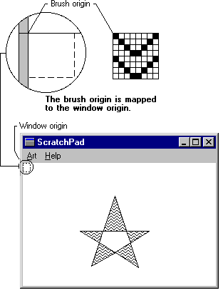

# Brush Origin

When an application calls a drawing function to paint a shape, the system positions a brush at the start of the paint operation and maps a pixel in the brush bitmap to the client area at the *window origin*, which is the upper-left corner of the window. The coordinates of the pixel that the system maps are called the *brush origin*. The default brush origin is located in the upper-left corner of the brush bitmap, at the coordinates (0,0). The system then copies the brush across the client area, forming a pattern that is as tall as the bitmap. The copy operation continues, row by row, until the entire client area is filled. However, the brush pattern is visible only within the boundaries of the specified shape.

There are instances when the default brush origin should not be used. For example, it may be necessary for an application to use the same brush to paint the backgrounds of its parent and child windows and blend a child window's background with that of the parent window. To do this, the application should reset the brush origin by calling the [**SetBrushOrgEx**](/windows/desktop/api/Wingdi/nf-wingdi-setbrushorgex) function and shifting the origin the required number of pixels. (An application can retrieve the current brush origin by calling the [**GetBrushOrgEx**](/windows/desktop/api/Wingdi/nf-wingdi-getbrushorgex) function.)

The following illustration shows a five-pointed star filled by using an application-defined brush. The illustration shows a zoomed image of the brush, as well as the location to which it was mapped at the beginning of the paint operation.

 

 

