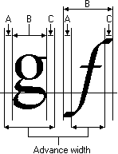

# Character Widths

Applications need to retrieve character-width data when they perform such tasks as fitting strings of text to page or column widths. There are four functions that an application can use to retrieve character-width data. Two of these functions retrieve the character-advance width and two of these functions retrieve actual character-width data.

An application can use the [GetCharWidth32](/windows/desktop/api/Wingdi/nf-wingdi-getcharwidth32a) and [GetCharWidthFloat](/windows/desktop/api/Wingdi/nf-wingdi-getcharwidthfloata) functions to retrieve the advance width for individual characters or symbols in a string of text. The advance width is the distance that the cursor on a video display or the print-head on a printer must advance before printing the next character in a string of text. The [**GetCharWidth32**](/windows/win32/api/wingdi/nf-wingdi-getcharwidth32a) function returns the advance width as an integer value. If greater precision is required, an application can use the [**GetCharWidthFloat**](/windows/win32/api/wingdi/nf-wingdi-getcharwidthfloata) function to retrieve fractional advance-width values.

An application can retrieve actual character-width data by using the [GetCharABCWidths](/windows/desktop/api/Wingdi/nf-wingdi-getcharabcwidthsa) and [**GetCharABCWidthsFloat**](/windows/desktop/api/Wingdi/nf-wingdi-getcharabcwidthsfloata) functions. The **GetCharABCWidthsFloat** function works with all fonts. The [**GetCharABCWidths**](/windows/win32/api/wingdi/nf-wingdi-getcharabcwidthsa) function only works with TrueType and OpenType fonts. For more information about TrueType and OpenType fonts, see [Raster, Vector, TrueType, and OpenType Fonts](raster--vector--truetype--and-opentype-fonts.md).

The following illustration shows the three components of a character width:

The A spacing is the width to add to the current position before placing the character. The B spacing is the width of the character itself. The C spacing is the white space to the right of the character. The total advance width is determined by calculating the sum of A+B+C. The character cell is an imaginary rectangle that surrounds each character or symbol in a font. Because characters can overhang or underhang the character cell, either or both of the A and C increments can be a negative number.

 

 
